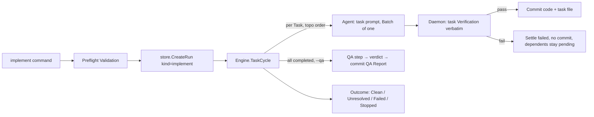

# Implement Command — Technical Spec

## Executive Summary

The Implement Command executes a Spec's Task Graph through the machinery the review path already owns: the ACP `agent.Runner`, the Daemon's `Verifier`/`Committer`/`WorktreeSnapshotter` collaborators, the Run Database, the Run Event Journal, and the Live Run View. The primary trade-off this design accepts is **sibling paths over a shared abstraction**: the spec path gets its own engine cycle (`TaskCycle`), its own plan type, and its own artifact parser (`internal/spec`) instead of forcing Tasks into `rounds.Batch` or extracting a unified Task Source interface. That duplicates cycle-orchestration structure, but it keeps the review path's code and tests untouched (a PRD goal and explicit non-goal boundary) and defers the abstraction to work-plan item 1, when two working implementations exist to extract from. The one shared mutation is the Run Database schema, which migrates to work-target locks (ADR 0016).

## System Architecture

**New package: `internal/spec`** — owns the on-disk Spec contract end to end: discovering active Specs under `docs/specs/`, parsing and validating the `_tasks.md` manifest (`schema: spec-tasks/v1`), computing a deterministic topological order, parsing task files (frontmatter, title, Verification commands), rewriting task `status`, and reading the QA Report verdict. Nothing outside this package touches spec markdown.

**Extended, not replaced:**

- `internal/daemon` gains `Engine.TaskCycle(ctx, TaskPlan)` beside `ResolveCycle`, reusing `Runner`, `Verifier`, `Committer`, `WorktreeSnapshotter`, `RunStateStore`, and the before-snapshot rule. `Pusher` and `ReviewSourceResolver` are never wired for spec Runs (ADR 0013).
- `internal/agent` gains `BuildTaskPrompt` and `BuildQAPrompt` beside `BuildPrompt` — minimal string builders mirroring the `implement-task` and `qa-gate` contracts (templating waits for work-plan item 5).
- `internal/store` migrates to schema v4 (ADR 0016): `active_run_locks(target_kind, target_key)`, Kind `implement`, nullable review columns, `spec_slug` column, and an `ActiveRunInGitRoot` query for the single-working-tree check from ADR 0012.
- `internal/runevent` gains Kinds `daemon.task` and `daemon.qa`. The existing `ReviewIssue` event field carries the Work Item identifier generically — task id for spec Runs — with no schema rename.
- `internal/preflight` gains default-branch detection (`git symbolic-ref refs/remotes/origin/HEAD`, falling back to a `main`/`master` name match when `origin/HEAD` is unset).
- `internal/cli` gains `runImplementCommand` following the `runOperationalCommand` shape: parse flags, Interactive Input, Preflight Validation, `CreateRun`, cockpit via `startRunUI`, engine cycle, terminal outcome, exit code.
- `internal/tui` gains a small `WorkItem` view model; the cockpit's left pane and `RenderLiveRunView` render Review Issues or Tasks through it, keyed on Run Kind. Interactive Input gains a Spec picker field.



## Implementation Design

### Interfaces

```go
// internal/spec — the on-disk Spec contract
type Spec struct{ Slug, Dir string }

type Task struct {
    ID, File, Title string
    Needs           []string
    Status          Status   // pending | in_progress | completed | failed
    Type            string   // frontend | backend | data | infra | docs | test | chore
    Verification    []string // commands extracted verbatim, section order
}

type Graph struct {
    Spec  Spec
    Tasks []Task // deterministic topological order (Kahn, manifest-order tiebreak)
}

func ListActive(gitRoot string) ([]Spec, error)          // Interactive Input picker
func Load(gitRoot, slug string) (*Graph, error)          // parse + validate + order
func ReloadTask(gitRoot string, t *Task) error           // re-read after the Agent
func SetStatus(taskPath string, s Status) error          // rewrite frontmatter status only
func QAVerdict(specDir string) (verdict string, err error) // newest qa/qa-report-*.md
```

`Load` returns typed validation errors (missing spec, inactive Spec, manifest parse, unknown `needs`, cycle, missing task file, missing/empty Verification section) so the CLI maps each to one actionable exit-2 message naming the offending Task.

```go
// internal/daemon — sibling of ResolveCycle
type TaskPlan struct {
    RunID   string
    WorkDir string      // git root; also the Agent working directory
    Spec    spec.Spec
    Tasks   []spec.Task // full graph in topological order
    Runtime agent.RuntimeSpec
    QA      bool
}

type TaskCycleResult struct {
    Completed, Failed, Skipped int    // skipped = unsatisfied needs, left pending
    QAVerdict                  string // "" when the QA step did not run
}

func (e *Engine) TaskCycle(ctx context.Context, plan TaskPlan) (TaskCycleResult, error)
```

`TaskCycle` per Task, in order: skip unless every `needs` is `completed` (from a live status map seeded by task files, updated in-memory as the Run progresses); before-snapshot; state `ResolvingWithAgent` and run the Agent with the task prompt as a Batch of one (Batch number = 1-based execution ordinal, task id in the event Work Item field); `ReloadTask`; state `Verifying` and run each Verification command through the existing `Verifier` (sequential, `sh -c`, all must pass); on pass settle `completed` (writing the status if the Agent forgot, per ADR 0014) and commit the snapshot diff; on any failure (Agent error, Agent-reported `failed`, verification failure) settle `failed` with the reason journaled, create no commit, preserve worktree changes, and continue with independent Tasks (generalizing ADR 0010). Stop Requests and infrastructure errors halt the cycle.

```go
// internal/agent — prompt builders (minimal, replaceable by work-plan item 5)
type TaskPromptRequest struct {
    SpecSlug, TaskID, TaskPath string
    TaskContent                string // full task file embedded in the prompt
}
func BuildTaskPrompt(req TaskPromptRequest) (string, error)
func BuildQAPrompt(specSlug, specDir, prdPath string) (string, error)
```

The task prompt states the execution invariants mirroring `implement-task`: implement only this Task's slice; set `status: in_progress` on start; run Verification while working; append `## Result` with evidence; settle `completed` or `failed`; never commit, push, or open a PR; never edit `_tasks.md` or other task files; a stale `in_progress` status means a dead prior Run — start fresh (the work-target lock guarantees no live owner, overriding `implement-task`'s stop-and-ask rule for the daemon-driven case).

### Data Models

- **Run Database schema v4** (ADR 0016): `runs` adds Kind `implement` and nullable `spec_slug`; `head_repository`, `head_branch`, `pr_number`, `head_sha` become required-by-Kind (review) instead of `NOT NULL`. `active_run_locks` re-keys to `(target_kind, target_key)`: `("pr", "<head_repo>#<head_branch>")` and `("spec", "<git_root>#<slug>")`. Migration v3→v4 rewrites existing lock rows in place; `ActiveRunError` gains the run id and work-target wording so the next useful action is `roundfix stop <run-id>`.
- **Run Events**: new Kinds `daemon.task` (payload: task id, phase, settled status, failure reason) and `daemon.qa` (payload: report path, verdict). `daemon.verification`, `daemon.commit`, and `daemon.outcome` are reused as-is. Existing readers already skip unknown Kinds.
- **Spec artifacts** are consumed exactly as `write-tasks`/`implement-task`/`qa-gate` define them (the handoff artifact contract): no new fields, no Roundfix-private markers. The authoritative graph source is the `_tasks.md` frontmatter, never the projection table.

### API Contracts

```
roundfix implement [--spec <slug>] [--qa]
                   [--agent <name>] [--model <id>] [--agent-command <cmd>]
                   [--agent-full-access] [--interactive | --no-input]
```

- **stdout** (non-interactive): one line per Task in graph order — `task_NN <status> — <title>` where status ∈ `completed | failed | skipped | pending` — then one outcome line (and the QA verdict line when the QA step ran). Nothing else.
- **stderr**: diagnostics, progress, Run id, agent log path.
- **Exit codes**: `0` Clean (every Task completed; QA `pass` when requested), `1` Unresolved/Failed, `2` Preflight Validation failure, `130` Stop Request — identical mapping to existing commands.
- **Preflight Validation** (each failure = one exit-2 message naming the check and fix): Spec exists with `_prd.md` `status: active`; manifest schema/graph valid and acyclic; every task file parses with ≥1 Verification command; working tree clean; current branch is not the repository default; no Active Run for this work target and none in this working tree; runtime probe passes.
- **Edge**: every Task already `completed` and no `--qa` → report and exit 0 without creating a Run; with `--qa` → the Run consists of the QA step only.
- Interactive mode opens when `--spec` or `--agent` is missing (same `shouldOpenInteractiveInput` logic); the Spec picker lists `spec.ListActive` results.
- **Commit contract** (ADR 0013): per-Task message `<type>: <task title>` with type mapping `docs→docs`, `test→test`, `chore→chore`, everything else `→feat`, plus trailers `Roundfix-Spec: <slug>` and `Roundfix-Task: <task_NN>`. QA Report commit: `docs(qa): qa report for <slug> (<verdict>)` with the spec trailer.

## Coverage Map

- Goal 1 / Story 1 → `runImplementCommand`, `spec.Load`, `Engine.TaskCycle`
- Goal 2 / Story 6 → store schema v4, `JournalSink` (reused), `daemon.task`/`daemon.qa` events, `attach` (works by run id unchanged), cockpit `WorkItem` pane
- Goal 3 / Story 3 → task-file statuses as the only resume state; `TaskCycle` executes every non-completed Task, including stale `in_progress`
- Goal 4 / Story (Feature 13) → additive-only changes; review path code paths and tests untouched
- Story 2 → `Committer` (reused), snapshot-diff pathspec, task commit message + trailers
- Story 4 → `spec.Load` typed errors, preflight default-branch veto, dirty-tree check, `ActiveRunInGitRoot`
- Story 5 → `BuildQAPrompt`, `spec.QAVerdict`, QA step in `TaskCycle` (ADR 0015; only `pass` passes)
- Story 7 → `tui` Spec picker field + `spec.ListActive`

## Integration Points

- **ACP Runtimes** — existing `agent.Runner`/`acp_runner` adapter, unchanged: runtime selection, `--agent-full-access` session modes (ADR 0011), raw-payload journaling (ADR 0008). The spec directory needs no `AllowAddDirs` entry — it lives inside the repository root the session already has.
- **git** — existing wrappers only: `preflight.InspectGit` (+ new default-branch probe) for reads, `daemon` snapshot/commit for writes. No push, no `gh`, no Review Source calls anywhere in the spec path.
- **SQLite Run Database** — same store; one migration.

## Testing Approach

All existing seams, no new test-only hooks:

- **Unit, `internal/spec`**: table tests over literal markdown fixtures in test files — manifest validation (cycle, unknown need, missing file, bad schema), topological determinism, task frontmatter/Verification extraction, status rewrite preserving file content, QA verdict parsing (`pass`/`fail`/`partial`/missing/unreadable). No golden files, matching repo practice.
- **Unit, `internal/daemon`**: drive `TaskCycle` directly with the existing fake collaborators pattern — a `fakeAgentRunner` that writes task statuses via `spec.SetStatus` (mirroring how the review fake writes issue statuses), `fakeVerifier` recording per-command calls, `fakeCommitter`, `fakeWorktree` — over a `t.TempDir()` git repo with a real spec directory. Covers: needs-gating, failure policy (no commit, dependents pending, independents continue), daemon settling of forgotten statuses, before-snapshot exclusion, QA step gating and verdict handling.
- **Unit, `internal/store`**: migration v3→v4 preserves rows and locks; work-target lock collision per kind; `ActiveRunInGitRoot`.
- **CLI integration**: buffer-captured `RunContext(ctx, args, &out, &err)` tests through the `newEngineCollaborators` and `collectInteractiveInput` package-var seams — full implement runs, every preflight failure message, exit codes, deterministic stdout, Attach over a finished spec Run.
- **TUI**: `model.Update` driven synchronously; `WorkItem` pane rendering for both Run Kinds.

The review path's existing suite passing unchanged is itself a PRD success metric — treat any needed edit to an existing review test as a design smell.

## Build Order

1. **`internal/spec` package** — discovery, manifest parse/validate/order, task file parse, status rewrite, QA verdict reader, typed validation errors.
2. **Store schema v4** — work-target locks, Kind `implement`, `spec_slug`, `ActiveRunInGitRoot`, migration + `ActiveRunError` wording (ADR 0016).
3. **Run Event vocabulary** — `daemon.task`, `daemon.qa` Kinds; document the Work Item field convention.
4. **Preflight default-branch detection** — `origin/HEAD` probe with name-match fallback.
5. **Task and QA prompt builders** (depends on: 1) — invariants mirroring `implement-task`/`qa-gate`.
6. **`Engine.TaskCycle`** (depends on: 1, 2, 3, 5) — needs-gating, agent/verify/settle/commit per Task, failure policy, task commit message + trailers.
7. **QA step** (depends on: 6) — gating on all-completed, verdict settling, QA Report commit.
8. **CLI implement command** (depends on: 2, 4, 6) — flags, Preflight Validation wiring, Run creation, non-interactive output, exit codes, help text.
9. **Interactive Input Spec picker** (depends on: 1, 8) — `CommandValues.Spec`, `fieldsForCommand("implement")`.
10. **Live Run View Tasks as Work Items** (depends on: 3, 8) — `tui.WorkItem` model, cockpit pane by Run Kind, plain-text renderer, Attach parity.
11. **Roundfix skill + docs update** (depends on: 8, 10) — `.agents/skills/roundfix/SKILL.md` gains the Implement Command and the task Batch contract, `make skills-sync`, `CONTEXT.md` untouched (all terms exist). Ships in the same PR as the CLI behavior per the repo hard rule.
12. **QA + dogfood evidence** (depends on: 7, 9, 11) — run the Implement Command against a real Spec (success metric), induced-failure resume check.

## Risks & Considerations

- **Failed Tasks leave a dirty worktree** (settled `failed` status + preserved edits are uncommitted, per the ADR 0010 preservation rule), and resume Preflight requires a clean tree. The preflight dirty-tree message must say exactly that: commit, stash, or discard the failed attempt before re-running. Accepted friction until worktree-per-task (work-plan item 4).
- **Prompt-contract drift**: `BuildTaskPrompt` mirrors `implement-task` by construction, not by mechanism. Keep the invariants in one commented constant and revisit under work-plan item 5; the same-PR skill rule covers the shipped `roundfix` skill but not `implement-task`.
- **Arbitrary shell execution**: task Verification commands run verbatim under the user's privileges — the same trust model as `defaults.verification` and user-authored specs; no new privilege surface.
- **Default-branch detection** is heuristic without `origin/HEAD`; the veto message must name the detected default so a false positive is diagnosable.
- **Cockpit reads task files mid-write**: the Agent rewrites task files while the pane polls; tolerate parse failures by keeping the last good status, never failing the view.
- **Migration v3→v4** touches live user databases; the migration test must cover a populated v3 fixture including an active lock.

## Decisions

- Run Database generalizes to work-target locks; single-working-tree check is a query, not schema. See ADR-0016.
- One Active Run per work target; spec target key is `(git_root, slug)`. See ADR-0012.
- Commit per Task, never push, default-branch veto, frontmatter-derived messages. See ADR-0013.
- Daemon runs task Verification verbatim and settles status. See ADR-0014. The Daemon gate runs **only** the Task's Verification commands — `defaults.verification` is not appended; repo-wide gates belong in task Verification sections or the QA step, which runs `make verify` first by its own contract.
- QA inside the Run behind `--qa`; report always committed. See ADR-0015. **Resolves the PRD open question**: the installed qa-gate skill already writes `verdict: pass | fail | partial`; only `pass` ends the Run Clean — `partial`, `fail`, missing, and unreadable all end it Unresolved.
- PRD's default commit-type mapping adopted (`docs/test/chore` pass through, all other surfaces → `feat`); `cog.toml` imposes no extra constraint.
- `defaults.auto_commit` and Final Push do not apply to spec Runs: the per-Task commit is the product contract, not a toggle.
- Run Budget stays a watch-loop concern: a spec Run is bounded by its finite graph, matching resolve's single-cycle behavior.
- Terminal states reuse the existing vocabulary (`Clean`, `Unresolved`, `Failed`, `Stopped`) — no new public state strings or exit codes.
- Run Events reuse the existing Work Item field for task ids; no journal schema change.
- No new config keys; the spec root is the documented `docs/specs/` convention under the git root.
- Stale Active Runs are released with the existing `roundfix stop <run-id>`; `ActiveRunError` names the run id.
