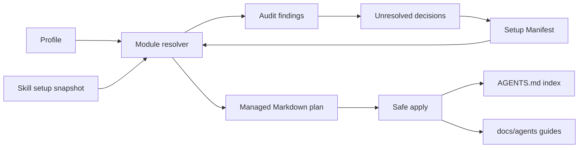

# Context-driven agent instructions — Technical Spec

## Executive Summary

The setup workflow becomes a declarative generator and validator backed by portable profiles, composable instruction modules, canonical skill-setup snapshots, and a repository-local manifest. A Python 3 standard-library script provides read-only audit, explicit safe application, and maintainer-only snapshot synchronization while producing stable finding codes and optional JSON output. Generated Markdown is identified by ownership markers, so updates replace managed blocks deterministically and leave repository-authored bytes outside those blocks untouched. The primary trade-off is additional metadata and asset structure inside the skill in exchange for repeatable upgrades that do not infer prior decisions from prose or repeatedly question the user.

## System Architecture

The canonical source remains `.agents/skills/setup-context-driven/`; the existing `make skills-sync` flow copies it into the embedded `skills/setup-context-driven/` bundle. The skill is split into five cooperating parts:

1. `SKILL.md` remains the orchestration layer. It detects repository context, invokes audit first, asks only for unresolved decision codes, previews changes, and invokes apply after approval.
2. `scripts/context_setup.py` is the deterministic execution layer. It parses bundled assets and repository state, resolves profiles and modules, produces findings, applies managed changes, and refreshes setup snapshots.
3. `assets/profiles/` contains the supported project compositions: TypeScript/Bun monorepo, Go CLI/TUI, and Rust CLI. A profile selects ordered modules and one canonical skill setup.
4. `assets/modules/` contains versioned module metadata plus Markdown templates. Modules own compact root pointers and detailed `docs/agents/` guides for universal workflow, language/runtime, repository shape, backend, frontend, CLI/TUI, autonomous work, and optional Secondbrain guidance.
5. `assets/setups/` contains portable snapshots of the canonical `typescript-bun`, `go-cli`, and `rust-cli` presets. Each snapshot records its source setup, source revision when known, normalized skill paths, skill names, and content digest.

Target repositories receive `docs/agents/setup-context.json` as the Setup Manifest. The manifest is the canonical answer store and managed-artifact inventory. The root `AGENTS.md` remains an index of mandatory rules and pointers; detailed stack and workflow rules live in setup-owned `docs/agents/*.md` modules.



## Implementation Design

### Interfaces

The script is invoked directly from the skill and uses explicit subcommands. Audit is the safe default when no subcommand is supplied.

```text
python3 scripts/context_setup.py [audit] --repo PATH [--format text|json]
    [--profile ID] [--show-extra-skills] [--setups-dir PATH]

python3 scripts/context_setup.py apply --repo PATH [--format text|json]
    [--profile ID] [--decision ID=VALUE]...

python3 scripts/context_setup.py sync-setups --source-dir PATH
    [--check] [--format text|json]
```

`audit` performs no writes. `apply` writes only artifacts and blocks declared as managed in the resolved plan; it refuses unbalanced, nested, or duplicate ownership markers. `sync-setups` is an authoring operation against an explicitly supplied checkout and never runs as part of normal repository setup.

Text output is concise and grouped by severity. JSON output is stable and writes only the result to stdout; diagnostics go to stderr.

```json
{
  "schemaVersion": "setup-context-driven/audit-v1",
  "ok": false,
  "summary": { "errors": 1, "decisions": 0, "warnings": 0, "info": 2 },
  "findings": [
    {
      "code": "skills.required.missing",
      "severity": "error",
      "path": ".agents/skills/golang-cli",
      "managedId": "profile.go-cli",
      "message": "Required skill golang-cli is not installed.",
      "action": "Install the go-cli setup."
    }
  ]
}
```

Exit codes are part of the script contract:

- `0`: audit has no blocking findings, apply completed, or snapshot check passed;
- `1`: blocking validation findings remain or safe apply cannot produce the declared state;
- `2`: invalid invocation, unreadable input, or invalid manifest/asset schema;
- `3`: one or more decision codes require human confirmation.

### Data Models

The Setup Manifest is JSON so the Python standard library can parse it without a YAML dependency. Its top-level contract is:

```json
{
  "schemaVersion": 1,
  "generator": { "skill": "setup-context-driven", "version": 1 },
  "profile": "typescript-bun-monorepo",
  "modules": ["core", "context-workflow", "typescript", "bun", "monorepo"],
  "decisions": {
    "domain.layout": { "value": "multi-context", "confirmedAt": "2026-07-15" },
    "secondbrain.enabled": { "value": false, "confirmedAt": "2026-07-15" }
  },
  "managedArtifacts": [],
  "localSkills": []
}
```

Decision identifiers are stable public data. Initial identifiers cover spec scaffolding, domain layout, external triage, autonomous work, verification, backend runtime, frontend/design runtime, language policy, and Secondbrain enablement. A template revision may reuse a compatible decision without prompting; removing or changing the meaning of a decision requires a manifest migration and yields `decision.required` when automatic migration is impossible.

Each module declares a stable module ID, version, dependencies, conflicts, ordered root blocks, supporting document templates, rule IDs, referenced skills, required decisions, and a managed-context budget. Profiles compose modules in a deterministic order and cannot override a rule ID silently. Duplicate or conflicting rule IDs are asset-validation failures.

Managed Markdown uses paired comments:

```markdown
<!-- setup-context-driven:begin id=agent-skills version=1 -->
...
<!-- setup-context-driven:end id=agent-skills -->
```

The manifest records each managed artifact or block, its module/template identity, version, and generated digest. Content outside paired markers is never part of the apply plan. Existing unmarked generated content requires a one-time adoption decision before the script may place ownership markers around or replace it.

Setup snapshots normalize comments and blank lines out of canonical preset files, preserve the ordered skill paths, derive unique skill names, and hash the normalized path list. Runtime validation uses the bundled snapshot. When a canonical setups checkout is available, audit may compare it with the bundled digest and report `skills.setup-snapshot.drift`; normal use never depends on a developer-specific path or network access.

Installed-skill classification combines `.agents/skills/*/SKILL.md` with `skills-lock.json` when present:

- selected setup skills are required;
- locked skills outside the setup are optional cleanup candidates;
- manifest-declared `localSkills` are repository-owned and exempt;
- untracked skill directories are reported separately for review and are never assumed removable.

### API Contracts

Finding codes are stable within `setup-context-driven/audit-v1`. The initial vocabulary includes:

- `manifest.missing`, `manifest.invalid`, `manifest.migration-required`;
- `decision.required`, `profile.unknown`, `module.conflict`;
- `managed.block.missing`, `managed.block.duplicate`, `managed.marker.invalid`, `managed.content.modified`, `managed.template.stale`;
- `docs.guide.missing`, `docs.reference.broken`, `docs.language.non-english`;
- `skills.required.missing`, `skills.reference.outside-setup`, `skills.setup-snapshot.drift`, `skills.extra.installed`, `skills.local.untracked`;
- `secondbrain.guide.missing`, `secondbrain.pointer.missing`, `secondbrain.safety-rule.missing`.

Errors block compliance. Decision findings use exit code `3`. Warnings identify managed drift that needs review but is not destructive. Informational findings include extra installed skills and never make `ok` false.

Safe apply uses an in-memory change plan, validates every resulting document before writing, writes temporary siblings, and replaces destinations only after all planned outputs pass validation. A failure leaves the repository unchanged. Applying the same resolved manifest twice must produce no second diff.

## Coverage Map

- Goal 1 and Story 1 → modular profiles, ordered module resolver, compact root blocks, detailed supporting guides.
- Goal 2 and Stories 2–4 → Setup Manifest, stable decision IDs, ownership markers, generated digests, atomic safe apply.
- Goal 3 and Story 3 → audit finding vocabulary, marker parser, reference and language checks, text/JSON reporting.
- Goal 4 and Story 2 → compatible decision reuse and explicit manifest migrations.
- Goal 5 and Stories 5–6 → canonical setup snapshots, installed-skill classifier, required-skill errors, optional extra-skill reporting.
- Story 7 → optional Secondbrain module with root pointer, read-only guide, citation rules, and secret exclusions.
- Story 8 → `sync-setups`, snapshot digests, asset consistency validation, and embedded-skill drift gate.

## Integration Points

- Canonical skills checkout: an optional authoring input to `sync-setups` and drift audit. It is never a runtime dependency and is addressed only through an explicit path.
- Repository skill installation: `.agents/skills/` is the installed-skill source; `skills-lock.json` enriches origin and cleanup classification when present.
- Roundfix skill bundle: `make skills-sync` copies the canonical `.agents/skills/setup-context-driven/` tree to `skills/setup-context-driven/`; `skills-sync-check` prevents drift.
- Secondbrain: generated guidance points to the user's configured local knowledge workspace, but the script neither reads secrets nor writes to the workspace, raw sources, or project mirrors.

## Testing Approach

The Python suite uses `unittest`, `tempfile`, and real filesystem operations. No mocks or test-only production branches are needed.

The micro-test boundary is asset resolution, manifest validation, marker parsing, finding classification, setup normalization, and change planning. Invariants include deterministic module order, rejection of conflicting rule IDs, strict marker pairing, stable finding codes, required-skill set comparison, and exclusion of informational extras from the blocking verdict.

The macro-test boundary invokes the script against temporary repositories that represent each supported profile. Each fixture runs apply, audit, and a second apply; the suite asserts a compliant audit, byte-for-byte preservation outside managed markers, and no diff after the second application. Additional flows cover first-run adoption, missing decisions, malformed manifests, missing required skills, optional extra-skill output, Secondbrain opt-in/out, and snapshot drift against temporary canonical setup files.

The repository gate adds a focused target that runs the Python suite and audits the bundled assets, then includes it in `make verify`. Existing `skills-sync-check` continues to prove the embedded copy matches the canonical skill. Tests assert observable files, stdout JSON, stderr diagnostics, and exit codes rather than private helper calls.

## Build Order

1. Declarative contract and portable assets: establish the ADR, manifest contract, module/profile schemas, TypeScript/Bun monorepo modules, Go CLI/TUI modules, Rust CLI modules, and pinned setup snapshots.
2. Read-only audit engine (depends on: 1): implement asset loading, profile resolution, manifest and marker parsing, document validation, skill classification, finding codes, output formats, and exit behavior with micro tests.
3. Safe apply and migration flow (depends on: 2): implement change planning, decision updates, one-time adoption, atomic writes, managed-block replacement, preservation checks, and idempotent macro tests.
4. Setup synchronization and optional integrations (depends on: 2, 3): implement snapshot synchronization/checking, extra-skill reporting, and Secondbrain module generation and validation.
5. Skill orchestration and repository gate (depends on: 1, 2, 3, 4): rewrite `SKILL.md` around audit-first execution, migrate current seeds into assets, add the focused verification target, synchronize the embedded skill, and run the complete gate.

## Risks & Considerations

- Existing repositories contain unmarked content that resembles generated output. Mitigation: require a one-time adoption decision and preview; never infer ownership solely from headings or prose.
- Excessive modularity could make ordering and conflicts difficult to reason about. Mitigation: keep a small initial catalog, require explicit dependencies/conflicts, and resolve modules deterministically.
- The TypeScript production samples currently contain hundreds of lines of repeated rules. Mitigation: enforce a compact managed root budget, move conditional bodies to supporting guides, and reject duplicate rule IDs across modules.
- Canonical skill setups evolve in a separate repository. Mitigation: pin source revision and digest in portable snapshots, provide explicit synchronization/checking, and report drift without creating a runtime dependency.
- Installed directories do not always reveal whether a skill is locally authored. Mitigation: prefer lock metadata, exempt manifest-declared local skills, classify unknown directories separately, and never remove anything.
- A failed multi-file apply could leave contradictory guidance. Mitigation: validate the complete in-memory plan and use temporary sibling files before atomic replacement.
- Stable finding and decision codes become compatibility contracts. Mitigation: version the JSON schema, migrate compatible manifest versions explicitly, and use a new schema version for breaking changes.

## Decisions

- Use Python 3 standard library only; no runtime dependency installation is allowed.
- Use explicit `audit`, `apply`, and `sync-setups` subcommands, with audit as the read-only default.
- Store the Setup Manifest as JSON under `docs/agents/` and use paired HTML ownership markers. See ADR-0046.
- Treat `.agents/skills/setup-context-driven/` as canonical and regenerate the embedded copy through the existing Make target.
- Store output templates and portable profile/setup data as skill assets; keep `SKILL.md` concise and orchestration-focused.
- Test observable script behavior against real temporary repositories with both micro and macro coverage.
- Never automatically remove skills or modify repository-authored content outside managed markers.
