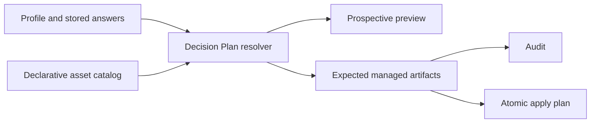

# Decision-driven setup generation — Technical Spec

## Executive summary

The setup generator will replace its Secondbrain-only decision branch with one
declarative Decision Plan resolved from the portable asset catalog. Audit,
preview, and apply will consume that same plan, so a confirmed value cannot be
stored without also changing the expected managed state. The design keeps the
Setup Manifest schema and existing CLI commands, trading a larger asset
validation contract for deterministic behavior and compatible migration. It
also splits the current mixed workflow artifacts where independent decisions
need independent ownership.

## System architecture

The implementation extends the existing skill assets and Python modules. It
does not add a package or runtime dependency.



`context_assets.py` will load and validate decision effects, profile entry
decisions, conditional module activation, artifact targets, template choices,
and render bindings. `context_setup.py` will resolve those declarations into a
Decision Plan before inspecting target files. Existing marker parsing,
installed-skill classification, atomic writes, manifest persistence, and setup
snapshot synchronization remain the execution boundaries.

The current `context-workflow` module owns a root block that mixes local Spec,
domain, and docs-layout rules. The catalog will separate these ownership units
so `spec.scaffold=false` can omit only the local Spec material. The same split
will make external triage conditional without removing local agent docs or
domain guidance.

## Implementation design

### Interfaces

The decision document gains declarative effects. The exact JSON property order
is not significant; identifiers and target references are.

```json
{
  "id": "autonomous.enabled",
  "type": "boolean",
  "effects": [{
    "when": {"equals": true},
    "activateModules": ["autonomous-work"],
    "requireDecisions": ["runtime.backend", "runtime.design", "verification.gate"]
  }]
}
```

String decisions declare render bindings, while enum decisions select an
approved template for each value. Effects may target only catalog-owned module,
artifact, template, and decision IDs. The loader rejects unknown targets,
duplicate bindings, type-incompatible conditions, and dependency cycles before
any repository state is read.

The resolver produces one internal contract:

```python
@dataclass(frozen=True)
class DecisionPlan:
    profile_id: str
    setup_id: str
    active_modules: list[str]
    resolved_decisions: dict[str, dict]
    unresolved_decisions: list[str]
    artifacts: list[PlannedArtifact]
```

`PlannedArtifact` carries the managed ID, destination, template and rendered
digest for a definite artifact, or a condition for an artifact whose decision
is unresolved. A concrete plan contains no conditional artifacts. Apply accepts
only a concrete plan; audit may report either form without writes.

### Data models

#### Decision effects

The catalog maps the nine existing decisions as follows:

| Decision | Declarative effect | Dependent answers or rendered value |
| --- | --- | --- |
| `spec.scaffold` | Activates or omits local Spec root rules, Spec routing, issue tracking, and Spec-specific docs-layout text | None |
| `domain.layout` | Selects single-context or multi-context domain root and guide templates | Selected enum value determines the approved template |
| `triage.external` | Activates or omits the external-triage root pointer and guide | None |
| `autonomous.enabled` | Activates or omits the autonomous-work module | When true, requires the two runtime decisions and `verification.gate` |
| `runtime.backend` | Binds the backend/default ACP Runtime and Agent Model to autonomous guidance | Stored string rendered as safe inline code |
| `runtime.design` | Binds the design, UI, UX, and frontend ACP Runtime and Agent Model | Stored string rendered as safe inline code |
| `verification.gate` | Binds the repository Verification command to autonomous guidance | Stored string rendered as safe inline code |
| `language.generated` | Selects the generated-language policy and audit validator | The current catalog accepts only `English` |
| `secondbrain.enabled` | Activates or omits the existing Secondbrain module | None |

Profiles gain an ordered list of entry decisions. Entry decisions are the
choices needed to determine the module graph: language, Spec scaffolding,
domain layout, external triage, autonomous work, and Secondbrain. Activated
modules may require dependent decisions. The resolver evaluates effects to a
fixed point and the asset loader proves that this dependency graph is acyclic.

#### Managed artifacts and templates

Decision-controlled guidance receives independent managed IDs. Existing mixed
blocks become obsolete managed artifacts during migration and are removed only
when both the manifest inventory and ownership markers prove setup ownership.
Repository-authored text around those blocks remains byte-for-byte unchanged.

Templates may contain only declared decision tokens. The renderer rejects an
undeclared token, a missing concrete value, line breaks or control characters
in inline values, and ownership-marker syntax inside a value. Inline-code
rendering chooses a Markdown delimiter that cannot be closed by the value.
Rendered content, not the source template, supplies the manifest digest.

#### Setup Manifest compatibility

The Setup Manifest remains at schema version 1. All nine existing decision IDs
and their stored `{value, confirmedAt}` objects retain their meaning. Applying
this generator to a spec 0030 manifest resolves those answers, replaces stale
managed inventory entries, increments affected template/artifact versions, and
updates only managed content. A compatible stored answer never causes a new
question. Newly activated dependent decisions still return
`decision.required` when absent or invalid.

### API contracts

#### Read-only preview

`audit --profile <id> --format json` will resolve the selected profile even when
the Setup Manifest is missing. The existing
`setup-context-driven/audit-v1` envelope and finding fields remain unchanged;
the response adds `selection` and extends `plannedChanges` additively.

```json
{
  "selection": {
    "profile": "rust-cli",
    "setup": "rust-cli",
    "modules": [{"id": "autonomous-work", "state": "conditional"}]
  },
  "plannedChanges": [{
    "action": "create guide",
    "path": "docs/agents/autonomous-work.md",
    "managedId": "guide.autonomous-work",
    "state": "conditional",
    "condition": {"decisionId": "autonomous.enabled", "equals": true}
  }]
}
```

A definite entry uses `state: "definite"` and omits `condition`. Conditional
entries describe each supported branch without guessing a default. The preview
includes create, refresh, and remove operations that can be established from
current repository state; it does not list no-op artifacts. Text output names
the same selection and operations concisely.

Audit remains read-only. Missing manifest plus unresolved decisions uses the
existing exit precedence: invalid input returns `2`, otherwise decision
findings return `3`, blocking errors return `1`, and a clean result returns `0`.

#### Apply

`apply` uses the same resolver and returns the same selection and preview when
an answer is missing. It performs no writes until the Decision Plan is concrete,
all adoption decisions are present, every rendered artifact validates, and the
complete change plan passes the existing atomicity checks.

When a false value makes an existing setup-owned artifact inactive, preview
reports a remove operation and apply removes only its marked block. A fully
managed guide is deleted only when no repository-authored bytes remain. This
retains the removal boundary proven by spec 0030.

#### Semantic audit

Audit derives expected modules, artifacts, templates, rendered values, and
digests from the Decision Plan. An inactive artifact still present in the
manifest produces a stale managed-inventory finding and a planned removal. A
required active artifact that is missing or uses a different rendered digest
uses the existing managed-block and stale-content findings. New asset-level
diagnostics cover unknown effect targets, invalid conditions, duplicate render
bindings, undeclared template tokens, and decision dependency cycles.

## Coverage map

- Goal 1 and Core Features 1–4 → decision-effect asset contract, fixed-point
  Decision Plan resolver, conditional module/artifact ownership, safe renderer.
- Goal 2 and Core Feature 5 → prospective planner, `selection`, definite and
  conditional `plannedChanges`.
- Goal 3 and Core Feature 6 → shared Decision Plan consumed by preview, audit,
  expected-artifact generation, and apply.
- Goal 4 and Core Feature 7 → schema-v1 manifest compatibility, effect-aware
  inventory migration, stored-answer reuse.
- Goal 5 → existing marker, atomic-write, skill, snapshot, Secondbrain, and
  idempotency boundaries plus regression coverage.
- Success Criteria QA-03 and QA-07 → macro fixtures that replay the exact
  failing decision combinations from the manual QA evidence.

## Integration points

- The canonical `.agents/skills/setup-context-driven/` tree owns the asset
  schema, templates, Python CLI, tests, and workflow instructions.
- The embedded `skills/setup-context-driven/` copy continues to be generated by
  the repository skill-sync target and must match byte-for-byte.
- Canonical skill setup snapshots and installed-skill classification are read
  after concrete module resolution. Their setup selection and no-removal
  policies do not change.
- Secondbrain remains a generated read-only guidance module. The resolver does
  not access the Secondbrain filesystem.

## Testing approach

Asset micro tests will mutate each new effect field and prove stable diagnostics
for unknown targets, incompatible conditions, duplicate bindings, cycles, and
undeclared tokens. Resolver tests will cover fixed-point ordering, dependent
questions, conditional plans, false-value exclusion, and deterministic output.
Renderer tests will cover each enum template, all three string bindings, safe
Markdown delimiters, and rejection of marker or multiline injection.

CLI macro tests will invoke real subprocesses against temporary repositories.
They will cover every decision's non-default value, a missing-manifest preview,
one-question-at-a-time dependent decisions, spec 0030 manifest migration,
managed-artifact removal with surrounding owner bytes, audit/apply agreement,
and a no-change second apply. Each profile must pass at least one concrete
decision combination, while TypeScript/Bun retains priority coverage.

Final QA will adapt the manual variation harness from spec 0030 into this
spec's QA directory so the evidence runner travels with the corrective spec;
production tests remain under the skill. The run must replay QA-03 and QA-07,
the full variation matrix, canonical setup drift, embedded-skill sync, source
restoration, and the repository verification gate.

## Build order

1. Extend and validate the portable decision-effect, profile-entry-decision,
   conditional artifact, template-selection, and render-binding contracts; add
   failing asset and resolver fixtures for all nine decisions.
2. Implement the fixed-point Decision Plan resolver and prospective selection /
   preview output for missing manifests and unresolved decisions (depends on:
   1).
3. Split mixed workflow ownership and implement boolean-controlled modules and
   artifacts for Spec scaffolding, external triage, autonomous work, and
   Secondbrain, including schema-v1 manifest migration (depends on: 1, 2).
4. Implement enum template selection, safe string rendering, rendered digests,
   and decision-aware semantic audit for domain, runtime, Verification, and
   language policies (depends on: 1, 2, 3).
5. Update skill orchestration for conditional preview and dependent questions,
   synchronize the embedded skill, and add cross-profile macro regression
   coverage (depends on: 2, 3, 4).
6. Replay the complete manual variation matrix and repository gate, storing
   evidence under this spec and closing every QA-03/QA-07 assertion (depends on:
   1, 2, 3, 4, 5).

## Risks and considerations

- Splitting the mixed workflow block changes managed IDs. Migration must prove
  ownership from both the manifest and markers before removal; otherwise it
  must stop with a blocking finding.
- A declarative effect graph can hide cycles. Load-time cycle detection and
  deterministic fixed-point ordering prevent runtime loops.
- Preview can drift from apply if either path adds special cases. Both paths
  must consume the same Decision Plan and rendered ExpectedArtifact objects;
  no second planner is allowed.
- Rendering maintainer-provided strings creates a marker-injection boundary.
  Validate and encode values before digest calculation, and reject unsafe input
  before any write.
- Additive JSON fields may affect consumers that incorrectly require exact
  top-level keys. The existing schema identifier and fields stay intact; the
  skill and tests will document that `selection`, `state`, and `condition` are
  additive.
- Conditional omission can reduce generated guidance but does not shrink the
  selected canonical skill setup. Changing skill requirement semantics is out
  of scope for this corrective spec.

## Decisions

- Decision effects, dependent answers, template choices, and render bindings
  live in the portable asset catalog. See ADR-0047.
- False booleans omit the rules and guides they control.
- Preview reports base and conditional operations without assuming defaults.
- Audit, preview, and apply consume one Decision Plan and one rendered artifact
  model.
- Existing compatible answers migrate automatically under Setup Manifest schema
  version 1.
- The existing commands, exit codes, finding envelope, ownership markers,
  atomic apply boundary, and no-removal skill policy remain unchanged.
