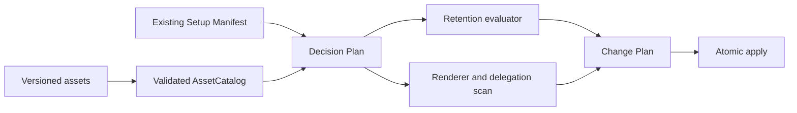

# Context-Driven Baseline upgrade retention and formatter compatibility — Technical Spec

## Executive Summary

This change extends the existing declarative setup asset catalog with stable clause contracts, version-transition ledgers, formatter compatibility metadata, and Repository-Owned Extension metadata. `context_assets.py` validates those contracts, while `context_setup.py` evaluates them through the existing Decision Plan and binds the resulting normative accounting into the same Change Plan that authorizes file mutations. The primary trade-off is that enforcement equivalence is proved through reviewed clause identity, explicit enforcement strength, and deterministic rendering rather than inferred from prose; this is less flexible than semantic comparison, but it is auditable, hermetic, and fail-closed. Formatter compatibility uses a checked-in golden corpus during ordinary Verification and the real pinned formatter during final QA, keeping audit and apply offline and free of arbitrary process execution.

## System Architecture

The canonical `.agents/skills/setup-context-driven/` tree remains the authorial implementation. Its distributed `skills/setup-context-driven/` copy continues to be generated and checked by the existing skill-sync gate. No Go package, Roundfix command, Doctor behavior, or external service changes.

`scripts/context_assets.py` remains the asset authority. It gains clause, baseline-transition, formatter, Repository-Owned Extension, delegation-alias, and normalized skill-dispatch contracts. The loader turns module declarations into one validated catalog object per active skill, so rendering never decides whether two entries are duplicates.

`scripts/context_setup.py` remains the planner and renderer. `resolve_decision_plan` selects the active future artifact graph. A new retention evaluator resolves the existing Setup Manifest's baseline identity, accounts for every prior mandatory clause against that graph, and supplies ordered `RetentionEntry` values to `concrete_change_plan`. The concrete plan remains the only mutation authority and includes both file and normative deltas in `planDigest`.



Rendering continues through `computed_render_values`, `render_expected_path`, and the managed-block helpers. Those helpers adopt one formatter-stable blank-line convention for root blocks and shared guides. Audit additionally scans repository-authored agent-instruction paragraphs for dangling delegation, but that scan produces information only and never adds mutation authority.

## Implementation Design

### Interfaces

Rules retain their current rule IDs as coverage and guide-grouping identities, but normative behavior moves into ordered clause contracts. Canonical enforcement labels are rendered with the clause text, making a weakened target mechanically observable.

```python
@dataclass(frozen=True)
class ClauseContract:
    clause_id: str
    enforcement: str
    guidance: str

@dataclass(frozen=True)
class RuleContract:
    rule_id: str
    coverage: tuple[str, ...]
    clauses: tuple[ClauseContract, ...]
```

The retention evaluator returns complete accounting or blocking findings. It does not guess equivalence from prose and does not produce an authorizable digest for an incomplete transition.

```python
@dataclass(frozen=True)
class RetentionEntry:
    from_clause: str
    enforcement: str
    disposition: str
    targets: tuple[str, ...]
    reason: str

def evaluate_retention(
    catalog: AssetCatalog,
    manifest: dict | None,
    plan: DecisionPlan,
) -> tuple[tuple[RetentionEntry, ...], list[Finding]]: ...
```

`ChangePlan` gains `retention: tuple[RetentionEntry, ...]`. Its canonical digest payload includes these entries in stable clause-ID order alongside selection, decisions, operations, and before/after digests. A stale file or normative mapping therefore invalidates the same `--confirm-plan` value.

### Data Models

Module schema v3 replaces a rule's single `guidance` string with one or more clauses. Each clause has a globally unique stable ID, one of `mandatory`, `prohibited`, or `stop-and-ask`, and portable guidance. The renderer prefixes guidance from the enforcement enum instead of relying on authors to preserve modal strength in free text. Every selected clause must have exactly one selected supporting-guide carrier, and every profile's `requiredRules` must reach all clauses in its selected modules.

`assets/retention/` contains versioned `UpgradeTransition` documents and the reviewed legacy TypeScript/Bun ledger. A transition identifies `fromBaseline`, `toBaseline`, the complete prior clause inventory with carrier and guidance digest, and exactly one mapping per prior clause. Mappings use `retained`, `moved`, `replaced`, or `rejected`; all require a reason. Accepted mappings target current clause IDs or the declared Repository-Owned Extension. Current-clause targets must be reachable in the future artifact graph and keep the same enforcement enum. Rejections have no target. Missing mappings, duplicate mappings, unknown targets, or strength changes invalidate the catalog or block the upgrade.

The Setup Manifest adds an opaque baseline ID under `generator`. Existing manifests are recognized only by a declared fingerprint of their managed artifact IDs, versions, templates, and digests. A known fingerprint is migrated additively into the next manifest; an unknown fingerprint blocks rather than inferring a source baseline from current text.

Skill dispatch entries gain stable trigger IDs. The loader normalizes active module declarations into `skill_dispatch_by_skill`, rejecting duplicate ownership or duplicate `(skill, trigger)` identities across a profile's dependency closure. Genuinely distinct triggers live together in the one owning contract. Shared workflow skills move to the least common owning module; technology and surface modules own only capability-proven domain triggers. Rendering consumes the normalized map and emits exactly one entry per installed skill.

`CoverageContract` gains bounded delegation aliases. A paragraph is a delegation candidate only when it both points to root or setup-managed guidance and contains a declared category alias. The scanner reads root and nested `AGENTS.md` and `CLAUDE.md`, excludes managed-marker spans, VCS/vendor/skill-mirror directories, does not follow symlinks, and enforces file-count and byte limits. Each missing active coverage category yields one deterministic informational finding per document.

A decision-controlled `repository-extension` module declares `docs/agents/repository.md`, its scaffold template, and a compact managed root pointer. When `repository.extension.enabled=true`, the Change Plan creates the unmarked file only if absent. It never enters `managedArtifacts`; later audit checks only that the typed root reference resolves and never compares, updates, or removes its bytes.

Each profile declares a formatter compatibility contract. The TypeScript/Bun profile selects a pinned Oxfmt Markdown contract with formatter version, fixture paths, and golden-corpus digest. Profiles without a selected Markdown formatter declare that fact explicitly instead of silently inheriting Oxfmt behavior.

### API Contracts

The existing `audit` and `apply` commands, arguments, JSON schema name, stdout/stderr discipline, and exit codes remain. Resolved preview and apply results add `retentionAccounting`, an ordered array containing `fromClause`, `enforcement`, `disposition`, `targets`, and `reason`; text output adds the equivalent retention section. This additive field is included only when a source baseline transition exists. `plannedChanges` remains the file-delta contract.

Unaccounted clauses, unknown source baselines, unreachable targets, and enforcement mismatches are blocking findings with exit `1`. Unresolved decisions and missing or stale plan confirmation remain exit `3`; invalid input and invalid bundled assets remain exit `2`. `delegation.baseline-floor` is informational and does not affect the plan or exit status. The new `repository.extension.enabled` boolean uses the existing repeatable `--decision ID=VALUE` surface. No command executes a formatter, Verification, or downloaded content.

## Coverage Map

- Goal 1 → ClauseContract, UpgradeTransition, retention evaluator, digest-bound Change Plan.
- Goal 2 → Module v3 clauses, legacy ledger, guide-carrier and distinct-guide validation.
- Goal 3 → Normalized skill-dispatch catalog, profile closure validation, dispatch renderer.
- Goal 4 → Formatter contract, formatter-stable framing, composition fixture and QA probe.
- Goal 5 → Delegation alias scanner, floor finding, repository-extension module.
- Story 1 → Manifest baseline resolver and fail-closed retention evaluator.
- Story 2 → `retentionAccounting` in text, JSON, and `planDigest`.
- Story 3 → Restored clause catalog and guide-specific behavioral fixtures.
- Story 4 → One catalog owner and one rendered entry per installed skill.
- Story 5 → Pinned Oxfmt golden corpus and full composition flow.
- Story 6 → Decision-gated unmarked extension plus non-blocking delegation findings.

## Integration Points

Runtime integration is limited to the target repository filesystem and the existing Setup Manifest. Reads and writes keep the current safe-relative-path, marker ownership, preimage verification, atomic replacement, and rollback boundaries. The delegation scanner is a read-only filesystem adapter and never follows links or executes repository content.

The formatter integration is test-only. Ordinary `make verify` compares generated bytes with a checked-in corpus produced by the exact formatter version recorded in its provenance file; it performs no network access or package installation. Final QA runs that pinned Oxfmt command in the disposable TypeScript/Bun fixture, then runs its selected fixture Verification, setup audit, and second apply. Updating the formatter contract requires deliberately regenerating both provenance and golden bytes.

## Testing Approach

Asset mutation tests extend `test_assets.py`: duplicate clauses, invalid enforcement, missing carriers, incomplete transitions, missing reasons, unknown or weakened targets, duplicate guide clause sets, duplicate dispatch ownership, unsafe extension paths, delegation aliases, and formatter metadata must fail with stable diagnostics.

A focused `test_upgrade_retention.py` uses a sanitized fixture derived from the real pre-0.9 managed corpus. It proves unknown and unaccounted baselines block without writes; retained, moved, replaced, rejected, and Repository-Owned Extension outcomes render in stable order; accepted clauses keep enforcement; and changing normative accounting changes `planDigest`. `test_manifest_migration.py` proves only declared legacy fingerprints acquire the additive baseline ID.

Existing preview/apply tests assert text and JSON parity, stale-confirmation rejection, and atomic one-time scaffold creation. Guide tests assert the actual routing matrix, findings lifecycle, acceptance evidence, slice discipline, Supervisor prohibition, Secondbrain protocol, design precondition, dependent-interface precondition, research split, and verification-configuration authority. They test behavior-bearing clauses rather than line counts.

`test_delegation.py` covers nested instruction documents, multiple missing categories, fully covered delegation, marker exclusion, ignored vendor and skill-mirror trees, symlinks, limits, deterministic ordering, and non-blocking status. Macro-profile tests assert that every required installed skill has one rendered dispatch entry and every supported profile applies, audits, and reapplies cleanly.

`test_formatter_compatibility.py` performs confirmed apply, byte comparison with the pinned Oxfmt corpus, fixture Verification, fresh audit, and second apply, asserting an empty repository diff and Change Plan. Final QA repeats the sequence with real pinned Oxfmt. Both canonical and distributed Python suites run before the existing mirror and repository verification gates.

## Build Order

1. Add clause, baseline, transition, extension, delegation-alias, formatter, and normalized dispatch asset contracts with mutation tests.
2. Restore portable clauses and operational guides, create the reviewed legacy ledger, and correct domain-skill dispatch ownership (depends on: 1).
3. Add baseline resolution, retention evaluation, additive manifest identity, Change Plan presentation, digest binding, and pre-0.9 upgrade tests (depends on: 1, 2).
4. Add the Repository-Owned Extension decision/scaffold and bounded delegation scan with informational findings (depends on: 1, 2).
5. Make managed framing formatter-stable and add the hermetic Oxfmt composition fixture plus real QA probe (depends on: 2, 3, 4).
6. Complete all-profile macro coverage, update the skill and maintainer documentation, synchronize the distributed copy, and run final QA and `make verify` (depends on: 3, 4, 5).

## Risks & Considerations

Clause enums cannot prove natural-language equivalence by themselves. The mitigation is to make clause text the sole rendered source, render enforcement canonically, require explicit reviewed transition mappings, and mutation-test weakened targets; no heuristic NLP result can authorize an upgrade.

Legacy fingerprints are deliberately strict. A locally modified managed block may not match a declared source baseline and will block until ownership or migration is resolved, which is safer than silently assigning the wrong ledger. Repository-authored bytes outside markers remain unaffected.

Formatter behavior can change between releases. Pinning provenance makes the supported contract reproducible, while the real QA probe detects drift before the contract is refreshed. The trade-off is that ordinary Verification proves the declared formatter version, not an arbitrary future version.

Delegation language is inherently varied. Requiring both an explicit delegation signal and a declared category alias limits false positives, and informational severity ensures uncertain matches cannot gate work. Bounded scanning and symlink exclusion prevent repository size or hostile paths from turning audit into an unbounded traversal.

Repository-Owned Extension creation crosses the managed/unmanaged boundary once. The planner therefore authorizes only initial creation, records its exact preimage/postimage in the Change Plan, and excludes it from future managed inventory. Typed-reference checks may report a missing file, but setup never restores or rewrites existing repository-authored content automatically.

## Decisions

- Baseline upgrades fail closed through declarative clause accounting. See [ADR-0058](../../adr/0058-baseline-upgrades-fail-closed-on-unaccounted-rule-removal.md).
- Formatter compatibility is part of generated output, never an apply mutation. See [ADR-0059](../../adr/0059-generated-output-is-formatter-stable-in-the-target-repository.md).
- Existing declarative ownership and one-plan composition remain authoritative. See [ADR-0046](../../adr/0046-setup-owned-agent-instructions-are-declarative.md) and [ADR-0047](../../adr/0047-setup-decisions-declare-their-effects.md).
- Enforcement equivalence uses stable clause identity, exact enforcement enums, and deterministic rendering; prose similarity is not an authority boundary.
- Dispatch has one validated catalog owner per skill in a selected profile; the renderer performs no semantic deduplication.
- Formatter proof is hermetic in ordinary Verification and executes real pinned Oxfmt in final QA.
- Repository-Owned Extensions are decision-gated, created unmarked once, and never enter setup-managed inventory.
- No new Go CLI surface or ADR is required.
