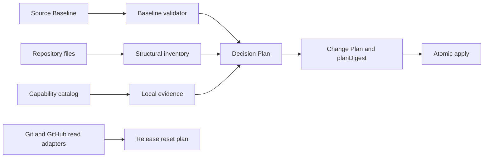

# Roundfix 0.0.1 Context-Driven Baseline reset — Technical Spec

## Executive Summary

This change replaces the setup catalog's v1/v2/v3 compatibility ladder with one strict `0.0.1` generation, adds byte-exhaustive Baseline Readoption, and introduces local Repository Capability evidence for the Standard TypeScript Monorepo Profile. The existing `AssetCatalog → Decision Plan → Change Plan → atomic apply` flow remains the mutation authority; new baseline and capability modules provide validated inputs instead of adding another planner. The primary trade-off is deliberate strictness: incompatible repositories must classify and dispose every Source Baseline Entry, which can require many decisions, but no heuristic or aggregate category can silently discard instruction bytes. Release history reset remains separate from setup and enters the existing read-only Release Plan Command as a digest-bound inventory mode.

## System Architecture

The canonical implementation remains `.agents/skills/setup-context-driven/`; `make skills-sync` continues to generate `skills/setup-context-driven/`. `scripts/context_assets.py` keeps catalog composition, cross-reference validation, and template loading. Two cohesive modules prevent the existing asset and workflow scripts from absorbing unrelated parsing and probing behavior:

- `scripts/context_baseline.py` owns Source Baseline loading, Normative Clause Manifest validation, structural inventory, and disposition validation.
- `scripts/context_capabilities.py` owns local evidence adapters for skills, executables, package manifests, workspaces, and repository contracts.

`context_setup.py` continues to resolve scalar decisions, render artifacts, calculate the concrete Change Plan, bind `planDigest`, and apply with preimage checks and rollback. It imports baseline and capability results before the plan becomes authorizable. Complex readoption and HTTP decisions arrive through a new decision file; the existing repeatable `--decision ID=VALUE` remains for scalar choices.

The Go release path remains in `internal/releaseplan` and `internal/cli`. A reset inventory adapter reads Git tags and paginated GitHub Release metadata, but exposes no mutation method. Normal range planning and reset planning share output discipline and approval states while using distinct request variants.



## Implementation Design

### Interfaces

A Source Baseline Entry is structural and byte-evidenced. Classification is user-authorized data, never parser output.

```python
@dataclass(frozen=True)
class SourceBaselineEntry:
    entry_id: str
    path: Path
    kind: str
    start: int
    end: int
    digest: str

@dataclass(frozen=True)
class EntryDisposition:
    entry_id: str
    classification: str
    destination: str
    target: str | None
    reason: str | None
```

Capability contracts separate required strength from observed evidence. A declared version cannot turn an absent package or tool into present evidence.

```python
@dataclass(frozen=True)
class RepositoryCapability:
    capability_id: str
    strength: str
    evidence_kind: str
    probe: dict[str, object]

@dataclass(frozen=True)
class CapabilityEvidence:
    capability_id: str
    status: str
    version: str | None
    source_path: Path | None
    source_digest: str | None
```

Release reset planning uses read-only providers. The plan digest covers the target version, target revision, and the complete ordered tag and release inventory.

```go
type ResetInventorySource interface {
    Tags(context.Context) ([]TagRef, error)
    Releases(context.Context) ([]ReleaseRef, error)
}

type ResetPlan struct {
    TargetVersion string
    TargetCommit  string
    Tags          []TagRef
    Releases      []ReleaseRef
    PlanDigest    string
}
```

### Data Models

Every Roundfix-owned setup asset adopts a string schema identity shaped as `setup-context-driven/<kind>/0.0.1` and a string `version: "0.0.1"`. Profiles, modules, decisions, templates, setup snapshots, managed artifacts, Setup Manifests, formatter provenance, compatibility fixtures, and managed markers use that generation. Old integer schemas and marker versions are not accepted as current state; they are input evidence for Baseline Readoption. The Run Database's `PRAGMA user_version`, external `skills-lock.json` schema, upstream skill metadata, and third-party protocol versions are operational or upstream contracts and do not reset.

`assets/source-baselines/<id>/` contains a project-agnostic corpus, `manifest.json`, and immutable identity metadata. The metadata pins corpus digest, manifest digest, ordered entry count, and profile. Explicit entry markers in the corpus provide stable evidence boundaries. The loader validates bidirectionally that every corpus entry appears exactly once in the Normative Clause Manifest and every manifest record resolves to matching bytes. A separate baseline index pins both digests and the entry count, so deleting an entry from the corpus and manifest still invalidates the generation unless an explicit new Source Baseline identity is authored.

Manifest entries classify portable source content as Normative Clauses, recommendations, or Operational Contracts. Operational Contracts carry a structure enum such as `template`, `ordered-procedure`, `decision-matrix`, `protocol`, or `lifecycle` and point to complete template fragments; a guidance summary cannot satisfy them. The project-token denylist and corpus fixtures reject project names, branding, paths, and generated artifacts.

When no current `0.0.1` manifest exists, Baseline Readoption scans bounded root and nested `AGENTS.md`, `CLAUDE.md`, and `docs/agents/` carriers. It skips VCS, vendor, dependency, skill-mirror, and symlink trees and enforces file-count and byte limits. Every nonblank byte belongs to exactly one heading section, list item, prose paragraph, fenced or managed-template block, or whole table/matrix Source Baseline Entry. Each entry stores path, byte range, structural kind, digest, and opaque bytes. The scanner reports structure only; the decision file classifies the entry and assigns exactly one destination.

Valid destinations are a current managed entry, an existing typed repository document with path and digest evidence, `docs/agents/specific-repository.md`, or explicit rejection. Rejection and non-governed classification require an individual non-empty reason. Repository-Specific Normative Rules preview exact proposed bytes and digest; confirmed initial creation is unmarked and recorded separately from `managedArtifacts`. Baseline creates and links the canonical carrier only for non-empty approved rules. It migrates either legacy `docs/agents/repository.md` or `docs/agents/repository-rules.md` byte-for-byte, removes the known empty scaffold, and blocks divergent non-empty legacy carriers for manual reconciliation. Later runs preserve the canonical repository-owned bytes. Source-tree digest, ordered entry digests, classifications, destinations, reasons, and proposed bytes all enter `planDigest`.

`assets/capabilities/` defines required, recommended, and optional Repository Capabilities. Evidence adapters read local `package.json` files, Bun lock/config files, fixed workspace paths, declared repository documents, installed Repository Skill Set trees, and executable lookup; they perform no network calls or installation. Package and workspace evidence records version, owner, source path, and source digest. A missing required capability blocks readiness. A present capability with absent or incompatible version requires an explicit version decision and remains unresolved until answered. A missing recommended capability emits one warning with a stable explanation; optional capability modules activate only when evidence or an explicit repository contract selects them.

The `standard-typescript-monorepo` profile replaces `typescript-bun-monorepo` and requires the exact `packages/frontend` and `packages/backend` workspaces plus the stack listed in PRD Core Features 2–3. PostgreSQL is proved by a recognized repository contract and persisted version evidence, not by connecting to a database. Inngest and Docker remain optional. Context7 and Exa are required Repository Skill Set capabilities for every profile; Firecrawl is recommended, while `rtk` and `rg` are recommended executable capabilities. Go and Rust profile content remains unchanged except for generation, universal research capabilities, and version metadata.

Skill dispatch becomes a list of activation contracts keyed by stable trigger ID, owner, exact required bundle, and optional capability condition. The loader rejects duplicate owners, triggers, missing snapshot members, and partial bundles. Production code always activates `coding-guidelines`, `clean-code`, and `solid`; Hono endpoint work adds `hono-api-best-practices`, `hono`, and `zod`, and persistence adds `drizzle-orm`. Rendering emits each trigger and exact bundle once.

The HTTP Contract Decision is a typed object with `mode: rest|post-only`, ordered exceptions containing scope, methods, owner, and reason, plus source evidence. Setup recognizes a supported typed repository document without editing it; otherwise the decision file must supply the contract. Verification remains a persisted scalar command and runs only outside audit/apply as already defined.

All 14 Roundfix-owned skills set `metadata.version: 0.0.1`, and `skills.Check` validates the owned set and rejects disagreement. `app.Version`, launcher and platform package manifests, the setup generation, and the restarted changelog use `0.0.1`; local binaries distinguish source state through existing Build Commit and Build Time fields rather than a different semantic version. The Release Plan JSON schema becomes `roundfix.release-plan/0.0.1`.

### API Contracts

`context_setup.py audit` and `apply` add repeatable `--decision-file <path>`. Each file uses `setup-context-driven/decisions/0.0.1`, contains scalar decisions, structured HTTP data, and readoption dispositions, and is included by content digest in the Decision Plan. Conflicting repeated files or conflicts with `--decision` are invalid input. Readoption output adds `sourceBaseline` and ordered `sourceEntries`; capability output adds ordered `capabilities`. The reset intentionally drops compatibility with `audit-v1`, old Setup Manifest schemas, and old profile IDs while retaining exit categories `0` clean/applied, `1` blocking, `2` invalid input, and `3` unresolved or stale confirmation.

`roundfix release plan --reset-to v0.0.1 [--format text|json]` is mutually exclusive with `--from`, `--to`, `--impact`, and `--reason`. It requires a clean committed target, inventories every local and remote stable tag plus every GitHub Release through read-only adapters, sorts deterministically, and returns `approval_required` with exit `3`. Text and JSON name each tag or release, immutable identity, target commit where available, and `planDigest`. Missing or incomplete GitHub inventory blocks rather than authorizing partial deletion. No release-plan interface can delete a tag or release.

## Coverage Map

- Goal 1 → Source Baseline loader, independent manifest/index validation, structural inventory, EntryDisposition, digest-bound Change Plan.
- Goal 2 → Standard TypeScript Monorepo Profile, capability catalog, exact activation bundles, complete Operational Contract templates.
- Goal 3 → Baseline Readoption, typed repository-document targets, Repository-Specific Normative Rules preservation.
- Goal 4 → strict `0.0.1` setup generation, owned-skill validation, CLI/npm identity, Release Plan schema.
- Goal 5 → compact root templates, complete guide fragments, Operational Contract structure validation.
- Story 1 → byte-exhaustive entries and individual disposition validation.
- Story 2 → local capability evidence, version decisions, blocking and warning severity.
- Story 3 → typed repository targets and one-time repository-rules creation.
- Story 4 → SkillActivation catalog and exact rendered bundles.
- Story 5 → source-tree digest, structured decision file, stale Change Plan rejection.
- Story 6 → version alignment, restarted changelog, read-only release reset inventory.

## Integration Points

Repository inspection stays local and read-only until confirmed apply. Existing safe-relative-path validation, managed-marker ownership, preimage verification, atomic replacement, postwrite verification, and rollback remain the filesystem boundary. Package evidence parses files and never executes repository scripts.

Repository Skill Set restoration retains its exact-commit Git boundary and upstream ownership rules. Resetting owned metadata requires canonical-to-embedded synchronization but never edits external skill trees or `skills-lock.json` version semantics.

Release reset planning uses the existing argv-only Git runner and a new read-only GitHub adapter. It may access the network to enumerate remote state, unlike setup audit/apply, but cannot publish, delete, or push. Changelog replacement is an implementation file change. Old tag and GitHub Release deletion occurs only after implementation and QA, from the accepted inventory, as a separately authorized release operation.

## Testing Approach

Asset mutation tests prove strict `0.0.1` schemas, bidirectional corpus accounting, immutable digest and count pins, Operational Contract structure, exact bundle ownership, project-token exclusion, and unchanged upstream metadata. Deleting the same entry from corpus and manifest must still fail against the baseline index.

Readoption tests use disposable, project-neutral repositories. They cover every structural unit kind, byte exhaustion, nested carriers, ignored trees, limits, individual rejection reasons, typed-document digests, repository-rules preview and preservation, source changes that stale confirmation, and zero writes before all dispositions resolve. Decision-file tests cover malformed schemas, duplicate entries, path escape, scalar conflicts, and exact digest binding.

Capability tests build local Bun monorepo fixtures for full evidence, missing required packages, version ambiguity, exact workspace paths, optional modules, Context7/Exa blocks, and Firecrawl/`rtk`/`rg` warnings. They assert no package manager, network, database, formatter, or repository script executes. HTTP tests cover REST, POST-only, typed exceptions, recognized repository documents, and unresolved contracts.

Macro tests apply, audit, format, run fixture Verification, audit again, and reapply every maintained profile with no delta. Both canonical and embedded Python suites run. Version tests inspect the CLI line, npm manifests, every owned skill, all setup assets, release schema, and changelog while proving Run Database and upstream schemas remain unchanged.

Release tests use temporary local/remote tags and a fake paginated GitHub adapter. They prove deterministic complete inventory, plan-digest sensitivity, flag exclusivity, exit `3`, stdout/stderr discipline, read failures, and absence of any mutation call. Final QA runs the real reset plan and confirms it inventories the three observed historical tags and corresponding releases; it does not delete them.

## Build Order

1. Add strict `0.0.1` version contracts, Source Baseline types, Normative Clause Manifest/index validation, and mutation tests.
2. Build the project-agnostic `0.0.1` corpora, complete Operational Contract fragments, and exact skill-activation bundles (depends on: 1).
3. Add Repository Capability contracts and local evidence adapters, then define `standard-typescript-monorepo`, workspace, version, optional-module, and HTTP contracts (depends on: 1, 2).
4. Add byte-exhaustive Baseline Readoption inventory, decision-file parsing, individual disposition validation, and Repository-Specific Normative Rules planning (depends on: 1, 2, 3).
5. Integrate capabilities and readoption into audit, Decision Plan, Change Plan, manifest/marker rendering, digest authorization, atomic apply, and preservation tests (depends on: 2, 3, 4).
6. Reset Go/Rust profile metadata and universal capabilities, align setup snapshots and all Roundfix-owned skills, synchronize the embedded tree, and extend owned-version validation (depends on: 1, 2, 5).
7. Align CLI/npm identity and changelog, add `release plan --reset-to` with read-only Git/GitHub inventory, and update release documentation and contract tests (depends on: 1).
8. Complete all-profile macro fixtures, maintainer and user documentation, full `make verify`, and the final QA matrix including the live read-only reset plan (depends on: 5, 6, 7).

## Risks & Considerations

Structural boundaries do not equal semantic boundaries. Byte exhaustion prevents omission, and explicit classification prevents the parser from claiming meaning; the cost is a potentially large decision file. Stable ordering and reusable decisions make the process resumable.

A strict generation makes every old manifest incompatible. Baseline Readoption is the safety path, not a compatibility layer: rollback before confirmed apply is no mutation, while rollback after apply uses the existing atomic preimages or Git history. Repository-Specific Normative Rules are intentionally outside later setup ownership, so setup cannot undo their confirmed creation or repair later user edits.

Local capability evidence can prove repository contracts, not live infrastructure health. PostgreSQL evidence therefore states what the repository requires and which version it declares; it never claims that a server is reachable. Required missing evidence blocks instead of accepting an assertion as installation proof.

Resetting to `0.0.1` makes the published sequence numerically lower than historical releases. The complete reset inventory and changelog make that discontinuity explicit. Deleting tags and releases is irreversible remote mutation and remains outside implementation and QA; the operator must accept a fresh plan after QA. If remote inventory changes, its digest becomes stale and cleanup must stop.

## Decisions

- Setup ownership and Decision Plan composition remain declarative. See [ADR-0046](../../adr/0046-setup-owned-agent-instructions-are-declarative.md) and [ADR-0047](../../adr/0047-setup-decisions-declare-their-effects.md).
- Release analysis remains separate from mutation. See [ADR-0048](../../adr/0048-release-planning-is-read-only-and-confirmation-gated.md).
- Retention is individual and fail-closed; formatter compatibility remains part of generated output. See [ADR-0058](../../adr/0058-baseline-upgrades-fail-closed-on-unaccounted-rule-removal.md) and [ADR-0059](../../adr/0059-generated-output-is-formatter-stable-in-the-target-repository.md).
- Source Baselines are independent and project-agnostic, and the Standard TypeScript Monorepo Profile is deliberately opinionated. See [ADR-0060](../../adr/0060-source-baselines-are-exhaustive-and-project-agnostic.md) and [ADR-0061](../../adr/0061-standard-typescript-monorepo-is-opinionated.md).
- Every Roundfix-owned version surface restarts at `0.0.1`; repository HTTP semantics remain typed repository policy. See [ADR-0062](../../adr/0062-roundfix-owned-versions-restart-at-zero.md) and [ADR-0063](../../adr/0063-repositories-own-their-http-contract.md).
- Unknown historical states use byte-exhaustive structural inventory and explicit individual disposition. See [ADR-0064](../../adr/0064-baseline-readoption-uses-byte-exhaustive-structural-inventory.md).
- Release reset inventory is a read-only `--reset-to` mode; deletion needs separate post-QA authority. See [ADR-0065](../../adr/0065-release-plan-exposes-a-read-only-reset-mode.md).
