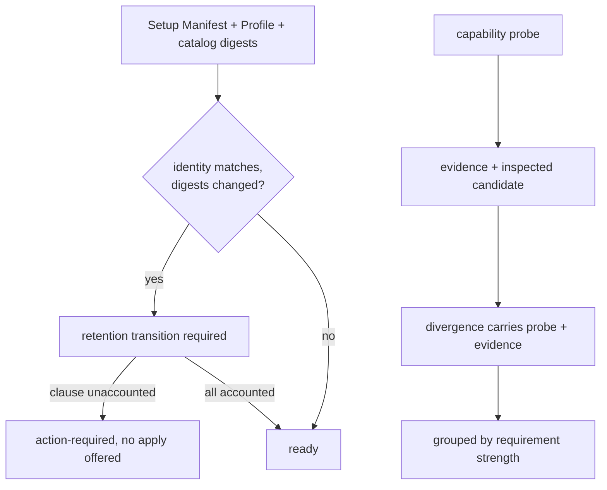

# Baseline capability evidence and retention — Technical Spec

## Executive Summary

Most of this Spec is surfacing data the model already holds. `RepositoryCapability`
carries a `Probe map[string]any`, `CapabilityOutcome` carries
`Evidence []CapabilityEvidence` and a `Diagnostic`, and `ProfileDivergence`
carries `Requirement` and `Blocking` — but the divergence projection keeps only
a code, an ID, and a message, so the evidence that would make a divergence
actionable is discarded at the boundary between evaluation and presentation.
Grouping by requirement strength, rendering the evaluated probe, and reporting
the inspected candidate are all projection changes over data that exists.

Two items are genuine behavior changes. Executable discovery is broken in a
specific, provable way: `lookPathWithoutExecution` calls `os.Lstat` and then
requires `IsRegular()`, and a symlink never satisfies that, so every Homebrew or
Docker Desktop install reads as missing. And the retention gate must close a
path that currently bypasses ADR-0058 entirely.

The design accepts one trade-off deliberately: the retention gate makes a
previously-completing path stop. It is bounded by failing closed only on
evidence, and by a characterization corpus of real consumer-repository plans
captured before the change.

## Project Constraints

- Identifier strategy: not applicable — no project-owned Internal Identifier is
  created; Profile identifiers, digests, capability IDs, and diagnostic codes
  keep their existing contracts. Source: `docs/agents/domain.md`.
- Authentication and HTTP: not applicable — the governing clause prohibits
  reading, printing, committing, or generating secrets and forbids inventing
  authentication, authorization, transport, or deployment policy; Baseline
  planning stays local, offline, and read-only until digest-confirmed apply.
  Source: `docs/agents/agent-instructions.md`.
- Active ADR obligations: applicable — ADR-0058 requires upgrades to fail
  closed on unaccounted managed-rule removal, which the same-identity drift path
  bypasses and this Spec enforces; ADR-0068 keeps one confirmation-gated
  workflow; ADR-0070 keeps the audit byte-exhaustive while preserving root
  instructions; ADR-0071 keeps plans portable and preimage-bound; ADR-0075 keeps
  divergence resolution a confirmed repository-owned adaptation; ADR-0087
  governs executable discovery resolving links without executing. Source:
  `docs/agents/domain.md`.
- Tooling authority: applicable — express maintainer authorization: on
  2026-07-28 the maintainer authorized the Skill pair plus its deterministic
  digest fallout in this Spec's PRD; bounded files:
  `.agents/skills/roundfix/SKILL.md`, `skills/roundfix/SKILL.md`,
  `internal/baseline/assets/setups/typescript-bun.json`,
  `internal/baseline/testdata/catalog.digest`,
  `internal/baseline/testdata/catalog.normalized.json`,
  `internal/baseline/testdata/parity-corpus/v1/fixtures/asset-sync.json`,
  `internal/baseline/testdata/parity-corpus/v1/manifest.json`. Catalog probe
  definitions may need fields added; that is asset content under the same
  bounded paths, and any digest fallout is sanctioned by ADR-0081. Source:
  `docs/agents/agent-instructions.md`.

## System Architecture

Three existing files carry almost all of it. `profile_alignment.go` owns
capability evaluation, divergences, and the Verification projection.
`plan.go` owns retention resolution and the plan result. `source_contracts.go`
owns the Upgrade Retention Contract. No new package or seam.



**The evidence-carrying divergence** is the central change: `ProfileDivergence`
gains the evaluated probe and the evidence that produced its verdict, so every
downstream renderer works from one value instead of re-deriving.

**The read-only re-check** reuses the same alignment evaluation the full plan
runs, with decision resolution skipped — same code path, fewer inputs, so the
two cannot disagree.

## Implementation Design

### Interfaces

Executable discovery, replacing the `Lstat`-then-`IsRegular` rejection:

```go
// resolveExecutableCandidate inspects one PATH candidate without executing it.
// It follows a bounded symlink chain and judges the target.
type executableProbeResult struct {
    Candidate string // the inspected path, always set when one existed
    Resolved  string // the regular executable it resolved to, empty when unsatisfied
    Reason    string // "", "not-found", "broken-link", "link-cycle", "not-executable"
    HopCount  int
}

func resolveExecutableCandidate(name string) executableProbeResult
```

The divergence, gaining the evidence it currently discards:

```go
type ProfileDivergence struct {
    Code        string                `json:"code"`
    ID          string                `json:"id"`
    Requirement CapabilityRequirement `json:"requirement"`
    Blocking    bool                  `json:"blocking"`
    Message     string                `json:"message"`
    NextAction  string                `json:"nextAction,omitempty"`
    Probe       map[string]any        `json:"probe,omitempty"`     // the evaluated probe
    Evidence    []CapabilityEvidence  `json:"evidence,omitempty"`  // what produced the verdict
}
```

Retention accounting over the same-identity drift path:

```go
type ClauseDisposition string // retained | moved | replaced | repository-document
                              // | repository-extension | reasoned-rejection | unaccounted

type ClauseDelta struct {
    Dispositions map[string]ClauseDisposition
    Counts       map[ClauseDisposition]int
}

// A ready update plan with a changed Profile or catalog digest requires a
// ClauseDelta whose Unaccounted count is zero. Otherwise planning is
// action-required and apply is never offered.
```

### Data Models

No persisted schema changes. `ProfileDivergence` gains two optional JSON fields;
the plan result gains the clause delta and the status matrix. Existing fields
keep their names and meanings.

### API Contracts

- **A read-only capability re-check** is added to the Baseline command surface.
  It resolves no decisions, writes nothing, and returns the same capability
  outcomes a full plan would produce.
- **The divergence prompt gains a fourth outcome** — exit without writing, print
  per-divergence remediation, name the re-check command — journaled distinctly
  from decline.
- **Divergences group by requirement strength**: blocking, advisory,
  informational. Every advisory states it does not block readiness or apply
  before any optional next action.
- **The final result is a status matrix**: approved postimages, semantic
  retention, profile alignment, repository Verification, idempotence — each
  `verified` or `not run`. Completion language appears only when retention is
  verified and idempotence passed.

## Coverage Map

- Story 1, Core Features 1 and 11 → retention transition over same-identity
  drift; `ClauseDelta`; the action-required exit.
- Story 2, Core Feature 5 → `ProfileDivergence.Probe` and `.Evidence`, plus the
  renderer that reads them.
- Story 3, Core Feature 4 → `resolveExecutableCandidate`; ADR-0087.
- Story 4, Core Feature 6 → the read-only re-check sharing the alignment path.
- Story 5, Core Feature 7 → the fourth prompt outcome and its journal record.
- Story 6, Core Features 2 and 12 → carrier classification narrowing only on
  positive evidence.
- Story 7, Core Feature 10 → the status matrix.
- Core Feature 3 → the clause-level delta rendered before final confirmation.
- Core Feature 8 → requirement-strength grouping over existing `Blocking` and
  `Requirement`.
- Core Feature 9 → portable Verification role mapped through the existing
  `VerificationRepositoryCommand` classification.

## Integration Points

- **The filesystem**, read-only: PATH candidates, symlink targets, declared
  files. Nothing is executed, per ADR-0087.
- **The catalog's probe definitions**, which become the source the rendered
  diagnostic reads, so the evaluation and the explanation share one definition.
- **The Run journal**, which records the fourth prompt outcome distinctly from
  decline.

## Testing Approach

Tests attach at the alignment evaluator and the plan resolver — both existing
seams — plus one new corpus.

- **Characterization corpus, captured before any behavior change.** Real
  consumer-repository plans and their outcomes are recorded. Every plan
  legitimately ready today must still be ready; every diagnostic that fires
  today must still fire. This is the non-regression gate.
- **The same-identity drift fixture** the PRD requires: unchanged Baseline
  identifier, changed digests, a disappearing clause. It exits action-required
  with an explicit unaccounted count, and no ready plan carries an empty
  retention ledger when clauses changed.
- **Executable probe table**: a regular executable, a one-hop symlink, a
  multi-hop chain, a cycle, a broken link, a non-executable target, and absence.
  Each asserts its own reason and the inspected candidate.
- **Re-check equivalence**: the read-only re-check and a full plan produce the
  same capability outcomes for the same repository.
- **Idempotent re-plan**: after a verified apply, zero file changes and zero
  warnings; an unmanaged nested carrier still warns.

## Build Order

1. **Characterization corpus** of current plan outcomes and diagnostics. No
   behavior change; the gate every later step is measured against.
2. **Executable discovery** (depends on: 1). `resolveExecutableCandidate`, its
   probe table, and the inspected-candidate reporting. Independently valuable:
   symlinked installs stop reporting missing.
3. **Evidence-carrying divergences** (depends on: 1). Carry probe and evidence
   through the projection; nothing renders them differently yet.
4. **Probe rendering and requirement grouping** (depends on: 3). Divergences
   render their evaluated probe and group by blocking, advisory, informational.
5. **Read-only capability re-check** (depends on: 2, 4). The command surface,
   sharing the alignment path so outcomes cannot diverge.
6. **Retention transition over same-identity drift** (depends on: 1). The
   `ClauseDelta`, the action-required exit, and the regression fixture. The
   largest slice and the one ADR-0058 turns on.
7. **Clause-level delta rendering** (depends on: 6). Rendered before final
   confirmation with counts; apply not offered while any clause is unaccounted.
8. **Carrier classification** (depends on: 1). Current managed artifacts stop
   warning; only unmanaged nested carriers warn, and only on positive evidence.
9. **Portable Verification role mapping** (depends on: 1). A declared repository
   command satisfies a portable role through the existing classification.
10. **Fourth prompt outcome** (depends on: 5). Exit without writing, print
    remediation, name the re-check command, journal distinctly.
11. **Status matrix** (depends on: 6, 8, 9). Five axes, each `verified` or
    `not run`; completion language gated on retention and idempotence.
12. **Document the contract** (depends on: 5, 10, 11).

## Risks & Considerations

- **The retention gate is the regression risk.** It turns a completing path into
  a stopping one. Bounded by failing closed only on positive evidence of an
  unaccounted clause, and by the characterization corpus: a plan legitimately
  ready today stays ready.
- **Carrier classification can under-warn.** Today the command over-warns;
  misclassification would silence a real nested-carrier conflict. Narrowing
  requires positive evidence — an unclassifiable carrier keeps its warning.
- **Verification role mapping can over-satisfy.** A role must not report
  satisfied without its declared repository command present.
- **Symlink resolution must stay non-executing.** The bound prevents a cycle
  from hanging; the target is judged, never run.
- **This is the largest Spec in the queue** — twelve slices. Steps 2, 3, 8, and
  9 are independent of the retention work and can land without it, so a stall in
  step 6 does not block the rest.

## Decisions

- Divergences carry their evidence rather than each renderer re-deriving it; one
  value feeds text, JSON, and the prompt.
- The read-only re-check shares the full plan's evaluation path, so the two
  cannot disagree — matching outcomes is a property of construction, not a test.
- Executable discovery resolves a bounded link chain and never executes. See
  ADR-0087.
- The retention gate closes on evidence, never on doubt; ADR-0058 is enforced on
  the path that bypassed it.
- Every narrowing — a warning suppressed, a role satisfied — requires positive
  evidence; absent it, current behavior stands.
