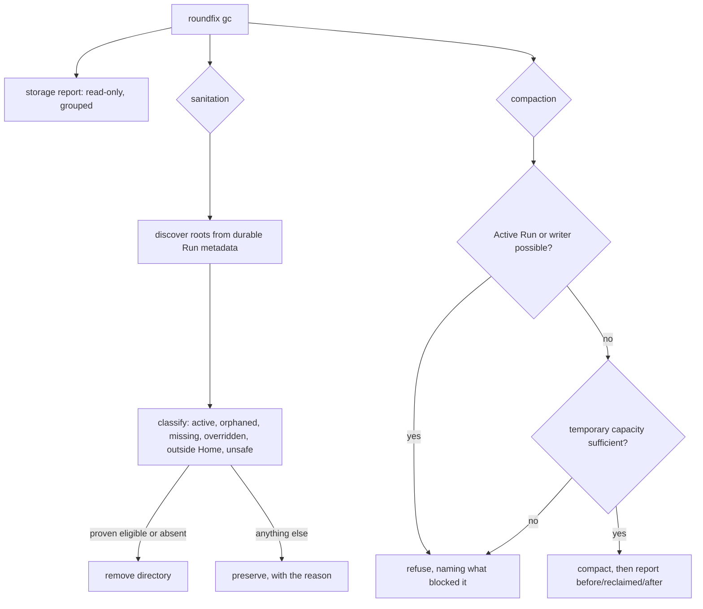

# Run storage compaction and global sanitation — Technical Spec

## Executive Summary

Retention already deletes rows; nothing returns the pages. `internal/store`
carries no `VACUUM` at all — searched, zero occurrences — so a database whose
journal is pruned keeps every byte it ever allocated. That is how it reached
1.4 GB with its journal already empty.

The second half is a scope mismatch. `PruneTerminalRuns` works machine-wide
over the Run Database, but `internal/cli/gc.go` resolves artifact cleanup
against the current repository's Artifact Root. One side sees every
repository, the other sees one, so artifact roots belonging to other
repositories are never reclaimed and never even listed.

Both halves are additive. Nothing here changes what retention deletes, and no
existing command changes its meaning.

## Measurement, not literals

Every acceptance in this Spec is about a quantity that moves: bytes on disk,
rows in a table, roots on a filesystem. This repository spent three Runs on
2026-08-05 to a test asserting a literal `104` that a legitimate change moved
to `106`, and the failure masked the real diagnostic behind it.

So no Verification in this graph asserts a recorded number. Each asserts a
**relation** that holds at any size:

- the preview's reclaimable bytes equal the bytes the operation actually
  reclaimed, within the tolerance the Spec declares;
- the report's grouped totals reconcile with the file size and the artifact
  totals, within that same declared tolerance;
- sanitation is idempotent: a second run reclaims zero;
- a refusal leaves every byte where it was.

## Project Constraints

- Identifier strategy: not applicable — Run IDs, Artifact Root paths, and table
  names keep their existing identities; no project-owned Internal Identifier is
  created. Source: `docs/agents/domain.md`.
- Authentication and HTTP: not applicable — the governing clause prohibits
  reading, printing, committing, or generating secrets and forbids inventing
  authentication, authorization, transport, or deployment policy; all behaviour
  is local SQLite and filesystem maintenance and opens no transport. Source:
  `docs/agents/agent-instructions.md`.
- Active ADR obligations: applicable — ADR-0033 keeps the Run Event Journal
  pruned by its retention window, and compaction reclaims pages without
  changing retention. ADR-0052 protects terminal completion, so compaction must
  refuse while an Active Run or any writer can exist. The Spec 0014 retention
  promise never to delete `runs` rows or Active Run locks holds unless this
  Spec's policy explicitly bounds a table with measured justification.
  ADR-0053 is relation-only: terminal Run Worktree reconciliation is owned by
  Spec 0038 and stays out of scope. Source: `docs/agents/domain.md`.
- Tooling authority: applicable — express maintainer authorization: the
  2026-08-04 record at
  `docs/workflow/authorizations/2026-08-04-queue-tail-tooling.md` names Spec
  0059. The exact bounded files: `.agents/skills/roundfix/SKILL.md` and its
  `skills/roundfix/SKILL.md` mirror, regenerated by `make skills-sync`.
  Deterministic Skill-digest fallout is sanctioned by ADR-0081 and lands in
  `internal/baseline/assets/setups/typescript-bun.json`,
  `internal/baseline/testdata/catalog.digest`,
  `internal/baseline/testdata/catalog.normalized.json`,
  `internal/baseline/testdata/parity-corpus/v1/fixtures/asset-sync.json`, and
  `internal/baseline/testdata/plan-characterization/advisory-only-divergences.golden.json`,
  `internal/baseline/testdata/plan-characterization/clean-adoption.golden.json`,
  `internal/baseline/testdata/plan-characterization/idempotent-replan-after-verified-apply.golden.json`,
  `internal/baseline/testdata/plan-characterization/same-baseline-changed-profile-and-catalog-digests.golden.json`, and
  `internal/baseline/testdata/parity-corpus/v1/manifest.json`. No other
  protected tooling mutation is authorized. Source:
  `docs/agents/agent-instructions.md`.

## System Architecture



Every path that is not proven ends at `KEEP` or `REFUSE`. That is the same
inverted default Spec 0077 established for review evidence, applied to bytes:
unproven is never permission to delete.

## Implementation Design

### Interfaces

```go
// CompactionPreview reports what a compaction would reclaim. It is exact
// enough to compare against the result, which is the acceptance this Spec
// asserts instead of any recorded size.
type CompactionPreview struct {
    BytesBefore      int64
    BytesReclaimable int64
    BytesAfter       int64 // projected
}

// Compact reclaims deleted pages. It refuses while an Active Run or any other
// writer can exist, and verifies temporary capacity before starting.
func (store *Store) Compact(ctx context.Context, preview CompactionPreview) (CompactionResult, error)

// DiscoverArtifactRoots returns every Roundfix-owned Artifact Root known from
// durable Run metadata — never from filesystem guessing outside recorded roots.
func DiscoverArtifactRoots(ctx context.Context, store *Store) ([]ArtifactRoot, error)
```

### Data Models

No schema change. `ArtifactRoot` carries its path, owning repository, and
classification; the storage report is computed, never stored.

### API Contracts

`roundfix gc` gains subcommands rather than flags that change its meaning:

| Command | Effect |
| --- | --- |
| `roundfix gc` | unchanged: per-repository retention prune |
| `roundfix gc --dry-run` | unchanged |
| `roundfix gc sanitize [--apply]` | global; dry-run first, `--apply` mutates |
| `roundfix gc compact [--apply]` | preview first, `--apply` compacts |
| `roundfix storage report` | read-only, no flags, safe anywhere |

Compaction is explicit and never an automatic side effect of a retention
sweep, so the operational prune on `implement`, `resolve`, and `watch` startup
stays cheap and lock-free.

## Coverage Map

- Core Feature 1 (guarded compaction with preview, refusal, capacity check) →
  `CompactionPreview`, `Compact`, and the `GUARD`/`CAP` diamonds.
- Core Feature 2 (global sanitation, dry-run first, classified) →
  `DiscoverArtifactRoots` and the classification table.
- Core Feature 3 (table lifecycle policy) → the documented per-table owner and
  rule, with Agent Selection records pruned only with their owning Run.
- Core Feature 4 (read-only storage report) → `roundfix storage report`.
- User Story 1 (preview before reclaiming, no hand-run SQLite) →
  `CompactionPreview` and the `gc compact` two-step surface.
- User Story 2 (refuse while a writer exists, verify capacity first) → the
  `GUARD` and `CAP` diamonds, asserted by the refusal-preserves-bytes test.
- User Story 3 (global discovery across repositories) →
  `DiscoverArtifactRoots` reading durable Run metadata.
- User Story 4 (grouped read-only report for policy decisions) →
  `roundfix storage report` and the per-table lifecycle policy it measures.
- User Story 5 (classify and preserve rather than guess) → the classification
  table, with everything unproven ending at `KEEP`.

## Integration Points

- `internal/store/journal.go` — retention neighbours; compaction lands beside
  `PruneTerminalRuns`.
- `internal/store/store.go` — the writer connection compaction must own alone.
- `internal/cli/gc.go` — the subcommands and their reports.
- `.agents/skills/roundfix/SKILL.md` and its mirror — CLI-contract
  synchronisation.

## Testing Approach

`internal/store` is already driven against temporary databases, and
`internal/cli/gc.go` has fixture-backed reports. No new seam is needed.

- **Preview equals result.** Delete rows, preview, compact, and assert the
  reclaimed bytes match the preview within the declared tolerance. This is the
  Spec's first Success Metric and it asserts a relation, not a size.
- **Refusal preserves every byte.** With an injected Active Run, compaction
  refuses and the file size is unchanged — asserted by comparing before and
  after, not against a constant.
- **Idempotence.** Sanitation twice reclaims something, then zero.
- **Ambiguity preserves.** Missing, overridden, outside-Home, and unsafe roots
  are each preserved with their reason, one case per classification.
- **Review Artifacts are never touched**, asserted directly.
- **Reconciliation.** The report's grouped totals reconcile with the measured
  file size and artifact totals within the declared tolerance.

## Build Order

1. **The storage report** — read-only, no mutation, and the measurement
   vocabulary every later step asserts against. Safe to land first because it
   changes nothing.
2. **Compaction** (depends on: 1) — preview, guard, capacity check, and the
   preview-equals-result assertion.
3. **Global sanitation** (independent of 2) — discovery, classification, and
   the preservation cases.
4. **Table lifecycle policy** (depends on: 1) — the documented owner and rule
   per durable table.
5. **Skill synchronisation** (depends on: 2, 3, 4) — the authorized Skill
   update and its regeneration chain.

## Risks & Considerations

- **Compaction touching a live database is the irreversible failure.** The
  guard is the feature; the reclaimed bytes are the by-product. A refusal that
  is wrong costs a retry, and a permission that is wrong costs the database.
- **Discovery must not guess.** Filesystem scanning outside recorded roots
  would delete directories Roundfix never created. Durable Run metadata is the
  only source.
- **Tolerance must be declared, not discovered.** A reconciliation assertion
  without a stated tolerance either flakes or is meaningless; the Spec names
  the tolerance and the reason for its size.

## Decisions

- Compaction is explicit and preview-gated, never automatic.
- Unproven classification always preserves. Deleting bytes is irreversible and
  the report costs nothing.
- Discovery trusts only durable Run metadata.
- No acceptance asserts a recorded size. Every one asserts a relation that
  holds at any size, because this repository has already paid three Runs for
  the alternative.
