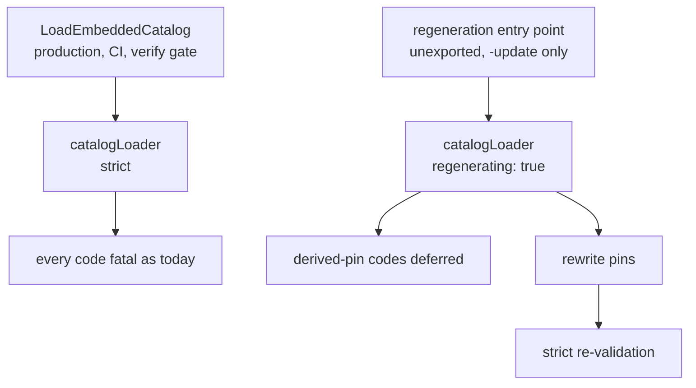

# Baseline digest regeneration bootstrap — Technical Spec

## Executive Summary

`catalogLoader` gains an explicit regeneration mode in which the derived pins
that the regeneration run itself rewrites stop being fatal during load. The mode
is reachable only through an unexported, regeneration-only entry point that the
`-update` test path calls; `LoadEmbeddedCatalog` — the function every production
caller, CI job, and Verification gate uses — is untouched and stays strict.

The trade-off this accepts is that a validation escape hatch now exists in the
package. It is bounded three ways: it is unexported so no caller outside the
package can reach it, it defers an explicit allowlist of diagnostic codes rather
than a severity class, and the regeneration target re-validates strictly after
rewriting so the run cannot finish on a catalog that is still inconsistent. A
deferred pin is a pin checked later, not a pin abandoned.

## Project Constraints

- Identifier strategy: not applicable — no project-owned Internal Identifier is
  created; diagnostic codes, profile identifiers, clause identifiers, and
  manifest row identities keep their existing contracts. Source:
  `docs/agents/domain.md`.
- Authentication and HTTP: not applicable — the governing clause prohibits
  reading, printing, committing, or generating secrets and forbids inventing
  authentication, authorization, transport, or deployment policy; this Spec
  handles no credential and opens no transport, since all behavior is local
  catalog validation and derived-artifact regeneration. Source:
  `docs/agents/agent-instructions.md`.
- Active ADR obligations: applicable — ADR-0081 keeps sanctioned digest
  regeneration a fallout of the authorized edit; ADR-0085 establishes that a
  regeneration run is not gated on the pins it rewrites while every other load
  stays strict. Source: `docs/agents/domain.md`.
- Tooling authority: applicable — express maintainer authorization: on
  2026-08-01 the maintainer authorized the Makefile mutation, recorded at
  `docs/workflow/authorizations/2026-08-01-baseline-digest-bootstrap.md`;
  bounded files: `Makefile`. A marker file at the frozen parity corpus path was
  expressly declined, so the finding's third defect is out of scope. Go sources
  under `internal/` and fixture data under `internal/baseline/testdata/` are
  product code and test data, not protected tooling. Source:
  `docs/agents/agent-instructions.md`.

## System Architecture

The change is contained in the Baseline module's catalog loader and the
regeneration target. No new package, file layout, or seam is introduced.



`catalogLoader` already accumulates `diagnostics` and exposes per-concern
`validate*` methods. It gains one field. `validateProfileFormatters` consults it
before recording a derived-pin mismatch. Nothing else in the validation surface
changes.

## Implementation Design

### Interfaces

The loader's mode and the deferral decision:

```go
type catalogLoader struct {
    source      fs.FS
    assets      map[string][]byte
    documents   map[string]document
    diagnostics []Diagnostic
    regenerating bool // set only by the regeneration entry point
}

// deferredDuringRegeneration lists the codes a regeneration run rewrites.
// Membership is deliberate: adding a code here is a decision, not a default.
var deferredDuringRegeneration = map[string]bool{
    "catalog.profile.formatter.goldenDigest.mismatch": true,
}

func (l *catalogLoader) add(code, subject, detail string) {
    if l.regenerating && deferredDuringRegeneration[code] {
        return // rewritten by this run; strict re-validation proves the result
    }
    // ...existing accumulation
}
```

The regeneration-only entry point, unexported so no production caller reaches
it:

```go
// loadEmbeddedCatalogForRegeneration loads with derived-pin mismatches
// deferred. Only the -update path may call it; LoadEmbeddedCatalog stays strict.
func loadEmbeddedCatalogForRegeneration() (*Catalog, error)
```

### Data Models

No new or changed entities. `deferredDuringRegeneration` is an explicit
allowlist keyed by existing diagnostic code, carrying no new identity.

### API Contracts

No public Go API changes and no CLI surface changes. Two observable behaviors
change:

| Surface | Before | After |
| --- | --- | --- |
| `make baseline-digests` after a module edit | fails at the first step, remediation names itself | rewrites the invalidated pins, then re-validates strictly |
| `catalog.sourceBaseline.required-clause.missing` | names the clause | names the clause and states the regenerator maintains manifest rows but never creates them, so the row must be added first |

Every diagnostic code, severity, and message outside regeneration mode is
unchanged.

## Coverage Map

- Goal "regenerate in one invocation" → regeneration mode, regeneration entry
  point, `-update` wiring.
- Goal "outside regeneration still fails closed" → unexported entry point,
  code allowlist, strict re-validation step, characterization corpus.
- Goal "an unresolvable diagnostic says so" → manifest-row guidance text.
- Core Feature 1 → `catalogLoader.regenerating` and the allowlist.
- Core Feature 2 → `-update` path wiring plus the regeneration target.
- Core Feature 3 → manifest-row diagnostic guidance.
- Core Feature 4 → characterization corpus captured before any behavior change.

## Integration Points

- **`make baseline-digests`** — the only tooling touched, and the only path that
  reaches regeneration mode. Its step list and derived-path scan are unchanged
  except for the added strict re-validation.
- **The `-update` test flag** in the Baseline package — already the switch that
  distinguishes a regeneration run; it now also selects the loader entry point.

## Testing Approach

Tests attach at the loader, which is already the package's validation seam. No
new seam is required.

- **Characterization corpus, captured before any behavior change.** Every
  catalog the package can load today is loaded and its full diagnostic set
  recorded as a golden. The change must leave that set identical outside
  regeneration mode. This is the non-regression gate, not a test written
  afterwards.
- **Cycle regression fixture.** A fixture reproducing the reported failure — a
  module edit that changes a generated guide, invalidating the formatter
  `goldenDigest` — proves regeneration now completes where it previously
  refused. This is the test that fails today.
- **Strictness assertions.** The same fixture loaded through
  `LoadEmbeddedCatalog` still produces `goldenDigest.mismatch`; a code absent
  from the allowlist still fires in regeneration mode.
- **Post-regeneration consistency.** After the target rewrites pins, a strict
  load succeeds — proving deferral is deferral and not suppression.
- **Diagnostic guidance.** A catalog missing a Source Baseline manifest row
  produces a message naming both the row and the tool's inability to add it.

## Build Order

1. **Characterization corpus.** Capture today's diagnostics for every loadable
   catalog as goldens. No behavior change in this step — it is the gate the
   later steps are measured against.
2. **Regeneration mode on the loader** (depends on: 1). The `regenerating`
   field, the code allowlist, the deferral in the diagnostic sink, and the
   unexported regeneration entry point. Strictness assertions land here.
3. **Wire the `-update` path and prove the cycle is broken** (depends on: 2).
   The regeneration tests use the new entry point; the cycle regression fixture
   goes from failing to passing.
4. **Strict re-validation in the regeneration target** (depends on: 3). After
   the steps rewrite derived artifacts, the target performs one strict load and
   fails if anything remains inconsistent. This is the authorized `Makefile`
   change.
5. **Manifest-row diagnostic guidance** (depends on: 1). The
   `required-clause.missing` and `required-rule.missing` messages state that the
   regenerator maintains rows but never creates them.
6. **Document the regeneration contract** (depends on: 4, 5). Record when
   regeneration mode applies, what it defers and why that is safe, and the
   manual step a new clause still requires.

## Risks & Considerations

- **An escape hatch in validation is the risk this Spec creates.** Bounded by
  being unexported, by an explicit code allowlist rather than a severity class,
  and by the strict re-validation that closes every regeneration run. A future
  addition to the allowlist is a visible, reviewable decision.
- **Deferral could mask a real mismatch** if the strict re-validation were
  skipped. Build order 4 exists specifically so the run cannot finish green on
  an inconsistent catalog; it is not optional polish.
- **The characterization corpus must precede the behavior change.** Captured
  after, it would encode the new behavior as the baseline and prove nothing.
- **Defect 3 of the finding stays open** — the frozen parity corpus still reads
  as derived. Out of scope by the maintainer's authorization; the existing
  comment on the exclusion set remains its mitigation.
- **The manifest-row limitation is made legible, not removed.** A new clause
  still needs a hand-written row; the Spec's contribution is that the tool now
  says so instead of naming a missing clause without explanation.

## Decisions

- Regeneration mode is reached only through an unexported entry point, so no
  production caller, CLI path, or external package can enable it.
- Deferral is keyed to an explicit allowlist of diagnostic codes, never to a
  severity or a category, so the blast radius is enumerable.
- The regeneration target re-validates strictly after rewriting; a deferred pin
  is checked later, not abandoned. See ADR-0085.
- Source Baseline manifest rows stay maintained input; this Spec improves the
  diagnostic rather than generating rows, which would change what the manifest
  is.
