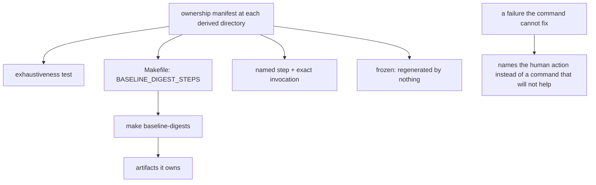

# Derived artifact regeneration boundary — Technical Spec

## Executive Summary

The defect is inference. `DERIVED_DIGEST_PATHS` lists directories, and the
natural reading is that `make baseline-digests` owns everything beneath them.
It does not: the frozen parity corpus is regenerated by nothing, and the
diagnostic characterization corpus is regenerated only by a dedicated flag
whose name does not match its test. Three occurrences, and a fourth on
2026-08-05 when this repository's own Supervisor guessed
`-update-catalog-diagnostic-characterization` from the test name and had to
discover that the flag is `-update-catalog-diagnostics`.

The fix is a manifest read at the path, not a rule inferred from behaviour.
Each directory under the derived scan carries an ownership record naming
exactly one owner: the sanctioned command, a named dedicated step with its
exact invocation, or frozen. An exhaustiveness test makes an unclassified
artifact a failure, so the next one added cannot inherit the ambiguity.

The trade-off accepted: a declared manifest can drift from reality. The
exhaustiveness test closes one direction — nothing unowned — and a second test
closes the other by asserting each declared dedicated step actually rewrites
what it claims. Neither test can prove the *frozen* class, which is why frozen
must be declared rather than detected.

## Project Constraints

- Identifier strategy: not applicable — no project-owned Internal Identifier is
  created; artifact paths, digest fields, and diagnostic codes keep their
  existing contracts. Source: `docs/agents/domain.md`.
- Authentication and HTTP: not applicable — the governing clause prohibits
  reading, printing, committing, or generating secrets and forbids inventing
  authentication, authorization, transport, or deployment policy; all behaviour
  is local artifact regeneration and validation. Source:
  `docs/agents/agent-instructions.md`.
- Active ADR obligations: applicable — ADR-0081 keeps sanctioned digest
  regeneration a fallout of the authorized edit, and this Spec widens what the
  sanctioned command covers without changing that status; ADR-0085 keeps a
  regeneration run ungated by the pins it rewrites while every other load stays
  strict, and the new step must preserve both. ADR-0080 owns QA verdict
  semantics and ADR-0091 owns the authored QA gate as a typed Task node, under
  which this Spec's own graph is authored. Source: `docs/agents/domain.md`.
- Tooling authority: applicable — express maintainer authorization: on
  2026-08-02 the maintainer authorized tooling adjustment for the queued Specs,
  recorded at
  `docs/workflow/authorizations/2026-08-02-queued-spec-tooling.md`, whose
  "Which Spec uses what" section names 0067 for "the regeneration step list and
  derived path scan"; bounded files: `Makefile`. Deterministic digest fallout is
  sanctioned by ADR-0081. Source: `docs/agents/agent-instructions.md`.

## System Architecture



## Implementation Design

### Interfaces

An ownership record beside the artifacts it governs, one per directory under
the derived scan:

```yaml
# internal/baseline/testdata/plan-characterization/_ownership.yml
owner: dedicated
command: >-
  go test ./internal/baseline -count=1
  -run TestBaselinePlanCharacterization
  -update-baseline-plan-characterization
reason: >-
  Not in BASELINE_DIGEST_STEPS; the sanctioned command reports "no changes"
  while this corpus is stale.
```

```yaml
# internal/baseline/testdata/parity-corpus/_ownership.yml
owner: frozen
reason: >-
  A frozen compatibility corpus. Repointing its blob and fixtures was tried on
  2026-07-30 and reverted; it is intentionally regenerated by nothing.
```

Valid `owner` values: `sanctioned`, `dedicated`, `frozen`. A `dedicated` record
requires `command`; every record requires `reason`.

### Data Models

No Go types beyond the parsed record. No digest value changes as a result of
this Spec — the PRD's Decisions require it and the corpus proves it.

### API Contracts

`make baseline-digests` gains the diagnostic characterization corpus in
`BASELINE_DIGEST_STEPS`, so one invocation leaves the tree consistent after an
ordinary owned-skill or module edit. That is the one behavioural change.

When a failure's remediation lies outside the sanctioned command, the
diagnostic names the human action — the exact dedicated invocation from the
ownership record — instead of printing a command that will not help.

## Coverage Map

- Core Feature 1 (every path classified, recorded at the path) → the
  `_ownership.yml` records.
- Core Feature 2 (the sanctioned command covers what it claims) → the
  `BASELINE_DIGEST_STEPS` addition.
- Core Feature 3 (frozen marked at its own path) → the `frozen` record,
  replacing the unexplained exclusion lists Specs 0034 and 0035 added.
- Core Feature 4 (a failure names the human action) → the diagnostic that reads
  the ownership record.
- Core Feature 5 (exhaustiveness proven) → the test that fails on an
  unclassified artifact.
- Goal "one stated owner, readable at the path" → the records plus
  exhaustiveness.
- Goal "one command regenerates everything it claims" → Core Feature 2 and its
  regression fixture.

## Integration Points

- `internal/baseline/testdata/**` — the ownership records.
- `Makefile` — `BASELINE_DIGEST_STEPS`, the one authorized tooling file.
- `internal/baseline` — the exhaustiveness test, the declared-step test, and
  the diagnostic that reads the records.

## Testing Approach

The seam exists: `internal/baseline` is already table-driven over `testdata`.
No new seam is needed.

- **The 2026-08-01 regression, reproduced.** Edit an owned skill, run the
  sanctioned command once, assert `make verify` is green. This is the PRD's
  first Success Metric and the failure that motivated the Spec.
- **Exhaustiveness.** Every path under the derived scan resolves to exactly one
  record; an artifact added without one fails. This is the test that stops the
  fourth occurrence from becoming a fifth.
- **Declared steps are real.** Each `dedicated` record's command is executed in
  a fixture and asserted to rewrite what the record claims, so a manifest entry
  cannot describe a step that does not work — which is exactly how a wrong flag
  name survived.
- **No digest moves.** The whole derived tree is byte-identical before and
  after this Spec, asserted over the corpus. The PRD forbids any digest change
  and this is the assertion that proves it.

## Build Order

1. **Ownership records and exhaustiveness** — the record shape, one per
   directory under the derived scan, and the test that fails on an
   unclassified artifact.
2. **Declared steps are executable** (depends on: 1) — the test proving each
   `dedicated` command rewrites what its record claims.
3. **Widen the sanctioned command** (depends on: 1) — the authorized `Makefile`
   change adding the diagnostic characterization corpus to
   `BASELINE_DIGEST_STEPS`, with the 2026-08-01 regression fixture.
4. **Diagnostics read the records** (depends on: 1, 3) — a failure the
   sanctioned command cannot fix names the human action from its record.

Step 3 is the only step touching protected tooling and is separated for that
reason.

## Risks & Considerations

- **A manifest can lie.** Exhaustiveness closes "nothing unowned"; the
  declared-step test closes "the command works". Neither can prove `frozen`,
  which is why frozen is declared and its reason recorded.
- **Widening the sanctioned command changes what an authorized edit rewrites.**
  ADR-0081 already sanctions that fallout, and the no-digest-moves assertion
  proves the widening changes coverage rather than content.
- **The parity corpus must stay frozen.** Repointing it was tried and reverted
  once. The `frozen` record exists to make the next reader stop before trying
  again.

## Decisions

- Ownership is declared at the path, never inferred from which step happens to
  rewrite a file. Inference produced every instance of this defect.
- Frozen stays frozen; legibility is the deliverable.
- A `dedicated` record carries its exact invocation, because a flag name that
  must be guessed from a test name has been guessed wrong twice.
