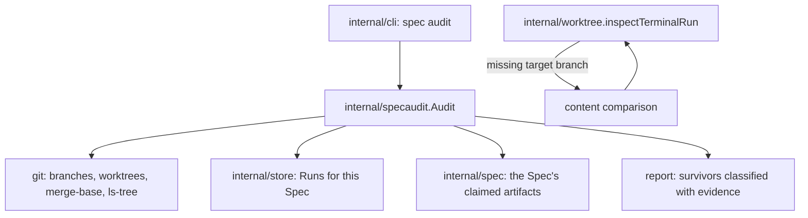

# Spec close audit — Technical Spec

## Executive Summary

The audit ships as `roundfix spec audit <slug>`, a read-only sibling of the
`spec check` command Spec 0064 delivered. It reads local Git state and the Run
Database, classifies every branch and worktree the Spec's cycle produced, and
verifies that what the Spec claims to have delivered is present on the synced
default branch.

One existing behaviour changes, deliberately and narrowly: when a Run's target
branch no longer exists — the case `gh pr merge --delete-branch` creates on
every squash merge — `inspectTerminalRun` currently degrades to `unknown`
forever. It will instead decide by content. The branch name is the handle the
merge destroys; the content is what integration actually means.

The trade-off accepted: content comparison can only prove integration, never
disprove it. A Run Branch whose files all match the default branch is
integrated; anything else stays `unintegrated` rather than being guessed at.
That asymmetry is deliberate — the PRD's Decisions say nothing is reclaimed on
ambiguity, and a false `integrated` is the one error that loses work.

## Project Constraints

- Identifier strategy: not applicable — no project-owned Internal Identifier is
  created; Run IDs, branch names, and worktree paths keep their existing
  contracts. Source: `docs/agents/domain.md`.
- Authentication and HTTP: not applicable — the governing clause prohibits
  reading, printing, committing, or generating secrets and forbids inventing
  authentication, authorization, transport, or deployment policy; the audit
  reads local Git state and the Run Database and opens no transport. Source:
  `docs/agents/agent-instructions.md`.
- Active ADR obligations: applicable — ADR-0052 protects terminal completion,
  so no audit path may touch an Active Run or a live writer; ADR-0053 governs
  proof-based Run Worktree reconciliation, whose missing-target case this Spec
  resolves by content rather than by relaxing the proof. ADR-0081 sanctions the
  deterministic digest fallout of the authorized Skill synchronisation. Source:
  `docs/agents/domain.md`.
- Tooling authority: applicable — this Spec adds a CLI command, and the
  repository HARD RULE requires a Pull Request that changes CLI behaviour to
  ship the Roundfix Skill update with it. Express maintainer authorization: on
  2026-08-04 the maintainer granted standing authorization for Roundfix Skill
  CLI synchronisation, recorded at
  `docs/workflow/authorizations/2026-08-04-queue-tail-tooling.md`; bounded
  files: `.agents/skills/roundfix/**` and its `skills/roundfix/**` mirror,
  regenerated by `make skills-sync`, for CLI-contract synchronisation only.
  Deterministic digest fallout is sanctioned by ADR-0081. Source:
  `docs/agents/agent-instructions.md`.

## System Architecture



`internal/specaudit` is a new package for the same reason `internal/speccheck`
was: `internal/worktree` is on the Run hot path, and an authoring-time audit
that shells out to `git branch`, `git worktree list`, and `ls-tree` has no
business being reachable from it. The one change inside `internal/worktree` is
the content resolution, which belongs there because that is where the `unknown`
originates.

## Implementation Design

### Interfaces

```go
package specaudit

type Kind string

const (
    KindPullRequest Kind = "pull-request" // backs an open Pull Request
    KindPending     Kind = "pending"      // holds unintegrated work
    KindResidue     Kind = "residue"      // safe to reclaim
    KindPreserved   Kind = "preserved"    // could not be classified
)

type Survivor struct {
    Name     string // branch name or worktree path
    IsWorktree bool
    Kind     Kind
    Evidence string // what proved this classification
    Reclaim  string // the exact command, empty unless KindResidue
}

type Undelivered struct {
    Artifact string // the path the Spec claims
    HeldBy   string // the branch that carries it
}

type Result struct {
    Slug        string
    Survivors   []Survivor
    Undelivered []Undelivered
}

// Audit reads local Git state and the Run Database. It mutates nothing.
func Audit(ctx context.Context, repoRoot, homeDir, slug string) (Result, error)
```

### Data Models

No persisted state. Classification inputs are the Spec's Runs from the Run
Database, `git branch --list`, `git worktree list --porcelain`, and the open
Pull Requests already reachable through the existing review source.

Delivery verification compares the Spec's claimed artifacts — its folder under
the archived or active Spec Root, and any file its Tasks recorded — against
`git ls-tree` on the synced default branch.

### API Contracts

```text
roundfix spec audit <slug> [--format text|json]
```

Exit `0` when nothing needs attention, `1` when residue or undelivered work is
found, `2` on usage error. One `roundfix-specaudit/v1` object under
`--format json`. Every survivor carries its evidence; `KindResidue` also
carries the exact reclaim command, which the operator runs — the audit never
does.

The one behavioural change outside the new command: a terminal Run whose
target branch is absent resolves `safe` when no file is unique to the Run
Branch and every shared implementation file matches the default branch, and
`unintegrated` otherwise. Every other `reconcile` refusal is unchanged.

## Coverage Map

- Core Feature 1 (read-only close audit classifying survivors) → `specaudit.Audit`
  and the `spec audit` command.
- Core Feature 2 (delivery verification against the default branch) → the
  `Undelivered` model and the `ls-tree` comparison.
- Core Feature 3 (content-based integration when the target branch is gone) →
  the `inspectTerminalRun` resolution.
- Core Feature 4 (scratch worktrees reclaimable once pushed) → `KindResidue`
  with its reclaim command; the reclaiming stays the operator's action.
- Core Feature 5 (evidence per classification, preserve the unclassifiable) →
  `Survivor.Evidence` and `KindPreserved`.
- Core Feature 6 (discoverable without knowing the Runs) → the slug is the only
  argument; Runs are resolved from the Run Database.
- Goal "nothing is reclaimed on ambiguity" → `KindPreserved` and the
  prove-only-integration asymmetry.
- Goal "an unmerged Pull Request cannot read as delivered" → Core Feature 2.

## Integration Points

- `internal/worktree/worktree.go` — the content resolution at the `unknown`
  origin; nothing else in the package changes.
- `internal/cli` — one new command branch under `spec`, its help, and the usage
  block.
- `internal/store` — read-only Run lookup by Spec slug.
- `.agents/skills/roundfix/**` and its mirror — the CLI-contract synchronisation
  the standing grant authorizes.

## Testing Approach

The seams exist: `internal/gittest` builds real repositories for tests, and
`internal/cli` drives commands over fixture homes. No new seam is needed.

- **Fixture repositories per classification.** One survivor per kind, each
  asserting the classification *and* its evidence string, because a
  classification without evidence is the thing Core Feature 5 forbids.
- **The session replay**, which is the PRD's first Success Metric: a fixture
  reproducing this session's end state — two scratch worktrees, one orphaned
  Run Worktree, one stale remote backup branch, two branches held by unmerged
  Pull Requests — and asserting all four kinds are reported.
- **The deleted-target case**, proven against the exact shape
  `gh pr merge --delete-branch` produces, asserting `safe` by content where
  today's code yields `unknown`.
- **The Active Run guard.** An injected active fixture must be untouched and
  unreported-as-residue. This is the assertion that protects ADR-0052 and the
  one most worth writing first.
- **Non-regression on `reconcile`.** Every refusal it makes today still holds
  except the resolved case, asserted over the existing reconcile tests
  unchanged.

## Build Order

1. **Content-based integration resolution** — the `inspectTerminalRun` change
   and its deleted-target fixture, with `reconcile`'s other refusals asserted
   unchanged.
2. **Survivor classification** (depends on: 1) — the package, the four kinds,
   evidence strings, and the Active Run guard.
3. **Delivery verification** (depends on: 2) — claimed artifacts against the
   synced default branch, naming the branch that holds anything absent.
4. **The command** (depends on: 2, 3) — dispatch, flags, both formats, exit
   codes, usage block.
5. **Session replay** (depends on: 3, 4) — the four-residue fixture.
6. **Skill synchronisation** (depends on: 4) — the authorized Roundfix Skill
   update and its regeneration chain.

Step 6 is separate because it is the only step touching protected tooling, and
an authorized tooling Task may mutate only its bounded files.

## Risks & Considerations

- **A false `integrated` loses work.** The content check proves integration and
  never disproves it; anything short of a full match stays `unintegrated`. The
  asymmetry is the safety property, not a limitation to remove later.
- **The audit could grow into a cleaner.** The PRD forbids it and the Decisions
  say why: naming residue is the deliverable, and a cleanup that guesses is
  worse than debris. `Reclaim` is a string the operator runs, never a call.
- **Active Runs.** ADR-0052 makes this the highest-stakes path in the Spec. The
  guard is written before the classifier that could violate it.
- **Scratch worktrees are outside the Run Database.** They are found through
  `git worktree list`, so the audit must classify a worktree it has no Run for
  as `preserved` rather than assuming residue.

## Decisions

- The audit reports and never reclaims; `KindResidue` carries a command, not an
  action. See the PRD's Decisions.
- Integration is proven by content when the branch name is gone, because
  `--delete-branch` destroys the handle and not the substance.
- Content comparison proves integration only; ambiguity resolves to
  `unintegrated` or `preserved`.
- `internal/specaudit` is a new package so Git-shelling audit logic stays off
  the Run hot path, matching the `internal/speccheck` precedent.
