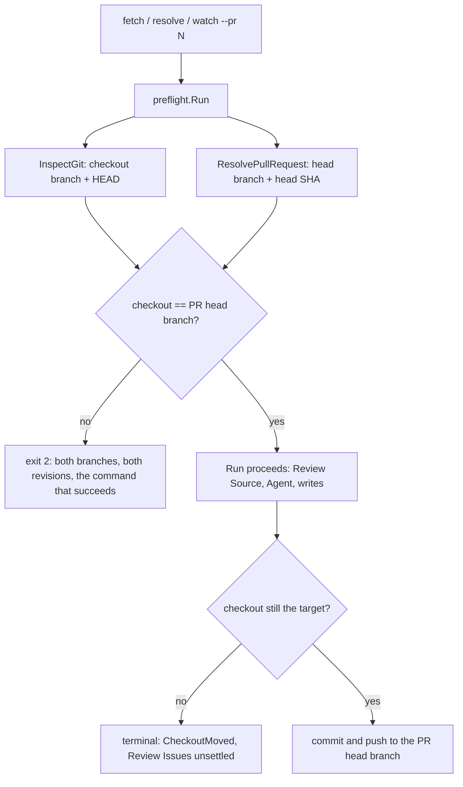

# A Review Run targets its Pull Request — Technical Spec

## Executive Summary

The comparison this Spec needs is one line away from existing. `preflight.Run`
already resolves both values it would compare: `InspectGit` returns
`GitState.Branch` for the checkout, and `ResolvePullRequest` returns
`PullRequest.HeadBranch` from the forge — `preflight.go:183` reads it straight
off `raw.HeadRefName`. Nothing compares them. The Run proceeds on whichever
branch the checkout happens to be on, and the Pull Request number it was given
decides only which Review Issues it fetches.

Adding the guard there satisfies Core Features 1, 2 and 5 at once, in the one
place whose contract already promises no side effects on refusal.

## Disproven premise

The PRD states the mid-Run check "exists; it just runs too late", quoting
`checkout branch mismatch: expected <branch> at <sha>, found <other> at <sha>`.
That message is not in the current tree. Searched: the literal string across
`internal/` and `docs/`, every comparison involving `PullRequest.HeadBranch`,
and every head-SHA guard in the review path. The only surviving occurrences are
the PRD itself and an archived Spec 0058 review artifact quoting the same
session.

The nearest live code is `rounds.go:641`, which compares recorded round
metadata — source, Pull Request, head repository, head branch, head SHA —
against the current request, but that is Round artifact reuse: a mismatch makes
Roundfix write a new Round rather than refuse a Run.

Core Feature 4 is therefore **new behavior, not a relocation**. The Spec's
premise that a late check exists is wrong; its conclusion that the failure
happened is not, and the archived artifact records the consequence. This
TechSpec builds the guard rather than moving one.

## Project Constraints

- Identifier strategy: not applicable — Pull Request numbers, branch names, and
  Run IDs keep their existing contracts; no project-owned Internal Identifier
  is created. Source: `docs/agents/domain.md`.
- Authentication and HTTP: applicable — resolving the Pull Request's head
  branch reuses the existing `gh`-backed resolver already called by
  `preflight.Run`; no credential is read, printed, committed, or generated, and
  no authentication, authorization, transport, or deployment policy is
  invented. Source: `docs/agents/agent-instructions.md`.
- Active ADR obligations: applicable — ADR-0052 protects terminal completion,
  so the mid-Run interruption must reach a terminal state through the normal
  outcome path and never strand a Run. ADR-0036 owns the separate review
  artifact commit, which is one of the writes this Spec binds to the Pull
  Request's head branch. ADR-0054 keeps Review Source Evidence the determinant
  of review outcomes and is untouched: an interrupted Run reports an
  interruption, never a review verdict. ADR-0053 is relation-only — its Run
  Worktree reconciliation contract governs spec Runs. Source:
  `docs/agents/domain.md`.
- Tooling authority: applicable — the PRD carried `not applicable` until
  authoring disproved it and corrected the row in the same pass, so the two
  artifacts now agree: this Spec changes CLI behaviour (a new Preflight
  refusal and a new terminal outcome), and the repository HARD RULE requires
  such a Pull Request to ship the Roundfix Skill update with it. Express
  maintainer authorization: the 2026-08-04 standing grant for Roundfix Skill
  CLI synchronisation at
  `docs/workflow/authorizations/2026-08-04-queue-tail-tooling.md`, whose
  covered list names Spec 0069; bounded files: `.agents/skills/roundfix/**` and
  its `skills/roundfix/**` mirror, regenerated by `make skills-sync`, for
  CLI-contract synchronisation only. ADR-0081 sanctions the deterministic
  digest fallout. Source: `docs/agents/agent-instructions.md`.

## System Architecture



The `CMP` diamond is one comparison between two values `preflight.Run` already
holds. The `GUARD` diamond is the new work.

## Implementation Design

### Interfaces

```go
// TargetMismatch reports a checkout that does not match the Pull Request the
// Run names. It carries both sides so the refusal can name them.
type TargetMismatch struct {
    PRNumber       string
    ExpectedBranch string
    ExpectedSHA    string
    FoundBranch    string
    FoundSHA       string
}

func (m TargetMismatch) Error() string
func (m TargetMismatch) NextAction() string // the git command that resolves it
```

`preflight.Request` gains nothing: both inputs are already resolved inside
`Run`. The guard sits after `ResolvePullRequest` and before `BuildPushPlan`,
so a refusal precedes every write the Preflight contract already covers.

For the mid-Run guard, the Run records the target branch and its revision at
Preflight and re-reads the checkout before each write boundary — Batch commit,
review artifact commit, and Final Push.

### Data Models

No persisted schema change. The Run already records its head repository and
head branch; the target revision joins them as a recorded field so the
mid-Run comparison has an anchor that does not depend on re-querying the forge.

### API Contracts

No new command and no new flag.

| Situation | Today | After |
| --- | --- | --- |
| Checkout on the Pull Request's head branch | runs | runs, unchanged |
| Checkout on another branch | runs, writes land on the wrong branch | **refused at Preflight, exit 2, no Run** |
| Checkout moves mid-Run | writes continue against the wrong tree | **terminal interruption, no write** |
| `--head-branch` / `--head-repository` given explicitly | honoured | honoured, then compared the same way |

The interruption is its own terminal outcome, distinct from `Failed`: a Review
Issue that failed on its merits and a Run stopped by its environment must not
read the same, because only one of them is worth re-running unchanged.

## Coverage Map

- Core Feature 1 (resolve target from the Pull Request, validate before any
  query or write) → the guard placed after `ResolvePullRequest`.
- Core Feature 2 (refuse naming both branches and revisions, create no Run) →
  `TargetMismatch` and the existing Preflight exit-2 contract.
- Core Feature 3 (artifact commits target the head branch) → the recorded
  target revision consulted at each write boundary.
- Core Feature 4 (mid-Run movement is an interruption) → the new terminal
  outcome and the write-boundary re-read.
- Core Feature 5 (the refusal names the command that succeeds) →
  `NextAction()`.

## Integration Points

- `internal/preflight/preflight.go` — the guard, between `ResolvePullRequest`
  and `BuildPushPlan`.
- `internal/cli/cli.go` — mapping the refusal to exit `2` and its report, and
  the terminal interruption outcome.
- `internal/store` — the recorded target revision.
- `internal/watch/watch.go` — the write-boundary re-read.
- `.agents/skills/roundfix/**` and its mirror — CLI-contract synchronisation.

## Testing Approach

`internal/preflight` is already driven by injected `GitRunner` and
`PullRequestResolver`, so both sides of the comparison are fixtures. No new
seam is needed.

- **The refusal table**: matching branch runs; differing branch refuses with
  both names and both revisions; explicit `--head-branch` is compared, not
  trusted.
- **No side effects on refusal**, asserted rather than assumed: no Run row, no
  Review Source call, no Agent Session, no commit, no push.
- **The Spec 0058 replay**: the recorded session's shape — a Run for one Pull
  Request while the checkout sat elsewhere — refuses instead of committing.
- **Mid-Run movement** at each write boundary reaches the interruption outcome
  with Review Issues left unsettled rather than failed.
- **Non-regression**: a Run whose checkout already matches behaves exactly as
  today, asserted over the existing review tests unchanged.

## Build Order

1. **The Preflight guard** — comparison, refusal, and next action, with the
   refusal table and the no-side-effects assertions. Closes Core Features 1, 2
   and 5 on its own.
2. **The recorded target and write boundaries** (depends on: 1) — the mid-Run
   re-read and the interruption outcome, with Core Features 3 and 4.
3. **Skill synchronisation** (depends on: 2) — the authorized Skill update and
   its regeneration chain.

Step 1 leads because it removes the failure that costs a round; step 2 covers
the one that costs a Run.

## Risks & Considerations

- **The interruption must settle.** ADR-0052 makes terminal completion the
  contract; an interruption that cannot reach a terminal state is worse than
  the bug it replaces.
- **Explicit overrides are still inputs.** `--head-branch` and
  `--head-repository` are compared like any other resolution, not trusted as
  intent — otherwise the flag reintroduces the mismatch it looks like it fixes.
- **Forks are out of scope**, per the PRD. The guard must refuse a fork head
  clearly rather than compare a branch name that means something else.

## Decisions

- The Pull Request is the authority; the checkout is validated against it.
- The guard lives in Preflight, whose contract already promises no side effects
  on refusal, rather than in each command.
- The mid-Run interruption is its own terminal outcome, because a re-run is
  correct for it and wrong for a genuine failure.
- The PRD's tooling-authority row is corrected here rather than left standing:
  this Spec changes CLI behaviour, so the Skill ships with it.
