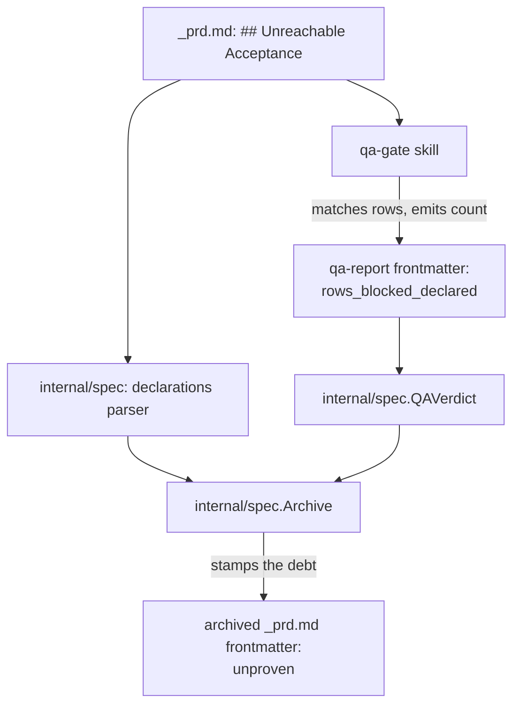

# Declared unreachable acceptance — Technical Spec

## Executive Summary

The work splits cleanly along a line the repository already draws. What a
blocked row *means* is decided by the `qa-gate` skill, which owns the
blocked-cause taxonomy, the verdict rules, and the `rows_blocked_*` frontmatter.
What the archive boundary *does* with that meaning is Go code in
`internal/spec`. This Spec changes both, and nothing else.

One new typed cause joins ADR-0080's counts: `rows_blocked_declared`. It is a
third count beside environment and finding, never a reclassification of either —
folding causes together to make a report look cleaner is the dishonesty this
Spec exists to remove.

The trade-off accepted: the archive command trusts the gate's typed count rather
than re-deriving it from the report's prose. That is the same trust
`rows_blocked_finding` already receives, and the alternative — parsing a
human-authored matrix table at the archive boundary — is a brittle second
implementation of the gate's own judgement.

## Project Constraints

- Identifier strategy: not applicable — QA row identifiers, verdict values, and
  Spec slugs keep their existing contracts; `rows_blocked_declared` extends the
  existing ADR-0080 count family rather than minting a new namespace. Source:
  `docs/agents/domain.md`.
- Authentication and HTTP: not applicable — the governing clause prohibits
  reading, printing, committing, or generating secrets and forbids inventing
  authentication, authorization, transport, or deployment policy; this Spec
  reads QA reports and Spec artifacts. Source:
  `docs/agents/agent-instructions.md`.
- Active ADR obligations: applicable — ADR-0080 owns verdict semantics and the
  typed blocked-row counts this Spec extends; nothing here may make a verdict
  more permissive than the evidence it summarizes. ADR-0091 owns the authored QA
  gate as a typed Task node, which is the node whose report this Spec
  reinterprets. ADR-0081 sanctions the deterministic digest fallout of the
  authorized skill edit. ADR-0093 surfaces as a relation candidate because it
  cites ADR-0080; it does not apply — it governs the Spec Consistency Check's
  detection boundary, a different subsystem. Source: `docs/agents/domain.md`.
- Tooling authority: applicable — express maintainer authorization: on
  2026-08-04 the maintainer authorized the QA gate skill for this Spec, recorded
  at `docs/workflow/authorizations/2026-08-04-queue-tail-tooling.md`, whose Spec
  0070 addendum names it; bounded files: `.agents/skills/qa-gate/**` and its
  `skills/qa-gate/**` mirror, regenerated by `make skills-sync`. Deterministic
  digest fallout is sanctioned by ADR-0081. Source:
  `docs/agents/agent-instructions.md`.

## System Architecture



The gate decides; the code enforces and records. Neither re-implements the
other.

## Implementation Design

### Interfaces

The declaration, authored in `_prd.md` before the gate ever runs:

```markdown
## Unreachable Acceptance

- criterion: Success Metric 1 — a real tagged release publishes all six
  coordinates
  reason: an irreversible act against a live registry that no gate may perform
  satisfied-by: a maintainer publishes a tagged release and records the run
```

```go
package spec

// UnreachableDeclaration is one acceptance the Spec's author declared
// beyond the reach of any hermetic Verification, before the gate ran.
type UnreachableDeclaration struct {
    Criterion   string // the acceptance it covers, verbatim
    Reason      string // why no gate can reach it
    SatisfiedBy string // the human action that would prove it
    Line        int    // 1-based, for diagnostics
}

// Unreachable reads the Spec's declarations. An absent section is not an
// error: a Spec that declares nothing is the ordinary case.
func Unreachable(specDir string) ([]UnreachableDeclaration, error)
```

### Data Models

`QAVerdict` grows one field it already has the shape for:

```go
RowsBlockedDeclared yaml.Node `yaml:"rows_blocked_declared"`
```

An absent field is zero, exactly as the other two counts behave today. No
persisted state is added; the archived PRD frontmatter gains `unproven`, a list
of the `satisfied-by` actions that remained unproven at archive.

### API Contracts

`roundfix archive <slug>` gains exactly one accepting case and no new flag:

| Report state | Today | After |
| --- | --- | --- |
| `pass`, all counts zero | archives | archives, unchanged |
| `partial`, `declared > 0`, `finding == 0`, `environment == 0`, declarations cover every declared row | refuses | **archives, stamping `unproven`** |
| `partial` with any `finding > 0` | refuses | refuses |
| `partial` with any `environment > 0` | refuses | refuses — circumstance is not unreachability |
| `declared > 0` with no matching declaration in the Spec | refuses | refuses, naming the unmatched count |
| `fail` | refuses | refuses |

`qa_override` is untouched in meaning, reach, and wording.

## Coverage Map

- Core Feature 1 (a Spec declares unreachable acceptance up front) → the
  `## Unreachable Acceptance` section and `spec.Unreachable`.
- Core Feature 2 (the gate matches a blocked row against the declarations) →
  the `qa-gate` matching rule and `rows_blocked_declared`.
- Core Feature 3 (a verdict may reflect declared-unreachable unmet rows) → the
  `QAVerdict` count read beside the existing two.
- Core Feature 4 (archive accepts and stamps the remaining debt) → the
  `Archive` accepting case and the `unproven` stamp.
- Core Feature 5 (`qa_override` keeps its meaning) → untouched in reach and
  wording; asserted by the refusal matrix.
- Core Feature 6 (an unmatched blocked row keeps blocking) → the declared-count
  versus declarations refusal.
- Core Feature 7 (a static-gate failure blocks only implicated rows) → the
  `qa-gate` scoping rule.
- Core Feature 8 (causes stay countable and typed) → three separate counts, no
  cause folded into another.
- Goal "a Spec can declare an acceptance no Verification can reach" → Core
  Feature 1's components.
- Goal "archives without `qa_override`" → Core Features 3 and 4's components.
- Goal "nothing merely inconvenient becomes archivable" → the refusals in the
  API Contracts table.
- Goal "a report says what it could not observe, in terms a reader can act on"
  → Core Features 7 and 8's components.

## Integration Points

- `internal/spec/qa.go` — one added count, read exactly as the existing two.
- `internal/spec/archive.go` — the accepting case and the `unproven` stamp.
- `internal/spec/spec.go` — the declarations parser.
- `internal/cli/archive.go` — the refusal diagnostics that name what is
  unmatched.
- `.agents/skills/qa-gate/**` and its `skills/` mirror — the authorized tooling
  surface; regenerated by `make skills-sync`.

## Testing Approach

The seams exist: `internal/spec` is table-driven over fixture Spec folders, and
`internal/cli/archive_test.go` drives the command. No new seam is needed.

- **Fixture matrix over the API Contracts table.** Every row above becomes a
  fixture asserting archive's accept or refuse, and the refusals assert the
  diagnostic names the cause. A table that only proves the accepting case would
  ship the permissiveness this Spec must not create.
- **Spec 0058 replayed**, which is the PRD's first Success Metric: its archived
  report and artifacts, with the release row declared, archive without
  `qa_override` and stamp the release action as unproven.
- **The wrongly-declared row.** A declaration whose row the environment could in
  fact reach must be reported, not accepted. This is the assertion most likely
  to be skipped and the one that keeps the feature honest.
- **Non-regression over the archived corpus.** Every Spec that archives today
  under `pass` still archives byte-identically; the PRD's Decisions require it
  and the archived corpus is the evidence.

## Build Order

1. **Declarations parser** — the `## Unreachable Acceptance` section and
   `spec.Unreachable`, with fixtures for present, absent, and malformed.
2. **The typed count** (depends on: 1) — `rows_blocked_declared` read by
   `QAVerdict` beside the existing two, absent meaning zero.
3. **The archive boundary** (depends on: 1, 2) — the one accepting case, every
   refusal preserved, the `unproven` stamp, and the fixture matrix over the
   whole API Contracts table.
4. **The gate contract** (depends on: 1) — the authorized `qa-gate` skill edit:
   match rows against declarations, emit the count, report a wrongly-declared
   row, and scope a static-gate failure to the rows it implicates.
5. **Spec 0058 replay and corpus non-regression** (depends on: 3, 4).

Steps 3 and 4 are deliberately separate: step 4 is the only step that touches
protected tooling, and an authorized tooling Task may mutate only its bounded
files.

## Risks & Considerations

- **This Spec widens an archive gate.** Every fixture that must still refuse is
  worth more than the one that must now accept. The API Contracts table is
  written as refusals with one exception for exactly that reason.
- **Declared is not environment.** The tempting simplification is to let
  environment-blocked rows archive too, since Spec 0058's rows were typed that
  way. That would make circumstance archivable and is explicitly refused.
- **Core Feature 7 has no code to test it.** Its correctness lives in a skill
  prompt, so its evidence is the gate's own behaviour on a Spec with an
  unrelated static failure. The QA gate for this Spec is the natural place to
  observe it, and the task that ships it says so.
- **The gate could declare unreachability itself.** It must not; ADR-0080 and
  this Spec's Non-Goals both forbid it. A gate that can excuse itself is not a
  gate.

## Decisions

- `rows_blocked_declared` is a third typed count, never a reclassification of
  the existing two. See ADR-0080.
- Unreachability is declared in `_prd.md` before the gate runs, by the Spec's
  author, and the gate only matches against it.
- The archive command trusts the gate's typed count rather than re-parsing the
  matrix, matching the trust `rows_blocked_finding` already receives.
- Environment-blocked rows keep blocking the archive. Circumstance is not
  unreachability.
