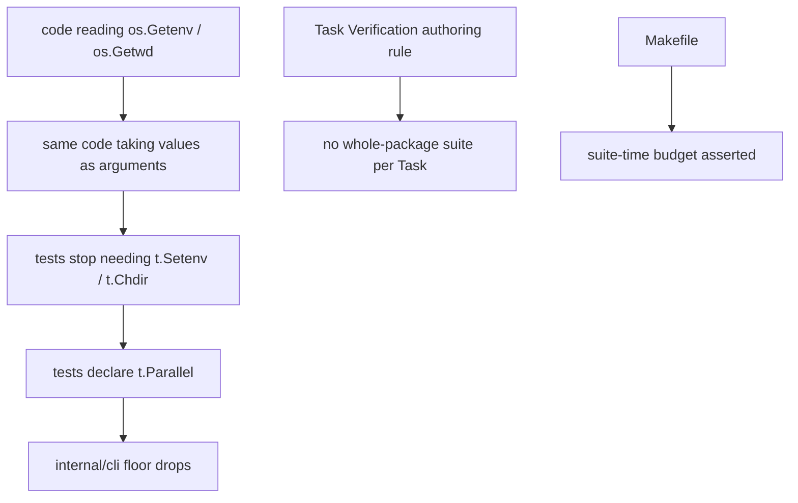

# Verification cost — Technical Spec

## Executive Summary

The baseline settles where the work is. Packages already overlap under
`go test ./...`, so the suite can never finish faster than its slowest package,
and `internal/cli` alone is 113.2s of 136.9s. It holds 488 test functions
against one `t.Parallel()` call, and the reason is not oversight: 20 `t.Setenv`
and 18 working-directory changes each make Go refuse `t.Parallel()`, because
both mutate state the whole process shares.

So the work is not "add `t.Parallel()`". It is removing the process-global
dependency first, then declaring parallelism — prefactoring before the easy
change. The second, cheaper half is the per-Task tax: fourteen Tasks each ran
a whole-package suite that the Run-level gate already runs.

The design accepts one trade-off. Making code take its environment explicitly
touches production signatures, not only tests. That is the point — the coupling
is real, and hiding it behind per-test process isolation would preserve it
while paying a spawn cost 488 times.

## Project Constraints

- Identifier strategy: not applicable — no project-owned Internal Identifier is
  created; test names, package paths, and target names keep their existing
  contracts. Source: `docs/agents/domain.md`.
- Authentication and HTTP: not applicable — the governing clause prohibits
  reading, printing, committing, or generating secrets and forbids inventing
  authentication, authorization, transport, or deployment policy; environment
  values passed explicitly carry no credential this Spec introduces. Source:
  `docs/agents/agent-instructions.md`.
- Active ADR obligations: applicable — ADR-0081 keeps sanctioned digest
  regeneration a fallout of the authorized edit, which any verification-target
  change preserves; ADR-0089 establishes that code under test takes its
  environment explicitly. Source: `docs/agents/domain.md`.
- Tooling authority: applicable — express maintainer authorization: on
  2026-08-02 the maintainer authorized tooling adjustment naming the `Makefile`
  and the owned skills, recorded at
  `docs/workflow/authorizations/2026-08-02-queued-spec-tooling.md`; bounded
  files: `Makefile` for the suite-time budget, and the owned skill pair for the
  Task Verification authoring rule. Deterministic digest fallout is sanctioned
  by ADR-0081. Source: `docs/agents/agent-instructions.md`.

## System Architecture

No new package. Three surfaces change:



**The coverage-equivalence harness** is the safety rail: it records the set of
test functions the suite executes, so "coverage is unchanged" is an assertion
rather than a claim. It is captured before any change and compared after.

## Implementation Design

### Interfaces

The shape of the prefactor — a function that read the process now receives what
it needs:

```go
// before: reads process state, so any test must mutate the process
func resolveRepoRoot() (string, error)          // used os.Getwd()
func configPath() string                        // used os.Getenv("ROUNDFIX_HOME")

// after: the value arrives, and the process default is resolved once at the
// command boundary where it belongs
func resolveRepoRoot(workDir string) (string, error)
func configPath(home string) string
```

The coverage-equivalence record:

```go
// Recorded before any change and compared after. A test that disappears or is
// renamed fails the comparison; a test that is added is reported, not failed.
type CoverageRecord struct {
    Packages map[string][]string // package -> sorted test function names
}
```

### Data Models

No persisted entities. Two artifacts under the Spec folder: the baseline
already committed under `baseline/`, and the coverage record.

### API Contracts

No CLI surface changes. Two contract changes are internal:

- Functions that read `os.Getenv` or `os.Getwd` for values a caller already
  knows take them as parameters; the process default is resolved once at the
  command boundary.
- A `Makefile` target asserts the suite completes within a recorded budget.

## Coverage Map

- Goal "verification proportional to what changed" → the Task Verification
  authoring rule; removal of whole-package commands from Task Verification.
- Goal "uses the machine it runs on" → the prefactor and the parallel
  declarations in `internal/cli` and `internal/baseline`.
- Goal "coverage identical" → the coverage-equivalence harness.
- Goal "regression visible" → the suite-time budget.
- Core Features 1 and 2 → parallel declarations, with a stated reason for every
  test left sequential and shared-state failures fixed rather than reverted.
- Core Feature 3 and 4 → Task Verification rule and the authoring skill.
- Core Feature 5 → budget.
- Core Feature 6 → coverage record.
- Core Feature 7 → the published before-and-after.

## Integration Points

- **The Go test runner**, whose `t.Parallel()` contract with `t.Setenv` and
  `t.Chdir` is the constraint this design works around rather than fights.
- **The `Makefile`**, which gains the budget assertion.
- **The `write-tasks` skill**, which carries the Verification authoring rule so
  the per-Task tax is not reintroduced.

## Testing Approach

The suite is the subject, so the tests here are about the suite's own
properties.

- **Coverage equivalence**, captured before any change: the set of executed
  test function names per package, compared after. A disappearance fails.
- **Shared-state detection**: the parallelised packages run with `-race` and
  repeated (`-count=2`) to surface state leaking between tests that now
  overlap.
- **Budget assertion**, exercised by a deliberately slow test that must trip it.
- **The before-and-after comparison** is produced with the baseline's own
  commands, on the same machine, and published under the Spec.

## Build Order

1. **Coverage-equivalence harness.** Record the executed test set per package.
   No behavior change; the rail every later step is measured against. The
   timing baseline is already committed under `baseline/`.
2. **Prefactor `internal/cli`'s environment reads** (depends on: 1). Functions
   take working directory and environment values as parameters; the process
   default resolves once at the command boundary. No test declares parallelism
   yet — this step only removes the reason it cannot.
3. **Declare parallelism in `internal/cli`** (depends on: 2). Every test that no
   longer mutates process state declares it; every test that still must states
   why in one line. Run with `-race -count=2` to surface shared state.
4. **Prefactor and parallelise `internal/baseline`** (depends on: 1). Same two
   moves on the second-heaviest package, independent of `internal/cli`.
5. **Remove the whole-package suite from Task Verification** (depends on: 1),
   across every active Spec's Task files, and record the authoring rule in the
   `write-tasks` skill so it is not reintroduced.
6. **Suite-time budget** (depends on: 3, 4). A `Makefile` assertion with the
   recorded budget, proven by a deliberately slow test.
7. **Publish the before-and-after** (depends on: 3, 4, 6). Same commands, same
   machine, both tables side by side, delta stated.

## Risks & Considerations

- **Parallelising surfaces real defects.** A test that only passes sequentially
  has found shared state. Fixing it is the work; reverting to sequential
  without a stated reason is how the defect survives. `-race -count=2` is how
  they surface deliberately rather than in someone's next Run.
- **The prefactor touches production signatures.** That is intended per
  ADR-0089, and bounded: values a caller already knows become parameters, and
  the process default still resolves — once, at the command boundary.
- **Some tests legitimately keep the global.** A test verifying that the
  process-level default is read correctly must set it. Those stay sequential
  with a one-line reason, and the reason is the deliverable.
- **Coverage is the one thing that must not move.** The equivalence harness is
  step 1 for that reason; without it, "coverage unchanged" is a claim.
- **`internal/cli` sets the floor.** Steps 2 and 3 are the only ones that can
  move the headline number. Step 4 helps the sum but not the floor.

## Decisions

- Prefactor before parallelising: `t.Setenv` and `t.Chdir` make Go refuse
  `t.Parallel()`, so the global dependency is removed first rather than worked
  around. See ADR-0089.
- Per-test process isolation was rejected: it preserves the coupling and pays a
  spawn cost 488 times.
- A test that fails under parallel execution is a defect to fix, and reverting
  it needs a stated reason.
- The Run-level gate owns "nothing else regressed"; a Task owns its own effect.
- The baseline under `baseline/` is frozen and not re-derived; comparing
  against a re-measured "before" would make the comparison circular.
