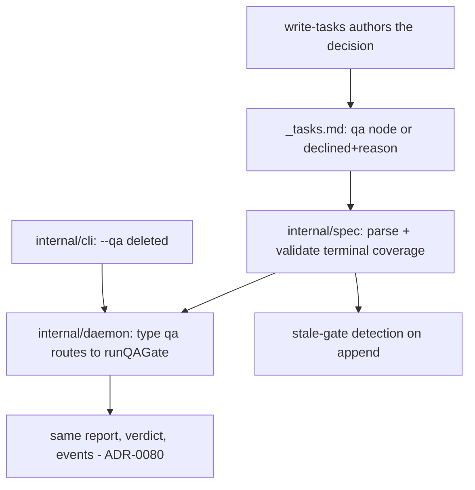

# QA is a Task, not a flag — Technical Spec

## Executive Summary

The gate moves from the invocation to the graph by becoming what everything
else in the graph already is: a Task. A new Task Type `qa` marks the terminal
node; the manifest declares the decision (`qa: task_NN` naming the gate, or
`qa: declined` with a reason); and the Daemon, on reaching a `qa` node, runs
the existing gate step it already knows how to run — same session kind, same
report, same verdict vocabulary, same events, per ADR-0080. The `--qa`
parameter is deleted, so what runs is what the graph says.

Invalidation falls out of dependency semantics instead of new machinery. A
gate node must depend on every leaf; appending a Task afterwards either
leaves the gate non-terminal (a structural validation error) or adds a
pending dependency beneath a settled terminal (a stale-gate error naming the
inserted Task). Both paths make "the graph grew after the gate reported"
impossible to do quietly — which is the whole point of ADR-0088.

One boundary matters for this Spec's own execution: the Run that implements
it is driven by the binary built before it, which rejects unknown Task
Types. This Spec's own graph therefore stays on the v1 contract and its own
gate runs at close under the current flow. The first Spec authored under the
new contract is the next one in the queue.

## Project Constraints

- Identifier strategy: applicable — one project-owned value is created: the
  Task Type `qa`, joining the canonical set in `internal/spec`; QA report
  names, verdict values, and event kinds keep their existing contracts.
  Source: `docs/agents/domain.md`.
- Authentication and HTTP: not applicable — graph shape and a command
  surface change; no transport or credential surface. Source:
  `docs/agents/agent-instructions.md`.
- Active ADR obligations: applicable — ADR-0080 owns verdict semantics and
  typed blocked-row counts, produced unchanged; ADR-0088 records the flag's
  removal in favour of the authored node; ADR-0091 (this Spec) records the
  representation. Source: `docs/agents/domain.md`.
- Tooling authority: applicable — express maintainer authorization recorded
  at `docs/workflow/authorizations/2026-08-02-queued-spec-tooling.md` and
  its 2026-08-03 addenda; bounded files: `.agents/skills/write-tasks/**`,
  `.agents/skills/qa-gate/**`, and `.agents/skills/roundfix/**` with their
  `skills/` mirrors via `make skills-sync`; corrective regeneration bounded
  to the sanctioned ADR-0081 paths (`internal/baseline/testdata/**`,
  `docs/specs/0071-verification-cost/coverage-record.json`). The addendum
  states the chronology: direction preceded every edit; the per-Spec
  listing was recorded at close when the gate named its absence. Source:
  `docs/agents/agent-instructions.md`.

## System Architecture

No new package. The change threads through the existing ownership chain:



## Implementation Design

### Interfaces

The graph contract, additive over v1:

```yaml
# _tasks.md frontmatter — exactly one of the two for post-contract Specs;
# absent on legacy graphs, which keep working unchanged.
qa: task_09            # the gate node's id
# or
qa: declined
qa_reason: docs-only Spec with no behavioral surface to observe
```

```go
// internal/spec — the type joins the canonical set; the graph learns
// which node is the gate and what "terminal" must mean.
const TaskTypeQA TaskType = "qa"

type Graph struct {
    // ...existing fields...
    QATaskID   string // "" when declined or legacy
    QADeclined bool
    QAReason   string
}

// Validation added to LoadGraph:
//  - a qa node must be unique, terminal, and depend on every leaf
//  - qa: <id> must name a node of type qa, and a type qa node must be named
//  - qa: declined requires a non-empty qa_reason
//  - a settled qa node with any dependency not settled before it is a
//    StaleGateError naming the inserted Tasks
```

```go
// internal/daemon — the engine's existing gate, reached from the graph:
// a node of type qa is executed by runQAGate instead of an Agent session;
// plan.QA is derived from the graph, not from the request.
```

### Data Models

No persisted entities change. The QA node is an ordinary `task_NN.md` with
`type: qa`; its frontmatter `status` settles like any Task, and the verdict
keeps living where it lives today (report file, Run Events, commit).

### API Contracts

- `roundfix implement` loses `--qa`. Passing it is an unknown-flag error
  with remediation text naming the authored-gate contract.
- An all-completed graph whose gate is unsettled is not a no-op: the Run
  starts and executes the gate — the behavior `--qa` used to force.
- Everything the gate emits — report path, verdict, typed blocked-row
  counts, `daemon.qa` events — is byte-compatible with today.

## Coverage Map

- Goal "declared when authored" → manifest contract + `write-tasks` rule.
- Goal "cannot begin early, cannot run apart from its graph" → dependency
  semantics (terminal node) + the Daemon's existing withholding, untouched.
- Goal "appending invalidates" → terminal-coverage validation +
  StaleGateError, proven by fixture (PRD Success Metric 4).
- Goal "declining is recorded once" → `qa: declined` + `qa_reason`.
- Core Feature 5 (unchanged semantics) → routing to the existing
  `runQAGate`; its tests keep passing unmodified.
- Core Feature 7 (legacy Specs unchanged) → absent-declaration path with a
  characterization fixture from an archived Spec's manifest.
- Maintainer-requested performance slice → the gate-cycle cost Task, which
  measures the QA step's own overhead and trims what does not change
  verdict semantics.

## Integration Points

- **`internal/spec`** — graph loading, Task Type set, validation errors.
- **`internal/daemon`** — `TaskCycle`'s gate decision (`plan.QA`), routing a
  `qa` node to `runQAGate`, session kind `qa` (already exists).
- **`internal/cli`** — flag removal, help text, profile category derivation
  (`implementProfileCategories` reads the graph, not the request).
- **The owned skill pair** — `write-tasks` authors the decision;
  `qa-gate` documents that it runs as the authored terminal node.
- **`internal/baseline` assets** — none: no module or profile content names
  `--qa`; verified by search before decomposition.

## Testing Approach

- **Graph contract tests** in `internal/spec`: parse both declarations;
  reject a non-terminal gate, an unnamed gate node, a declined graph with a
  gate node, a missing reason; accept every archived Spec's manifest
  unchanged (legacy characterization).
- **Stale-gate fixture**: settle a gate, append a Task, prove the load
  fails with the inserted Task named — PRD Success Metric 4.
- **Daemon routing tests**: a graph ending in a `qa` node runs the gate
  after the last Task settles and never before; verdict and report land
  exactly as today's `--qa` tests expect (those tests migrate from flag to
  graph, assertions unchanged).
- **CLI tests**: `--qa` is an unknown flag with remediation; an
  all-completed graph with an unsettled gate starts a Run.
- **Skill checks**: `make skills-sync-check` and the existing skill
  contract tests carry the authoring rule.

## Build Order

1. **Graph contract in `internal/spec`** — `TaskTypeQA`, manifest
   declaration, terminal-coverage validation, legacy pass-through, and the
   StaleGateError with its fixture. Everything later reads this.
2. **Daemon routes the gate from the graph** (depends on: 1) — `plan.QA`
   derived, `qa` node executed by `runQAGate`, existing gate tests migrated
   to graph-driven setup.
3. **CLI surface** (depends on: 2) — `--qa` deleted with remediation,
   no-op rule updated, profile categories derived from the graph.
4. **Owned skills** (depends on: 1) — `write-tasks` authors
   include-or-decline with the terminal-node emission rule; `qa-gate`
   documents its place in the graph; mirrors synced, digest fallout
   regenerated per ADR-0081.
5. **Gate-cycle economics** (depends on: 2) — measure the QA step's own
   overhead (the PRD records twenty-to-twenty-five-minute cycles on Spec
   0057) and apply the adjustments that leave verdict semantics untouched.
   The maintainer asked for this slice explicitly.
6. **Docs alignment** (depends on: 3) — every `--qa` reference in
   `docs/agents/` and command help reflects the authored-gate contract.

## Risks & Considerations

- **The executing binary predates the contract.** This Spec's own graph
  must stay v1; the first authored gate belongs to the next Spec. The
  decomposition records this so no Task tries to dogfood the mechanism
  inside the Run that builds it.
- **Test migration is the bulk of the diff.** Every daemon test that passes
  `qa: true` moves to a graph with a gate node. Mechanical, but wide; the
  assertions must not change, only the setup.
- **A gate node must never reach an Agent.** Routing happens on Task Type;
  the engine refuses to schedule a `qa` node as Agent work even if a graph
  is hand-edited into that shape.
- **Skill edits carry digest fallout.** Sanctioned by ADR-0081; the sync
  and regeneration land inside the skill Task, not as drift.

## Decisions

- The gate is a Task node of a new type, not a manifest-only property: the
  graph already owns ordering, status, and history, and a node gets all
  three for free. (ADR-0091)
- Declining is a manifest declaration with a reason, not an absent node —
  absence must keep meaning "legacy graph" for every Spec authored before
  this contract.
- Invalidation is structural validation at load, not a background daemon
  behavior: it fires where the author is, at the next load, naming the
  inserted Tasks.
- The Daemon's withholding is untouched; dependency semantics subsume it
  for authored gates.
