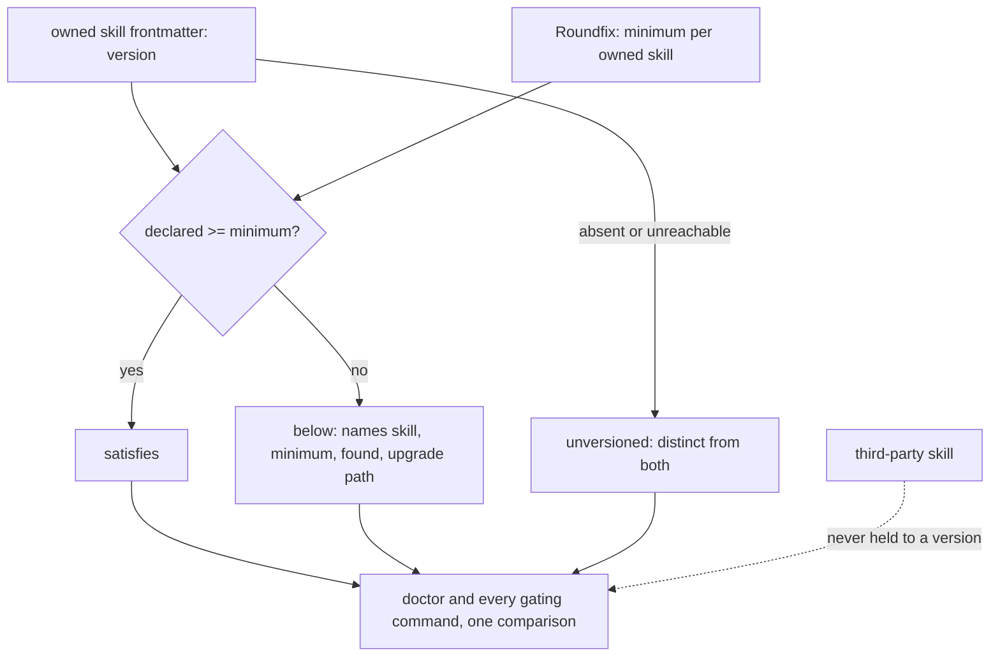

# Skill versions decoupled from the binary — Technical Spec

## Executive Summary

`treeDigest` is the whole defect, in four places: declared per skill in the
setup snapshot, folded into the catalog digest, validated in
`catalog_validate.go`, and rewritten by `assets_sync.go`. Because it pins
*content*, any edit to an owned skill changes what the binary claims about it,
and a Roundfix release asserts a fact about content it does not version.

The replacement is a declared version and a declared minimum, compared. A skill
says what it is; Roundfix says what it needs; readiness is `>=`. Nothing
derives the other, and a newer skill needs no change in Roundfix.

The scope boundary matters as much as the mechanism: this covers only the
skills `OWNED_SKILLS` names — authored here and embedded in the binary. Roundfix
must not demand a version from content it neither owns nor publishes, and the
2026-07-29 finding records what happened the last time it imposed its own needs
on repositories that had no reason to hold them.

## Version identity

Owned skill frontmatter carries `name`, `description`, and `metadata` today —
no version. Adding one is this Spec's own work, not a dependency on anyone.

The version is the skill's compatibility identity, and it is compared, never
parsed for meaning beyond ordering. Three states stay distinct at every
surface, and collapsing any two of them makes the contract unreadable during
the transition:

| State | Meaning |
| --- | --- |
| satisfies | declared version is at or above the declared minimum |
| below | declared version is under the minimum — blocking, names both |
| unversioned | the skill declares none, or its source is unreachable |

`unversioned` is never reported as missing. An unreachable source and an absent
skill are different facts and the operator acts differently on each.

## Project Constraints

- Identifier strategy: applicable — this Spec introduces a skill version as a
  compared value. It is not a project-owned Internal Identifier: the version is
  declared by the skill and read by Roundfix, so ownership stays with the
  skill and Roundfix never mints or infers one. Source:
  `docs/agents/domain.md`.
- Authentication and HTTP: applicable — the governing clause prohibits reading,
  printing, committing, or generating secrets and forbids inventing
  authentication or transport policy. Resolving a skill's declared version
  reads local installed files, introduces no credential, and opens no endpoint.
  Source: `docs/agents/agent-instructions.md`.
- Active ADR obligations: applicable — ADR-0081 keeps sanctioned digest
  regeneration a fallout of the authorized edit, which whatever replaces the
  content pin must preserve for the artifacts Roundfix still owns. ADR-0085
  keeps a regeneration run ungated by the pins it rewrites while every other
  load stays strict. ADR-0080 owns QA verdict semantics and ADR-0091 owns the
  authored QA gate as a typed Task node, under which this graph is authored.
  ADR-0093 surfaces as a relation candidate because it cites ADR-0080; it does
  not apply — it governs the Spec Consistency Check's detection boundary.
  Source: `docs/agents/domain.md`.
- Tooling authority: applicable — express maintainer authorization: the
  2026-08-04 record at
  `docs/workflow/authorizations/2026-08-04-queue-tail-tooling.md` names Spec
  0073. The exact bounded files: `Makefile`, for the version contract and any
  change to how the owned-skill version check is invoked; and
  `.agents/skills/<owned-skill>/**` with its `skills/<owned-skill>/**` mirror,
  for any member of `OWNED_SKILLS`. That set is bounded by the `Makefile`
  variable, not by any list copied into a Spec — a copied list is the defect
  this repository's "an assertion reads the constant it means" rule names.
  Setup snapshot and profile assets under `internal/baseline/assets/**` are
  product assets rather than protected tooling. Deterministic digest fallout is
  sanctioned by ADR-0081. Source: `docs/agents/agent-instructions.md`.

## System Architecture



The dotted edge is as load-bearing as the solid ones.

## Implementation Design

### Interfaces

```go
// SkillVersion is a skill's declared compatibility identity. Roundfix reads
// it and never invents one.
type SkillVersion struct {
    Declared string // empty means unversioned
    Source   string // where it was read from, for the diagnostic
}

// Readiness compares a declared version against Roundfix's declared minimum.
// It returns one of three distinct states and never collapses them.
func Readiness(declared SkillVersion, minimum string) (ReadinessState, error)
```

### Data Models

Owned skill frontmatter gains `version`. The setup snapshot carries the
**minimum** per owned skill in place of `treeDigest`. The catalog digest stops
folding skill content, so a skill edit no longer moves it.

Digests that protect artifacts Roundfix genuinely owns — the guides it
generates — stay exactly as they are. The change is narrow: content pins stop
gating *compatibility*.

### API Contracts

No new command and no new flag. `roundfix doctor`'s `skills:` line reports
readiness under this contract, and every command that gates on skills uses the
same comparison, so two surfaces cannot disagree.

| Situation | Today | After |
| --- | --- | --- |
| Owned skill edited | `make verify` red until two corpora re-recorded | green, no regeneration step |
| Owned skill one minor above minimum | digest mismatch, blocking | satisfies, no Roundfix change |
| Owned skill below minimum | indistinguishable from any other mismatch | blocks, naming skill, minimum, found, upgrade |
| Skill declares no version | not representable | `unversioned`, distinct from both |
| Third-party skill | held to a digest it never published | never held to a version |
| Baseline applied before this Spec | validates | validates, unchanged |

## Coverage Map

- Core Feature 1 (every authorial skill declares a version) → the frontmatter
  field and the check that every `OWNED_SKILLS` member carries one.
- Core Feature 2 (Roundfix declares a minimum, carried by the profile) → the
  setup snapshot's minimum replacing `treeDigest`.
- Core Feature 3 (readiness is a comparison, not equality) → `Readiness`.
- Core Feature 4 (below the minimum blocks, naming four facts) → the
  `BLOCK` branch and its diagnostic.
- Core Feature 5 (three states never collapsed) → `ReadinessState`, asserted
  one case per state.
- Core Feature 6 (Doctor and every gating command agree) → the single
  comparison both call.
- Core Feature 7 (digests stop gating compatibility, stay where owned) → the
  catalog digest no longer folding skill content.
- Core Feature 8 (corpora stop embedding volatile skill digests) → the
  recorded diagnostics losing their digest fields.
- Core Feature 9 (prior Baselines keep validating, archived artifacts
  byte-identical) → the compatibility corpus, asserted unchanged.

## Integration Points

- `.agents/skills/<owned-skill>/SKILL.md` and mirrors — the declared version.
- `internal/baseline/assets_sync.go` — `treeDigest` write path.
- `internal/baseline/catalog_validate.go` — `treeDigest` validation.
- `internal/baseline/assets/setups/` — the minimum replacing the content pin.
- `Makefile` — the version contract and how the check is invoked.
- `internal/cli` — the Doctor `skills:` line.

## Testing Approach

`internal/baseline` is table-driven over recorded corpora, and `./skills` has
its own contract tests. No new seam is needed.

- **The edit test**, which is the Spec's first Success Metric: edit an owned
  skill and assert `make verify` stays green with no regeneration step. This is
  the assertion the whole Spec exists for.
- **The three states**, one case each, asserted as distinct outcomes rather
  than as pass/fail.
- **One minor above satisfies**, with no change to Roundfix — the property that
  lets a skill ship on its own schedule.
- **A third-party skill is never failed for lacking a version**, asserted
  directly, because the 2026-07-29 finding records the cost of the opposite.
- **Back-compatibility**: a Baseline applied before this Spec still validates,
  and archived Spec artifacts are byte-identical, asserted over the existing
  compatibility corpus.
- **No acceptance asserts a recorded digest or a recorded version.** Each
  asserts the comparison's outcome, which holds at any version.

## Build Order

1. **Declare the version** — the frontmatter field on every `OWNED_SKILLS`
   member, plus the check that each carries one. Changes no behaviour.
2. **Compare instead of matching** (depends on: 1) — `Readiness`, the three
   states, and the minimum carried by the setup snapshot.
3. **Stop gating on content** (depends on: 2) — the catalog digest stops
   folding skill content and the corpora stop embedding it, with the edit test
   and the back-compatibility corpus.
4. **One comparison everywhere** (depends on: 2) — Doctor and every gating
   command call it, with third-party treatment asserted unchanged.
5. **Skill synchronisation** (depends on: 3, 4) — the authorized Skill update
   and its regeneration chain.

Step 1 leads because it is inert: skills gain a field nothing reads yet, so the
repository stays green while the identity exists to compare against.

## Risks & Considerations

- **Widening to third-party skills is the failure mode.** It has happened
  before, and three consumer repositories failed `roundfix doctor` for skills
  they had no reason to hold. The boundary is `OWNED_SKILLS`, read from the
  `Makefile` variable rather than copied.
- **Removing a digest can remove protection Roundfix needs.** The rule is
  narrow: content pins stop gating compatibility; every digest protecting an
  artifact Roundfix generates stays.
- **The transition has a real unversioned window.** Between step 1 and step 2,
  skills declare versions nothing compares. That is deliberate and is why
  `unversioned` is a first-class state rather than an error.

## Decisions

- Compatibility is a floor, not an equality. The question that survives a skill
  evolving on its own schedule is "is this new enough", not "is this identical".
- The skill owns its version; Roundfix owns the minimum. Neither derives the
  other.
- The contract covers only what Roundfix authors and ships.
- `unversioned` is its own state, never collapsed into pass or fail.
- The `OWNED_SKILLS` boundary is read from its declaring variable, never copied
  into a Spec artifact that can drift from it.
