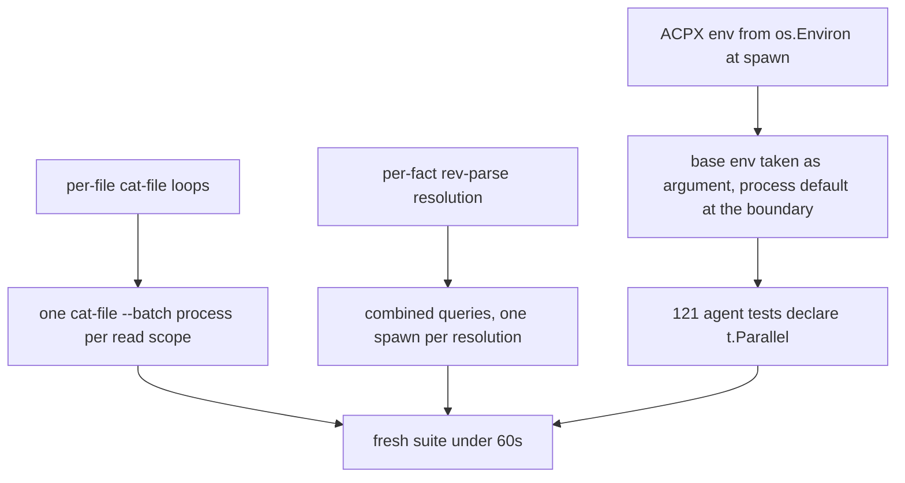

# Git spawn economy — Technical Spec

## Executive Summary

The measurement settles where the work is. The suite is not compute-bound
(36% utilization on twelve cores) and not idle-bound; it is spawn-bound —
kernel time is three times user time, and 13,926 git processes start and die
in one run. Production issues about six thousand of them, and two shapes
dominate: **per-file loops** (`cat-file blob` once per tree entry, in skills
restore and assets-sync provenance) and **per-fact resolution** (`rev-parse`
once per question, re-asked per operation). Both have batch-shaped answers
inside git itself: `cat-file --batch` streams any number of objects through
one process, and `rev-parse` answers several queries in one invocation.

The second half extends ADR-0089 to `internal/agent`: the ACPX child's
environment is composed from `os.Environ()` at spawn time, which forces the
package's tests to mutate process env via `t.Setenv` — 126 calls that keep
121 of 136 tests sequential. Taking the base environment as an argument, with
the process default resolved at the boundary, is exactly the prefactor Spec
0071 applied to `internal/cli`, and it unlocks the same parallelism.

What this design deliberately does not do: extract a shared git client
(seven per-package runners is not the cost — process count is), or cache
facts across mutations (a stale fact is a corrupted Run; a spawned process
is only a slow one).

## Project Constraints

- Identifier strategy: not applicable — no new project-owned identifiers;
  existing contracts keep their names. Source: `docs/agents/domain.md`.
- Authentication and HTTP: not applicable — no transport or credential
  surface. Source: `docs/agents/agent-instructions.md`.
- Active ADR obligations: applicable — ADR-0089 extended to
  `internal/agent`; ADR-0090 (this Spec) governs batch reads; ADR-0081 not
  triggered, since no digest-bearing asset is edited. Source:
  `docs/agents/domain.md`.
- Tooling authority: not applicable — no Makefile, workflow, skill, or pin
  changes. Source: `docs/agents/agent-instructions.md`.

## System Architecture

No new package. Three surfaces change, each inside the code that owns it:



## Implementation Design

### Interfaces

The batch reader, private to each package that needs it (the loop shape is
identical; the error vocabulary is not, and sharing the reader would couple
the two error contracts):

```go
// batchObjectReader feeds object names to one `git cat-file --batch`
// process and returns contents in request order. It exists so a read of N
// objects costs one spawn, not N.
type batchObjectReader struct {
    stdin  io.WriteCloser
    stdout *bufio.Reader
    cmd    *exec.Cmd
}

func newBatchObjectReader(ctx context.Context, gitArgs ...string) (*batchObjectReader, error)
func (r *batchObjectReader) Read(objectSHA string) ([]byte, error) // one round-trip
func (r *batchObjectReader) Close() error                          // waits for exit
```

The agent boundary, mirroring what 0071 did in `internal/cli`:

```go
// before: composed from the process at spawn time
func acpxCommandEnv(extra []string) []string          // reads os.Environ()

// after: the base arrives; the process default resolves once at the boundary
func acpxCommandEnv(base []string, extra []string) []string
```

Repository resolution combines queries the interface already permits:

```go
// before: four spawns per resolution
// rev-parse --show-toplevel; rev-parse --verify HEAD^{commit};
// rev-parse --show-object-format; rev-list --max-parents=0 HEAD

// after: rev-parse answers its three in one spawn, line-ordered
// rev-parse --show-toplevel --show-object-format --verify HEAD^{commit}
```

### Data Models

No persisted entities. Two artifacts under the Spec folder: the spawn census
(`baseline/`) captured before any change, and the after-measurement.

### API Contracts

None change. Outputs, errors, exit codes, and digests are byte-identical;
the characterization is the existing suite plus the census.

## Coverage Map

- Goal 1 (batch reads) → `batchObjectReader` in `internal/baseline`
  (skills restore, assets-sync provenance); combined `rev-parse` in
  repository resolution.
- Goal 2 (agent env) → `acpxCommandEnv` taking a base; test helpers supply
  per-test environments; parallel declarations follow.
- Goal 3 (<60s) → the before-and-after measurement, same commands, same
  machine.
- Goal 4 (no behavior change) → the suite itself, unchanged, plus digest
  assertions already in place (restore digests, plan digests).

## Integration Points

- **git's batch interfaces** — `cat-file --batch` framing:
  `<sha> SP <type> SP <size> LF <content> LF`, with `missing` on unknown
  objects. The reader must consume exactly `size` bytes plus the trailing
  newline, and must treat a `missing` reply as the same error the per-file
  loop produced.
- **The ACPX spawn path** (`internal/agent/acpx_runner.go`), where
  `cmd.Env = acpxCommandEnv(...)` is composed.
- **The spawn census procedure** — the PATH shim from the 0071 follow-up,
  recorded so the after-measurement counts the same way.

## Testing Approach

- **The suite is the characterization.** No output may change, and the
  existing golden digests (restore, plan, catalog) fail on any content
  drift the batch reader introduces.
- **Batch reader unit tests**: multi-object reads return contents in
  request order; a `missing` object surfaces the loop's existing error;
  zero-byte blobs; content containing the framing delimiters; process death
  mid-stream fails the read, not the process.
- **Agent parallel validation**: after the seam lands, `-race -count=2` on
  `internal/agent`, the same rule 0071 used — a test that fails under
  parallelism found shared state, and fixing it is the work.
- **The census**, before and after, with the same shim.

## Build Order

1. **Commit the spawn census baseline.** The shim procedure and its counts
   (13,926 total; the per-subcommand table) under `baseline/`. No behavior
   change; the comparison target for step 6.
2. **Batch reader in skills restore** (depends on: 1). The
   `cat-file blob` per-file loop in `skills_restore_git.go` reads through
   one `--batch` process. Its digest tests are the rail.
3. **Batch reader in assets-sync provenance** (depends on: 2 — it reuses
   the reader shape proven there). The loop in `assets_sync_git.go`.
4. **Combine repository resolution queries** (depends on: 1).
   `repository.go` and `assets_sync_git.go` ask `rev-parse` their multiple
   questions in one spawn each.
5. **Agent environment seam** (depends on: 1). `acpxCommandEnv` takes the
   base; helpers inject per-test; parallel declarations follow, validated
   with `-race -count=2`.
6. **Publish the before-and-after** (depends on: 2, 3, 4, 5). Census and
   wall clock, same commands, same machine, target stated: under 60s.

## Risks & Considerations

- **Framing bugs corrupt content silently.** The batch protocol is
  length-prefixed; an off-by-one survives until a digest assertion catches
  it. That is why the digest tests are the rail and why content containing
  delimiter bytes is a required unit case.
- **A long-lived child changes failure modes.** The per-file loop failed
  per object; the batch process can die mid-stream. The reader maps that to
  the same error surface, and its unit tests prove it.
- **Combined `rev-parse` output is order-dependent.** Parsing is positional;
  the test pins the order.
- **Parallelising `internal/agent` surfaces real defects** — as it did in
  `internal/cli` and `internal/daemon`, where the race detector found two.
  That is the point; sequential execution hid them.

## Decisions

- Batch within one immutable scope only; never cache across mutations. A
  stale repository fact corrupts a Run; a spawn only slows one. (ADR-0090)
- Per-package readers over a shared git client: the cost is process count,
  not code duplication, and the two loops own different error vocabularies.
- The agent seam follows ADR-0089 rather than inventing an injection
  mechanism: values a caller already knows become parameters, and the
  process default resolves once at the boundary.
