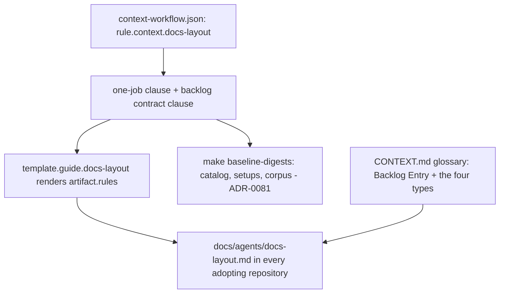

# A typed backlog for triage intent — Technical Spec

## Executive Summary

The layout is defined in exactly one place, and that is where this Spec
works. `docs/agents/docs-layout.md` is a managed artifact generated from
`template.guide.docs-layout` plus the clauses of `rule.context.docs-layout`
in the `context-workflow` module
(`internal/baseline/assets/modules/context-workflow.json`). The findings
contract already lives there as an embedded, copyable clause; the backlog
contract lands beside it the same way. No binary behavior changes — no
command reads the backlog; directories in this layout materialize when
their first file lands, which is how every docs directory already works.

The deterministic fallout is the familiar ADR-0081 chain: module edit →
`make baseline-digests` regenerates the catalog digest, setup snapshots,
and the parity/compatibility corpus → this repository re-applies its own
baseline so its checked-in guide carries the new contract.

## Project Constraints

- Identifier strategy: applicable — Backlog Entry and its type values
  (`feat`, `fix`, `perf`, `refactor` — the Conventional Commits intent
  vocabulary) join the `CONTEXT.md` glossary and are used verbatim in
  every clause. Source: `docs/agents/domain.md`.
- Authentication and HTTP: not applicable — this Spec changes local
  documentation layout and Baseline asset content, opens no transport, and
  handles no credential. Source: `docs/agents/agent-instructions.md`.
- Active ADR obligations: applicable — ADR-0081 (digest fallout of the
  authorized asset edit); ADR-0092 (this Spec); the knowledge-flow
  principle (guides never reference backlog content). Source:
  `docs/agents/domain.md`.
- Tooling authority: not applicable — Baseline module assets, the
  generated guide, and the glossary; no protected tooling file. Source:
  `docs/agents/agent-instructions.md`.

## System Architecture



## Implementation Design

### The contract the guide will carry

Frontmatter, mirroring the findings contract's shape:

```markdown
---
type: feat            # feat | fix | perf | refactor
status: open          # open | promoted | declined
created: 2026-08-03
spec: null            # spec slug when status: promoted
reason: null          # required when status: declined
---
```

Body template per type, embedded copyable in the guide:

```markdown
# <Title — the intent in one line>          # type: feat
## Opportunity   — what could exist and for whom
## Value         — why it would matter; the hypothesis
## Shape         — the rough form of a solution, explicitly non-binding

# <Title — the defect in one line>          # type: fix
## Symptom       — what misbehaves, as a user or operator sees it
## Where         — surface, command, or package, as known
## Expected      — the behavior that should replace it
## Evidence      — finding link when one exists; "none yet" is honest

# <Title — the cost in one line>            # type: perf
## Slow          — what is slow, for whom, in which operation
## Measured      — the number that says so, and how it was taken
## Target        — the number that would settle it

# <Title — the tangle in one line>          # type: refactor
## Tangled       — what resists change, duplicated or coupled where
## Cost          — what it makes slow, risky, or wrong to touch
## Shape         — the structure that would replace it, non-binding
```

### The boundary clause

One clause states both directions: a finding records what happened
(evidence, immutable, never a commitment); a backlog entry records what to
do next (intent, typed, never evidence). A finding may spawn an entry; an
entry needs no finding. A `feat` entry is upstream raw material the spec
pipeline may consume — never the `write-idea` artifact itself. The type
vocabulary is the Conventional Commits vocabulary the repository already
enforces on PR titles, so one word carries the intent from backlog entry to
Spec to commit; `refactor` is the canonical token, never an abbreviation.

### Data Models

No Go types. The contract is guide content and module clauses. Filenames:
`docs/backlog/YYYY-MM-DD-<slug>.md`.

### API Contracts

None. No command reads or validates the backlog; validation is editorial,
by the guide's contract, exactly as findings work today.

## Coverage Map

- PRD Core Features 1–4 → the module clause edits and the two templates.
- Core Feature 5 (promotion mirrors adoption) → the lifecycle wording in
  the contract clause.
- Core Feature 6 → the `CONTEXT.md` glossary entries.
- Core Feature 7 (open type set) → the contract names the closed current
  set and the rule for extending it.
- Success Metric "fresh apply produces the guide" → the corpus and
  golden-driven guide tests in `internal/baseline`.

## Integration Points

- `internal/baseline/assets/modules/context-workflow.json` — the one-job
  clause, the new backlog contract clause, the boundary clause.
- `internal/baseline/assets/templates/guides/docs-layout.md` — only if the
  static body needs a section anchor; the rules token may carry everything.
- `make baseline-digests` — ADR-0081 fallout: catalog digest, setup
  snapshots, source-baseline corpus, parity fixtures.
- This repository's own baseline apply — the checked-in guide regenerates;
  `docs/backlog/` receives its first entry as proof of the template.
- `CONTEXT.md` — glossary entries; the knowledge-flow principle bounds
  what may point where.

## Testing Approach

- The existing guide-generation and corpus tests in `internal/baseline`
  are the rail: the regenerated corpus is re-recorded deliberately with
  the sanctioned `-update` steps, and the diff must show only the layout
  content and its digests — declared breaks, not discovered ones.
- A characterization check that the findings contract clause is
  byte-unchanged: this Spec adds beside it, never edits it.
- The repository's own regenerated `docs/agents/docs-layout.md` is
  reviewed against the PRD's contract as acceptance evidence.

## Build Order

1. **Module clauses** — extend the one-job clause with `docs/backlog/`;
   add the Backlog Operational Contract clause (frontmatter + both
   templates) and the boundary clause beside the findings contract.
2. **Digest chain** (depends on: 1) — `make baseline-digests`; corpus
   re-recorded deliberately; diffs inspected and declared.
3. **This repository adopts** (depends on: 2) — re-apply the baseline so
   the checked-in guide updates; seed `docs/backlog/` with its first real
   entry using the template verbatim.
4. **Glossary** (depends on: 1) — `CONTEXT.md` gains Backlog Entry,
   `idea`, `fix`, and the write-idea distinction.

## Risks & Considerations

- **The corpus is a characterization gate.** Re-recording it is sanctioned
  but must be reviewed: only layout content and digests may move. Anything
  else moving means the edit leaked.
- **Vocabulary drift.** Averted by construction: aligning the type set
  with Conventional Commits removed the `idea` collision with the
  `write-idea` artifact entirely — `feat` names the entry, `write-idea`
  names the pipeline stage. The one residual trap is abbreviation:
  `refactor`, never `refact`, and the contract says so.
- **Scope discipline.** No skill edits, no migration of existing findings,
  no binary changes — three tempting adjacencies, all out of scope by PRD.

## Decisions

- The contract lives in module clauses, not in static template prose,
  because clauses are the unit adopting repositories receive and the unit
  the corpus characterizes. (ADR-0092 records the product decision.)
- Four types now — the Conventional Commits intent vocabulary (`feat`,
  `fix`, `perf`, `refactor`); extension is a contract change with a corpus
  re-record, never an informal addition, and a new type must be a
  Conventional Commits type that expresses intent.
- Findings deprecation into the backlog is explicitly deferred and will be
  its own Spec if it happens.
