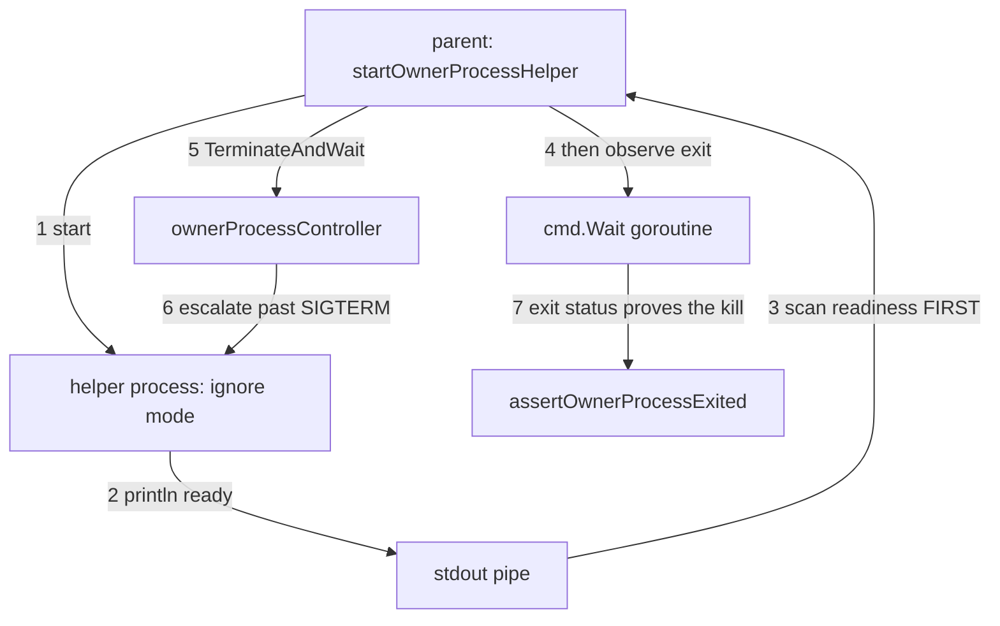

# Force Stop exit proof — Technical Spec

## Executive Summary

The change is contained in one file, `internal/store/process_unix_test.go`, and
it has three parts: keep the `ignore` helper alive without tripping the Go
runtime's deadlock detector, order the readiness handshake ahead of process-exit
observation, and add the assertion that makes a premature helper exit fail.

The trade-off accepted is that the helper gains a bounded lifetime rather than
blocking forever. A truly unbounded block is what the runtime kills; a block the
runtime cannot prove is dead needs either a registered OS signal source or a
timer. This design takes the signal source, because it is what the sibling
`terminate` mode already does and because it keeps the helper's liveness tied to
the same mechanism the test is about.

## Project Constraints

- Identifier strategy: not applicable — no project-owned Internal Identifier is
  created; helper modes, test names, and process states keep their existing
  contracts. Source: `docs/agents/domain.md`.
- Authentication and HTTP: not applicable — the governing clause prohibits
  reading, printing, committing, or generating secrets and forbids inventing
  authentication, authorization, transport, or deployment policy; this Spec
  changes in-process test coordination and opens no transport. Source:
  `docs/agents/agent-instructions.md`.
- Active ADR obligations: applicable — ADR-0089 requires code under test to take
  its environment explicitly; the helper's liveness and the parent's readiness
  handshake are made explicit rather than left to scheduling. Source:
  `docs/agents/domain.md`.
- Tooling authority: not applicable — no protected tooling mutation is proposed
  or authorized; the surface is Go test code under `internal/store`. Source:
  `docs/agents/agent-instructions.md`.

## System Architecture



The current graph has steps 3 and 4 inverted, which is the whole race.

## Implementation Design

### Interfaces

```go
// ignore mode: survive SIGTERM and stay alive until something kills us.
// signal.Ignore drops SIGTERM; the runtime must still see a live source,
// so block on a registered signal channel rather than on select{}.
case "ignore":
    signal.Ignore(syscall.SIGTERM)
    defer signal.Reset(syscall.SIGTERM)
    held := make(chan os.Signal, 1)
    signal.Notify(held, syscall.SIGINT) // never sent; keeps the goroutine live
    defer signal.Stop(held)
    fmt.Fprintln(os.Stdout, "ready")
    <-held
```

```go
// parent: readiness before exit observation, and exit cause asserted.
func startOwnerProcessHelper(t *testing.T, mode string) (int, <-chan error)
// 1. cmd.Start
// 2. scan readiness from stdout      <- moved ahead of the Wait goroutine
// 3. start the cmd.Wait goroutine
// 4. t.Cleanup as today
```

### Data Models

None. No persisted state and no new types.

### API Contracts

None. No command, flag, exit code, or output format changes.

## Coverage Map

- Goal "the helper stays alive until something kills it" and Core Feature 1 →
  the `ignore` mode block on a registered signal source.
- Goal "readiness without racing exit" and Core Feature 2 → the reordered
  handshake in `startOwnerProcessHelper`.
- Goal "premature exit fails" and Core Feature 3 → the new regression
  assertion.
- Core Feature 4 → the force-kill proof asserting the controller's escalation
  caused the exit.
- Success Metrics 1–3 → Testing Approach below.

## Integration Points

None external. `internal/store`'s process controller, its production code, and
every other package are untouched.

## Testing Approach

The seam already exists: `internal/store` runs its helper as a re-executed test
binary selected by `ROUNDFIX_OWNER_PROCESS_HELPER`. No new seam is needed.

- **Liveness, directly observed.** Run the helper binary alone in `ignore`
  mode; assert it prints readiness, is still alive afterwards, and produces no
  `fatal error`. This is the check that would have caught the defect, and it
  did not exist.
- **The repeated pair.** Run the parent and helper together at `-count=50`. The
  QA gate's probe used exactly this and it is what proved the parent was
  passing for the wrong reason; it becomes the regression rail.
- **Negative probe.** Make the helper exit immediately, prove the new
  assertion fails, and revert within the same check. An assertion never
  observed failing is not known to be able to fail.

## Build Order

1. **Helper liveness** — `ignore` mode blocks on a registered signal source;
   the direct liveness observation lands with it.
2. **Handshake ordering** (depends on: 1) — readiness is scanned before the
   `cmd.Wait` goroutine starts; the repeated-pair run proves the closed-pipe
   failure is gone.
3. **Causation and regression** (depends on: 1, 2) — the force-kill proof
   asserts the controller's escalation ended the process, and the premature-exit
   regression is proven able to fail by the negative probe.

## Risks & Considerations

- **The obvious wrong fix is a sleep.** Blocking the helper on a long
  `time.Sleep` also defeats the deadlock detector and would pass. It reintroduces
  a wall-clock dependency, which this repository has now paid for three times in
  one session. The signal-source block has no duration.
- **Ordering alone is not enough.** Fixing only the parent leaves a helper that
  still dies of a runtime deadlock; the test would pass more reliably and prove
  no more than it does today. Both halves are required, which is why they are
  separate Build Order steps with the causation assertion after them.
- **`-count=50` is a rail, not a guarantee.** It catches this race because the
  race is wide. Keeping the causation assertion is what protects the contract
  when the timing changes.

## Decisions

- `ignore` mode blocks on a registered signal channel, matching the sibling
  `terminate` mode, rather than on `select {}` or a timer.
- Readiness is consumed before process-exit observation begins; the fix is
  ordering, never a widened timeout.
- The proof asserts the controller caused the exit, because "the process is
  gone" is satisfied by a process that crashed on its own — the exact reading
  under which this defect passed.
