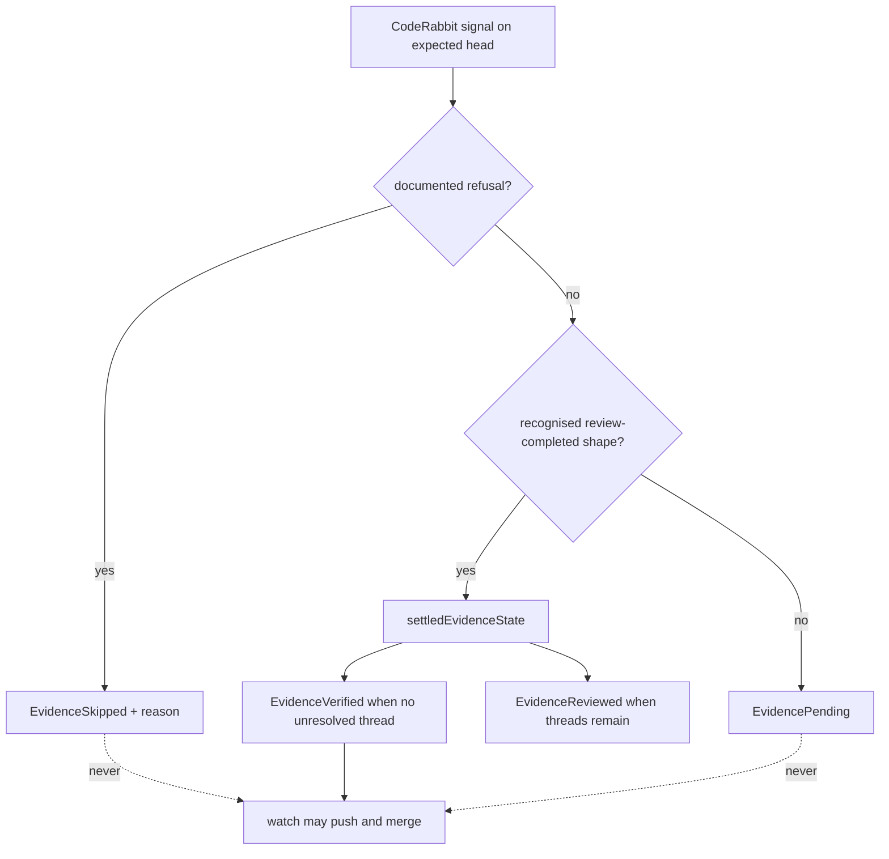

# A green check is not a review — Technical Spec

## Executive Summary

The change is one inverted default in `classifyEvidence`, plus the recognition
that makes its diagnostics useful.

Today `verified` is reached by **falling through**: a CodeRabbit check on the
expected head that is not a pending signal and not the one recognised skip title
lands on `settledEvidenceState`, which returns `verified` when no thread is
unresolved. Adding `Review rate limited` to the skip list would fix the observed
shape and leave the mechanism intact.

Instead, `verified` becomes reachable only through a recognised
review-completed shape. Everything unrecognised resolves `pending`. Refusal
recognition still exists — a refused head should say *why* it was refused — but
it is no longer what holds the gate closed. The gate is held closed by the
default.

The trade-off accepted: a benign but unrecognised signal now stalls the loop
instead of merging. That is the correct direction — a stall is visible and
recoverable, an unreviewed merge is neither — and it is bounded, because
`pending` is a state `watch` already waits on rather than an error it aborts
with.

## Project Constraints

- Identifier strategy: not applicable — no project-owned Internal Identifier is
  created; Review Source Evidence states, check names, and Run identities keep
  their existing contracts, and this Spec maps a case onto states that already
  exist. Source: `docs/agents/domain.md`.
- Authentication and HTTP: not applicable — the governing clause prohibits
  reading, printing, committing, or generating secrets and forbids inventing
  authentication, authorization, transport, or deployment policy; this Spec
  classifies signals already fetched through the existing Review Source client
  and opens no new transport. Source: `docs/agents/agent-instructions.md`.
- Active ADR obligations: applicable — ADR-0054 makes Review Source Evidence the
  determinant of review outcomes and this Spec restores that intent rather than
  changing it; nothing here may make an outcome more permissive than the
  evidence it summarizes. ADR-0080 owns QA verdict semantics and ADR-0091 owns
  the authored QA gate as a typed Task node, under which this Spec's own graph
  is authored. ADR-0081 sanctions the deterministic digest fallout of the
  authorized Skill synchronisation. ADR-0093 surfaces as a relation candidate
  because it cites ADR-0080 and does not apply. Source: `docs/agents/domain.md`.
- Tooling authority: applicable — express maintainer authorization: on
  2026-08-04 the maintainer granted standing authorization for Roundfix Skill
  CLI synchronisation, recorded at
  `docs/workflow/authorizations/2026-08-04-queue-tail-tooling.md`, which names
  Spec 0077; bounded files: `.agents/skills/roundfix/**` and its
  `skills/roundfix/**` mirror, regenerated by `make skills-sync`, for
  CLI-contract synchronisation only. Source:
  `docs/agents/agent-instructions.md`.

## System Architecture



The two dotted edges are the Spec. Today only the `skipped` one exists, and
only for one title.

## Implementation Design

### Interfaces

```go
// reviewCompleted reports whether this signal is a shape Roundfix recognises
// as a review that actually ran. It is the only door to verified evidence.
func reviewCompleted(run CheckRun) bool

// refusalReason recognises the documented shapes in which the source declines
// to review the expected head, and returns the reason verbatim. It exists to
// explain a refusal, not to hold the gate closed — the closed default does that.
func refusalReason(run CheckRun, comments []IssueComment) (string, bool)
```

`classifyEvidence` gains one ordering rule: refusal, then recognised
completion, then pending. `settledEvidenceState` is reached only through
`reviewCompleted`.

### Data Models

No persisted state and no new evidence state. `skipped` and `pending` already
exist and already carry the meanings this Spec needs. The refusal reason travels
in `Evidence.Detail`, bounded by the existing `BoundEvidenceDetail`.

### API Contracts

No new command and no new flag.

| Signal on the expected head | Today | After |
| --- | --- | --- |
| `Review rate limited`, success | `verified` | `skipped`, reason recorded |
| `Review skipped`, path filters | `skipped` | `skipped`, unchanged |
| Recognised completed review, no unresolved thread | `verified` | `verified`, unchanged |
| Recognised completed review, unresolved threads | `reviewed` | `reviewed`, unchanged |
| Unrecognised check, success conclusion | `verified` | **`pending`** |
| Any of the above recorded against an earlier commit | not current | not current, unchanged |

`watch --until-clean` on a `skipped` or `pending` head does not push and does
not merge, and names what it observed. That behaviour already exists for both
states; this Spec routes the cases into them.

## Coverage Map

- Core Feature 1 (a refusal resolves `skipped`, by class) → `refusalReason`
  ordered ahead of everything else.
- Core Feature 2 (`verified` only through positive evidence) → `reviewCompleted`
  as the single door to `settledEvidenceState`.
- Core Feature 3 (read the authoritative signal, not the conclusion) →
  `refusalReason` reading the documented comment as well as the check.
- Core Feature 4 (`watch` does not merge a refused or unclassified head) → the
  existing `skipped` and `pending` handling, which this Spec routes into.
- Core Feature 5 (evidence for one head never verifies another) → the existing
  `currentHeadCheckRun` guard, asserted rather than assumed.
- Core Feature 6 (classification observable) → the Run Event Stream record
  carrying state and reason.

## Integration Points

- `internal/reviewsource/coderabbit/coderabbit.go` — `classifyEvidence`,
  `structuredSkipReason`, and the path to `settledEvidenceState`.
- `internal/watch/watch.go` — the diagnostic naming what was observed; the
  refusal and pending branches already exist.
- `internal/runevent` — the classification record.
- `.agents/skills/roundfix/**` and its mirror — CLI-contract synchronisation.

## Testing Approach

The seam exists: `internal/reviewsource/coderabbit` is table-driven over
recorded GitHub payloads. No new seam is needed.

- **The #107 replay**, the PRD's first Success Metric: the exact payload that
  merged 125 files unreviewed must resolve `skipped` and must stop the watch.
- **The default-deny test.** An unrecognised check name with a success
  conclusion resolves `pending`. This is the assertion that makes the boundary
  hold for shapes nobody has seen, and the one most likely to be omitted because
  it tests an absence.
- **The class table.** Rate limit, path-filter skip, and title case variants,
  each asserted. Different strings, same class.
- **Stale-head isolation.** A refusal recorded against an earlier commit must
  not settle the current head, and a completed review against an earlier commit
  must not verify it either.
- **Non-regression over the recorded corpus.** Every payload that resolves
  `verified` today still does. This Spec tightens a gate, and the way to get it
  wrong is to make real reviews stop counting.

## Build Order

1. **Invert the default** — `reviewCompleted` as the only door to
   `settledEvidenceState`, unrecognised resolving `pending`, with the
   default-deny test and the non-regression corpus asserted unchanged.
2. **Refusal recognition** (depends on: 1) — `refusalReason` over the documented
   shapes with reasons recorded, the #107 replay, the class table, and
   stale-head isolation.
3. **Diagnostics** (depends on: 1, 2) — the watch message naming what it
   observed, and the Run Event Stream record.
4. **Skill synchronisation** (depends on: 3) — the authorized Skill update and
   its regeneration chain.

Step 1 leads deliberately: it is the change that closes the gate, and it closes
it even for the shapes step 2 has not learned yet.

## Risks & Considerations

- **Default-deny can stall on a benign unknown.** Accepted: a stall is visible
  and recoverable, an unreviewed merge is neither. It resolves `pending`, which
  `watch` waits on rather than aborting.
- **The non-regression corpus is the safety net.** Tightening a gate goes wrong
  by making real reviews stop counting, and the recorded corpus is what proves
  it did not.
- **Recognition is CodeRabbit-shaped.** That is the source in use. The inverted
  default is what protects a future source, and it is written as the general
  rule rather than as a CodeRabbit special case.
- **Retrigger is absent by design.** A refused head will now stall until a real
  review happens or an operator acts. That is worse ergonomics and better
  correctness, and the follow-on Spec owns making it ergonomic.

## Decisions

- `verified` requires positive evidence that a review ran. The default is
  inverted rather than the refusal list extended, because a list fixes today's
  shape and leaves tomorrow's open.
- No new evidence state: `skipped` already means the source explicitly declined
  that head, and `pending` already means no usable signal yet.
- Refusal recognition explains a refusal; it does not hold the gate. If the two
  ever disagree, the default wins.
