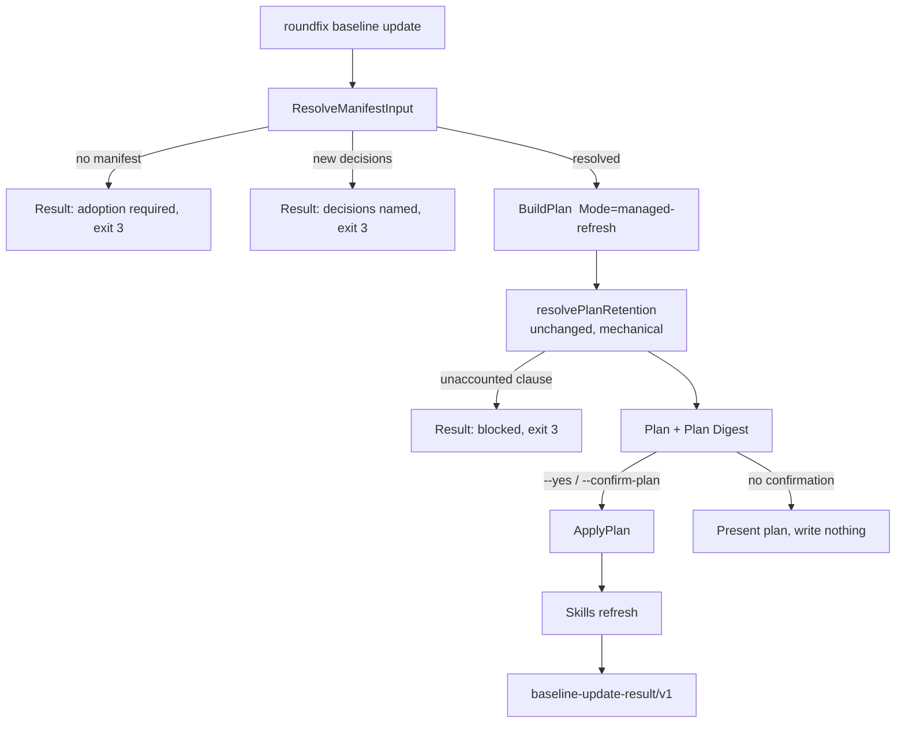

# Baseline update — Technical Spec

## Executive Summary

The Baseline engine already contains almost everything an update needs. Plan
assembly performs mechanical clause-level retention accounting through
`resolvePlanRetention` and `classifySourceClauseTransition`, entirely without an
analyzer; plans are already portable and preimage-bound; apply is already a
recoverable transaction. What is missing is an input path that reads the Setup
Manifest, and a preservation mode that regenerates managed regions without
asking anyone where repository-authored prose belongs. This design adds exactly
those two things and a command that composes them with the two skill
installers that already exist.

The primary trade-off accepted: a managed refresh will not re-file
repository-authored rules a maintainer hand-wrote into a root carrier after
adoption. Those rules stay where they were written. We accept an update that is
mechanically complete over what the Baseline owns and deliberately blind to
what it does not, because the alternative — the current behavior — spends a
supervised ACP turn on every refresh to re-derive a settled answer, and that
cost is why the fleet drifts.

## Project Constraints

- Identifier strategy: not applicable — the `go-cli-tui` Baseline Profile does
  not select `identifier.strategy`. Every artifact this design introduces is
  identified by content digest through the existing `planContentIdentity` and
  Plan Digest machinery, so no generated identifier is required. Source:
  `docs/agents/domain.md`.
- Authentication and HTTP: not applicable — the repository has no
  `docs/agents/backend.md`, the `go-cli-tui` Profile selects no backend module,
  and this design opens no HTTP surface. External skill acquisition reuses the
  existing immutable Git source contract in `skills_restore_git.go` rather than
  adding an authenticated protocol. Source: `docs/agents/spec-routing.md`.
- Active ADR obligations: applicable — ADR-0047 (immutable fingerprinting
  guarantees) constrains the digest scheme used for Plan identities; ADR-0058
  (retention accounting is fail-closed on unaccounted managed-clause removal) is
  satisfied by keeping `resolvePlanRetention` on the update path unchanged;
  ADR-0066 (CLI exit codes are fixed and documented) constrains the exit code
  contract in the API Contracts section; ADR-0067 (structured CLI output schema)
  requires schemaVersion, type, ok, requestId, and timestamp on every response;
  ADR-0068 (one confirmation-gated workflow) is satisfied by binding apply to
  the exact Plan Digest; ADR-0070 (CLI response bodies are always complete) is
  satisfied by the single json/text output writer; ADR-0071 (portable,
  preimage-bound plans) and ADR-0073 (recoverable transaction) are satisfied by
  reusing `BuildPlan` and `ApplyPlan` unmodified; ADR-0069 (semantic analysis is
  read-only and supervised) is respected by not invoking the analyzer at all on
  this path; ADR-0081 (digested guidance pins are sanctioned fallout of Baseline
  updates after adoption) applies directly — pins rewritten by `make
  baseline-digests` are declared fallout; ADR-0087 (capability discovery
  resolves links without executing) is unchanged; ADR-0090 (repository facts are
  read in batches, never cached across mutations) constrains the update to reuse
  existing batched inspection rather than adding per-file reads; ADR-0099
  separates mechanical retention accounting from supervised classification; and
  ADR-0100 replaces the root backup with a verified preservation invariant on
  this path only. Source: `docs/agents/spec-routing.md`.
- Tooling authority: applicable — this design edits Roundfix-owned Skills and
  Baseline module assets. Express maintainer authorization: recorded 2026-08-07
  in `docs/workflow/authorizations/2026-08-07-baseline-update-command.md`,
  granted as "Skills + module assets, limitado ao propósito". Bounded files:
  `skills/setup-context-driven/**` and `.agents/skills/setup-context-driven/**`;
  `skills/roundfix/**` and `.agents/skills/roundfix/**`; and
  `internal/baseline/assets/modules/*.json` limited to teaching the update
  command to generated guidance. Pins rewritten by `make baseline-digests` are
  sanctioned fallout under ADR-0081. Source: `docs/agents/agent-instructions.md`.

## System Architecture

Three existing packages are extended and no new package is created.

`internal/baseline` gains a third preservation mode and a manifest reader that
projects a stored manifest into the inputs `BuildPlan` already accepts.
`internal/cli` gains one command file. `skills` is used as-is.



The interactive `roundfix baseline` reuses the same `ResolveManifestInput`. When
it resolves cleanly it skips the preservation prompt, the profile prompt, every
decision prompt, and `promptBaselineClassification` — which is the call that
today reaches `baselineacp.(*Analyzer).Segment` and blocks on a spawned ACP
runtime. First adoption keeps its current path untouched.

## Implementation Design

### Interfaces

A third mode, alongside the two in `preservation.go`:

```go
const PreservationModeManagedRefresh PreservationMode = "managed-refresh"
```

`planRootPreservationWithCatalog` accepts it, still loads root sources to detect
blocking carriers, and then returns a plan whose `SourceBaseline` carries no
entries and whose `DecisionSkeleton` is nil — the two conditions that already
make every caller skip classification. Per ADR-0100 it plans no root backup.

The manifest reader, in a new `internal/baseline/update.go`:

```go
// ManifestInput is a stored Setup Manifest projected into plan inputs.
type ManifestInput struct {
    ProfileID    string
    Decisions    []DecisionValue
    NewDecisions []DecisionSuggestion // required by catalog, absent from manifest
    Manifest     SetupManifest
}

// ResolveManifestInput reads docs/agents/setup-context.json and resolves it
// against the current catalog. It never prompts and never writes.
// Returns ErrNoManifest when the repository has never adopted.
func ResolveManifestInput(root string, catalog *Catalog) (ManifestInput, error)
```

`DecisionSuggestion` carries the decision ID, its catalog-suggested value, and
the summary the CLI prints, so `--adopt-suggested` needs no second lookup.

The CLI request, in a new `internal/cli/baseline_update.go`:

```go
type baselineUpdateRequest struct {
    repo            string
    format          string   // text | json
    confirmation    string   // exact Plan Digest
    yes             bool     // confirm the digest this run computes
    adoptSuggested  bool
    skipSkills      bool
    skillsSourceDir string
}
```

### Data Models

No new persisted entity. `SetupManifest` is read, and rewritten by the existing
plan assembly, unchanged in shape.

One new result document, `roundfix/baseline-update-result/v1`, composed of
`schemaVersion`, `type`, `ok`, `requestId`, and `timestamp` on both success
and error responses, plus the fields the existing types already produce: the
prior and current
`CatalogIdentity`, the `FileChange` list, the `RetentionEvidence` and optional
`ClauseDelta`, the approved `PlanDigest`, a skills section projecting
`skills.InstallResult` and `baseline.SkillsRestorePayload`, and the existing
`Finding` warnings. It reuses `ResultStatusMatrix` so the axes stay
independent — a green apply with a drifted unreachable skill reports
`approvedPostimages: verified` next to a skills warning rather than collapsing
into one success state.

### API Contracts

```
roundfix baseline update [--repo <path>] [--format <text|json>]
                         [--yes | --confirm-plan <digest>]
                         [--adopt-suggested] [--no-skills]
                         [--skills-source-dir <path>]
```

Exit categories match the existing Baseline family:

- `0` — plan presented with nothing to change, or apply and verification passed.
- `1` — execution, verification, recovery, or rollback failure.
- `2` — invalid input, invalid manifest schema, or an unsafe repository.
- `3` — authentication or permission error: the caller cannot write.
- `4` — action required and nothing written: no manifest (adoption required), a
  decision the manifest does not carry, an unaccounted managed clause, or a
  plan presented without confirmation.
- `130` — canceled.

`--yes` and `--confirm-plan` are mutually exclusive. `--yes` confirms the digest
computed in the same invocation, which is what a sweep needs; `--confirm-plan`
keeps the two-step review available for a single repository.

## Coverage Map

- Core Feature 1 (manifest-driven refresh) → `ResolveManifestInput`,
  `baselineUpdateCommand`.
- Core Feature 2 (managed-only refresh scope) → `PreservationModeManagedRefresh`,
  marker-bounded postimage assembly.
- Core Feature 3 (retention accounting without classification) →
  `resolvePlanRetention` and `classifySourceClauseTransition`, reused unchanged.
- Core Feature 4 (confirmation-gated apply) → `BuildPlan`, `ApplyPlan`, the
  `--yes` and `--confirm-plan` contract.
- Core Feature 5 (skills refresh in the same act) → skills refresh stage
  composing `skills.Install` and `baseline.RestoreSkills`.
- Core Feature 6 (new decisions stop the sweep) → `ManifestInput.NewDecisions`,
  `--adopt-suggested`, exit category `3`.
- Core Feature 7 (interactive asks only what is new) → interactive short-circuit
  in `driveHumanBaselinePlanWithAnalyzers`.
- Core Feature 8 (a moved profile digest is still an update) →
  `ResolveManifestInput` digest-drift branch, interactive state inspection.
- Core Feature 9 (result document names the outcome) →
  `baseline-update-result/v1`, `ResultStatusMatrix`.
- Goal "refreshes without answering settled questions" → `ResolveManifestInput`,
  `baselineUpdateCommand`, interactive short-circuit in
  `driveHumanBaselinePlanWithAnalyzers`.
- Goal "every repository-authored byte identical" → `PreservationModeManagedRefresh`,
  existing marker-bounded postimage assembly, preservation invariant test.
- Goal "skills carried with guidance" → skills refresh stage composing
  `skills.Install` and `baseline.RestoreSkills`.
- Goal "sweep from a script; stop only for a real decision" → `--yes`,
  `--adopt-suggested`, exit-category contract.
- Goal "unaccounted removal still blocks" → `resolvePlanRetention` reused
  unchanged; regression test asserting a managed-refresh plan blocks on an
  unaccounted clause.
- Story 1 (fleet sweep) → `baselineUpdateCommand`, `--yes`, JSON result.
- Story 2 (interactive asks only what is new) → interactive short-circuit.
- Story 3 (hand-written rules untouched, proven) → `PreservationModeManagedRefresh`
  plus the byte-identity assertion over non-managed regions.
- Story 4 (skills in the same act) → skills refresh stage.
- Story 5 (new decision named, nothing written) → `ManifestInput.NewDecisions`,
  exit `3`.
- Story 6 (unaccounted clause fails) → `resolvePlanRetention`, `ClauseDelta`.

## Integration Points

- **Owned skill bundle** — `skills.Install` with `Target: "project"`, writing
  `<repo>/.agents/skills` and its `.claude/skills` link. In-process, no network.
- **External Repository Skill Set** — `baseline.RestoreSkills`, reusing its
  immutable Git source and provenance checks. The update calls it in preview
  first, then with the returned digest, so the existing two-step contract is
  honored inside one command rather than bypassed. Failure to reach the source
  degrades to a warning, never to a nonzero exit.
- **ACP runtime** — deliberately not integrated on this path. The absence is the
  feature.

## Testing Approach

Existing seams, no new ones:

- `internal/baseline` table tests over `testdata` repositories, as
  `plan_test.go` and `preservation_test.go` already do. New cases: managed
  refresh produces no source baseline entries; a repository with unmarked root
  guidance still produces no dispositions; an unaccounted clause still blocks.
- **Preservation invariant test** — the load-bearing one. Build a fixture whose
  root carrier and guides mix managed markers with authored prose and
  repository-rule blocks, run a managed-refresh plan and apply against a stale
  catalog, then assert the digest of every non-managed region is unchanged
  byte-for-byte. Assert against the region digests, not a golden file, so the
  test keeps meaning when the generated content legitimately moves.
- `internal/cli` command tests following `baseline_plan_test.go` and
  `baseline_skills_restore_test.go`: argument parsing, mutual exclusion of
  `--yes` and `--confirm-plan`, each exit category, and the JSON result shape.
- **Idempotence test** — apply a managed refresh, then plan again, and assert
  zero file changes. This is the success metric the PRD names and the cheapest
  proof that the mode is closed.
- The characterization corpus in `compatibility_corpus_test.go` must show the
  existing adoption path unchanged. Per the repository's standing rule that
  specs evolve and never regress, the corpus is captured before the change and
  any declared break is stated in the task that causes it.

Skill installers are exercised through their existing tests; the update's own
tests inject a stub skills stage rather than reaching the network, keeping the
new command's tests hermetic.

## Build Order

1. **Capture the characterization corpus** for the current interactive and
   `plan` paths, so every later step has a before-image to diff against.
2. **`PreservationModeManagedRefresh`** in `internal/baseline/preservation.go`:
   accept the mode, return a ready plan with no source baseline and no decision
   skeleton, plan no root backup. (depends on: 1)
3. **Preservation invariant test** proving non-managed bytes survive a managed
   refresh byte-for-byte. (depends on: 2)
4. **`ResolveManifestInput`** in `internal/baseline/update.go`, including new
   decision detection against the current catalog. (depends on: 1)
5. **`roundfix baseline update` command** in `internal/cli/baseline_update.go`:
   flags, the plan/confirm/apply sequence, exit categories, and the
   `baseline-update-result/v1` document. (depends on: 2, 4)
6. **Skills refresh stage** composing `skills.Install` and
   `baseline.RestoreSkills`, with unreachable-source degradation to a warning.
   (depends on: 5)
7. **Idempotence and exit-category tests** over the assembled command.
   (depends on: 5, 6)
8. **Interactive short-circuit** in `driveHumanBaselinePlanWithAnalyzers`: skip
   the settled prompts and classification when `ResolveManifestInput` resolves,
   prompt only for new decisions. (depends on: 4, 2)
9. **Documentation and owned skills** — `docs/user-guide/context-driven-development.md`,
   `skills/setup-context-driven/**`, `skills/roundfix/**` and their `.agents/`
   mirrors, and any `internal/baseline/assets/modules/*.json` that names the
   update path. Authorized tooling; its own commit, after the Task commits it
   documents. Run `make baseline-digests` for the sanctioned pin fallout.
   (depends on: 5, 6, 8)
10. **QA gate** — the authored terminal task, walking the six user stories
    against real repositories including a genuine fleet repository copy.
    (depends on: 7, 8, 9)

## Risks & Considerations

- **A hand-written rule never gets filed.** A maintainer who adds rules to
  AGENTS.md after adoption will not see them migrated by an update. This is the
  accepted trade-off, stated in the PRD's Non-Goals. Mitigation: the result
  reports the count of root bytes outside managed markers, so the condition is
  visible rather than silent, and the interactive adoption path still classifies
  when the maintainer asks for it.
- **`--yes` confirms a digest the maintainer never read.** Mitigation: the flag
  is opt-in, the default presents the plan and writes nothing, and the result
  always carries the digest that was applied so a sweep leaves an audit trail.
- **Skills degradation could mask a real drift.** Mitigation: unreachable
  external sources are a named warning per skill in the result, and the status
  matrix keeps that axis separate from apply success rather than folding it in.
- **Marker drift in the wild.** A repository whose managed markers were
  hand-edited cannot be safely refreshed. The existing carrier-conflict warnings
  already detect this; the update must surface them as blocking rather than
  inheriting the adoption path's warning-only treatment, because a managed
  refresh's whole contract rests on the markers being trustworthy.
- **Digest drift is the common case, not the exception.** Interactive state
  inspection sets the resolved profile and every stored decision before it tests
  the profile digest, and returns adoption on a mismatch — so the workflow
  announces adoption while offering the manifest's values as defaults for every
  prompt. Observed on 2026-08-07 in a repository that answered twenty-one
  prompts on that path. The fix is to keep resolving when the profile still
  resolves and the decisions still validate; the trap is that the two failure
  reasons currently share one message and must be separated before either can be
  treated differently.
- **Fleet profiles are not all `go-cli-tui`.** Six of the nine adopted
  repositories are `standard-typescript-monorepo`, which selects decisions this
  repository does not exercise, including `identifier.strategy` and
  `auth.provider` with its structured typed value. Those are precisely the
  decisions most likely to be absent from an older manifest, so the
  new-decision path and `--adopt-suggested` need a test using that profile's
  decision set, not only this repository's.

## Decisions

- The update reuses `BuildPlan` and `ApplyPlan` unmodified rather than adding a
  parallel engine; only the inputs and one preservation mode are new.
- Retention accounting is left exactly where it is, on the update path,
  unchanged. See ADR-0099.
- A managed refresh takes no root backup and carries a verified preservation
  invariant instead. See ADR-0100.
- The external skill restore is called through its existing two-step preview and
  confirm contract from inside the command, rather than given a bypass.
- `--yes` confirms the digest computed in the same run; `--confirm-plan` remains
  for the reviewed single-repository case. They are mutually exclusive.
- Hand-edited managed markers block a managed refresh instead of warning, which
  is stricter than the adoption path, because the mode's guarantee depends on
  them.
