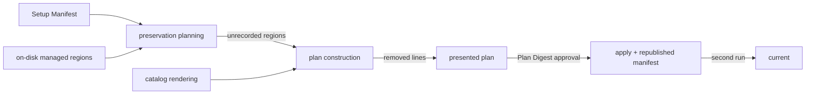

# A Baseline Command update that runs on the repositories that already exist — Technical Spec

## Executive Summary

The managed-refresh path compares each managed region's bytes against the digest
the Setup Manifest recorded on adoption day and blocks when they differ. That
comparison is correct in steady state and wrong exactly once — on the first
update of any repository whose managed regions moved before the update command
existed — and the block fires before planning, so nothing the command produces
can repair it. This design replaces the blocking comparison with a
classification: a region whose bytes differ is *unrecorded*, planning proceeds,
and the presented plan names the region and every line the refresh removes. The
trade-off accepted is that a managed region a human did edit is replaced rather
than protected; the compensations are that the plan names it before approval,
the preimage remains in the plan per ADR-0100, and the Baseline already declares
managed content Baseline-owned. Only a genuinely ambiguous target — the same
managed identity appearing twice in one file — remains blocking, because no
renderer can choose between two candidates. The same Spec restores the fourteen
structural clauses the catalog stopped emitting, which is the other measured
blocker, and seats the three Normative Clauses whose absence let the defect ship.

## Project Constraints

- Identifier strategy: not applicable — every identity this design reads
  (managed artifact id, clause id, profile id) already exists and is assigned by
  the catalog. Source: `docs/agents/domain.md`.
- Authentication and HTTP: not applicable — the Baseline Command performs local
  filesystem work with no network boundary. Source: `docs/agents/cli.md`.
- Active ADR obligations: applicable — ADR-0058 keeps retention fail-closed and
  Build Order 6 fixes the catalog rather than the gate; ADR-0100 keeps the
  managed-refresh preimage proof, which this design relies on as the preservation
  guarantee that makes classification safe; ADR-0070 stays narrowed to adoption;
  ADR-0081 governs `make baseline-digests`; ADR-0099 keeps retention accounting
  mechanical; ADR-0091 keeps the authored QA gate terminal in the Task Graph.
  ADR-0101 through ADR-0104 are introduced by this Spec. Source:
  `docs/agents/domain.md`.
- Tooling authority: applicable — protected Baseline catalog assets and three
  repo-owned authorial skills are mutated. Express maintainer authorization:
  `docs/workflow/authorizations/2026-08-07-restore-structural-clauses.md`,
  `docs/workflow/authorizations/2026-08-08-the-brain-is-a-source-not-an-archive.md`,
  `docs/workflow/authorizations/2026-08-08-evidence-from-outside-the-spec.md`,
  `docs/workflow/authorizations/2026-08-08-glossary-currency-clause.md`, and
  `docs/workflow/authorizations/2026-08-08-the-skill-ships-with-the-cli-change.md`.
  Bounded files: `internal/baseline/assets/modules/*.json`,
  `internal/baseline/assets/retention/**`,
  `internal/baseline/assets/source-baselines/baseline.standard-typescript-monorepo-0.0.1/corpus/docs/agents/secondbrain.md`,
  `internal/baseline/assets/source-baselines/baseline.standard-typescript-monorepo-0.0.1/corpus/docs/agents/spec-routing.md`,
  `internal/baseline/assets/source-baselines/baseline.standard-typescript-monorepo-0.0.1/corpus/docs/agents/domain.md`,
  `internal/baseline/assets/source-baselines/baseline.standard-typescript-monorepo-0.0.1/manifest.json`,
  `.agents/skills/write-tasks/SKILL.md`, `.agents/skills/qa-gate/SKILL.md`, and
  `.agents/skills/roundfix/SKILL.md`.
  Source: `docs/agents/agent-instructions.md`.

## System Architecture

No new package, no new command, no new flag. The change lives in three existing
seams of the Baseline Command:

- **Root preservation planning** (`internal/baseline/preservation.go`) currently
  turns a managed-region mismatch into a blocking `Finding`. It becomes the
  producer of a classification carried on the preservation plan.
- **Plan construction** (`internal/baseline/plan.go`) already holds both the
  preimage and the rendered postimage for every managed artifact on the
  managed-refresh path. It becomes the place where each unrecorded region's
  removed lines are computed, because that is the only point where both sides
  exist.
- **Command surface** (`internal/cli/baseline_update.go`,
  `internal/cli/baseline_human.go`) gains one reported block in text output and
  one optional field in the JSON result.

Two independent workstreams sit beside that spine and touch no Go code on the
refresh path: restoring the fourteen structural clauses to their owning catalog
modules, and seating three Normative Clauses with their Source Baseline entries.
They share `manifest.json` and the derived digests, so they are sequenced rather
than parallelised.



## Implementation Design

### Interfaces

```go
// UnrecordedManagedRegion is one managed region whose on-disk bytes are not
// the bytes the adopted Setup Manifest recorded. It is reported, not blocking.
type UnrecordedManagedRegion struct {
    Path      string `json:"path"`
    ManagedID string `json:"managedId"`
    // Reason is "digest-mismatch" or "marker-absent".
    Reason string `json:"reason"`
    // RemovedLines are on-disk lines the refreshed rendering does not
    // reproduce, in on-disk order, deduplicated, and truncated.
    RemovedLines []string `json:"removedLines"`
    // RemovedLinesTruncated counts lines omitted from RemovedLines.
    RemovedLinesTruncated int `json:"removedLinesTruncated,omitempty"`
}

// RootPreservationPlan gains one field; every other field is unchanged.
type RootPreservationPlan struct {
    // ...
    UnrecordedManagedRegions []UnrecordedManagedRegion `json:"unrecordedManagedRegions,omitempty"`
}
```

`managedRefreshMarkerFindings` is replaced by `classifyManagedRegions`, which
returns `([]UnrecordedManagedRegion, []Finding, error)`. It emits a `Finding`
only for a duplicated managed identity, under a new code
`baseline.preservation.managed-marker.ambiguous`; the code
`baseline.preservation.managed-marker.modified` is retired.

### Data Models

No persisted schema changes. The portable plan document gains
`unrecordedManagedRegions`, written only when `preservationMode` is
`managed-refresh`, so greenfield and preservation plan JSON — and their existing
goldens — stay byte-identical. The field participates in the Plan Digest: the
maintainer approves a digest computed over what they were shown.

`docs/agents/setup-context.json` keeps its schema. It is already rewritten by
every applied plan; this Spec asserts that behavior rather than adding it.

### API Contracts

`roundfix baseline update` keeps its flags, its states, and its exit codes. Two
observable changes:

- A repository whose only obstacle was an unrecorded managed region moves from
  `action_required` / `decision` / exit `3` to `plan_ready` / `approval` /
  exit `3`, and to `verified` / exit `0` once approved.
- The JSON result gains `unrecordedManagedRegions`, omitted when empty. The
  schema stays `roundfix/baseline-update-result/v1`: the field is additive and
  optional, so every existing consumer keeps parsing v1 documents unchanged.

Text output gains one block under the plan, listing each unrecorded region by
path and managed identity with its removed lines indented beneath, or the words
`no lines removed` when the refresh only adds.

The unresolved-profile failure keeps exit `2` and gains a message naming the
profile identity, the locations searched, and the action that restores it, in
place of the raw `lstat` error it surfaces today.

## Coverage Map

- Core Feature 1 (regions classified, not presumed damaged) →
  `classifyManagedRegions`, `UnrecordedManagedRegion`.
- Core Feature 2 (a refresh names what it removes) → removed-line computation in
  plan construction, update command text and JSON surfaces.
- Core Feature 3 (approval covers replacement) → the existing `--yes` and
  `--confirm-plan` contract with the classification inside the Plan Digest.
- Core Feature 4 (the update converges) → applied-plan Setup Manifest
  republication, convergence test.
- Core Feature 5 (structural clauses emitted again) → the owning catalog modules
  and the retention-accounting corpus.
- Core Feature 6 (an unresolved profile reports its repair) → profile resolution
  diagnosis in `ResolveManifestInput` and the update command surface.
- Core Feature 7 (the Secondbrain is a consultation source) → the consultation
  clause seated in the secondbrain module and its Source Baseline entry.
- Core Feature 8 (acceptance carries outside evidence) → the outside-evidence
  clause in the spec-workflow module and the `write-tasks` and `qa-gate` skill
  text.
- Core Feature 9 (the glossary is checked when work closes) → the
  glossary-currency clause seated in the context-workflow module.
- Goal 1, Story 1 → `classifyManagedRegions`, restored structural clauses,
  unresolved-profile diagnosis.
- Goal 2, Story 4 → applied-plan manifest republication; convergence test.
- Goal 3, Story 2, Story 3 → `UnrecordedManagedRegion`, removed-line computation,
  command surface.
- Goal 4 → structural clause restoration in the owning catalog modules.
- Goal 5, Story 7 → the outside-evidence clause and its skill text.
- Story 5 → unresolved-profile diagnosis.
- Story 6 → the Secondbrain consultation clause.

## Integration Points

None. Every boundary is the local filesystem, already mediated by
`os.OpenRoot`-anchored access in `internal/baseline`.

## Testing Approach

Existing seams only:

- `internal/baseline` filesystem-backed plan and apply tests, the seam Spec 0082
  built for managed refresh. The classification, the removed-line computation,
  and convergence attach here.
- `internal/cli` command tests for text and JSON output.
- The catalog validation and retention-accounting corpus tests for the restored
  clauses and the seated clauses.

One property is asserted that has no seam today and gets one: **convergence**. A
test builds an adopted copy, rewrites its Setup Manifest to a stale digest
without touching the managed regions, refreshes, and asserts the second plan
reports `current` with zero file changes. This is the mechanical form of the
Success Metric and the only test that can fail if manifest republication
regresses.

Each new test must be able to fail: the classification test asserts a specific
`Reason` and the specific removed line, not merely that planning succeeded; the
ambiguity test asserts the plan is not applicable and names the duplicated
managed identity.

## Build Order

1. Classify managed regions instead of blocking on them: add
   `UnrecordedManagedRegion`, replace `managedRefreshMarkerFindings` with
   `classifyManagedRegions`, keep a duplicated managed identity blocking under a
   new finding code, and carry the classification on the preservation plan.
2. Compute each unrecorded region's removed lines during plan construction and
   carry them on the portable plan document for the managed-refresh mode only,
   inside the Plan Digest (depends on: 1).
3. Report unrecorded regions and their removed lines in the update command's
   text and JSON surfaces, and update the roundfix skill's description of the
   update flow (depends on: 2).
4. Prove convergence: a filesystem test that ages a Setup Manifest, refreshes,
   and asserts the second run reports the repository current with no proposed
   change (depends on: 2).
5. Diagnose an unresolved Baseline Profile with the profile identity, the
   locations searched, and the repair action (independent of 1–4).
6. Restore the fourteen structural Normative Clauses to their owning catalog
   modules and regenerate derived pins (independent of 1–5).
7. Seat the Secondbrain consultation clause, the outside-evidence clause, and
   the glossary-currency clause with their Source Baseline entries, and
   regenerate derived pins (depends on: 6, because both edit the Source Baseline
   manifest and the derived pins).
8. State the outside-evidence obligation and the glossary check in the
   `write-tasks` and `qa-gate` skills and sync the generated copies (depends
   on: 7).
9. Measure the finished binary against every adopted repository in the
   maintainer's fleet and record the result as this Spec's outside evidence
   (depends on: 3, 5, 6).
10. Author the terminal QA gate (depends on: every non-QA leaf).

## Risks & Considerations

- **A hand-edited managed region is replaced.** Mitigated by naming it and its
  removed lines before approval, by the plan's preimage, and by the existing
  Baseline-ownership clause. Not mitigated to zero, and deliberately so: the
  alternative measured worse, blocking six of eight repositories.
- **Removed-line noise.** A large region could report many lines. Mitigated by
  deduplication, by comparing trimmed non-blank lines, and by truncation with a
  reported remainder.
- **Plan Digest churn.** Adding a field changes managed-refresh plan digests.
  No shipped digest is pinned outside this repository's own tests, and a digest
  the maintainer holds from a previous invocation is already invalidated by any
  catalog change.
- **Restoring fourteen clauses re-renders managed guides across the fleet.**
  That is the intended effect, and it is exactly what Build Order 9 measures
  before the Spec closes.
- **Build Order 6 and 7 both regenerate derived pins.** Sequencing them prevents
  the integration conflict two parallel tasks sharing one file produced in
  Spec 0083.

## Decisions

- A managed region is trusted by its marker and the plan's preimage, not by an
  adoption-day digest. See ADR-0101.
- An unrecorded managed region is refreshed and named. See ADR-0102.
- An applied refresh republishes the Setup Manifest so the update converges. See
  ADR-0103.
- A Spec accepts on evidence it did not author. See ADR-0104.
- A duplicated managed identity stays blocking, because the refresh has no
  defensible target; this is the only surviving blocking marker condition.
- The JSON result schema stays `v1` because the added field is optional and
  additive.
- Spec 0082's Task 02 Requirement 4 is superseded here; its other requirements
  and its preimage-proof design are kept intact.
