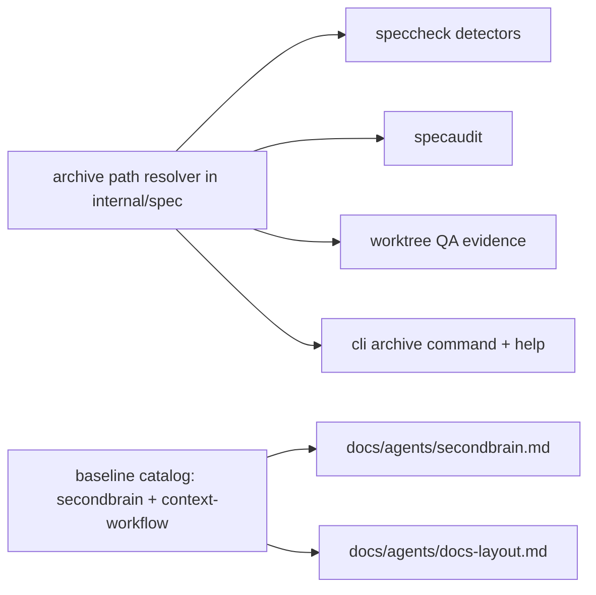

# What an Agent reads before it decides — Technical Spec

## Executive Summary

Two changes to the same surface, sharing one gate. Retired artifacts move from
per-kind trees — `docs/specs/_archived/`, `docs/findings/_archived/` — into one
`_archived/` root holding `specs/`, `findings/`, `adr/`, and `backlog/`, so an
Agent's read path holds active material and every consumer learns one path. And
the Secondbrain consultation clause loses its local-documentation exemption for
two named moments: forming a design or architecture recommendation, and
authoring an Idea, PRD, or TechSpec.

The trade-off accepted is churn against a known blast radius: `_archived`
appears 50 times in Go across five packages, two of them with hardcoded
`docs/specs/_archived` and `docs/findings/_archived` literals. The compensation
is that the literals collapse to one resolver, so the next archive kind costs a
directory rather than a code change.

**What does not change**: which artifacts are archived, and when. The Archive
Command's preconditions, the `archive-spec` contract, and the QA-pass trigger
stay exactly as they are. This Spec moves the destination, standardizes the
frontmatter, and improves file management around it.

## Project Constraints

- Identifier strategy: not applicable — Spec slugs, ADR numbers, and finding
  filenames keep the identities they carry; nothing new is minted. Source:
  `docs/agents/domain.md`.
- Authentication and HTTP: not applicable — local filesystem layout and static
  configuration, with no network surface. Source: `docs/agents/cli.md`.
- Active ADR obligations: applicable — ADR-0081 makes derived pins rewritten by
  `make baseline-digests` sanctioned fallout of an authorized catalog edit, and
  this design depends on it because every clause edit moves a manifest digest;
  ADR-0092 keeps triage intent in a typed backlog, which is where both halves
  were filed; ADR-0093 and ADR-0094 govern the citation-based consistency check
  that reads the archive paths this Spec moves, so its detectors move with them;
  ADR-0095 keeps the Secondbrain inbox the single capture door and is unaffected,
  because this Spec changes consultation and not capture; ADR-0091, ADR-0096,
  and ADR-0097 govern the authored QA gate; ADR-0104 requires an acceptance row
  on evidence this Spec did not author and holds pull request preparation until
  it is satisfied or carried forward. Source: `docs/agents/domain.md`.
- Tooling authority: applicable — Baseline catalog modules, the source-baseline
  corpus and manifest, two setup-owned guides, and the review configuration are
  mutated. Express maintainer authorization:
  `docs/workflow/authorizations/2026-08-09-what-an-agent-reads-before-it-decides.md`.
  Bounded files: `internal/baseline/assets/modules/secondbrain.json`,
  `internal/baseline/assets/modules/context-workflow.json`,
  `internal/baseline/assets/source-baselines/baseline.standard-typescript-monorepo-0.0.1/corpus/docs/agents/secondbrain.md`,
  `internal/baseline/assets/source-baselines/baseline.standard-typescript-monorepo-0.0.1/corpus/docs/agents/docs-layout.md`,
  `internal/baseline/assets/source-baselines/baseline.standard-typescript-monorepo-0.0.1/manifest.json`,
  `docs/agents/secondbrain.md`, `docs/agents/docs-layout.md`, and
  `.coderabbit.yaml`. Source: `docs/agents/agent-instructions.md`.

## System Architecture

No new package. One new seam, and it earns its place by removing five copies of
the same knowledge:

- `internal/spec` owns the archive destination today through `archivedDirName`.
  It gains the resolver that answers "where does a retired artifact of kind K
  live", and every other package asks it instead of composing its own path.
- `internal/speccheck` holds the two hardcoded literals and the detectors that
  read them. It consumes the resolver.
- `internal/specaudit`, `internal/worktree`, and `internal/cli` compose archive
  paths for audit, QA evidence, and command help. They consume the resolver.
- `internal/baseline/assets` holds the clause catalog. The consultation trigger
  and the layout guide are content edits there, rendered into the two guides.



## Implementation Design

### Interfaces

One resolver replaces five path compositions. Kinds are closed, because an open
set would let a caller invent a directory the checker never reads:

```go
// ArchiveKind names a retired artifact family under the single archive root.
type ArchiveKind string

const (
	ArchiveKindSpec    ArchiveKind = "specs"
	ArchiveKindFinding ArchiveKind = "findings"
	ArchiveKindADR     ArchiveKind = "adr"
	ArchiveKindBacklog ArchiveKind = "backlog"
)

// ArchiveDir returns the repository-relative directory holding retired
// artifacts of one kind. It is the only place the layout is expressed.
func ArchiveDir(kind ArchiveKind) string
```

### Data Models

No persisted schema. Two content contracts change.

**Frontmatter standardization.** Every archivable artifact carries the same
lifecycle keys in the same place: `status`, `created_at`, `updated_at`, and for
a retired record the pointer that replaced it. The 105 ADRs are the worst case —
31 carry frontmatter `status`, 20 carry a legacy `Status: Accepted` body line,
and 53 carry neither.

**The forward pointer.** An artifact that leaves the read path names its
replacement, and the active record that replaced it is reachable from it. Moving
history without this trades a token cost for a broken trail, which is the same
failure in the other direction.

### API Contracts

`roundfix archive` writes to `_archived/specs/<slug>/` instead of
`docs/specs/_archived/<slug>/`. Its preconditions, its refusals, and its
`qa_override` behavior are unchanged.

`roundfix spec check` reads retired Specs and findings from the new root. Its
codes, severities, and fix strings are unchanged apart from the paths they name.

`roundfix baseline` renders the two edited guides. It is also this Spec's own
proving surface: the maintainer asked that the Baseline Command be run against
this repository to see the result of the catalog edits and to exercise the
update path, so the QA gate carries that as a row rather than as a note.

### Consultation

Consulted while this design was formed, as the Normative Clause requires — and
as the clause this Spec strengthens would have required earlier.

`wiki/concepts/arquitetura-de-instrucoes-e-progressive-disclosure.md` supplies
both halves of the argument. It treats agent instructions as a context
architecture rather than a store of every known rule, and it raises the stakes
past token cost: "documentação stale é mais perigosa para agentes do que para
humanos porque o agente pode tratá-la como instrução atual." A superseded record
left in the read path is not merely paid for — it can be obeyed. That is why a
lifecycle marker is not a substitute for a move.

The same page answers the objection that moving history hides it: "o objetivo
não é esconder conhecimento. É tornar o próximo documento descobrível quando
necessário, sem fazê-lo pagar tokens em todas as tarefas." That sentence is what
turns the forward pointer from a nicety into a requirement, and it is the test
this Spec must pass.

Its maintenance rule — ask before adding a line to the global contract — is why
the consultation clause becomes unconditional at two named moments rather than
always. A rule that fires on every task becomes background noise; one that fires
where decisions are formed stays enforceable.

## Coverage Map

- Goal 1 (one archive root) → `ArchiveKind` and `ArchiveDir` in `internal/spec`,
  consumed by speccheck, specaudit, worktree, and cli.
- Goal 2 (retired material leaves the read path, stays reachable) → the move
  itself plus the forward-pointer contract.
- Goal 3 (one review filter) → the `.coderabbit.yaml` path filter.
- Goal 4 (unconditional consultation) → the `secondbrain` and
  `context-workflow` clause edits, rendered into `docs/agents/secondbrain.md`.
- Goal 5 (one lifecycle format) → frontmatter standardization across the ADR
  corpus.

## Integration Points

CodeRabbit, through `.coderabbit.yaml` path filters — one exclusion replaces one
per tree. No other external system is touched.

## Testing Approach

Existing seams. `internal/speccheck` has a corpus golden that pins active-corpus
finding counts and reports archived ones; `internal/spec` and `internal/cli`
have archive tests; the Baseline contract tests already assert that an owned
edit leaves derived artifacts byte-identical.

- **Characterization first.** Pin today's paths and counts before moving them:
  the archive destination each package composes, the corpus golden's active
  counts, and the current conditional consultation clause text.
- **Unit.** `ArchiveDir` returns the expected directory per kind; no caller
  composes an archive path without it, asserted by a grep-style test over the
  packages that used to.
- **Migration.** Every artifact that lived under a per-kind `_archived/` is
  reachable under the new root, and no artifact is lost — asserted by count and
  by name, not by spot check.
- **Contract.** The rendered `docs/agents/secondbrain.md` states the
  unconditional trigger; the rendered `docs/agents/docs-layout.md` states the
  new root. Both are checked against the catalog, which is what
  `make baseline-digests` already enforces.

Any Task that removes or renames a test re-records
`docs/references/coverage-record.json` in its own commit. Clear the gate's own
cache with `GOCACHE="$PWD/.gocache" go clean -testcache`.

## Build Order

1. Characterization corpus for archive paths, corpus-golden counts, and the
   current consultation clause — tests only, no behavior change.
2. The archive path resolver in `internal/spec`, with every kind it must answer
   for and no caller yet using it (depends on: 1).
3. Consumers move to the resolver — speccheck, specaudit, worktree, cli — with
   the two hardcoded literals deleted (depends on: 2).
4. The artifacts move: existing archived Specs and findings relocate under the
   single root, and the corpus golden is re-recorded deliberately with its
   reason (depends on: 3).
5. Frontmatter standardization across the ADR corpus, including the forward
   pointer on every retired record (depends on: 4).
6. The consultation clause becomes unconditional at the two named moments, in
   the catalog and its corpus, followed by `make baseline-digests` (depends
   on: 1).
7. `.coderabbit.yaml` excludes the single archive root and drops the per-tree
   filters (depends on: 4).
8. Authored QA gate — terminal `qa` Task per ADR-0091, whose matrix includes
   running `roundfix baseline` against this repository to observe the catalog
   edits and exercise the update path (depends on: 5, 6, 7).

## Risks & Considerations

- **A move that loses an artifact is silent.** Git preserves history, but a
  missed file simply stops being read. The migration Task asserts by count and
  name rather than by inspection.
- **The corpus golden will move.** Relocating archived Specs changes what the
  checker scans. That is an intentional detector-input change and its
  re-recording carries a stated reason, which is exactly the case the golden's
  own note describes.
- **Frontmatter standardization touches 74 ADRs.** Large, mechanical, and easy
  to do wrong in bulk; it stays its own Task so its diff is reviewable as one
  thing.
- **The consultation clause could become noise.** Firing on every task would
  train agents to skip it. Binding it to design formation and to Idea, PRD, and
  TechSpec authoring keeps it where a wrong decision is expensive.
- **This Spec changes the rules the next Spec is authored under.** Spec 0089 was
  authored before the clause tightened and consulted the Secondbrain anyway;
  anything authored after this lands under the stricter rule.

## Decisions

- History moves out of the read path rather than being marked in place, because
  stale documentation can be obeyed by an agent and a marker only helps a reader
  who notices it. See Consultation.
- Nothing is deleted: 101 of 105 ADRs are cited by Specs required to stay
  byte-identical.
- Archive kinds are a closed set, so no caller invents a directory the checker
  never reads.
- What is archived and when does not change — only where it lands, how its
  frontmatter reads, and how it is managed.
- The Baseline Command run against this repository is a QA row, not a note,
  because it is the only check that exercises the update path the catalog edits
  depend on.
