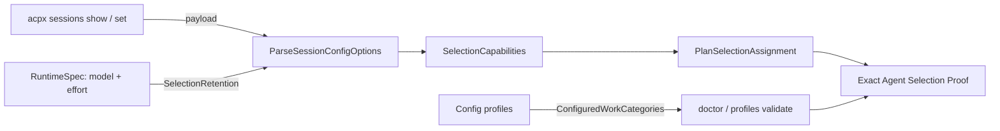

# A third ACP Runtime that can actually run — Technical Spec

## Executive Summary

Three independent defects keep every Roundfix Run off the `opencode` ACP
Runtime, and each one hides the next. The capability projection refuses an
advertised select option above 64 values and discards the whole option, so a
417-model catalog produces no model state; a reasoning effort cannot be applied
to an OpenCode session before its first prompt, so the config set that a
token-free proof issues answers ACP `-32602`; and profile readiness resolves
only the five required Agent Work Categories, so the configured profile that
would have shown all of this reported `ok`.

The design fixes each at its own layer. The projection keeps bounding what it
retains rather than what a runtime may advertise, which preserves the fail-closed
property by making retention reference-driven instead of position-driven.
`opencode` becomes a model-managed reasoning runtime, refused at configuration
and at runtime validation with the empty value named as the repair. Readiness
resolves every Agent Work Category the effective configuration defines.

The trade-off accepted is explicit: Roundfix gives up reasoning-effort control on
`opencode` rather than weaken Exact Agent Selection Proof or spend tokens to
raise a queue owner before proving. `CONTEXT.md` defines that proof as
token-free and as applying the exact model and reasoning assignment; on this
runtime those two requirements cannot both hold for a non-empty effort, and the
glossary already blesses an empty effort as valid model-managed state.

## Project Constraints

- Identifier strategy: not applicable — no new entity or resource identity is
  introduced. Agent Selection tuples, Agent Work Category keys, and ACP config
  option ids are assigned by existing contracts or by the adapter. Source:
  `docs/agents/domain.md`.
- Authentication and HTTP: not applicable — the ACP Runtime boundary is local
  stdio through acpx; this design adds no network surface and no HTTP contract.
  Source: `docs/agents/cli.md`.
- Active ADR obligations: applicable — ADR-0050 keeps Fallback Chains inactive
  until after Run creation, so Preflight still proves every configured tuple and
  substitutes none, which this design preserves; ADR-0069 pins Baseline semantic
  analysis to a Codex-only retry pair behind Exact Agent Selection Proof and is
  unaffected, because the retention rule never narrows an option below the bound
  and the model-managed refusal is scoped to the `opencode` runtime; ADR-0081
  makes the copies and digests rewritten by `make skills-sync` sanctioned
  fallout of the authorized skill edit; ADR-0091 keeps the authored QA
  gate a terminal node of the Task Graph, ADR-0096 keeps it proving machine facts
  before spending an Agent turn, and ADR-0097 governs row carry-forward; ADR-0104
  requires at least one acceptance row to rest on evidence this Spec did not
  author, satisfied by the adopted measurement under `references/`. New decisions
  land as ADR-0105, ADR-0106, and ADR-0107. Source: `docs/agents/domain.md`.
- Tooling authority: applicable — the roundfix skill and this repository's
  Roundfix configuration are mutated. Express maintainer authorization:
  `docs/workflow/authorizations/2026-08-08-the-third-runtime-gets-a-profile-and-a-skill-entry.md`.
  Bounded files: `.agents/skills/roundfix/SKILL.md` and `.roundfixrc.yml`.
  Source: `docs/agents/agent-instructions.md`.

## System Architecture

No new package, layer, or seam. Every change lands in a module that already owns
the concern:

- `internal/agent/selection_capabilities.go` owns the bounded projection of an
  ACP `configOptions` response. It gains a retention parameter and loses its
  size-as-malformation rule.
- `internal/agent/acpx_runner.go` owns the mapping from an ACP Runtime to its
  reasoning-effort config key. It stops mapping `opencode`, which makes
  `validateRuntimeSelection` reject a non-empty effort on that runtime for every
  entry point, including an invocation override.
- `internal/agent/selection_assignment.go` owns selection encodings. It gains
  `runtime_managed` beside `model_managed`, because the two differ in what the
  adapter may advertise: `model_managed` requires the absence of a reasoning
  option, while OpenCode advertises a per-model `effort` option Roundfix
  deliberately never assigns. Without the distinction an empty-effort OpenCode
  selection plans and then fails its own effective-state check. Discovered
  during Task 03 against the measured payload; see ADR-0106.
- `internal/config/profiles.go` owns Agent Selection normalization. It gains the
  same refusal earlier, where the maintainer can act on it.
- `internal/config/profiles.go` also gains the resolver for configured Agent Work
  Categories; `internal/cli/doctor.go` and `internal/cli/profiles_validate.go`
  consume it.



## Implementation Design

### Interfaces

Retention is named by the Agent Selection being proven, so both parse entry
points take it and neither infers it:

```go
// SelectionRetention names the advertised values a capability projection must
// keep when an option advertises more values than Roundfix retains.
type SelectionRetention struct {
	Model           string
	ReasoningEffort string
}

func ParseSessionConfigOptions(
	payload []byte, adapter AdapterEvidence, retention SelectionRetention,
) (SelectionCapabilities, error)

func ParseSessionCapabilitySnapshot(
	payload []byte, adapter AdapterEvidence, retention SelectionRetention,
) (SelectionCapabilities, error)
```

`SelectCapability` records what it dropped, so a diagnostic can say `417
advertised, 64 retained` instead of implying the adapter offers 64:

```go
type SelectCapability struct {
	ID              string
	CurrentValue    string
	Values          []string
	AdvertisedCount int
}
```

Configured-category resolution is a pure function over effective profiles:

```go
// ConfiguredWorkCategories returns every required Agent Work Category plus each
// optional category the effective configuration defines. A category that only
// inherits general is absent, because it contributes no distinct tuple.
func ConfiguredWorkCategories(config Config) []WorkCategory
```

### Data Models

No persisted schema changes. Three bounds move, and one is new:

| constant | today | after | reason |
| --- | --- | --- | --- |
| `maxCapabilityValues` → `maxRetainedCapabilityValues` | 64, refusal threshold | 64, retention bound | size stops meaning malformation |
| `maxAdvertisedCapabilityValues` | — | 4096 | keeps a real fail-closed ceiling and keeps `too_many_option_values` meaningful |
| `maxCapabilityResponseBytes` | 65,536 | 1,048,576 | measured payload is 50,590 bytes at 417 models, 77% of today's limit |

Retention rule, applied only when an option advertises more than
`maxRetainedCapabilityValues` values — at or below it every value is kept and
behavior is byte-identical to today:

1. Keep the option's `currentValue`.
2. Keep every value that binds to `retention.Model` or equals
   `retention.ReasoningEffort`, where binding matches an exact advertised value
   or a value whose canonical prefix before a trailing `[effort]` suffix equals
   the requested model. This is the same rule `modelsForCanonical` applies, so
   retention never drops a value planning would have bound.
3. Fill the remainder in advertised order up to the bound, for diagnostics.

### API Contracts

Two observable CLI changes, both on existing commands.

`roundfix doctor` — the `profiles:` detail counts every configured category's
tuples, and the `adapter:` line enumerates the ACP Runtimes those tuples
reference. A failing optional-category profile now fails the check instead of
reporting `ok`.

Configuration validation — a non-empty `reasoning_effort` on `runtime: opencode`
is rejected at load with the repair named:

```
profiles.data.preferred.reasoning_effort must be empty for runtime "opencode";
OpenCode advertises reasoning effort per model and only after an Agent Session's
first prompt, so Roundfix cannot apply one during a token-free Exact Agent
Selection Proof; use reasoning_effort: "" for model-managed reasoning
```

The same refusal reaches `--reasoning-effort` invocation overrides through
`validateRuntimeSelection`, so no entry point bypasses it.

## Coverage Map

- Goal 1 (an `opencode` selection passes proof) → relevance-bounded retention in
  `ParseSessionConfigOptions`/`ParseSessionCapabilitySnapshot`; model-managed
  reasoning in `acpxReasoningEffortConfigKey`.
- Goal 2 (a real Run on `opencode-go`) → the `.roundfixrc.yml` profile plus the
  authored QA gate row that executes it.
- Goal 3 (readiness never reports `ok` over a failing profile) →
  `ConfiguredWorkCategories`, consumed by `doctorProfileReadinessResult` and
  `doctorAdapterRuntimes`.
- Goal 4 (an unusable effort is explained) → `normalizeSelection` refusal and
  `validateRuntimeSelection` refusal.

## Integration Points

Only one external system: the OpenCode ACP adapter reached through `opencode`,
launched by acpx. The boundary pattern is unchanged — Roundfix speaks acpx's
public strict-JSON command surface and opens no runtime-private persistence. The
per-invocation transient agent process documented in the adopted measurement is
an acpx and OpenCode behavior this design accommodates rather than depends on: if
a future acpx applies `--model` to config-set invocations, the model-managed
refusal becomes conservative rather than wrong, and ADR-0106 can be revisited on
new measurement.

## Testing Approach

Existing seams only. `internal/agent` tests exercise the projection and the
assignment planner as pure functions over recorded payloads; `internal/cli` tests
drive `doctor` and `profiles validate` through their command entry points with a
stubbed runner; `internal/config` tests drive profile decoding.

- **Characterization first.** Before any behavior moves, record today's behavior
  as tests: the codex and claude advertised sets project unchanged, an option
  above the bound currently fails with `too_many_option_values`, and `doctor`
  reports required-category scope. These become the regression floor and make
  every intended break visible as a declared edit.
- **Unit.** Retention keeps a requested model that sits past the bound; retention
  keeps a bracketed variant when the canonical model is requested; an unadvertised
  model still produces `SelectionUnsupportedError` and never
  `capability_evidence_invalid`; an option above `maxAdvertisedCapabilityValues`
  still fails closed; `ConfiguredWorkCategories` omits inherited categories.
- **Command-level.** `doctor` fails when a configured optional-category profile
  fails; the `adapter:` line names `opencode` when a profile selects it; config
  load rejects a non-empty `opencode` effort with the repair text.
- **Fixture.** The adopted measurement supplies a real 417-value `configOptions`
  payload shape; the fixture reproduces its structure at reduced size, and one
  test asserts the retained-versus-advertised counts.

Any task that removes or renames a test re-records
`docs/references/coverage-record.json` with
`go test ./internal/spec -run '^TestCoverageEquivalence$' -update-coverage-record`
**in its own commit**, because a retired test the record still names reads as a
regression.

Clear the cache the gate actually uses before trusting it:
`GOCACHE="$PWD/.gocache" go clean -testcache`. The Makefile exports
`GOCACHE ?= $(CURDIR)/.gocache`, so a bare `go clean -testcache` clears the
user-level cache and leaves the gate's cache untouched. Measured on 2026-08-08
during Task 03 of this Spec: `make verify` reported exit 0 with
`ok roundfix/internal/spec (cached)` over a real coverage regression. Filed as
`docs/backlog/2026-08-08-go-clean-testcache-clears-a-cache-the-gate-does-not-use.md`.

## Build Order

1. Characterization corpus for the capability projection, the assignment planner,
   and profile readiness scope — tests only, no behavior change.
2. Relevance-bounded capability retention: retention parameter, retention rule,
   `AdvertisedCount`, the three bounds (depends on: 1).
3. OpenCode model-managed reasoning: drop `opencode` from
   `acpxReasoningEffortConfigKey`, refuse a non-empty effort in
   `normalizeSelection` and on the legacy runtime-defaults path (depends on: 1).
4. Readiness over configured Agent Work Categories: `ConfiguredWorkCategories`,
   `doctor` profile and adapter scope, `profiles validate` default scope
   (depends on: 1).
5. The opencode route in this repository: one Agent Work Category selecting
   `runtime: opencode` with model-managed reasoning in `.roundfixrc.yml`, with the
   comment recording why the effort is empty (depends on: 2, 3, 4).
6. Roundfix skill synchronization for the two changed CLI behaviors, followed by
   `make skills-sync` (depends on: 2, 3, 4).
7. Durable knowledge upstream: the measured OpenCode adapter facts move into
   `docs/references/model-selection.md`, and the glossary is checked for a
   vocabulary gap (depends on: 2, 3).
8. Authored QA gate — terminal `qa` Task per ADR-0091, whose matrix includes a
   real Roundfix Run executing a Task on an `opencode-go` model, with captured
   evidence (depends on: 5, 6, 7).

## Risks & Considerations

- **The raised byte ceiling is a bound, not a guarantee.** `sessions show`
  returns the whole session record, including `messages` and `eventLog`, so a long
  Run's payload grows independently of catalog size. The measured 50,590 bytes is
  a session-start figure. 1 MiB buys roughly twenty times today's headroom; if it
  is ever hit, the correct repair is a narrower capability read, not a larger
  number. `AdvertisedCount` exists partly so that failure is diagnosable.
- **Model-managed reasoning is a real capability loss.** OpenCode models start at
  their own defaults — `kimi-k3` at `max`, `qwen3.8-max` at `high`,
  `minimax-m3` at `none`. A category routed to `opencode` accepts whatever the
  model defaults to. This is recorded in ADR-0106 and is revisitable on new
  adapter behavior.
- **Retention makes proof depend on the requested selection.** A projection is no
  longer a pure function of the payload alone. The mitigation is that retention
  only narrows what is kept, never what binding accepts: below the bound nothing
  is dropped, and above it the requested value is kept by construction.
- **The commit choreography is easy to get wrong.** The authorization record and
  any prerequisite fix land before the authorized Task commit; a consequent fix
  lands after. Coverage re-recording belongs to the commit that changed the tests.
- **This Spec is implemented by hand.** No Roundfix Run can execute its Task
  Graph while `opencode` is the only runtime with quota and is the thing being
  repaired. Task evidence is captured the same way, but the Daemon settlement
  path is not exercised.

## Decisions

- A capability projection bounds what it retains, not what a runtime advertises.
  See ADR-0105.
- OpenCode reasoning effort is managed by the model, refused when non-empty. See
  ADR-0106.
- An empty reasoning effort has two proof meanings, kept apart as two encodings:
  `model_managed` proves only against an adapter advertising no reasoning
  control, and `runtime_managed` proves against a runtime whose advertised
  control Roundfix declines to assign. Collapsing them would have weakened the
  Codex and Claude proof to admit an unassigned reasoning option.
- Profile readiness covers every configured Agent Work Category; inherited
  categories add no tuple and are not enumerated. See ADR-0107.
- The retention bound stays at 64 values, and a separate absolute ceiling of 4096
  keeps `too_many_option_values` meaningful rather than dead.
- The interactive picker and TUI keep offering nothing for `opencode`. Offering
  417 adapter-enumerated models needs a repository-configured allowlist, which was
  considered and deferred out of this Spec.
