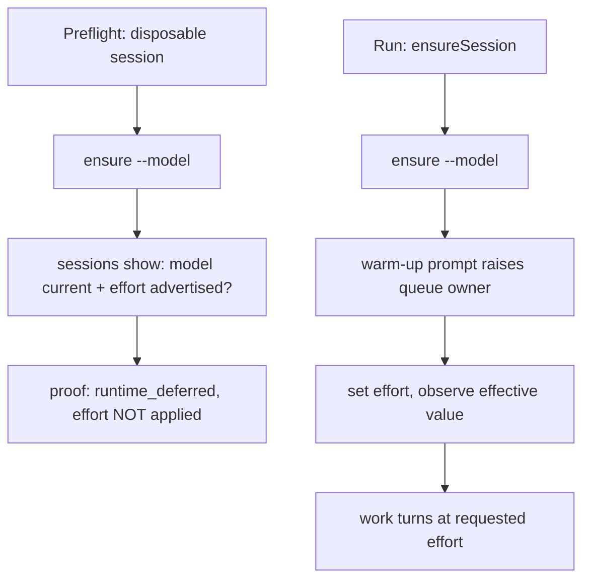

# An effort the runtime actually receives — Technical Spec

## Executive Summary

The OpenCode `effort` config option exists only once a queue-owner agent process
holds the selected model, and acpx raises that owner on the session's first
prompt. Spec 0088 met that constraint by refusing the effort outright, which
keeps Exact Agent Selection Proof token-free at the price of always inheriting
the model's opening level — the bottom of the range for three of four
candidates.

This design pays a round trip instead. After ensuring the Agent Session with its
model, Roundfix sends one minimal warm-up prompt, applies the requested effort,
observes the effective value, and only then sends work. The proof splits in two
and each half states what it saw: Preflight stays token-free and proves the model
current and the effort *advertised*; the Run proves the effort *applied*.

The trade-off accepted is that Preflight no longer observes an applied
assignment for this runtime, so a Run can still fail on an effort that Preflight
accepted — an adapter could advertise a value it refuses. That is why the split
gets its own encoding rather than reusing `independent`: a readiness surface
must never report an assignment it did not make. The compensation is that the
failure moves from silent (running at `low` while the profile says `high`) to
loud (a Run that stops before its first work turn).

## Project Constraints

- Identifier strategy: not applicable — no new entity or resource identity is
  introduced; ACP config option ids and effort values are assigned by the
  adapter. Source: `docs/agents/domain.md`.
- Authentication and HTTP: not applicable — the ACP Runtime boundary is local
  stdio through acpx; no network surface and no HTTP contract is added. Source:
  `docs/agents/cli.md`.
- Active ADR obligations: applicable — ADR-0108 is the decision this design
  implements and supersedes ADR-0106, which stays superseded rather than edited
  away; ADR-0081 makes the copies and digests rewritten by `make skills-sync`
  sanctioned fallout of the authorized skill edit rather than separate targets;
  ADR-0105 keeps capability retention relevance-bounded and is relied on
  unchanged, because the retained `effort` values are what Preflight checks
  against; ADR-0107 keeps readiness over every configured category; ADR-0050
  keeps Fallback Chains inactive until after Run creation; ADR-0091, ADR-0096,
  and ADR-0097 govern the authored QA gate; ADR-0104 requires an acceptance row
  on evidence this Spec did not author and now holds pull request preparation
  until it is satisfied or carried forward. Source: `docs/agents/domain.md`.
- Tooling authority: applicable — the roundfix skill and this repository's
  Roundfix configuration are mutated. Express maintainer authorization:
  `docs/workflow/authorizations/2026-08-09-an-effort-the-opencode-runtime-actually-receives.md`.
  Bounded files: `.agents/skills/roundfix/SKILL.md` and `.roundfixrc.yml`.
  Source: `docs/agents/agent-instructions.md`.

## System Architecture

No new package or seam. Three existing modules change, and one of them is where
Spec 0088 put the refusal being removed:

- `internal/config/profiles.go` owns Agent Selection normalization. Its
  `runtimesManagingReasoning` refusal is deleted; a non-empty effort on
  `opencode` becomes valid configuration again.
- `internal/agent/acpx_runner.go` owns the runtime-to-config-key mapping and the
  session lifecycle. `acpxReasoningEffortConfigKey` maps `opencode` back to the
  generic `effort` key, and `ensureSession` gains the warm-up step before
  applying the effort.
- `internal/agent/selection_assignment.go` owns encodings and planning. It gains
  `runtime_deferred` and the rule that selects it.



## Implementation Design

### Interfaces

The encoding set gains one member, and its meaning is the difference between
what was seen and what was done:

```go
const (
	SelectionEncodingIndependent  = "independent"     // applied and observed, token-free
	SelectionEncodingModelVariant = "model_variant"
	SelectionEncodingModelManaged = "model_managed"   // empty effort, no control advertised
	SelectionEncodingRuntimeManaged = "runtime_managed" // empty effort, control declined
	// SelectionEncodingRuntimeDeferred is a non-empty effort on a runtime that
	// cannot accept one before its session's first prompt: Preflight proves it
	// advertised, the Run proves it applied. See ADR-0108.
	SelectionEncodingRuntimeDeferred = "runtime_deferred"
)
```

The warm-up is one bounded, idempotent step on the existing session lifecycle,
and it publishes what it observed rather than only checking it:

```go
// warmSessionForDeferredEffort raises the adapter's queue-owner process so a
// reasoning effort can be applied, then applies it, observes the effective
// value, and publishes that observation as a Run Event. It runs at most once
// per Agent Session, before any work turn, and is a no-op on a session already
// warmed.
func (runner *ACPXRunner) warmSessionForDeferredEffort(
	ctx context.Context, req ExecuteRequest, assignment SelectionAssignment,
	sink runevent.Sink,
) (SelectionProof, error)
```

Publishing is not decoration. A transcript records what an Agent said; a receipt
records what the system executed. Without the event, the only evidence the
effort reached the runtime lives in memory for the length of one call, and a
later reader auditing why a Run behaved as it did has nothing to read.

### Data Models

No persisted schema change. One behavioral bound is new: the warm-up prompt is a
constant, minimal, and must not read as an instruction the Agent could act on.
It is sent once per session and its turn is not a work turn.

### API Contracts

Two observable CLI changes.

`roundfix profiles validate` and `roundfix doctor` report
`encoding: runtime_deferred` for an `opencode` selection carrying a non-empty
effort, and their proof states the effort as advertised rather than applied.

Configuration stops refusing. The error Spec 0088 added —
`reasoning_effort must be empty for runtime "opencode"` — is removed. An effort
the selected model does not advertise now fails at proof with
`SelectionUnsupportedError`, naming the advertised values.

### Consultation

The Secondbrain was consulted while this design was formed, as the Normative
Clause Spec 0084 seated requires. Three of its concepts bear on it directly.

`wiki/concepts/agent-harnesses.md` frames the defect: "Your agent didn't fail.
Your harness did." A maintainer selecting a model on its published score while
the harness silently delivers the floor of its range is a harness failure, and
naming it that way is what makes the round trip worth paying. The same page's
**Silent Success > Crash** section describes today's behavior exactly — an
interface that looks normal while the state underneath is wrong, so the next
turn operates on a broken premise and produces coherent, wrong work. This design
converts a silent success into a crash with a clear boundary, before the first
work turn.

Its production contract supplied the correction this design needed. **Own the
state**: the effective effort has one owner, the session's config state, and one
replay path. **Order the mutation**: ensure, warm, apply, observe, work — in that
order, and the ordering is the fix. **Prove the action**: "transcript is not
proof; the receipt says what the system permitted, attempted, and executed."
The first draft observed the applied effort in memory and moved on, which is a
transcript. It now publishes the observation as a Run Event, which is a receipt.

`wiki/concepts/custos-e-limites-de-agentes-de-codigo.md` separates **asset** from
**throughput** work and warns that reasoning level is inherited invisibly,
multiplying cost without the operator noticing. Effort here stays per Agent
Selection and therefore per Agent Work Category, so a maintainer can spend on
the categories that produce reusable assets without paying the same rate for
disposable throughput. That page also holds the cost argument for this Spec:
"the cost of a gate that lies includes hours of wrong execution and contaminated
runs," and saving by removing the check is a false economy.

## Coverage Map

- Goal 1 (a configured effort reaches the Agent) → warm-up step in
  `ensureSession`; refusal removal in `normalizeSelection`.
- Goal 2 (Preflight stays token-free and honest) → `runtime_deferred` encoding
  and the advertised-value check in `PlanSelectionAssignment`.
- Goal 3 (every work turn at the requested effort, including the first) → the
  warm-up ordering: effort applied before the first work prompt.
- Goal 4 (an unadvertised effort fails closed before a Run) →
  `SelectionUnsupportedError` from the advertised-value check.
- Goal 5 (Codex and Claude unchanged) → the encoding is selected only for
  runtimes that defer; every other path keeps `independent`.

## Integration Points

One external system: the OpenCode ACP adapter through acpx. The boundary stays
acpx's public strict-JSON command surface. The warm-up depends on one measured
acpx behavior — that a prompt raises a queue owner that later `set` invocations
reach — and a Task must re-measure it rather than trust this document, because
it is adapter behavior and not a published contract.

## Testing Approach

Existing seams. `internal/agent` tests exercise planning and encoding as pure
functions over recorded payloads and drive the session lifecycle through the
fake acpx command runner; `internal/config` tests drive profile decoding;
`internal/cli` tests drive `doctor` and `profiles validate`.

- **Characterization first.** Record today's behavior before moving it: config
  refuses a non-empty `opencode` effort, `acpxReasoningEffortConfigKey` returns
  `ModelManagedReasoningError`, an empty effort plans `runtime_managed`, and a
  Run issues no reasoning config set. These become the declared breaks.
- **Unit.** A non-empty `opencode` effort plans `runtime_deferred` when the
  value is advertised, and produces `SelectionUnsupportedError` when it is not;
  Codex and Claude still plan `independent`; an empty effort still plans
  `runtime_managed`.
- **Lifecycle.** The recorded acpx command sequence for an `opencode` Run is
  ensure, warm-up prompt, `set effort`, then the work prompt — asserted in that
  order, because the ordering *is* the fix.
- **Command-level.** `profiles validate --json` reports
  `encoding: runtime_deferred`; configuration with a non-empty `opencode` effort
  loads.

Any Task that removes or renames a test re-records
`docs/references/coverage-record.json` with
`go test ./internal/spec -run '^TestCoverageEquivalence$' -update-coverage-record`
in its own commit. Clear the gate's own cache before trusting it:
`GOCACHE="$PWD/.gocache" go clean -testcache`, because the Makefile exports
`GOCACHE ?= $(CURDIR)/.gocache` and a bare `go clean -testcache` clears a
different one.

## Build Order

1. Characterization corpus for the refusal, the key mapping, the encodings, and
   the Run's command sequence — tests only, no behavior change.
2. Encoding and planning: add `runtime_deferred`, select it for a non-empty
   effort on a deferring runtime, and fail closed on an unadvertised value
   (depends on: 1).
3. Configuration and key mapping: remove the refusal, restore `opencode` to the
   generic effort key (depends on: 2).
4. Session warm-up: raise the queue owner, apply the effort, observe the
   effective value, publish it as a Run Event receipt, and assert the command
   ordering. Idempotent per Agent Session (depends on: 3).
5. The proving profile in `.roundfixrc.yml`:
   `openrouter/deepseek/deepseek-v4-pro` at `xhigh` (depends on: 4).
6. Roundfix skill synchronization for the removed refusal and the new contract,
   followed by `make skills-sync` (depends on: 4).
7. Durable knowledge upstream: `docs/references/model-selection.md` records that
   the runtime hands back the floor of each range and what Roundfix now does
   about it (depends on: 4).
8. Authored QA gate — terminal `qa` Task per ADR-0091, whose matrix includes a
   real Run on `deepseek-v4-pro` at `xhigh` with the applied effort observed in
   captured evidence (depends on: 5, 6, 7).

## Risks & Considerations

- **The warm-up pollutes session history.** Its exchange sits in the Agent's
  context before the real task. The mitigation is a constant, minimal prompt
  that reads as setup rather than instruction; the Task should record the exact
  bytes so a reviewer can judge them.
- **Preflight accepts what a Run may still refuse.** An adapter can advertise a
  value it rejects. The encoding names this honestly and the Run fails before
  its first work turn, which is why the split is not a silent weakening.
- **The queue owner's lifetime is measured, not contracted.** acpx documents a
  TTL; if an owner dies mid-Run the effort could silently revert. A Task should
  determine whether the applied effort survives the owner's restart, and record
  the answer even if the design does not change.
- **One more round trip per Agent Session.** Bounded and paid once per session,
  and it moves the system-prompt cache write rather than adding it — but a Run
  with many short sessions pays it many times. Effort stays per Agent Work
  Category, so a maintainer can pay it where the output is reused and not where
  it is discarded.
- **ADR-0106 stays superseded, not deleted.** Spec 0088 is archived and its
  bytes must not move.

## Decisions

- Roundfix warms the session rather than applying the effort after the first
  real prompt: the opening turn decides most of a Batch and would otherwise be
  the only turn at the floor. See ADR-0108.
- The split proof gets its own encoding rather than reusing `independent`,
  because a readiness surface must not report an assignment it did not make.
- The proving profile uses `deepseek-v4-pro` at `xhigh` — the model's own
  maximum and the benchmarked variant — chosen by the maintainer over
  `grok-4.5` at `high`.
- The applied effort is published as a Run Event rather than only observed in
  memory, because a transcript is not proof of an action. Added after consulting
  the Secondbrain; see Consultation.
