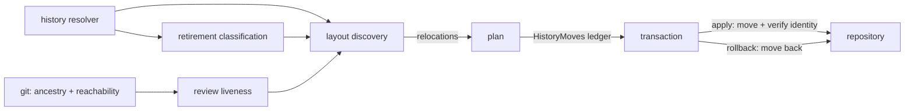

# One history root under `docs/` — Technical Spec

## Vocabulary Contract

- emits: `internal/baseline/plan.go`
  pattern: `historyMoves|HistoryMove|HistoryRelocation`
  documented-in: `CONTEXT.md`

`History Relocation` is this Spec's coined term: one retired file that belongs
under the history root and is not there. It reaches a maintainer reading a plan
report, and it reaches any later tool parsing `historyMoves` out of a plan
document, so it needs a durable glossary owner rather than a definition that
lives only here. Declaring it makes `SC-VOCABULARY-UNDOCUMENTED` run instead of
skip, so shipping the token without that owner fails mechanically.

## Executive Summary

The history root is one resolver returning repository-relative literals, and every
consumer already reads it rather than a path of its own, so relocating the root is
a change to that function plus the bytes it points at. Two things are not small.
The fleet migration means the Baseline learns a second mutation shape — relocating
files whose content it does not render — which enters the Plan as its own ordered
ledger of source, destination, and content identity, carrying no bytes, so it
inherits the existing transaction's rollback and verification without putting a
growing history tree inside a serialized plan. And Review Artifacts, joining as a
fifth retired family, are the only family whose retirement is not a property of the
file: a Spec is retired when it archives and a decision when its status says so,
while a review is retired when its Pull Request is finished — a fact that lives
outside the repository. This design refuses to read it from there, deciding on
local Git reachability instead, and accepts that the answer can lag: an undecidable
head stays live. The primary trade-off is a second mutation kind inside a plan
contract that already carries one, taken over a plan whose size would grow with the
history it moves. Two smaller ones: retirement classification reads the decision
lifecycle field for a question that field was not written to answer, so this Spec
narrows it; and the review liveness check is deliberately less accurate than the
provider it refuses to call.

## Project Constraints

- Identifier strategy: applicable — the glossary owns the Archive Command and the
  archived spec root, and this design changes what the second resolves to. New
  components are named in glossary vocabulary, and the closing Task checks whether
  the glossary carries a term for the relocation ledger. Source:
  `docs/agents/domain.md`.
- Authentication and HTTP: not applicable — no network boundary, credential, or
  request is created or read; this design touches a resolver, a plan ledger, a
  filesystem move, and documentation carriers. Source:
  `docs/agents/specific-repository.md`.
- Active ADR obligations: applicable — ADR-0120 fixes the archive root and states
  what it supersedes; ADR-0121 makes an archive move a ledger of identities rather
  than of content; ADR-0122 narrows retirement to `rejected`, `deprecated`, and
  `superseded`. ADR-0081 makes derived pins regenerated by the sanctioned
  regeneration command deterministic fallout of the expressly authorized edit,
  needing no separate per-Spec authorization. ADR-0093 and ADR-0094 govern the citation-based
  consistency check whose detectors read the relocated paths, so those detectors
  must keep resolving. ADR-0104 obliges one acceptance row on evidence this Spec
  did not author. Source: `docs/agents/domain.md`.
- Tooling authority: applicable — Baseline catalog modules, the source-baseline
  corpus and manifest, a setup-owned guide, seven Roundfix-owned skills, and two
  repository configuration files are mutated. Express maintainer authorization:
  `docs/workflow/authorizations/2026-08-12-the-archive-root-under-docs.md`,
  granted 2026-08-12. Bounded files: `internal/spec/archive.go`,
  `internal/spec/archive_layout_characterization_test.go`,
  `internal/spec/archive_test.go`,
  `internal/docscontract/testdata/corpus-golden.json`,
  `internal/docscontract/doc.go`,
  `internal/baseline/assets/modules/spec-workflow.json`,
  `internal/baseline/assets/modules/context-workflow.json`,
  `internal/baseline/assets/source-baselines/baseline.standard-typescript-monorepo-0.0.1/corpus/docs/agents/docs-layout.md`,
  `internal/baseline/assets/source-baselines/baseline.standard-typescript-monorepo-0.0.1/manifest.json`,
  `docs/agents/docs-layout.md`,
  `.agents/skills/archive-spec/SKILL.md`,
  `.agents/skills/write-prd/SKILL.md`,
  `.agents/skills/write-tasks/SKILL.md`,
  `.agents/skills/write-techspec/SKILL.md`,
  `.agents/skills/write-idea/SKILL.md`,
  `.agents/skills/brainstorming/SKILL.md`,
  `.agents/skills/roundfix/SKILL.md`,
  `.coderabbit.yaml`, `.roundfixrc.yml`, `skills/baseline_skill_contract_test.go`,
  `internal/docscontract/publicdocs_test.go`, and
  `skills/owned_skill_edit_repocontract_test.go`. Source:
  `docs/agents/agent-instructions.md`.

## System Architecture

Four existing components change and three are added.

**The history resolver** (`internal/spec`) keeps its shape and changes its
answers, gaining a fifth family for Review Artifacts. It is the only place that
knows where a retired family lives, which is what Spec 0085 Task 03 built it for,
so no consumer needs editing.

**The Review Artifact root** (`internal/config`) drops the underscore from the
orphan root and gains one refusal: it never resolves into the history tree, so a
new Round for an already-retired Spec's Pull Request writes to the live root
(ADR-0123). The Spec-owned branch of that resolution is unchanged — it already
writes `<spec>/reviews/` and already travels with its Spec.

**Retirement classification** (new, `internal/spec`) answers one question per
document: is this decision record or intent entry retired. It is deliberately not
the existing inactive-status predicate — see ADR-0122 — and it is a pure function
of frontmatter so it can be tested without a filesystem.

**Review liveness** (new, `internal/spec`) answers the same question for an orphan
Review Artifact, from the head its round metadata recorded and the repository's
local Git state. It has three answers, not two: finished, live, and undecidable —
and undecidable resolves to live.

**Layout discovery** (new, `internal/baseline`) walks a repository and reports
every retired artifact sitting somewhere the current layout does not put it,
across the legacy shapes: an archive directory inside a documentation tree, an
archive root outside the documentation tree, and the underscored orphan review
root. It returns relocations, never performs them.

**The Baseline Plan and its transaction** (`internal/baseline`) gain the history
move ledger. Planning appends relocations to the plan; applying performs them
inside the existing transaction and verifies each destination against its
recorded identity; rollback moves them back.



## Implementation Design

### Interfaces

The resolver keeps its signature and returns the relocated literals.

```go
// ArchiveDir returns the repository-relative directory holding retired
// artifacts of kind. Unknown kinds return an empty directory.
func ArchiveDir(kind ArchiveKind) string // -> "docs/history/specs", ...
```

Retirement classification is a pure function of a document's frontmatter.

```go
// Retirement reports whether a decision or intent document has retired.
// A proposed decision record is pending, never retired (ADR-0122).
type Retirement struct {
    Retired bool
    Reason  string // the status that retired it, empty when active
}

func ClassifyADR(content []byte) Retirement
func ClassifyBacklogEntry(content []byte) Retirement
```

Review liveness answers three ways, and the third is why it is not a boolean.

```go
// ReviewLiveness is what local Git can prove about an orphan Review Artifact's
// Pull Request. Undecidable resolves to live, never to finished (ADR-0123).
type ReviewLiveness string

const (
    ReviewFinished    ReviewLiveness = "finished"    // head is an ancestor of the default branch,
                                                     // or unreachable with its branch gone
    ReviewLive        ReviewLiveness = "live"        // head is reachable and not an ancestor
    ReviewUndecidable ReviewLiveness = "undecidable" // no recorded head, or Git cannot answer
)

// ClassifyReview reads the recorded head from a round's metadata and asks the
// repository. It never contacts the hosting provider.
func ClassifyReview(repoRoot, reviewDir string) (ReviewLiveness, string, error)
```

Layout discovery reports relocations and performs none.

```go
// HistoryRelocation is one file that belongs under the archive root and is
// not there. Content identity is read before any mutation is planned.
type HistoryRelocation struct {
    From            string // repository-relative
    To              string // repository-relative, under the archive root
    ContentIdentity string
}

// DiscoverHistoryLayout returns the relocations that bring a repository to the
// current layout, sorted by From, and the collisions that refuse to move.
func DiscoverHistoryLayout(root string) ([]HistoryRelocation, []HistoryCollision, error)
```

The plan ledger carries identity and no bytes (ADR-0121).

```go
type HistoryMove struct {
    Ordinal         int    `json:"ordinal"`
    From            string `json:"from"`
    To              string `json:"to"`
    ContentIdentity string `json:"contentIdentity"`
}

// PlanDocument gains one field; ManagedEntries and the preimage and postimage
// sets keep their existing meaning and never describe a relocation.
type PlanDocument struct {
    // ... existing fields
    HistoryMoves []HistoryMove `json:"historyMoves,omitempty"`
}
```

### Data Models

No database entity changes. Two serialized documents gain a field, and both are
schema-versioned already:

- The Plan document gains `historyMoves`, omitted when empty so an unrelated plan
  serializes byte-identically to today.
- The transaction journal gains the same ordered ledger, so a crash between the
  source's removal and the destination's creation is recoverable by the existing
  phase machinery rather than by a new one.

A relocation is recorded per file, not per directory. A directory is not an
atomic unit here: a partially migrated tree must be describable, and a collision
on one file must not refuse its siblings.

### API Contracts

`roundfix baseline plan` reports relocations alongside the file changes it
already reports, and `--format json` carries them under `historyMoves`. Its exit
status is unchanged: a repository needing migration is a plan with changes, not
an error.

`roundfix baseline apply` performs the relocations inside its existing
transaction. A collision — a destination that already exists — refuses that one
relocation, names both paths and the reason, and does not refuse its siblings;
the run's exit status reports that not every relocation was performed.

The Archive Command's output changes only in the path it prints.

## Coverage Map

- Goal 1, Story 1 → history resolver.
- Goal 2, Stories 2 and 6 → layout discovery, history move ledger, transaction.
- Goal 3, Story 3 → retirement classification, layout discovery.
- Goal 4, Story 4 → review liveness, Review Artifact root, layout discovery.
- Goal 5, Story 5 → review configuration carriers, the rule-source reachability
  check.
- Goal 6, Story 6 → the release, which is delivery rather than a component.
- Core Feature 1 → history resolver.
- Core Feature 2 → retirement classification, layout discovery.
- Core Feature 3 → Review Artifact root, history resolver, layout discovery.
- Core Feature 4 → review liveness.
- Core Feature 5 → Review Artifact root.
- Core Feature 6 → layout discovery, history move ledger, transaction.
- Core Feature 7 → layout discovery collisions, apply refusal path.
- Core Feature 8 → plan reporting, apply reporting.
- Core Feature 9 → review configuration carriers, the rule-source reachability
  check.
- Core Feature 10 → the guides, skills, and catalog modules named in the
  authorization.

## Integration Points

Git is called for one purpose and not for the other. A relocation is `os.Rename`
plus its verification: Git detects a rename by content similarity at diff time
rather than from index metadata, so history is preserved without the apply path
taking a Git dependency. Review liveness does read Git — ancestry and reachability
of a recorded head — and that read is local, offline, and side-effect free.

The hosting provider is deliberately not an integration point. It holds the
accurate answer to whether a Pull Request is finished, and reading it needs a
credential and a network the migration must run without, so ADR-0123 refuses it.

The review tool is configuration, not an integration. Because the history root
carries no underscore, the existing prefix-matched exclusion no longer reaches it,
so `path_filters` gains a path-anchored `docs/history/**` entry — which also
covers a review directory inside an active Spec, a path the prefix match never
reached. `knowledge_base.filePatterns` admits no negation, which is why Core
Feature 9's second half is a reachability check over the configured patterns
rather than an exclusion.

## Testing Approach

Existing seams carry most of this, and one new seam is needed.

- **Retirement classification** — table-driven unit tests over frontmatter
  fixtures, including the two cases ADR-0122 exists for: a `proposed` record stays,
  and a legacy record whose body does not mark it inactive stays.
- **Review liveness** — `internal/gittest`'s isolated repositories, with a
  fixture per answer: a head merged into the default branch, a head on a deleted
  branch, a head on a live branch, and a round whose metadata records no head. The
  fourth is the one that must resolve to live rather than finished.
- **Layout discovery** — the same isolated repositories, with a fixture per legacy
  shape plus a repository already on the current layout, which must report nothing.
- **The move ledger and transaction** — the existing transaction tests are the
  seam. The cases that matter are the ones a move introduces and a content write
  does not: a destination that exists refuses without touching its siblings, and a
  rollback after a partial relocation returns every moved file to its source.
- **The Review Artifact root** — a unit test that the resolver never returns a
  path under the history root, including for a Spec slug that resolves only in the
  history tree.
- **The layout characterization tests** are updated in the same change that moves
  the bytes, per the repository's rule that a characterization is re-recorded
  deliberately with its reason and never regenerated on reflex.
- **The corpus golden** is re-recorded once, with its reason stated, in the Task
  that moves this repository's own history tree.

The rule-source reachability check is the new seam: a test that resolves every
configured review rule-source pattern against the history root and fails when one
matches. It is new because nothing mechanical asserts it today — the protection is
currently a comment.

## Build Order

1. Retirement classification, with its tests. Pure, no dependencies, and it is
   what layout discovery asks about decision records and intent entries.
2. The history resolver's new answers including the Review Artifact family, the
   Review Artifact root losing its underscore and refusing to resolve into
   history, and this repository's own retired trees moved under it — with the two
   layout characterization tests updated and the corpus golden re-recorded in the
   same change (depends on: nothing; independent of 1).
3. Review liveness over local Git, with a fixture per answer (depends on: 2).
4. Layout discovery over every legacy shape, reporting relocations and collisions
   (depends on: 1, 2, 3).
5. The history move ledger in the Plan, planned from discovery and reported by
   `baseline plan` (depends on: 4).
6. The ledger in the transaction — apply, identity verification, collision
   refusal, and rollback (depends on: 5).
7. The guides, skills, and Baseline catalog modules that name the old location,
   with the derived pins and skill mirrors regenerated as sanctioned fallout
   (depends on: 2).
8. The review configuration: the path-anchored history exclusion, the corrected
   comment, and the rule-source reachability check (depends on: 2).

Steps 7 and 8 are independent of each other and of 3–6; each depends only on step
2. Steps 3–6 deliver the fleet migration; 2, 7 and 8 deliver this repository's
correction and the documentation that describes it.

## Risks & Considerations

**A second mutation shape in a plan contract that is already large.** `plan.go`
is 3,035 lines and `validatePlanApplyContract` and `verifyAppliedPlanState` both
enumerate what a plan may contain. The mitigation is that the ledger is additive
and omitted when empty, so every existing plan serializes and validates exactly
as today; the risk is that the two validators grow a second code path that only
the migration exercises. Step 5's tests are what keep that path honest.

**Moving files the tool does not own.** Everything Roundfix relocates here is
documentation it did not write. The content identity recorded before the move and
verified after it is the whole protection, and it is why the ledger carries
identity rather than nothing.

**A repository holding both layouts.** Reported and refused per file rather than
merged, per the PRD. The risk is a maintainer reading a partial migration as a
failure; the mitigation is that discovery reports the complete set before any
mutation, so the report names every collision at once rather than one per run.

**Relocation triggered by a frontmatter edit.** After this ships, marking an ADR
`deprecated` moves it on the next Baseline run. That is the intent — Goal 3 — and
ADR-0122 is what keeps it from also moving a pending proposal. Worth watching in
the release: it is the one behavior here that acts on a file the maintainer just
edited by hand.

**The decision-record relocation is smaller than the Spec's framing suggests.**
Measured 2026-08-12: zero records in `docs/adr/` carry a retiring status and one
intent entry is declined, because Spec 0085 already gave every record a lifecycle
status. Core Feature 2 therefore moves one file today and establishes the rule for
the rest. The classification code still earns its place — every future retirement
runs through it — but no Task should be sized as though 116 files move.

**Review liveness can be wrong, and the direction matters.** A squash merge leaves
no ancestor of the default branch, so a finished Pull Request can read as
undecidable and its review stays live. That is the safe direction and it is
deliberate: keeping a finished artifact costs a directory, while retiring a live
one breaks the Round the loop is still running. The residue is visible — a review
that never retires stays in the live root — so the failure mode is legible rather
than silent.

**Fifty orphan folders, one decision each.** The measured population here is 50
directories on 2026-08-12. Discovery reads each one's round metadata, so a folder
with no recorded head, an unparseable metadata file, or several rounds with
different heads all need a defined answer. The newest round's head is the one that
decides, and the absence of any is undecidable.

## Decisions

- A history move is an ordered ledger of source, destination, and content
  identity, never of content. See ADR-0121.
- Retirement is `rejected`, `deprecated`, or `superseded`; a `proposed` record is
  pending and stays in the active directory. See ADR-0122.
- An orphan Review Artifact retires on local Git reachability, never on the
  hosting provider's Pull Request state, and the resolver never writes into the
  history root. See ADR-0123.
- The newest round's recorded head decides a review's liveness, because it is the
  head the loop last worked against.
- The Spec-owned Review Artifact path is left exactly as it is. It already writes
  inside the Spec and already travels with it into history, so changing it would
  add risk without adding an outcome.
- The relocation participates in the existing Baseline transaction rather than
  running as a separate step, so a failed apply leaves no half-migrated tree.
  Maintainer decision, 2026-08-12.
- A relocation is recorded per file rather than per directory, so a partial
  migration is describable and one collision does not refuse its siblings.
- `os.Rename` rather than `git mv`: Git detects renames by content similarity at
  diff time, so history survives without the apply path taking a Git dependency.
- The plan field is omitted when empty, so a repository already on the current
  layout produces a byte-identical plan document to today.
