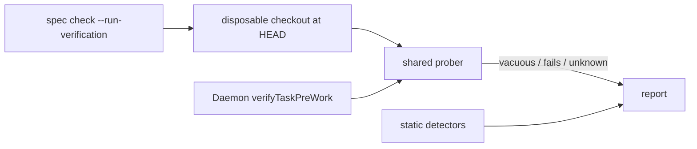

# A Verification that ran before anyone believed it — Technical Spec

## Vocabulary Contract

- emits: `internal/speccheck/verification.go`
  pattern: `SC-VERIFY-(INVERTED-EXIT|NON-HERMETIC)`
  documented-in: `CONTEXT.md`

The two new refusal codes are this Spec's coined vocabulary: they reach an author
reading a refusal and any later tool matching on them, so they need the durable
owner every other `SC-*` code has. Declaring them makes
`SC-VOCABULARY-UNDOCUMENTED` run instead of skip.

## Executive Summary

The executor this Spec needs already exists. `verifyTaskPreWork` in
`internal/daemon` runs every authored Verification command against the unchanged
tree and classifies each as vacuous, failing, or unknown — wrapped in Run
bookkeeping the authoring caller has no use for. The design extracts that loop
into a prober both callers share, so the checker cannot approve what the probe
later refuses. Around it sit two static detectors for shapes a reader can name
without running anything, a context contract that lets a Task declare its own
output, and one sentence in the authoring skill.

The primary trade-off is that executing authored commands at authoring time costs
seconds and requires a disposable checkout, where a static detector costs
milliseconds — accepted because a static detector cannot enumerate the shapes
that pass without work, which is exactly how eleven commands survived a clean
checker in one Spec and eight in another. A second, smaller trade-off: the
authoring probe runs against `HEAD`, which is the pre-work tree for a graph
nobody has started and an approximation for one partly done. The design states
that rather than pretending otherwise.

## Project Constraints

- Identifier strategy: applicable — Verification, Task, and the `SC-*` refusal
  vocabulary are glossary terms this Spec extends, and each new code is coined
  vocabulary the glossary must own. The closing node checks whether the work
  introduced or changed a term. Source: `docs/agents/domain.md`.
- Authentication and HTTP: not applicable — no network boundary, credential, or
  request is created or read. The work is static analysis and local command
  execution in a disposable checkout. Source: `docs/agents/specific-repository.md`.
- Active ADR obligations: applicable — ADR-0124 makes authoring and Run time
  share one prober, which is this design's central decision. ADR-0117 places a
  check with the stage that can produce its defect, which is the whole thesis
  moved from Run time to authoring; ADR-0093 checks Spec consistency by citation
  rather than inference, which bounds what a static detector may conclude;
  ADR-0094 makes the check artifact-presence aware, so a detector skips rather
  than fails where its artifact is absent; ADR-0111 makes an unobserved
  Verification unknown rather than a verdict, which is what the prober reports for
  a command it could not run; ADR-0014 gives the Daemon ownership of task
  verification and settlement, unchanged here — the shared prober moves code, not
  ownership. Source: `docs/agents/domain.md`.
- Tooling authority: applicable — the task-authoring skill gains the exit-zero
  rule. Express maintainer authorization:
  `docs/workflow/authorizations/2026-08-12-the-authoring-and-baseline-corrections.md`,
  granted 2026-08-12, whose per-Spec section for this Spec is binding. Bounded
  files: `.agents/skills/write-tasks/SKILL.md`. Source:
  `docs/agents/agent-instructions.md`.

## System Architecture

One component is extracted, one is added, and three existing ones gain checks.

**The shared prober** (extracted, `internal/daemon` or a package both can import)
takes a working directory, an ordered command list, and the existing `Verifier`,
and returns one classification per command. It is the loop `verifyTaskPreWork`
runs today, minus run state, capacity acquisition, and artifact paths.

**The disposable checkout** (new, `internal/speccheck` or the CLI) gives the
authoring caller a tree to run against: a detached worktree at `HEAD`, removed
when the check ends. It is where the probe's commands execute, so a command that
writes cannot touch the operator's working tree.

**The static detectors** (`internal/speccheck`) gain two codes and re-enable a
third. They read authored command text and refuse shapes a reader can name:
inverted exit conditions, undeclared environment dependence, and — restored —
commands already satisfied before any work.

**The context contract** (`internal/spec`) accepts a declared output whose
existence is not required, so `SC-REF-UNRESOLVED` stops refusing a Task that
names the file it creates.

**The authoring skill** gains the exit-zero rule beside the vacuity rule it
belongs next to.



## Implementation Design

### Interfaces

The prober is the loop both callers share.

```go
// CommandVerdict is what one authored command does against a tree where no
// work has happened. Unknown means the command could not run, which ADR-0111
// keeps distinct from a verdict.
type CommandVerdict struct {
    Command string
    Vacuous bool
    Unknown bool
    Cause   error
}

// ProbeCommands runs each command in workDir and classifies it. It owns no run
// state, acquires no capacity, and writes only where outputFor sends it.
func ProbeCommands(
    ctx context.Context,
    verifier Verifier,
    workDir string,
    commands []string,
    outputFor func(index int) string,
) ([]CommandVerdict, error)
```

The disposable checkout is a narrow helper, not a package.

```go
// DisposableCheckout materializes the repository at HEAD in a temporary
// worktree and returns its path with a cleanup. The caller never runs authored
// commands in the operator's working tree.
func DisposableCheckout(ctx context.Context, repoRoot string) (dir string, cleanup func() error, err error)
```

The two static detectors follow the existing detector shape and are registered
at the tasks stage beside `SC-VERIFY-WORK-INDEPENDENT`.

```go
const (
    CodeVerifyInvertedExit = "SC-VERIFY-INVERTED-EXIT"
    CodeVerifyNonHermetic  = "SC-VERIFY-NON-HERMETIC"
)
```

### Data Models

No database entity changes and no serialized document gains a field. The
`--run-verification` result is reported, not persisted: an authored command's
behaviour against `HEAD` is a fact about this moment, and storing it would create
a second thing to keep true.

### API Contracts

`roundfix spec check <slug> --run-verification` executes each authored
Verification command in a disposable checkout and reports one line per command:
the command, whether it ran, and whether it passed where a pre-work tree should
make it fail. It exits non-zero when any command is vacuous, matching the
Daemon's refusal.

The flag is opt-in. `spec check` without it stays as fast as it is today, which
is what lets it run in `verify-docs` on every commit.

## Coverage Map

- Goal 1, Story 1 → shared prober, disposable checkout.
- Goal 2, Story 2 → the exit-zero rule in the authoring skill.
- Goal 3, Stories 2 and 4 → the two static detectors and the restored vacuity
  detector.
- Goal 4, Story 3 → the context contract's declared output.
- Core Feature 1 → shared prober, disposable checkout.
- Core Feature 2 → `SC-VERIFY-INVERTED-EXIT`.
- Core Feature 3 → `SC-VERIFY-NON-HERMETIC`.
- Core Feature 4 → the restored `SC-VERIFY-VACUOUS-COMMAND` registration.
- Core Feature 5 → the context contract.
- Core Feature 6 → the authoring skill.

## Integration Points

Git is called once per run, to create and remove a detached worktree. The
repository's own findings record worktree creation failing under load and tests
writing into the repository root, so the checkout is created with the same
`core.fsmonitor=false` hygiene the isolated test repositories already use, and
its removal is deferred rather than left to the caller.

No network, no hosting provider, no Run Database.

## Testing Approach

Existing seams carry this and one new seam is needed.

- **The shared prober** — the Daemon's existing probe tests are the seam. The
  extraction must leave them passing unchanged; a test that has to change is a
  signal the extraction moved behaviour, not just code.
- **The static detectors** — table-driven tests over authored command text, one
  case per measured shape: `grep -c`, `grep -v | wc -l`, `test $(…)` without a
  comparison, a bare environment variable, a `test -n "$VAR" &&` guard, and a
  temporary-directory dependency. Each measured form gets its own case so a
  regression names which shape returned.
- **The context contract** — a Task declaring a `creates:` path that does not
  exist passes; one declaring an `interface:` path that does not exist still
  fails.
- **The disposable checkout** is the new seam: a test that the checkout is a
  distinct tree, that a command writing into it leaves the repository untouched,
  and that the checkout is removed when the check ends including on failure.
- **The end-to-end refusal** — a fixture Spec whose Task carries one vacuous and
  one honest command, proving `--run-verification` refuses the first and reports
  the second, and that the exit status matches what the Daemon would do.

## Build Order

1. Extract the shared prober from `verifyTaskPreWork`, leaving the Daemon's
   existing probe tests passing unchanged.
2. The disposable checkout helper, with its isolation and cleanup tests
   (depends on: nothing; independent of 1).
3. `spec check --run-verification`, wiring the checkout to the prober and
   reporting one line per command (depends on: 1, 2).
4. `SC-VERIFY-INVERTED-EXIT`, with a case per measured reversed form
   (depends on: nothing).
5. `SC-VERIFY-NON-HERMETIC`, with a case per measured non-hermetic form
   (depends on: nothing).
6. Restore `SC-VERIFY-VACUOUS-COMMAND` to the staged registry and account its
   findings across the active corpus (depends on: 4, 5 — so the corpus is
   accounted once, against all three detectors, rather than three times).
7. The context contract's declared output (depends on: nothing).
8. The exit-zero rule in the authoring skill, with the three working forms
   (depends on: 3, so the rule cites a check that exists).

Steps 4, 5 and 7 are independent of each other and of 1–3. Step 6 is the one
that moves the corpus golden, and it lands after the detectors it accounts for.

## Risks & Considerations

**The probe runs against `HEAD`, not against each Task's real pre-work tree.**
For a graph nobody has started they are the same. For a partly-executed graph a
later Task's pre-work tree includes its predecessors' work, so a command that is
honest there can read as vacuous here. The mitigation is to say so in the
report rather than to model per-Task trees, which would require executing the
graph — the thing this check exists to avoid.

**Executing authored commands is executing untrusted text.** A Verification
command is authored by a Supervisor and may do anything a shell can. The
disposable checkout bounds the blast radius to a temporary tree, and the flag is
opt-in, but this is the design's real hazard and the reason it is not on by
default in `verify-docs`.

**Restoring the vacuity detector moves the corpus golden.** It found ten vacuous
commands across three Specs on its first run and was disabled the same day.
Re-enabling it will report findings against active Specs that predate it; step 6
accounts them deliberately rather than regenerating the golden on reflex.

**A partial detector reads as a gate.** The repository measured this: an author
corrected the four commands a detector refused and read the clean verdict as
complete coverage, which cost a Run. The two new static detectors have the same
shape, so `spec check` must say what it did not execute — which is the argument
for `--run-verification` reporting its own absence when it was not run.

## Decisions

- Authoring and Run time share one prober rather than two implementations. See
  ADR-0124.
- `--run-verification` is opt-in, so the fast check stays fast and untrusted
  command execution is never implicit.
- The probe's result is reported and not persisted; it is a fact about the tree
  at that moment.
- The disposable checkout is a detached worktree at `HEAD` rather than a copy of
  the tracked tree: it is exact and cheaper, and the copy approach already has a
  measured failure mode in this repository's own suite.
