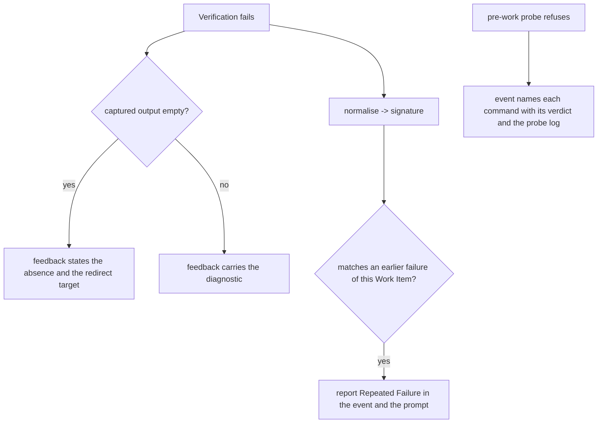

# A failure the Agent can read — Technical Spec

## Vocabulary Contract

- emits: `internal/daemon/task_engine.go`
  pattern: `[Rr]epeated [Ff]ailure`
  documented-in: `CONTEXT.md`

Repeated Failure is this Spec's coined term: it names a Verification failure whose
normalised diagnostic signature matches an earlier failure of the same Work Item.
It reaches a Supervisor through the Run's event stream and an Agent through the
repair prompt, so it needs the durable owner the glossary gives. Declaring it
makes `SC-VOCABULARY-UNDOCUMENTED` run instead of skip.

## Executive Summary

Everything here is about what a reader is given, and each repair is small and
local.

A Verification that fails after redirecting its output hands the Agent a command,
an exit status, and nothing else, so the one repair turn ADR-0038 allows is spent
guessing. The feedback states the absence explicitly (ADR-0135). A failure that
already happened is reported as new, so a Run was spent reproducing a known
diagnostic; a normalised signature makes the repetition nameable (ADR-0136). The
vacuity event names a count and hides the offenders behind a key that reads as
"what ran". The authoring contract has no exit when corrective work exceeds its
ceiling, so the loop stops for a policy decision. And the run budget does not say
what it bounds, which is stated where it is configured (ADR-0137).

The primary trade-off is in the signature: normalising to survive timestamps and
temporary paths can collide, calling two different failures the same. That is the
accepted direction — a false repetition costs a Supervisor one comparison, a
missed one costs a Run.

## Project Constraints

- Identifier strategy: applicable — Verification Feedback, Agent Session, Work
  Item, Run Event and Task are glossary terms this Spec changes the reporting of,
  and Repeated Failure is coined vocabulary the glossary must own. The closing
  node checks whether the work introduced or changed a term. Source:
  `docs/agents/domain.md`.
- Authentication and HTTP: not applicable — no network boundary, credential or
  request is created or read. The work is diagnostic capture, event emission,
  configuration text and one authoring clause. Source:
  `docs/agents/specific-repository.md`.
- Active ADR obligations: applicable — ADR-0135, ADR-0136 and ADR-0137 are this
  design's decisions. ADR-0014 gives the Daemon ownership of task verification and
  status settlement, which owns every change here; ADR-0038 allows one Verification
  repair, the turn this Spec stops wasting; ADR-0111 makes an unobserved
  Verification unknown rather than a verdict, which is what an absent diagnostic
  must be reported as. The decisions extending that ownership are accounted and
  none changes: ADR-0020 ranks a parsed prompt result above the runtime's exit
  code, ADR-0057 gives the Daemon exclusive ownership of Implement Task status,
  ADR-0056 separates Task Capacity from Verification Capacity, and ADR-0096 with
  ADR-0117 place the gate's mechanical stage and its checks. Source:
  `docs/agents/domain.md`.
- Tooling authority: applicable — the constraint governs this Spec, and one
  protected tooling mutation is proposed and authorized: the task-authoring skill
  gains the sanctioned exits for a reached corrective-Task ceiling. Express
  maintainer authorization:
  `docs/workflow/authorizations/2026-08-12-the-authoring-and-baseline-corrections.md`,
  granted 2026-08-12, whose per-Spec section for this Spec is binding. Bounded
  files: `.agents/skills/write-tasks/SKILL.md`. Source:
  `docs/agents/agent-instructions.md`.

## System Architecture

Five existing components change and nothing is added.

**The feedback prompt** (`internal/agent`, `VerificationFeedback` and
`BuildVerificationRepairPrompt`) gains the absent-diagnostic state. The struct
already carries `Failure` and `DiagnosticPath`; what is missing is that an empty
`Failure` is rendered as emptiness rather than as nothing. The Daemon's two call
sites — `engine.go` for a batch and `task_engine.go` for a Task — supply it.

**The repetition check** (`internal/daemon`) computes a normalised signature from
the captured diagnostic and the failing command, compares it against earlier
failures of the same Work Item, and reports a match. The Run Event Journal is
where earlier failures already live, so the comparison reads what is recorded
rather than persisting a second copy.

**The vacuity event** (`internal/daemon/task_engine.go`) names the offenders
rather than a count behind a key that reads as "what ran", and points at the probe
log that settles it. `VerificationProbe` already classifies every command, so the
event can carry each command with its own verdict.

**The configuration surface** (`internal/config`) states what the maximum Run
duration bounds, in the template the tool renders.

**The authoring contract** (`.agents/skills/write-tasks/SKILL.md`) gains the
sanctioned exits when corrective work exceeds the ceiling.



## Implementation Design

### Interfaces

The feedback gains one field and the prompt one branch.

```go
// VerificationFeedback describes one failed Verification for the repair turn.
// DiagnosticEmpty distinguishes "the command said nothing" from "we have
// nothing to say", which ADR-0135 requires the Agent to be able to tell apart.
type VerificationFeedback struct {
    Command         string
    DiagnosticPath  string
    Failure         string
    DiagnosticEmpty bool
    Repeated        *RepeatedFailure
    Attempt         int
    TaskHandoff     bool
}

// RepeatedFailure names the earlier failure this one matches.
type RepeatedFailure struct {
    Signature string // normalised, stable across runs
    RunID     string // where the earlier failure was recorded
    Attempt   int
}
```

The signature is one function with one rule.

```go
// DiagnosticSignature normalises a captured diagnostic so two runs of the same
// failure compare equal: timestamps, durations, temporary paths, process ids
// and run identifiers are replaced before hashing. ADR-0136 explains why a
// collision is the accepted direction.
func DiagnosticSignature(command string, diagnostic []byte) string
```

### Data Models

No database entity gains a column. The repetition check reads the Run Event
Journal, which already records each Verification failure with its Work Item; a
second store of signatures would be a second thing to keep true about a fact the
journal already holds.

### API Contracts

The repair prompt states, when the command produced no output, that it produced
none and where it was redirected. When the failure repeats, it names the earlier
Run and attempt.

The vacuous pre-work event carries every probed command with its own verdict
under a key that says what it holds, plus the probe log path. Its summary names
the offending commands rather than only their count.

`roundfix` writes a configuration template whose `max_run_duration` entry states
what it bounds.

## Coverage Map

- Goal 1, Story 1 → the feedback prompt's absent-diagnostic state.
- Goal 2, Story 2 → the repetition check.
- Goal 3, Story 3 → the authoring contract's ceiling exits.
- Core Feature 1 → the feedback prompt.
- Core Feature 2 → the repetition check.
- Core Feature 3 → the authoring contract.
- Core Feature 4 → the recovery output's surface naming.
- Core Feature 5 → the vacuity event.
- Core Feature 6 → the configuration surface.

## Integration Points

No network, no hosting provider. The Run Event Journal is read through the
interface the Daemon already uses to publish to it. Git is untouched.

## Testing Approach

- **The absent diagnostic** — the prompt builder's existing tests are the seam. A
  feedback whose captured output is empty renders text stating that; one with
  output renders unchanged, which is the regression that matters.
- **The repetition check** — table-driven over the normaliser: two diagnostics
  differing only by timestamp, temporary path, duration and process id compare
  equal; two genuinely different assertions do not. Then the end-to-end case: a
  Work Item failing twice with the same assertion produces a repetition on the
  second failure and none on the first.
- **The vacuity event** — the payload carries each command with its verdict and
  the probe log path, and the summary names offenders. The measured shape is the
  assertion: a reader must not be able to mistake the list for what the tool ran.
- **The configuration surface** — the rendered template states what the budget
  bounds, asserted against the template the tool writes rather than a fixture.
- **The authoring contract** — the clause is present in the canonical skill and
  its mirror, and the changed-file set is the bounded scope plus the Task file.

## Build Order

1. The absent-diagnostic state in the feedback and both Daemon call sites
   (depends on: nothing).
2. The diagnostic signature and its normaliser, with the collision cases
   (depends on: nothing).
3. The repetition check reading the Run Event Journal, reported in the event and
   in the prompt (depends on: 1, 2 — it extends the prompt step 1 changes and
   consumes the signature step 2 defines).
4. The vacuity event naming its offenders and its probe log (depends on:
   nothing).
5. The configuration surface stating what the budget bounds (depends on:
   nothing).
6. The recovery output naming the surface its Task file came from (depends on:
   nothing).
7. The authoring contract's ceiling exits (depends on: nothing; a tooling Task
   with its own bounded scope).

Steps 1, 2, 4, 5, 6 and 7 are independent. Step 3 is the only join, and it lands
after the two it composes so a failure there is about their composition.

## Risks & Considerations

**The signature can collide.** Normalising away timestamps and paths is what makes
a repetition recognisable, and it can also make two different failures compare
equal. The direction is deliberate: a false repetition costs one comparison, a
missed one costs a Run. The tests carry both directions so the collision surface
is visible rather than assumed.

**Reading the Run Event Journal for prior failures ties the check to retention.**
A failure older than the journal's retention window is not found, so a repetition
across a gc boundary reports as new. That is a bounded loss and it is stated
rather than fixed by persisting a parallel store, which would be a second thing to
keep true.

**The tooling Task must not travel with production code.** The authoring clause is
authorized for exactly one file, and a commit mixing it with Go would fail the
changed-path audit — as one did during Spec 0095. Step 7 is its own Task with its
own bounded scope for that reason.

**A capability is not delivered until its production caller carries it.** Both
Specs delivered before this one had a Task that built and unit-tested a capability
no production path reached. Every step here names the call site it must change,
and each Task's Verification asserts the caller rather than the declaration.

## Decisions

- An absent diagnostic is a reported state, not an empty message. See ADR-0135.
- A repeated failure is recognised by a normalised diagnostic signature, read
  from the Run Event Journal rather than from a new store. See ADR-0136.
- The run budget's meaning is stated where it is configured, and where it is
  evaluated is left unchanged until a reproduction says otherwise. See ADR-0137.
