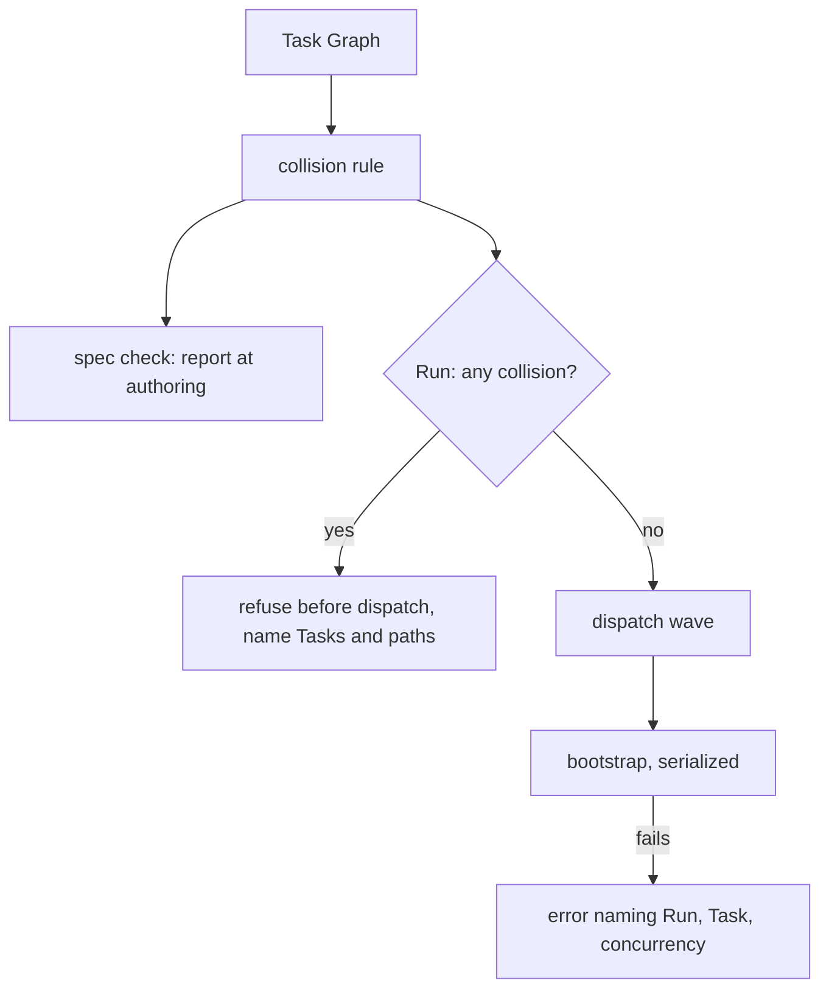

# A wave that cannot collide — Technical Spec

## Executive Summary

Concurrency is configured as a number and verified as nothing. Three latent
failures became visible when it was raised, and each cost a Run of finished
Agent work. This design makes same-wave collision a fact the graph can be asked
about before dispatch, serializes the bootstrap that shares a Git directory, and
gives a worktree failure the Run, the Task, and the concurrency that produced
it.

The PRD left two questions open. The first — refuse or silently serialize —
keeps the PRD's own default: refuse, because silently reordering changes the
execution plan the Supervisor authored, and the fix is one edit to `_tasks.md`
against a lost Run.

The second the PRD answered wrongly, and its own motivating evidence says so.
Its default was to compute collisions from declared Task Context. **Neither Task
in the measured collision declares a `## Context` section at all**, so that
source would have detected nothing and the Run would still have died. Both
Verifications name `internal/speccheck/mechanical.go`. The collision set is
therefore the union of three sources — the paths a Task's Verification commands
name, its declared Context entries, and the paths a prior Run's settlement
commit for that Task changed — each optional, and none sufficient alone.

The trade-off this accepts is recall over precision. A Verification that only
reads a file it never edits will be counted as touching it, so a legitimate wave
can be refused. That is the cheaper error: the refusal names the Tasks, the
shared paths, and which source produced each, so a Supervisor can see in one
read whether it is real, and correcting it costs an edit rather than a Run.

## Project Constraints

- Identifier strategy: applicable — Run, Task Worktree, Run Worktree, Task
  Capacity, and Wave are glossary terms this Spec reports on, and a collision
  message that invents a synonym for one of them is a defect. The glossary
  carries no term for the set of paths a Task is known to touch, and the closing
  node decides whether one is owed. Source: `docs/agents/domain.md`.
- Authentication and HTTP: not applicable — no network boundary, credential,
  request, or transport is created or read. The work is process orchestration,
  filesystem isolation, and error reporting inside a local daemon. Source:
  `docs/agents/specific-repository.md`.
- Active ADR obligations: applicable — the PRD's row is carried forward
  unchanged and one record is added. ADR-0148 establishes that a rule enforced
  both at authoring and at Run time lives in one extracted prober used by both
  callers, precisely so a checker cannot approve what the Run later refuses.
  This Spec follows that shape: one collision rule, read by the Spec
  Consistency Check and by the Run before dispatch. Source:
  `docs/agents/domain.md`.
- Tooling authority: applicable — no protected tooling mutation is proposed or
  authorized. The work is production Go in the daemon, worktree, and checker
  packages plus their tests. The PRD's Non-Goal keeps wave-composition rules out
  of the authoring skills, and this design honours it: a checker detector
  reports a collision, and no skill is edited. Source:
  `docs/agents/agent-instructions.md`.

## System Architecture

Four components change; no package, layer, or directory is added.

**The collision rule** is one function over a Task Graph: given the Tasks, it
returns the pairs that share a path and the source of each shared path. It reads
the graph and the repository, runs no command, and opens no Agent Session.

**Two callers, one rule**, following ADR-0148. The Spec Consistency Check
reports a collision at authoring, where the defect is produced and where fixing
it is one edit. The Run asks the same question before dispatching, which is the
backstop for a graph authored before the checker carried the rule, or edited
after it passed.

**Bootstrap serialization** in the worktree package. Sibling Task Worktrees
bootstrap against one shared Git directory and one shared package cache, so the
bootstrap step takes a process-wide lock while the Tasks themselves stay
parallel. Concurrency is preserved where it pays and removed where it collides.

**The worktree failure message** carries the Run, the Task, and the configured
concurrency, with the underlying filesystem error as evidence rather than as the
message.



## Implementation Design

### Interfaces

```go
// TaskTouchSet is the paths one Task is known to touch, and where each was
// learned. No source is authoritative alone: the measured collision declared no
// Context at all, and its Verification commands are what named the shared file.
type TaskTouchSet struct {
    TaskID string
    Paths  map[string]TouchSource // repository-relative path -> how it was learned
}

type TouchSource string

const (
    TouchFromVerification TouchSource = "verification command"
    TouchFromContext      TouchSource = "declared context"
    TouchFromPriorRun     TouchSource = "prior Run settlement commit"
)

// WaveCollision is two Tasks a graph allows to run together that are known to
// touch one path.
type WaveCollision struct {
    First, Second string
    Paths         map[string]TouchSource
}

// Collisions reports every pair the graph permits in one wave that shares a
// path. Tasks ordered by a needs edge, directly or transitively, never collide:
// the graph already serializes them.
func Collisions(repoRoot string, graph *spec.Graph) ([]WaveCollision, error)
```

### Data Models

No schema change and no new persisted entity. A collision is computed from the
graph and the repository each time it is asked for, so a graph edited between
Runs is never judged on a stale record.

### API Contracts

`roundfix spec check` — gains one finding for a graph whose same-wave Tasks
share a path, naming both Tasks, each shared path, and the source that produced
it. It is a finding rather than a gap: the two sides are both written down.

`roundfix implement` — refuses before dispatching when the graph carries a
collision, with no Agent Session opened and the same naming. The refusal states
the fix: give one Task a `needs` edge on the other. It never reorders the plan
itself.

## Coverage Map

| PRD item | Component |
| --- | --- |
| Goal 1, Story 1, Core Feature 1 | `Collisions` and its two callers |
| Goal 2, Story 2, Core Feature 2 | Bootstrap serialization in the worktree package |
| Goal 3, Story 3, Core Feature 4 | The worktree failure message |
| Goal 4 | The checker finding, which turns a wager into a reported fact |
| Core Feature 3 | The bootstrap failure classification |

## Integration Points

- `internal/spec` — the Task Graph and the Task document the rule reads.
- `internal/speccheck` — the authoring-time caller.
- `internal/daemon/task_engine.go` — the pre-dispatch caller, beside the
  existing plan validation.
- `internal/worktree` — bootstrap serialization and the failure message.

## Testing Approach

Every seam exists. `internal/speccheck`, `internal/daemon`, and
`internal/worktree` already cover these surfaces; no new seam is added.

- The measured graph is the first case: two Tasks with no declared Context whose
  Verifications name one file are reported, which is the collision the PRD's own
  default would have missed.
- Tasks ordered by a `needs` edge, direct and transitive, are not reported.
- A path named only by a package selector such as `./internal/cli` is not a
  file and never produces a collision.
- The Run refuses before any Agent Session, asserted against the Run Database
  rather than stdout alone.
- Bootstrap runs concurrently at capacity above one across repeated attempts
  without a lock collision, and a bootstrap that fails after completing its work
  is classified apart from one that failed before starting.
- A worktree creation failure names the Run, the Task, and the concurrency, and
  carries the underlying error.

Repository Verification is `rtk make verify`; `make verify-docs` covers the
markdown contracts and is required before the pull request opens.

## Build Order

1. The collision rule over a Task Graph, with its three sources and the
   needs-edge exclusion.
2. The Spec Consistency Check reports a collision at authoring (depends on: 1).
3. The Run refuses before dispatch (depends on: 1; serialized after 2 by edit
   locality in the checker packages).
4. Bootstrap is serialized across sibling Task Worktrees, and a bootstrap that
   failed after completing its work is classified apart (depends on: none;
   ordered here because it shares no file with 1–3).
5. A worktree creation failure names the Run, the Task, and the concurrency
   (depends on: 4 — both edit the worktree package).
6. QA gate (depends on: 5).

Documentation is not a step: this Spec edits no skill and coins no term unless
the closing node finds one owed, which is where that decision belongs.

## Risks & Considerations

**Recall over precision refuses legitimate waves.** A Verification that reads a
file without editing it counts as touching it. Accepted: the refusal is cheap to
diagnose because it names the source of every shared path, and cheap to fix
because one `needs` edge settles it. The opposite error costs a Run of finished
Agent work, which is the cost this Spec exists to remove.

**A collision rule that reads Verification text is a heuristic.** It is bounded
to paths that resolve to files in the repository, so a package selector, a flag,
or a test name never becomes a path. It never infers intent, which is the line
ADR-0093 draws for the checker.

**Serializing bootstrap narrows the concurrency that was raised.** Only the
bootstrap step serializes; Agent turns and Verification stay parallel. The Spec's
own Non-Goals forbid changing the default concurrency, and this changes none.

**A prior Run's changed files can be stale.** They are read from that Run's
settlement commit rather than from a live worktree, so they describe what the
Task did rather than what the tree looks like now, and they are one source among
three rather than a verdict.

## Decisions

- A collision refuses rather than silently serializes, keeping the PRD's default:
  reordering the plan the Supervisor authored, without telling them, replaces a
  visible failure with an invisible one.
- The collision set is the union of Verification-named paths, declared Context,
  and a prior Run's changed files. The PRD's default of declared Context alone is
  superseded by its own evidence: neither Task in the measured collision declares
  Context, so that source would have caught nothing.
- One rule with two callers rather than two implementations, under ADR-0148.
- No new ADR is minted. The wave-composition rule this Spec adds is new, and the
  PRD already records that no accepted ADR governs it; the rule's shape follows
  ADR-0148 rather than reversing anything.
