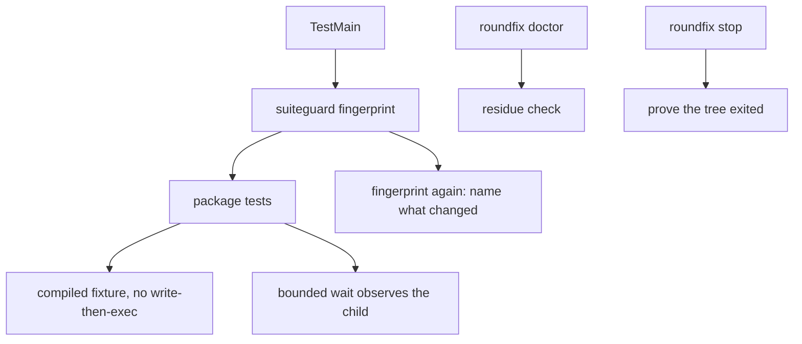

# A suite that leaks nothing — Technical Spec

## Vocabulary Contract

- emits: `internal/cli/doctor.go`
  pattern: `residue`
  documented-in: `CONTEXT.md`

Process Residue is this Spec's coined term: it names a process Roundfix spawned
that outlived the Run that spawned it, and it reaches an operator through the
readiness diagnostic. Declaring it makes `SC-VOCABULARY-UNDOCUMENTED` run instead
of skip.

## Executive Summary

Four defects share one root and one repair: the suite has no boundary it proves.
It writes into the repository it reads, executes files it wrote a moment earlier,
waits out long budgets for children that are already dead, and leaves processes
behind that no command can see. Each is repaired by giving the suite something it
can assert about itself rather than by loosening any assertion it makes about the
product.

The central decision is that a spawned fixture stops being a written script and
becomes a compiled binary (ADR-0125). That closes the write-then-execute window
the repository has now measured from both ends — an empty `--version` probe on
2026-08-10 and a literal `text file busy` on 2026-08-14 — and it is the reason
this Spec was pulled forward: Spec 0095 added ten new checkout sites and a command
that executes authored shell, which raised spawn density enough that the flake
cost four consecutive gate attempts on one Pull Request.

The primary trade-off is that compiled fixtures cost build time where scripts cost
nothing, and a re-executed test binary is less obvious to read than a four-line
shell script. Accepted, because the alternative the literature offers is a retry
loop, which hides a race rather than removing it.

## Project Constraints

- Identifier strategy: applicable — Run, Run Database, Force Stop and Agent
  Session are glossary terms this Spec reports against, and Process Residue is
  coined vocabulary the glossary must own. The closing node checks whether the
  work introduced or changed a term. Source: `docs/agents/domain.md`.
- Authentication and HTTP: not applicable — no network boundary, credential or
  request is created or read. The work is process lifetime, filesystem isolation,
  test fixtures and a local inventory. Source:
  `docs/agents/specific-repository.md`.
- Active ADR obligations: applicable — ADR-0125 makes a spawned fixture a
  compiled binary, ADR-0126 places the isolation guard per package, and ADR-0127
  makes residue a readiness fact, and ADR-0128 makes the guard and the
  changed-path audit read one regeneration declaration; those four are this
  design's decisions.
  ADR-0014 gives the Daemon ownership of task verification and status settlement,
  which bounds the inventory to reporting. The decisions extending that ownership
  are accounted and none changes: ADR-0020 ranks a parsed prompt result above the
  runtime's exit code, ADR-0038 allows one Verification repair, ADR-0056 separates
  Task Capacity from Verification Capacity, ADR-0057 gives the Daemon exclusive
  ownership of Implement Task status, and ADR-0096 with ADR-0117 place the gate's
  mechanical stage and its checks. Source: `docs/agents/domain.md`.
- Tooling authority: not applicable — no protected tooling mutation is proposed
  or authorized. The work is Go test code, test fixtures and production Go in the
  CLI and process-ownership packages; it edits no linter, formatter, test-runner
  or build configuration, and it changes no test in order to make a failure
  disappear. Source: `docs/agents/agent-instructions.md`.

## System Architecture

One package is added, three existing seams are changed, and one command gains a
section.

**The suite guard** (new, `internal/suiteguard`) is a helper a package's
`TestMain` installs. It fingerprints the repository root before the package's
tests run and again after, and fails the package naming every path that appeared,
vanished or changed. It is deliberately tiny and has no dependency on the rest of
the tree, so every package can import it without creating a cycle.

**The compiled fixture** replaces `os.WriteFile` plus `exec.Command` wherever a
test executes something it just wrote. Two shapes serve every measured case: a
re-execution of `os.Args[0]` behind an environment switch, which the ACPX harness
already uses for `acpx` itself, and a binary built once into a package-level
temporary directory before any test starts forking.

**The bounded wait** replaces the long deadline in `internal/agent`'s spawn
helpers with a wait that observes the child process, so a fixture that died
reports in milliseconds with its own name rather than after the agent budget.

**The residue inventory** (`internal/cli/doctor.go`) gains a check that lists
processes Roundfix started with no live Run record, with each one's age and
originating Run when the Run Database still knows it.

**Force Stop** proves the process tree it terminated rather than only the
registered owner.



## Implementation Design

### Interfaces

The guard is one call and one failure mode.

```go
// Main fingerprints repoRoot, runs the package's tests, fingerprints again, and
// fails the package naming every path the tests created, changed or removed.
// A package installs it from TestMain; ADR-0126 explains why per package.
func Main(m *testing.M, repoRoot string) int

// Violation is one path the suite touched inside the repository root.
type Violation struct {
    Path   string
    Change string // created | modified | removed
}
```

The compiled fixture is a constructor, not a framework.

```go
// FixtureBinary builds name once for the calling package and returns its path.
// The build happens before the package's tests start, so nothing executes a
// file another goroutine may still hold open. See ADR-0125.
func FixtureBinary(t testing.TB, name string, source string) string
```

The inventory is one function behind the existing check shape.

```go
// Residue reports processes this repository's Roundfix started that no live Run
// owns. It reports and settles nothing, which ADR-0014 requires and ADR-0127
// places in the readiness diagnostic.
func Residue(ctx context.Context, store RunStore, table ProcessTable) ([]ResidualProcess, error)

type ResidualProcess struct {
    PID       int
    Started   time.Time
    CPUTime   time.Duration
    RunID     string // empty when no Run record survives
    Command   string
}
```

### Data Models

No database entity changes and no serialized document gains a field. Residue is
computed from the live process table and the existing Run Database at the moment
it is asked; persisting it would create a second thing to keep true about a
machine state that changes without Roundfix's involvement.

### API Contracts

`roundfix doctor` gains one line per residual process — its age, its CPU time,
its originating Run when known, and what to do about it — and says so explicitly
when there is nothing to report rather than printing an empty table. Its exit
status is unchanged: residue is a fact to surface, not a reason to refuse a Run.

`roundfix stop` proves the exit of the process tree it terminated. Its output and
exit status are unchanged when the tree exits; it now fails rather than reporting
success when a descendant survives.

## Coverage Map

- Goal 1, Story 1 → the suite guard.
- Goal 2, Story 2 → the detach teardown and the sentinel moved outside the
  framework-deleted directory.
- Goal 3, Story 3 → the bounded wait.
- Goal 4, Story 4 → the residue inventory.
- Goal 5, Story 5 → the evidence hygiene check.
- Core Feature 1 → the suite guard.
- Core Feature 2 → the detach teardown.
- Core Feature 3 → the bounded wait.
- Core Feature 4 → the compiled fixture.
- Core Feature 5 → the residue inventory.
- Core Feature 6 → Force Stop proving the tree.
- Core Feature 7 → the guard's regeneration exemption.
- Core Feature 8 → the evidence hygiene check.

## Integration Points

The process table is read through the platform facility the repository already
uses for ownership checks; no new dependency is introduced and no process outside
Roundfix's own spawn lineage is inspected, which the PRD's non-goals require.

Git is not called by the guard: comparing a fingerprint of the working tree is
cheaper than a `git status` per package and does not depend on the index being
current, which this repository has already been bitten by twice.

No network, no hosting provider.

## Testing Approach

- **The suite guard** — a package whose test deliberately writes into the
  repository root proves the guard fails and names the path; a package that
  writes only inside its temporary directory proves it passes. The guard's own
  fingerprint cost is measured so it does not become the thing that slows the
  suite.
- **The compiled fixture** — the seam is the existing adapter harness. The
  measured signatures are the assertions: a fixture executed immediately after
  construction under concurrent forking must not produce `ETXTBSY` or an empty
  probe. A stress case runs the construction and execution in a loop with
  concurrent `exec` load, which reproduces the race on the old shape and must not
  on the new one.
- **The bounded wait** — a fixture that exits immediately proves the failure
  arrives in under a second and names the fixture, against the agent budget it
  used to consume.
- **The detach teardown** — the survival property under test is unchanged; the
  new assertion is that no process remains after the package's tests end, which
  the guard observes.
- **The residue inventory** — a fabricated process table with and without a
  matching Run record proves both the reported and the empty case, without
  spawning anything.
- **Force Stop** — a Run whose spawned child outlives its registered owner proves
  the stop fails rather than reporting success.

## Build Order

1. The compiled fixture for the two measured cases — the adapter harness and the
   release-gate formatter — with the stress case that reproduces the race on the
   old shape (depends on: nothing). First, because it is what unblocks delivery.
2. The bounded wait that observes the child (depends on: nothing).
3. The suite guard package with its own tests (depends on: nothing).
4. Installing the guard in the packages that spawn, and the repository-contract
   test that enumerates which packages install it (depends on: 3).
5. The detach teardown and the sentinel relocation (depends on: 3, so a leaked
   process is observed by the guard rather than argued about).
6. The residue inventory in the readiness diagnostic (depends on: nothing).
7. Force Stop proving the tree (depends on: 6, which builds the process-table
   reader it needs).
8. The evidence hygiene check (depends on: nothing).
9. The guard reads the sanctioned-regeneration declaration, so a command that
   exists to rewrite declared derived artifacts is not reported as a violation
   (depends on: 4, because the exemption is only observable once the guard is
   installed where those commands run).

Steps 1, 2, 3, 6 and 8 are independent of each other. Step 9 was added on
2026-08-14 after step 4 landed: installing the guard made `make baseline-digests`
and the characterization update flags fail, each naming paths their own
authorization record already declares as sanctioned outputs. The design had
assumed no test writes into the repository on purpose; two commands do, by
contract.

## Risks & Considerations

**A sanctioned regeneration writes into the repository by design.** Measured on
2026-08-14, once the guard was installed: `make baseline-digests` and the
characterization update flags each rewrite derived artifacts their own
authorization record declares. The guard reads that declaration rather than
holding a list of its own (ADR-0128), so an exemption cannot drift from the
authorization that justifies it.

**The guard can fail a package for a race it did not cause.** Two packages run
concurrently under `go test ./...`, so a file one writes is visible to another's
fingerprint. The mitigation is that the guard reports paths inside the repository
root only — which no test should write at all — so a cross-package sighting is
still a true violation, merely attributed to whichever package looked second. The
build order puts the guard after the fixtures precisely so the loudest writer is
gone before the guard starts naming names.

**Compiling fixtures costs build time in a suite already near its budget.** The
`test-budget` target caps the suite, and adding builds spends against it. The
mitigation is that each fixture is built once per package rather than per test,
and that the `os.Args[0]` shape costs nothing at all — it is the binary the test
is already running.

**A stress case that reproduces a race can itself be flaky.** A test that must
observe `ETXTBSY` on the old shape will not observe it every time. It is written
to assert the new shape's success under load rather than the old shape's failure,
so it can fail only in the direction that matters.

**Residue reporting reads a process table the repository does not own.** A
machine with unrelated processes, a container without a full table, or a
restricted platform can all make the reader answer partially. It reports what it
could see and says what it could not, rather than claiming an empty inventory it
did not establish.

## Decisions

- A spawned fixture is a compiled binary, never a written script. See ADR-0125.
- The isolation guard runs per package rather than once around the suite, because
  a violation nobody can attribute is a violation nobody fixes. See ADR-0126.
- Residue is reported by the readiness diagnostic rather than by a new command or
  a fabricated Run row. See ADR-0127.
- The build order leads with the fixture repair rather than with the guard,
  because the flake is currently blocking delivery and the guard is not.
- The guard reads the same sanctioned-regeneration declaration as the changed-path
  audit rather than carrying its own exemption list. See ADR-0128.
