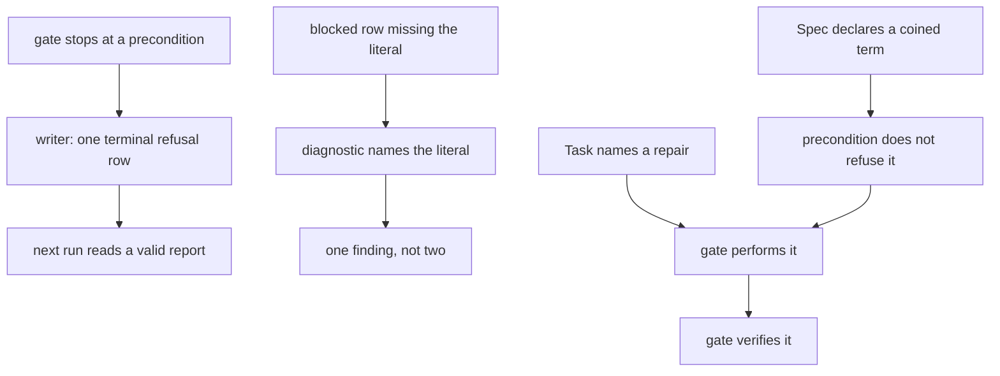

# A gate report that does not block its successor — Technical Spec

## Vocabulary Contract

- emits: `internal/speccheck/mechanical.go`
  pattern: `[Aa]ssigned [Rr]epair`
  documented-in: `CONTEXT.md`

Assigned Repair is this Spec's coined term: it names a repair a gate's own Task
file instructs it to make, as distinct from a finding it reports. The distinction
is the whole of ADR-0134, and it reaches a Supervisor through the gate's report,
so it needs the durable owner the glossary gives. Declaring it makes
`SC-VOCABULARY-UNDOCUMENTED` run instead of skip — which this Spec's own gate then
proved, by finding the term emitted and undocumented.

## Executive Summary

Four defects sit in one node, and every one is a few lines from where it is
measured. The report writer emits a `## Results` section with no rows when the
gate stops at a precondition, and the shape detector refuses that on the next run
with a fix the refused run cannot perform; the writer already knows it has zero
rows, so it records the refusal as one terminal row (ADR-0132). The blocked-cause
parser requires a literal the diagnostic never names, and the row it drops then
makes a count disagree, reporting twice for one cause (ADR-0133). And the gate is
assigned repairs it reports instead of performing, including a glossary update its
own precondition forbids it from reaching (ADR-0134).

Nothing here weakens the mechanical stage. It refuses before spending an Agent
turn, which is what made all four cheap to find, and every repair keeps that.

The primary trade-off is in ADR-0134: a gate that performs repairs is a gate that
writes, and a writing gate can write the wrong thing. It is bounded to what the
Task file names, and the alternative — leaving contract-assigned work to whoever
reads the report — was measured twice this week and cost a Run each time. A
smaller trade-off: recording the refusal as a row means a failed run leaves a
report that looks structurally like a successful one. That is the point, and the
verdict distinguishes them.

## Project Constraints

- Identifier strategy: applicable — QA Report, the verdict vocabulary and the
  three typed blocked-cause counts are glossary terms this Spec changes the
  reading and writing of. It coins no new term: the terminal refusal row is a QA
  Report row like any other. The closing node checks whether the work introduced
  or changed a term. Source: `docs/agents/domain.md`.
- Authentication and HTTP: not applicable — no network boundary, credential or
  request is created or read. The work is report writing, report parsing, and the
  diagnostics they emit. Source: `docs/agents/specific-repository.md`.
- Active ADR obligations: applicable — ADR-0132, ADR-0133 and ADR-0134 are this
  design's decisions. ADR-0096 makes the gate prove machine facts before spending
  an Agent turn, which is the behaviour that produced every defect here and which
  this Spec repairs rather than removes; ADR-0080 owns verdict semantics and the
  three typed blocked-cause counts, read and not redefined; ADR-0097 lets a row
  carry forward only on declared, unmoved evidence, which bounds what a report may
  claim about a prior run. ADR-0091 makes the gate a Task node of its own type,
  ADR-0093 checks Spec consistency by citation rather than inference, ADR-0104
  makes a Spec accept on evidence it did not author, and ADR-0117 places a check
  with the stage that can produce its defect — this Spec changes none of the four,
  and the last is why these repairs belong in the stage that writes and reads the
  report. Source: `docs/agents/domain.md`.
- Tooling authority: applicable — the constraint governs this Spec, and no
  protected tooling mutation is proposed or authorized. The work is production Go
  in the gate's report writer, its mechanical stage and the consistency checker,
  plus their tests. The `qa-gate` contract's stated row form is read rather than
  edited. Source: `docs/agents/agent-instructions.md`.

## System Architecture

Three existing components change and nothing is added.

**The report writer** (`internal/daemon`, `writeMechanicalQAReport`) emits one
terminal row when the mechanical result carries no rows, naming what stopped the
gate. It already computes the body and knows the row count, so this is a branch
rather than a new path. Two adjacent facts are corrected while it is open: the
verdict line is written only when the result blocks, so a non-blocking refusal
produces a report with no verdict at all; and two of the three typed counts are
hard-coded to zero while the third is computed.

**The shape detector** (`internal/speccheck`, `detectMechanicalReportShape`)
names the literal a blocked cause requires instead of listing the prefixes the row
already satisfies, and stops reporting a count disagreement as its own finding
when the disagreement is caused by rows it failed to parse.

**The gate's contract execution** (`internal/speccheck` mechanical stage and the
gate skill's reading of its Task) treats a repair the Task file names as work to
perform and then verify. The vocabulary precondition stops refusing a term the
Spec under gate declared in its own Vocabulary Contract, so the glossary update
the authoring contract assigns is reachable.



## Implementation Design

### Interfaces

The writer gains one internal decision, not a new exported shape.

```go
// refusalRow is the terminal row a gate writes when it stopped before building
// any matrix row. It carries the cause so the next run reads a valid report
// rather than an empty table. See ADR-0132.
type refusalRow struct {
    ID     string // stable, e.g. "QA-PRECONDITION"
    Status string // "fail", or a typed blocked status when the cause is environmental
    Cause  string // what stopped the gate, verbatim
}
```

The detector's change is to its messages and its finding count, not its signature.

```go
// blockedCauseLiteral is the exact text a typed blocked status must carry for a
// finding-blocked row to count. The diagnostic quotes it; ADR-0133 explains why
// naming the three prefixes a row already satisfies is not a diagnostic.
const blockedCauseLiteral = " — waits on "
```

### Data Models

No database entity changes. The QA Report gains no frontmatter field: the refusal
row is a Results row, and the three typed counts keep the meanings ADR-0080 owns.

### API Contracts

A precondition-refused gate writes a report whose Results table has exactly one
row, whose verdict line is always present, and whose typed counts match that row.
The next run of the same Spec reads it without a `QA-REPORT-SHAPE` finding.

A blocked row whose status carries a valid type but not the required literal is
refused with a message quoting the literal. The count disagreement that follows
from an unparsed row is not reported separately.

## Coverage Map

- Goal 1, Story 1 → the report writer's terminal refusal row.
- Goal 2, Story 2 → the shape detector's literal-naming diagnostic.
- Goal 3 → the writer, since a valid report needs no deletion to supersede.
- Goal 4, Story 4 → the vocabulary precondition change.
- Goal 5, Story 5 → the gate performing its Task's named repairs.
- Story 3 → the single-finding rule for a parse-caused count disagreement.
- Core Feature 1 → the report writer.
- Core Feature 2 → the report writer, whose valid report the mechanical stage
  reads without refusing.
- Core Feature 3 → the shape detector's diagnostic.
- Core Feature 4 → the single-finding rule.
- Core Feature 5 → ADR-0133, which settles the declared phrasing as a contract
  whose requirement is stated rather than guessed.
- Core Feature 6 → the vocabulary precondition change.
- Core Feature 7 → the gate performing its Task's named repairs.

## Integration Points

No network, no hosting provider. Git is read exactly as the mechanical stage reads
it today. The Run Database is untouched: the QA Report is a file on disk, and
nothing here writes a Run record or settles a Task status. Settlement ownership is
unchanged and uncited, because nothing in this design approaches it.

## Testing Approach

- **The terminal refusal row** — the writer's existing tests are the seam. A
  mechanical result with no rows produces a report with one row, a verdict, and
  matching counts; a result with rows is byte-identical to what it writes today,
  which is the regression that matters.
- **The successor** — the end-to-end case: write a precondition-refused report,
  then run the mechanical stage against it and assert no `QA-REPORT-SHAPE`
  finding. This is the defect reproduced and then closed, and it replays the
  measured 2026-08-14 sequence.
- **The literal-naming diagnostic** — table-driven over blocked statuses: typed
  with the literal, typed without it, untyped, and each of the three types. The
  message must quote the literal for the second case.
- **One cause, one finding** — a report whose count disagrees only because a row
  failed to parse yields exactly one finding, and a report whose count genuinely
  disagrees with correctly parsed rows still yields the count finding.
- **The vocabulary precondition** — a Spec whose Vocabulary Contract declares a
  term absent from the glossary is not refused by the gate's static precondition;
  a term emitted by code and declared by no Spec still is.
- **The performed repair** — the seam is the gate's own Task contract. A Task
  naming a repair, with the repair unmade, must not pass; with the repair made by
  the gate, it must. The negative case is the one that matters, because a gate
  that reports instead of acting passes nothing.

## Build Order

1. The terminal refusal row in the writer, with the verdict line and the typed
   counts corrected alongside it (depends on: nothing).
2. The successor case proving a refused report no longer blocks the next run
   (depends on: 1).
3. The literal-naming diagnostic (depends on: nothing).
4. One cause, one finding, for a parse-caused count disagreement (depends on: 3,
   because the two share the parse result they report on).
5. The vocabulary precondition change, so a Spec's own coined term is
   documentable by its gate (depends on: nothing).
6. The gate performs the repairs its Task names, and verifies them (depends on:
   5, so the vocabulary update is the first repair it can actually perform).

Steps 1, 3 and 5 are independent. Step 6 lands last because it is the broadest
behavioural change and the one whose blast radius is a gate that writes.

## Risks & Considerations

**A gate that performs repairs is a gate that writes.** This is the design's real
hazard. It is bounded to what the Task file names, it verifies what it wrote, and
the PRD's non-goals forbid treating an assigned repair as licence to edit the Spec
at large. The counter-evidence is that the alternative was measured twice on
consecutive days and cost a Run each time.

**A refused report now looks structurally like a passing one.** Both have a
Results table with terminal rows. The verdict distinguishes them, which is why the
verdict line becomes unconditional in step 1 rather than being written only when
the result blocks — a non-blocking refusal currently produces a report with no
verdict at all, and that is the shape most likely to be misread.

**Relaxing the vocabulary precondition could hide a real undocumented term.** The
relaxation is narrow: it applies only to a term the Spec under gate declared in
its own Vocabulary Contract, which is the case where the gate has been assigned
the documentation. A term emitted by code that no Spec declared is refused exactly
as it is today.

**Two of the three typed counts are hard-coded to zero in the writer.** Correcting
them is in scope for step 1 because the refusal row may be environmentally
blocked, and a count that cannot express that would force the row to be a plain
failure. It is a latent defect this Spec touches rather than one it was written
for, so it is named here rather than left as a surprise in the diff.

## Decisions

- A refused gate records the refusal as its terminal row rather than writing no
  report. See ADR-0132.
- A diagnostic names the literal it requires, and one cause reports once. See
  ADR-0133.
- The gate performs the repairs its Task names, and its vocabulary precondition
  stops refusing a term the Spec under gate declared. See ADR-0134.
- The declared row phrasing stays a contract rather than becoming a convention:
  the parser keeps requiring it, and the diagnostic starts saying so.
