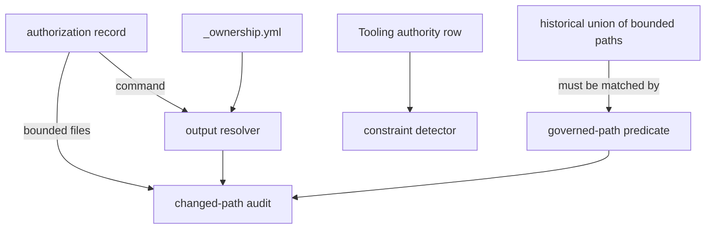

# An audit that reads the authorization it was given — Technical Spec

## Vocabulary Contract

- emits: `internal/speccheck/mechanical.go`
  pattern: `governed path`
  documented-in: `CONTEXT.md`

Governed Path is this Spec's coined term: it names a repository path the tooling
rules bind, as distinct from an ordinary path a Task may change without any
grant. It reaches an author through a refusal message, so it needs the durable
owner the glossary gives. Declaring it makes `SC-VOCABULARY-UNDOCUMENTED` run
instead of skip.

## Executive Summary

The audit refuses three things it should not, and the repair for each is to read
something that already exists rather than to weaken a rule.

A grant is asked to enumerate every output of its regeneration command, which is
the enumeration of consequences ADR-0081 rejected. The repository already records
that ownership where the artifacts live, in `_ownership.yml`, so a grant names the
command and the audit resolves the outputs from the tree (ADR-0129).

Every changed path is read as governed, so an ordinary Go file alongside an
authorized asset fails a Task whose only fault was being one commit. The governed
class is defined by kind and enumerated nowhere; it becomes a declared set held to
the record of every path maintainers have actually bounded (ADR-0130).

And the PRD template writes a Tooling authority row the checker refuses. The row
states whether the constraint governs the Spec — it always does — and bounded
files become required only when the row declares a mutation (ADR-0131).

The primary trade-off is that resolving outputs from the tree makes the audit
depend on ownership records being correct, where an enumerated list is
self-contained. Accepted, because those records already have to be correct for
the Baseline to work, and because a second list is a second thing to keep true.
A smaller trade-off: a declared governed set can drift. The mitigation is not
vigilance but a check — the set must match every path any authorization has ever
bounded, so it can grow deliberately and cannot silently narrow.

## Project Constraints

- Identifier strategy: applicable — Tooling Authority, Project Constraint,
  Authorization Record and Sanctioned Regeneration are glossary terms this Spec
  changes the reading of, and Governed Path is coined vocabulary the glossary must
  own. The closing node checks whether the work introduced or changed a term.
  Source: `docs/agents/domain.md`.
- Authentication and HTTP: not applicable — no network boundary, credential or
  request is created or read. The work is static analysis of commits, records and
  authored artifacts. Source: `docs/agents/specific-repository.md`.
- Active ADR obligations: applicable — ADR-0129, ADR-0130 and ADR-0131 are this
  design's decisions. ADR-0081 is the decision the audit fails to implement and
  this Spec implements. ADR-0096 places the audit in the gate's mechanical stage
  and ADR-0117 puts a check with the stage that can produce its defect, which is
  why the tooling-row repair lands at authoring time; ADR-0128 already makes the
  suite guard and this audit read one declaration, and this Spec makes them share
  the parser rather than only the format. Source: `docs/agents/domain.md`.
- Tooling authority: applicable — the constraint governs this Spec, and no
  protected tooling mutation is proposed or authorized. The work is production Go
  in the consistency checker and its tests. The PRD template is deliberately left
  unchanged: ADR-0131 settles the disagreement in the checker precisely so that
  repairing the grant machinery does not itself require a grant. This row was
  written as `not applicable` while the Spec was authored, because the checker
  that reads it still refused the correct wording — the third such refusal, after
  the PRD was refused twice. The detector this Spec delivers accepts it, which is
  the row proving its own repair. Source: `docs/agents/agent-instructions.md`.

## System Architecture

One package is extracted, and three existing readers change.

**The regeneration reader** in `internal/suiteguardcontract` is already the
single parser of the `## Sanctioned regeneration` block, as of Spec 0103's
task_11. ADR-0128 made the audit and the suite guard read one declaration; that
Task made them read it with one reader. This design depends on that and adds
nothing to it.

**The output resolver** (`internal/baseline` exposing what it already validates)
answers "which paths does command C own?" from the `_ownership.yml` records. The
audit asks that instead of reading an `outputs:` list, and a grant that still
carries one keeps working — the list is a union with the resolved set, never a
replacement, so no existing record breaks.

**The governed-path predicate** (`internal/speccheck`) decides whether a changed
path is bound by the tooling rules at all. It reads a declared set and is held to
the union of every path any authorization record has ever bounded.

**The tooling-row detector** (`internal/speccheck/constraints.go`) requires
bounded files only when the row's reason declares a proposed or authorized
mutation, rather than whenever the row says `applicable`.



## Implementation Design

### Interfaces

The resolver answers one question.

```go
// OutputsFor returns the repository-relative paths the named regeneration
// command owns, read from the ownership records in the tree. ADR-0129 explains
// why a grant names the command rather than its consequences.
func OutputsFor(repoRoot string, command string) ([]string, error)
```

The predicate answers the other.

```go
// GovernedPath reports whether the tooling rules bind path. An ordinary source
// file is not governed and is never audited against a grant. ADR-0130 explains
// why the declared set is held to the historical record.
func GovernedPath(path string) bool
```

The shared reader replaces the duplicated one.

```go
// SanctionedRegeneration binds one declared command to its declared outputs.
// One parser, so the audit and the suite guard cannot disagree about a record.
type SanctionedRegeneration struct {
    Command string
    Outputs []string
}
```

### Data Models

No database entity changes. `_ownership.yml` gains no field: the audit reads the
`owner` and `command` it already carries. The governed set is a declared list
compiled into the checker rather than a new file, so it cannot be edited without
the code review that changes it.

### API Contracts

`roundfix spec check --stage prd` stops refusing a Tooling authority row that
records the constraint as applicable with no mutation proposed. It still refuses a
row that declares a mutation without bounded files, and still refuses a record
that does not name the Spec.

The QA gate's changed-path audit reports one finding per governed path a Task
commit changed that no grant reaches. It reports nothing for an ungoverned path,
and nothing for a path the named command owns.

## Coverage Map

- Goal 1, Story 1 → the output resolver and the shared reader.
- Goal 2, Story 2 → the governed-path predicate.
- Goal 3, Story 3 → the tooling-row detector.
- Story 4 → the output resolver, which is what lets a record state a cause.
- Core Feature 1 → the output resolver.
- Core Feature 2 → the governed-path predicate.
- Core Feature 3 → the tooling-row detector.
- Core Feature 4 → ADR-0131, implemented by the tooling-row detector.

## Integration Points

No network, no hosting provider, no Run Database. Git is read exactly as the
audit reads it today, through the existing commit inspection.

The Baseline is imported for the ownership records it already validates. That is
a new dependency edge from the checker toward the Baseline, and it is the reason
the resolver is exposed as one function rather than by moving ownership parsing
into the checker: the Baseline stays the owner of what ownership means.

## Testing Approach

- **The shared reader** — the existing tests of both parsers are the seam. The
  extraction must leave them passing unchanged; a test that has to change is a
  signal the two parsers disagreed and the merge picked a side, which is worth
  knowing.
- **The output resolver** — table-driven over the real ownership records: a
  command that owns a tree, a command that owns nothing, and a path owned by a
  different command. The measured case is `make baseline-digests`, whose declared
  outputs in the 2026-08-06 record must equal what the resolver returns, proving
  the two sources agree before the enumerated one is allowed to fall away.
- **The governed-path predicate** — one case per kind the universal clause names,
  plus the historical-union check, which is a repository-contract test reading
  every authorization record under `docs/workflow/authorizations/` and failing if
  any bounded path is ungoverned.
- **The tooling-row detector** — the template's exact wording passes; a row
  declaring a mutation without bounded files still fails; a row citing a record
  that does not name the Spec still fails.
- **The end-to-end refusal** — a fixture Task commit touching one authorized
  asset, one ordinary Go file, and one regenerated derived artifact passes, and
  the same commit with an unauthorized governed path still fails.

## Build Order

1. The tooling-row detector, so an author following the template stops being
   refused (depends on: nothing).
2. The governed-path predicate with its per-kind cases (depends on: nothing).
3. The historical-union contract test that holds the predicate to the record
   (depends on: 2).
4. The output resolver over the ownership records, proven against the enumerated
   list it will replace (depends on: nothing).
5. The audit reads the resolver and the predicate together, and the end-to-end
   refusal fixture (depends on: 3, 4).

Steps 1, 2 and 4 are independent. Step 5 is where the repairs meet, and it lands
last so a failure there is about their composition rather than about any one of
them.

The single regeneration reader this design planned as its first step already
exists: Spec 0103's task_11 pointed the changed-path audit at
`suiteguardcontract.ParseSanctionedRegenerations` on 2026-08-14, so the two
parsers named in System Architecture are already one, and
`parseMechanicalRegenerationOutputs` is the thin wrapper that remains. The step
was dropped after the pre-work gate audit found its checks passing on an
untouched tree.

## Risks & Considerations

**Resolving outputs from the tree makes the audit trust the ownership records.**
A record that is wrong now silently widens what a grant permits. The mitigation is
step 5's equality proof: the resolved set for `make baseline-digests` must equal
the enumerated set the 2026-08-06 record already carries, so the two sources are
compared before either is trusted alone. A future command with no enumerated list
has no such comparison, which is a real gap and is stated rather than closed.

**A declared governed set is a list, and lists rot.** The historical-union check
keeps it from narrowing, and nothing keeps it from being too narrow for a kind no
authorization has ever bounded — a tool the repository has not yet adopted. That
is the honest limit: the set is proven complete against what has been protected,
not against what could be.

**Making the audit refuse fewer things is the direction that loses safety.** Each
repair here is a narrowing of what the audit refuses, and a narrowing that goes
too far is invisible until something unauthorized lands. Every step therefore
carries a negative case alongside its positive one: a hand-edited derived pin
still refused, an unauthorized governed path still refused, a mutation without
bounded files still refused.

**The checker gains a dependency on the Baseline.** That edge is new and it points
from the smaller package to the larger one. If it proves awkward, the alternative
is to move ownership parsing into a shared package as step 1 already does for the
regeneration block — noted rather than pre-emptively built.

## Decisions

- A grant names the command; the tree names its outputs. See ADR-0129.
- The audit judges governed paths, and the historical record keeps the declared
  set honest. See ADR-0130.
- The Tooling authority row states applicability, not mutation, and the checker
  changes rather than the template. See ADR-0131.
- An enumerated `outputs:` list keeps working as a union with the resolved set, so
  no existing authorization record breaks on the day this lands.
