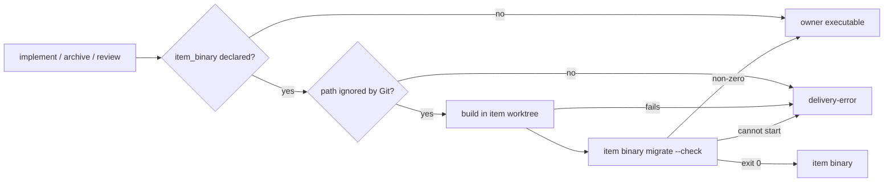

# A delivery queue that runs the binary its item builds — Technical Spec

## Executive Summary

The queue owner starts every child step of an item, `implement`, `archive`
and `review`, through one method that resolves `os.Executable()`, so the child
is always the owner's own build reading the item's Project Config. The fix
adds a Project Config declaration of the repository's Roundfix build, and
before each child the owner builds that binary in the item worktree, asks it
`migrate --check`, and starts the child with it when it would not change the
Run Database schema. `roundfix migrate --check` is the new, read-only probe.
The trade-off is a build of about one second per step and an item whose own
Daemon settles its Tasks, accepted because the item's code already runs as
its Verification and because the merge-deciding gates stay with the owner and
GitHub (ADR-0225).

## Project Constraints

- Identifier strategy: not applicable — no identifier scheme changes; the new
  key `delivery.item_binary` follows the existing dotted names. Source:
  `docs/agents/domain.md`.
- Authentication and HTTP: not applicable — local builds and local processes
  only; no request, credential or forge read is added, and tests stay offline.
  Source: `docs/agents/cli.md`, `docs/agents/agent-instructions.md`.
- Active ADR obligations: applicable — ADR-0225 (this Spec) governs the item
  binary and its schema rule. ADR-0192: "The declaration lives in Project
  Config because merge recovery is a repository policy", and the build runs
  through the same Verification executor as a derived regeneration. ADR-0027:
  "truly unknown keys keep failing strict validation", so the new key is
  refused by older binaries and no compatibility rule is added. ADR-0125:
  "Fixtures are therefore compiled once", which binds the fake item binary,
  and ADR-0213 ends each fixture process with its test binary. ADR-0193,
  ADR-0199 and ADR-0211 hold unchanged. ADR-0187 and ADR-0189 govern the
  Roundfix Skill edit. ADR-0184: "A TechSpec now declares numbered Surface
  Transcripts", applied to `migrate --check`. The gate is bound by ADR-0080,
  ADR-0088, ADR-0091, ADR-0104, ADR-0155, ADR-0156 and ADR-0167; ADR-0093,
  ADR-0117, ADR-0168, ADR-0176 and ADR-0183 check consistency; ADR-0166,
  ADR-0178 and ADR-0182 bind each Task commit. ADR-0096 and ADR-0097 cite ADR-0080 but decide the gate's machine stage and row carry, ADR-0194, ADR-0195 and ADR-0210 cite ADR-0097 but decide what a QA row records, when it is observed again and its evidence snapshot, and ADR-0220 cites ADR-0211 but decides the Doctor's delivery readiness; this Spec changes none of them, so none applies. Source: `docs/agents/domain.md`.
- Tooling authority: applicable — task_01 edits the Roundfix Skill, whose
  canonical files and `SKILL.md` mirror are Governed Paths; express maintainer
  authorization: "considere autorizado a ajustar todas as skills se
  necessário", and the cycle answer "Continue" of 2026-10-03; bounded files:
  `.agents/skills/roundfix/SKILL.md`,
  `.agents/skills/roundfix/references/deliver.md`,
  `.agents/skills/roundfix/references/setup.md`,
  `skills/roundfix/SKILL.md`. No other Governed Path changes, and the
  repository's own Project Config is not edited. Source:
  `docs/agents/agent-instructions.md`, `docs/agents/spec-routing.md`;
  Spec-contained authorization record:
  `docs/specs/0221-a-delivery-queue-that-runs-the-binary-its-item-builds/_authorization.md`.

## System Architecture

No new package or command; one new flag.

| Component | Where | Change |
| --- | --- | --- |
| Item build declaration | `Delivery`, `deliveryOverlay`, `applyOverlay` in `internal/config/config.go`; validation in `internal/config/delivery.go` | Adds `delivery.item_binary` with `build` and `path` |
| Migration check | `runMigrateCommand` in `internal/cli/migrate.go`; usage text in `internal/cli/cli.go` | Adds `--check`, read-only |
| Step executable | `commandDeliveryWorkflow` in `internal/cli/deliver_workflow.go` | Builds, probes and selects the executable for `implement`, `archive` and `review` |
| Skill and guides | Roundfix Skill `deliver` and `setup` references; `deliver`, `migrate` and configuration guides | Describe the behavior |



## Implementation Design

### Interfaces

```go
// internal/config/config.go
type Delivery struct {
	DerivedPaths []DerivedPathDeclaration
	ItemBinary   ItemBinaryDeclaration
}

// ItemBinaryDeclaration names the command that builds the repository's own
// Roundfix binary and the repository-relative path it writes. The zero value
// is undeclared.
type ItemBinaryDeclaration struct {
	Build string `yaml:"build"`
	Path  string `yaml:"path"`
}

func (declaration ItemBinaryDeclaration) Declared() bool

// internal/cli/deliver_workflow.go
type commandDeliveryWorkflow struct {
	// existing fields unchanged
	log io.Writer // nil writes to os.Stderr, the owner's console log
}

// stepExecutable returns the executable that runs step ("implement",
// "archive" or "review") for specSlug in workDir.
func (workflow *commandDeliveryWorkflow) stepExecutable(ctx context.Context, workDir, specSlug, step string) (string, error)

func (workflow *commandDeliveryWorkflow) runRoundfix(ctx context.Context, executable, workDir string, args ...string) (roundfixCommandResult, error)
```

### The declaration

`deliveryOverlay` gains `ItemBinary *ItemBinaryDeclaration` under
`item_binary`, decoded through a custom `UnmarshalYAML` that refuses any key
other than `build` and `path` with `delivery.item_binary.<key> is not a
supported config key`. `applyOverlay` replaces the whole value when the
overlay carries it, so Project Config replaces User Config as
`derived_paths` does. Validation, beside `validateDerivedPaths`, refuses:

1. a declaration with an empty `build` or an empty `path`:
   `delivery.item_binary requires build and path`;
2. a `path` that is absolute, holds a backslash, has a `..` segment, is `.`,
   or differs from its `path.Clean` form:
   `delivery.item_binary has unsafe path "<path>"`.

### The step executable

`stepExecutable` reads `workflow.loaded.Config.Delivery.ItemBinary`, the
configuration the owner loaded at start; it never reads the item's Project
Config. When the declaration is absent it returns `os.Executable()` and does
nothing else. Otherwise, in order:

1. `git check-ignore -q -- <path>` in `workDir`. A non-zero exit returns
   `item binary path "<path>" is not ignored by Git`.
2. The build command runs through `daemon.ExecVerifier` with `WorkDir`
   `workDir` and output
   `<artifact dir>/delivery/<slug>/item-binary-build.log`. A failure returns
   `build item binary: <verifier error>`, which names the command and the log.
3. The probe starts `<workDir>/<path> migrate --check` with `Dir` `workDir`
   and the environment `deliveryCommandEnvironment` gives every child. When it
   cannot start (missing file, not executable), it returns
   `run item binary "<absolute path>": <error>`.
4. Exit `0`: write the line of API Contract 2 and return the absolute item
   binary path.
5. Any other exit: write the notice of API Contract 3 and return
   `os.Executable()`.

`RunSpec`, `Archive` and `Review` call `stepExecutable` with the step names
`implement`, `archive` and `review` and pass its result to `runRoundfix`; an
error from it is returned as the step's error, which the engine parks
`delivery-error` as it parks every workflow error. `runRoundfix` keeps its
environment, working directory and result handling and only takes the
executable as a parameter. The build runs once per step, because each step
starts from a different item head.

### The migration check

`runMigrateCommand` accepts exactly `--check` as its single argument; every
other argument keeps the existing `unexpected argument` refusal. In check
mode:

1. An absent database prints `No Run Database at <path>; nothing to migrate`
   on stdout and exits `0`, creating nothing.
2. Otherwise `store.OpenReader` opens it; it never migrates. On success the
   command reads the version, closes the reader, prints
   `Run Database is at schema version <n>, the version this binary supports: <path>`
   on stdout and exits `0`.
3. A `store.SchemaVersionError` prints
   `roundfix: migrate check: <error>` on stderr and exits `2`; the error
   already names `roundfix migrate` for an older database and
   `roundfix upgrade` for a newer one.
4. Any other failure prints `roundfix: migrate check failed: <error>` on
   stderr and exits `1`.

The reader is the one the read-only commands use, so a write-ahead log a live
owner holds is read, and SQLite may leave its `-wal` and `-shm` sidecars; the
database file itself is never written.

### Data Models

No Run Database change. `Config.Delivery` gains one value.

### API Contracts

1. API Contract: `roundfix migrate --check` — outcomes and exit codes of "The
   migration check"; stdout for exit `0`, stderr otherwise; the database file
   keeps its bytes and version.
2. API Contract: item binary line, on the owner's console log, once per step:
   `roundfix: Delivery Queue item <slug>: <step> runs the item binary <absolute path>`.
3. API Contract: fallback notice, once per step:
   `roundfix: notice: Delivery Queue item <slug>: <step> runs the owner's binary; the item binary's migrate --check exited <n>: <first non-empty line of its stderr, else stdout>`.
4. API Contract: `delivery.item_binary` configuration errors, exactly the
   three messages of "The declaration".
5. API Contract: the park reasons of "The step executable", steps 1 to 3,
   inside the `delivery-error` blocker.

### Surface Transcripts

1. Surface Transcript: a current Run Database. The disposable Roundfix Home
   holds `.roundfix/roundfix.db` at this binary's schema version.

   ```transcript
   $ roundfix migrate --check
   stdout:
   Run Database is at schema version <n>, the version this binary supports: <path>
   stderr:
   exit: 0
   ```

2. Surface Transcript: an older Run Database, schema version 21 under a binary
   that supports 22 or later.

   ```transcript
   $ roundfix migrate --check
   stdout:
   stderr:
   roundfix: migrate check: Run Database "<path>" has schema version 21, older than the schema version <n> this binary supports; run 'roundfix migrate' to upgrade it
   exit: 2
   ```

3. Surface Transcript: no Run Database.

   ```transcript
   $ roundfix migrate --check
   stdout:
   No Run Database at <path>; nothing to migrate
   stderr:
   exit: 0
   ```

The owner's console-log lines have no transcript: no command prints them
alone. API Contracts 2 and 3 fix their bytes, and task_04's tests assert them
through the workflow's `log` writer.

## Vocabulary Contract

No new glossary term is adopted by this Spec; "item binary" is used in its
plain sense and the QA gate's glossary check decides whether it needs an
entry. The emitted words are `migrate --check`, `delivery.item_binary`, the
two console-log lines and the configuration and park messages above. task_01
documents each in the `deliver`, `migrate` and configuration guides and the
Roundfix Skill.

## Coverage Map

- Goal 1 → The step executable; API Contract 2.
- Goal 2 → The step executable steps 3 to 5; The migration check.
- Goal 3 → The step executable (absent declaration).
- Goal 4 → The migration check; API Contract 1.
- User Story 1 → The step executable; API Contract 2.
- User Story 2 → The step executable; API Contract 3.
- User Story 3 → The step executable; API Contract 5.
- User Story 4 → The declaration; API Contract 4.
- User Story 5 → The migration check; Surface Transcripts 1-3.
- Core Feature 1 → The declaration; API Contract 4.
- Core Feature 2 → The step executable steps 1 and 2.
- Core Feature 3 → The step executable step 4; API Contract 2.
- Core Feature 4 → The step executable step 5; API Contract 3.
- Core Feature 5 → The step executable steps 1 to 3; API Contract 5.
- Core Feature 6 → The step executable (absent declaration).
- Core Feature 7 → The migration check; API Contract 1; Surface Transcripts 1-3.
- Core Feature 8 → Build Order 1.
- Success Metric 1 → Testing Approach 3.
- Success Metric 2 → Testing Approach 3.
- Success Metric 3 → Testing Approach 3.
- Success Metric 4 → Testing Approach 1.

## Integration Points

- **Verification executor.** The build reuses `daemon.ExecVerifier`, the path
  the repository gate and derived regeneration already take.
- **Run Database.** Only `migrate --check` of the item binary reads it before
  the item binary is trusted with it; the owner keeps its own writer
  connection.
- **Item worktree.** The built binary lives at an ignored path, so the
  owner's clean-tree checks and the archive's exact-diff check see nothing
  new.

## Testing Approach

1. **Migration check**, in the new file `internal/cli/migrate_check_test.go`,
   through `runCLI` with disposable homes and the seeds of
   `internal/cli/migrate_test.go`: a current, an older, a newer and an absent
   database give the outcomes of API Contract 1; the database bytes and
   `PRAGMA user_version` are unchanged and no file other than `-wal` or
   `-shm` appears; `migrate --check extra` is refused with the existing
   `unexpected argument` message. Every existing `migrate_test.go` test passes
   unedited.
2. **Declaration**, in the new file
   `internal/config/delivery_item_binary_test.go`, through `Load` and
   `ResolveConfigProposal`: a Project Config declaration is read; a Project
   declaration replaces a User one; each message of API Contract 4 is
   returned for its input; an undeclared configuration yields the zero value.
   `internal/config/delivery_derived_paths_test.go` passes unedited.
3. **Step executable**, in the new file
   `internal/cli/deliver_item_binary_test.go`, over a disposable repository
   whose `.gitignore` ignores `bin/`, a disposable Roundfix Home and a fake
   item binary compiled once with `testfixture.FixtureBinary` (ADR-0125). The
   declared build copies that fixture to `bin/roundfix`; the fixture records
   its arguments and working directory to a file the test names and answers
   `migrate --check` with an exit code the test chooses. Cases: the
   declaration selects the item binary and writes API Contract 2's line;
   `RunSpec`, `Archive` and `Review` each start the fixture with the arguments
   the owner's binary received before; a probe exit of `2` returns the owner's
   executable with API Contract 3's notice and the fixture records only the
   probe; a build that exits `7` and an unignored path each return API
   Contract 5's error and start nothing; no declaration returns the owner's
   executable, runs no build and writes no line. No test writes an executable
   with a literal mode.

## Build Order

1. The Roundfix Skill `deliver` and `setup` references, their mirrors, the
   version record, and the `deliver`, `migrate` and configuration guides,
   written from this TechSpec, task_01 (depends on: none).
2. `roundfix migrate --check` with its usage text and tests, task_02 (depends
   on: 1).
3. The `delivery.item_binary` declaration with its tests, task_03 (depends
   on: 1).
4. The step executable in the owner with its tests, task_04 (depends on: 2,
   3).
5. Terminal QA, task_05 (depends on: 1, 2, 3, 4).

## Risks & Considerations

- **The item judges its own Tasks.** The item binary's Daemon settles the
  item's Tasks and its `review` assembles the review. The repository gate the
  owner runs and the Pull Request's required checks still decide the merge,
  as ADR-0225 records.
- **A stale write-ahead log.** The check reads through the read-only reader,
  which sees the log, so a migration not yet checkpointed is not misread.
- **A build that writes outside its path.** The owner checks only the
  declared path; a build that dirties tracked files would be caught by the
  next step's clean-tree checks, as any dirt is today.
- **Self-delivery.** This Spec's own delivery runs on an owner built before
  it, which is why Roundfix's Project Config is not edited here (PRD Open
  Questions).

## Decisions

- The owner reads the declaration it loaded at start, not the item's Project
  Config and not the default branch at each step, so an owner older than
  `main` never fails on a key it cannot read.
- A schema difference falls back to the owner's binary; a broken declaration
  parks. See ADR-0225.
- `migrate --check` reuses the read-only reader instead of an immutable file
  read, trading possible sidecar files for a correct answer under a live
  write-ahead log.
