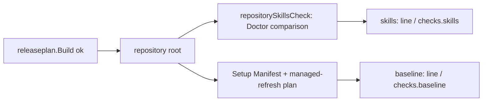

# Adjustments the adopters asked for — Technical Spec

## Executive Summary

Three independent slices, each small. The Baseline marks `branch.prefix`
optional with the machinery Spec 0207 built for `frontend.layout`, removes it
from the core module's required decisions, and moves the prefix sentence from
the agent-instructions template into the decision's renderer, so a recorded
value renders today's bytes and an unrecorded one renders the commit-type rule.
The `qa-gate` skill gains one paragraph. The release plan reuses the Doctor's
skills comparison and the Baseline update's managed-refresh planning to print
two read-only lines after a successful range plan. The trade-off this design
accepts is that the release plan now loads the Baseline catalog and plans a
managed refresh on every range plan, about a tenth of a second measured on this
repository, in exchange for a report that cannot drift from the commands the
runbook names.

## Project Constraints

- Identifier strategy: not applicable — no identifier scheme changes; the
  decision keeps `branch.prefix`, and the JSON field `checks` names no
  identifier. Source: `docs/agents/domain.md`.
- Authentication and HTTP: not applicable — local reads only; the release
  plan's checks read local files and contact no service, and no test reaches
  the network. Source: `docs/agents/cli.md`,
  `docs/agents/agent-instructions.md`.
- Active ADR obligations: applicable — ADR-0228 (this Spec) governs the
  optional branch prefix. ADR-0205: "The decision is optional: while a
  repository records none, the Baseline states the suggestion", and its
  machinery is reused unchanged. ADR-0118 and ADR-0150 keep the decision key
  and its `<type>/` default, ADR-0150: "Keep the compatible `branch.prefix`
  string key with `<type>/` as its pattern default". ADR-0222: "four sentences
  the Baseline renders still did not hold for every repository that reads
  them"; the unrecorded wording holds for every reader. ADR-0187 and ADR-0189
  govern the Roundfix Skill and `qa-gate` edits. ADR-0184: "A TechSpec now
  declares numbered Surface Transcripts", applied to the release plan. The gate
  is bound by ADR-0080, ADR-0088, ADR-0091, ADR-0104, ADR-0155, ADR-0156 and
  ADR-0167; ADR-0093, ADR-0117, ADR-0168, ADR-0176 and ADR-0183 check
  consistency; ADR-0166, ADR-0178 and ADR-0182 bind each Task commit. ADR-0096,
  ADR-0097, ADR-0194, ADR-0195 and ADR-0210 decide row carry and observation,
  which the `qa-gate` paragraph restates without changing. The adopted branch-prefix entry cites ADR-0191 for clause retention, but ADR-0191 decides how a setup snapshot follows its upstream by name, ADR-0204 and ADR-0206 cite it but decide composed setups and upstream setup names, ADR-0219 cites ADR-0204 but decides which built-in profile a draft adapts (a draft may now omit the branch prefix only because no module requires it), and ADR-0192 cites ADR-0178 but decides how a conflict in declared derived paths is resolved; this Spec changes none of them, so none applies. Source:
  `docs/agents/domain.md`.
- Tooling authority: applicable — express maintainer authorization on
  2026-10-04: "Autorizar os dois" for the Baseline source, the agent guides and
  the governed Baseline test the source change invalidates; "considere
  autorizado a ajustar todas as skills se necessário" for the skills. Source:
  `docs/agents/agent-instructions.md`, `docs/agents/spec-routing.md`;
  Spec-contained authorization record:
  `docs/specs/0223-adjustments-the-adopters-asked-for/_authorization.md`;
  bounded files: `.agents/skills/qa-gate/SKILL.md`,
  `.agents/skills/roundfix/SKILL.md`,
  `.agents/skills/roundfix/references/release.md`,
  `docs/agents/setup-context.json`,
  `internal/baseline/assets/decisions.json`,
  `internal/baseline/assets/modules/core.json`,
  `internal/baseline/assets/templates/guides/agent-instructions.md`,
  `internal/cli/baseline_plan_test.go`, `skills/qa-gate/SKILL.md`,
  `skills/roundfix/SKILL.md`.

## System Architecture

No new package or command.

| Component | Where | Change |
| --- | --- | --- |
| Branch prefix decision | `internal/baseline/assets/decisions.json`, `modules/core.json`, `templates/guides/agent-instructions.md` | Optional, not required by core, sentence moves into the renderer |
| Decision rendering | `renderProjectDecision`, `renderUnrecordedProjectDecision` in `internal/baseline/project_decision_render.go` | A `branch.prefix` case in each |
| QA gate skill | `.agents/skills/qa-gate/SKILL.md`, section "Row input declaration" | One paragraph, version raised |
| Release plan checks | new `internal/cli/releaseplan_checks.go`; `internal/cli/releaseplan_command.go`; skills helper extracted in `internal/cli/doctor.go`; usage in `internal/cli/cli.go` | Two read-only checks after a successful range plan |
| Skills and guides | Roundfix Skill release reference; release runbook; Context-Driven Development guide | Describe the behavior |



## Implementation Design

### Interfaces

```go
// internal/baseline/project_decision_render.go
const branchPrefixDecisionID = "branch.prefix"
// renderProjectDecision gains the branchPrefixDecisionID case; renderUnrecordedProjectDecision
// gains the same case. Both return the Fixed texts below.

// internal/cli/doctor.go
// repositorySkillsCheck returns the result the Doctor's skills: line reports
// for repositoryRoot; the Doctor calls it, and its output does not change.
func repositorySkillsCheck(ctx context.Context, dependencies doctorDependencies, repositoryRoot string) CheckResult

// internal/cli/releaseplan_checks.go
type releasePlanCheck struct {
	Status     string
	Detail     string
	NextAction string // empty when Status is ok or current
}
type releasePlanChecks struct {
	Skills   releasePlanCheck
	Baseline releasePlanCheck
}
func collectReleasePlanChecks(ctx context.Context, source releasePlanGitSource, environment commandEnvironment) releasePlanChecks
```

### The optional branch prefix

1. `decisions.json`: `branch.prefix` gains `"optional": true`. Its `version`
   (2), `type`, `default` (`<type>/`), `summary` and render binding keep their
   bytes; the summary is the prompt text a governed human-flow test pins.
2. `modules/core.json`: `requiredDecisions` loses `branch.prefix`. The four
   built-in profiles keep it in their decisions, so first adoption asks it and
   a recorded value stays selected.
3. `templates/guides/agent-instructions.md`: the five lines from "The
   branch-prefix pattern is" to "documented namespace." become the single line
   `{{branch.prefix}}`. The template's version is not raised, because no
   catalog check requires it.
4. The renderer returns, for a recorded value `v`, the five lines exactly as
   the template rendered them before (Fixed text 1), and, while unrecorded,
   Fixed text 2. `catalog.decision.optional.invalid` already accepts the
   declaration: a valid default and only `renderBindings` under
   `{"present": true}`.
5. `make baseline-digests` regenerates `internal/baseline/testdata/catalog.digest`,
   `catalog.normalized.json` and four plan goldens (`advisory-only-divergences`,
   `clean-adoption`, `idempotent-replan-after-verified-apply`,
   `same-baseline-changed-profile-and-catalog-digests`), whose only semantic
   change is the catalog digest. No setup, profile, Source Baseline or
   formatter fixture changes. The public Managed Refresh then rewrites only the
   catalog digest in `docs/agents/setup-context.json`; this repository records
   `<type>/`, so `docs/agents/agent-instructions.md` keeps its bytes.
6. Clause retention (Baseline rule for removed clauses): no Normative Clause is
   removed or renamed. The moved sentence is template prose; the Source
   Baseline clause manifests carry no entry for it, and
   `classifySourceClauseTransition` reads only clause entries, so no
   `replaces` declaration or retention disposition is needed.
7. `internal/cli/baseline_plan_test.go`, case
   `decisions-absent-names-every-required-decision`: it asserts that every
   decision of the Go CLI/TUI profile is named missing. It now skips a decision
   the embedded catalog declares optional and asserts that `branch.prefix` is
   not named.

Fixed text 1 (recorded `v`, each line ends with a newline except the last):

```text
The branch-prefix pattern is `v`; `<type>` is replaced by the
work's purpose, never used literally. Use `<type>/` as the portable decision
value. Legacy personal-prefix values must be revised through Baseline and do
not override the purpose-based branch rule below. Tool-owned Run and Task
branches follow their tool's documented namespace.
```

Fixed text 2 (unrecorded):

```text
No branch prefix is recorded. Name new work branches `<type>/<description>`,
where `<type>` is the work's Conventional Commit type, as the branch rule
below states. Tool-owned Run and Task branches follow their tool's documented
namespace.
```

### The QA gate paragraph

In `.agents/skills/qa-gate/SKILL.md`, section "Row input declaration", after
the paragraph that ends "Do not add inputs after execution to make
carry-forward eligible.", task_01 adds:

```text
A gate reopened over a report written before rows declared inputs re-executes
every row that report recorded without `inputs:`; such a row is never
carriable. A row executed again in a new pass declares its inputs for that pass
when the pass plans it as `pending`. That is a new observation with its own
inputs, not inputs added after execution; never add `inputs:` to the earlier
report's rows.
```

The skill's version rises from 0.0.7 to 0.0.8 in both front-matter fields. The
`### QA settlement` section keeps its bytes. The Daemon's carry decision is
unchanged: a row without inputs is already refused with the reason
`no inputs`.

### The release plan checks

`runReleasePlanCommand` calls `collectReleasePlanChecks` only after
`releaseplan.Build` succeeds, and passes the result to both printers. The reset
plan, a refused plan and a failed plan never call it.

1. The repository root is `git rev-parse --show-toplevel` through the plan's
   Git runner. When it fails, both checks are `failed` with
   `resolve repository root: <error>`.
2. Skills: `repositorySkillsCheck`, the code the Doctor's `skills:` line runs,
   extracted from the Doctor without changing its output. Status is the
   Doctor's check status (`ok`, `unversioned`, `warn` or `failed`) and detail
   is its detail.
3. Baseline: `baseline.LoadEmbeddedCatalog`, then
   `baseline.ResolveManifestInput`. No Setup Manifest gives `action_required`
   with `the repository has no Setup Manifest`; new decisions give
   `action_required` with
   `the current Baseline catalog requires new decisions: <ids>`. Otherwise
   `baseline.BuildPlan` with the managed-refresh preservation mode and the
   command's executable directories: no file change and no history move gives
   `current` with `the repository already matches the current Baseline catalog`;
   otherwise `plan_ready` with `<n> file change(s)`, followed by
   `, <m> history move(s)` when there are moves. An outcome without a plan
   reports its own state and message; any error gives `failed` with the error.
   `roundfix baseline update` is not changed.
4. Every status other than `ok` and `current` carries the next action
   `complete the skills and guides check in the release runbook before the release Pull Request`.

### Data Models

No Run Database or configuration change. The release plan JSON gains one
object.

### API Contracts

1. API Contract: release plan text — after the `Next action:` line and before
   any commit list, exactly two lines: `skills: <status>: <detail>` and
   `baseline: <status>: <detail>`, each followed by
   `; next: <next action>` when its status is neither `ok` nor `current`.
2. API Contract: release plan JSON — a top-level `checks` object between
   `approval` and `changes`:
   `{"skills": {"status", "detail", "nextAction"?}, "baseline": {...}}`, with
   `nextAction` omitted when empty. `schemaVersion` stays
   `roundfix.release-plan/0.0.1`; the field is additive and absent from a reset
   plan.
3. API Contract: the checks never change `state`, `proposedVersion` or the
   exit code, and write nothing.
4. API Contract: the agent-instructions guide renders Fixed text 1 for a
   recorded `branch.prefix` and Fixed text 2 while it is unrecorded.
5. API Contract: `roundfix release plan --help` gains the sentence "A range
   plan also reports the skills and baseline checks read-only; they never
   change the decision state, the proposed version, or the exit code."

### Surface Transcripts

1. Surface Transcript: a repository without a Setup Manifest or owned skills,
   tag `v0.4.0`, one `fix:` commit after it.

   ```transcript
   $ roundfix release plan
   stdout:
   Decision: ready
   Base: v0.4.0 (<sha>)
   Target: HEAD (<sha>)
   Impact: patch
   Breaking: false
   Proposed version: v0.4.1
   Approval required: no
   Next action: release may proceed for v0.4.1 after independent release verification.
   skills: failed: missing: <owned skill names>; Setup Manifest is absent or unreadable; 0 external required; next: complete the skills and guides check in the release runbook before the release Pull Request
   baseline: action_required: the repository has no Setup Manifest; next: complete the skills and guides check in the release runbook before the release Pull Request
   Determining commits:
   - <sha> fix: correct output [impact=patch, type=fix]
   stderr:
   exit: 0
   ```

2. Surface Transcript: an adopted repository whose skills and guidance are
   current, at the same range.

   ```transcript
   $ roundfix release plan
   stdout:
   Decision: ready
   Base: v0.4.0 (<sha>)
   Target: HEAD (<sha>)
   Impact: patch
   Breaking: false
   Proposed version: v0.4.1
   Approval required: no
   Next action: release may proceed for v0.4.1 after independent release verification.
   skills: ok: <n> required: <n> Roundfix-owned, <n> external
   baseline: current: the repository already matches the current Baseline catalog
   Determining commits:
   - <sha> fix: correct output [impact=patch, type=fix]
   stderr:
   exit: 0
   ```

## Vocabulary Contract

No new glossary term. The emitted words are the two line prefixes `skills:`
and `baseline:`, the JSON field `checks`, the status values the Doctor and the
Baseline update already emit, the next-action sentence, the help sentence of
API Contract 5, and Fixed texts 1 and 2. task_01 documents the release words
in the Roundfix Skill release reference and the release runbook, and the
branch prefix words in the Context-Driven Development guide.

## Coverage Map

- Goal 1 → The optional branch prefix; API Contract 4; Fixed texts 1 and 2.
- Goal 2 → The QA gate paragraph.
- Goal 3 → The release plan checks; API Contracts 1-3.
- User Story 1 → The optional branch prefix steps 1-4; Fixed text 2.
- User Story 2 → The optional branch prefix steps 4-5; Fixed text 1.
- User Story 3 → The QA gate paragraph.
- User Story 4 → The release plan checks; API Contracts 1, 2 and 5; Surface Transcripts 1-2.
- Core Feature 1 → The optional branch prefix steps 1, 2 and 7.
- Core Feature 2 → The optional branch prefix steps 3-4; API Contract 4.
- Core Feature 3 → The optional branch prefix steps 5-6.
- Core Feature 4 → The QA gate paragraph.
- Core Feature 5 → The release plan checks; API Contracts 1-3.
- Core Feature 6 → Build Order 1.
- Success Metric 1 → Testing Approach 1.
- Success Metric 2 → Testing Approach 2.
- Success Metric 3 → Testing Approach 3.
- Success Metric 4 → Build Order 1.

## Integration Points

- **Doctor.** The skills check moves into a helper both commands call; the
  Doctor's line keeps its bytes.
- **Baseline update.** The release plan calls the same `baseline` package
  functions the update calls, without its skills stage and without applying.
- **Setup Manifest.** This repository's manifest records `<type>/`; only its
  catalog digest moves.

## Testing Approach

1. **Branch prefix rendering**, in the new file
   `internal/baseline/branch_prefix_optional_test.go`:
   `TestAnUnrecordedBranchPrefixStatesTheCommitTypeRule` (a built-in profile
   planned without the answer reports no missing decision and renders Fixed
   text 2, not "The branch-prefix pattern is"),
   `TestARecordedBranchPrefixKeepsItsSentence` (`<type>/` and `ma/` render
   Fixed text 1), `TestBranchPrefixIsAnOptionalDecision` (the catalog declares
   it optional, the core module does not require it, and every built-in profile
   still selects it).
2. **Update**, in the new file `internal/cli/baseline_branch_prefix_test.go`:
   `TestBaselineUpdateWithoutABranchPrefixAsksNothing` (a Setup Manifest
   without the decision: `baseline update --format=json` reports no new
   decision and no `decision` category; after `--yes` the guide carries Fixed
   text 2 and the manifest records no prefix),
   `TestBaselineUpdateKeepsARecordedBranchPrefix` (the recorded value and its
   paragraph are kept). The characterization corpus
   `TestBaselinePlanAdoptionAndDecisionCharacterizationCorpus` passes with the
   case of step 7.
3. **Release plan**, in the new file `internal/cli/releaseplan_checks_test.go`:
   `TestReleasePlanReportsTheSkillsAndBaselineChecks` (text and JSON in a
   repository without a manifest), `TestReleasePlanChecksNeverChangeTheDecision`
   (the outcome table's state, proposed version and exit with failing checks),
   `TestReleasePlanChecksOnAnAdoptedRepository` (an adopted fixture with this
   repository's skills copied in reports `ok` and `current`; a stale one
   reports `plan_ready` with the count `baseline update --no-skills` reports),
   `TestReleasePlanChecksWriteNothing` (tree bytes and `git status --porcelain`
   equal before and after on a repository with pending Baseline changes). The
   Doctor and release plan tests pass unedited.

## Build Order

1. The `qa-gate` paragraph, the Roundfix Skill release reference, both version
   raises and records, the release runbook and the Context-Driven Development
   guide, written from this TechSpec, task_01 (depends on: none).
2. The optional branch prefix with its derived artifacts, this repository's
   Setup Manifest, the characterization case and its tests, task_02 (depends
   on: 1).
3. The release plan checks with the Doctor helper, the usage sentence and the
   tests, task_03 (depends on: 1).
4. Terminal QA, task_04 (depends on: 1, 2, 3).

## Risks & Considerations

- **A repository-owned profile may drop the decision.** No module requires it
  any more, so a profile draft no longer refuses its absence; a Setup Manifest
  that still records it under such a profile is refused as before, naming the
  unselected decision.
- **Doctor parity.** Extracting the skills check must keep the Doctor's output
  byte-identical; the Doctor tests run unedited.
- **Cost.** The release plan loads the catalog and plans a refresh; measured at
  0.38 s against 0.44 s for the unchanged binary on this repository, within
  noise.
- **Queue order.** Specs 0222, 0224 and 0226 may raise the Roundfix Skill's
  version too; task_01 raises it from the tree it starts on.

## Decisions

- Remove the decision from core's required list rather than keep it there, as
  the frontend layout precedent does; the built-in profiles keep offering it.
- Move the whole sentence into the renderer, so a recorded value keeps its
  bytes and no template line reads half a rule while unrecorded.
- Report the checks with the vocabulary of the commands they mirror, rather
  than invent a pass or fail scale.
- Keep `schemaVersion`: the field is additive and no consumer pins the key set.
