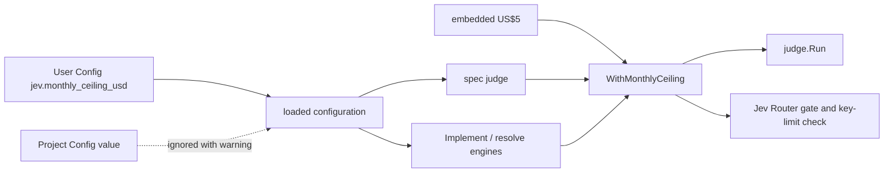

# A Jev ceiling the maintainer sets — Technical Spec

## Executive Summary

The monthly Jev ceiling is read today from the judge's embedded questions
file, which the judge, the Jev Router gate and its key-limit check all load.
This design adds one User Config value, `jev.monthly_ceiling_usd`, and one
rule that applies it: when the value is set it replaces the embedded ceiling,
and when it is unset the embedded US$5 stays. The judge command and the
Implement and resolve engines pass the loaded value to that rule; nothing
else changes. The trade-off is that the embedded value stays the default
instead of moving into the configuration package, accepted because every
existing test and the judge's measured settings keep reading it unchanged,
and because an unset value then needs no second copy of the number
(ADR-0231).

## Project Constraints

- Identifier strategy: not applicable — no identifier scheme changes; the new
  key follows the existing dotted configuration names. Source:
  `docs/agents/domain.md`.
- Authentication and HTTP: not applicable — recipients, endpoints and keys
  are unchanged and every test stays offline, with the router's key endpoint
  served by a local test server. Source: `docs/agents/cli.md`,
  `docs/agents/agent-instructions.md`.
- Active ADR obligations: applicable — ADR-0231 (this Spec) governs the key,
  its default and its scope, and supersedes in part ADR-0201, which sets "a
  spending ceiling of US$5 per calendar month", and ADR-0218, whose prompts
  run "under the US$5 monthly ceiling that ADR-0201 sets". The gate's refusal
  stands, ADR-0218: "At or above the ceiling, or when either source cannot
  be read, the prompt is not sent". ADR-0002: "Roundfix uses YAML for User
  Config at", the file the operator edits. ADR-0027: "truly unknown keys keep
  failing strict validation", so no compatibility rule is added for older
  binaries. ADR-0114: "A Fallback Selection may switch ACP Runtime
  automatically only while Agent work has not begun", unchanged.
  ADR-0187 and ADR-0189 govern the Roundfix Skill edit. ADR-0184:
  "A TechSpec now declares numbered Surface Transcripts", applied to
  `roundfix spec judge`. The gate is bound by ADR-0080, ADR-0088, ADR-0091,
  ADR-0104, ADR-0155, ADR-0156 and ADR-0167; ADR-0093, ADR-0117, ADR-0168,
  ADR-0176 and ADR-0183 check consistency; ADR-0166, ADR-0178 and ADR-0182
  bind each Task commit. ADR-0096 and ADR-0097 cite ADR-0080 but decide the gate's machine stage and row carry, ADR-0192 cites ADR-0178 but decides derived-path conflict regeneration, and ADR-0200 and ADR-0209 cite ADR-0201 but decide that the judge never gates and that it only suggests which sources share a Spec, ADR-0208 cites ADR-0209 but decides how sources are grouped, and ADR-0194, ADR-0195 and ADR-0210 cite ADR-0097 but decide what a QA row records, when it is observed again and its evidence snapshot; this Spec changes none of them, so none applies. Source: `docs/agents/domain.md`.
- Tooling authority: applicable — task_01 edits the Roundfix Skill, whose
  canonical files and `SKILL.md` mirror are Governed Paths; express maintainer
  authorization: "considere autorizado a ajustar todas as skills se
  necessário", and the decision of 2026-10-04 quoted in the PRD; bounded
  files: `.agents/skills/roundfix/SKILL.md`,
  `.agents/skills/roundfix/references/runtime.md`,
  `.agents/skills/roundfix/references/spec.md`,
  `skills/roundfix/SKILL.md`. No other Governed Path changes, and the
  repository's own Project Config is not edited. Source:
  `docs/agents/agent-instructions.md`, `docs/agents/spec-routing.md`;
  Spec-contained authorization record:
  `docs/specs/0225-a-jev-ceiling-the-maintainer-sets/_authorization.md`.

## System Architecture

No new package, command or flag.

| Component | Where | Change |
| --- | --- | --- |
| Configured ceiling | `Config`, `configOverlay`, `applyConfigContent` in `internal/config/config.go` | Adds `jev.monthly_ceiling_usd`, User Config only |
| Ceiling rule | `Questions` in `internal/judge/questions.go` | Adds `WithMonthlyCeiling` |
| Judge command | `runSpecJudgeCommand` and its usage in `internal/cli/spec_judge.go` | Applies the loaded value |
| Router gate | `Dependencies` and `NewEngine` in `internal/daemon/engine.go`; the Implement Run engine in `internal/cli/implement.go`; the resolve engine in `internal/cli/cli.go` | Applies the loaded value |
| Guides, skill and ADR notes | configuration and `spec` guides; Roundfix Skill `spec` and `runtime` references | Describe the value |



## Implementation Design

### Interfaces

```go
// internal/config/config.go
type Jev struct {
	// MonthlyCeilingUSD is the User Config Jev ceiling in US dollars. Zero
	// means unset, and every consumer keeps the judge's built-in ceiling.
	MonthlyCeilingUSD float64
}

type Config struct {
	// existing fields unchanged
	Jev Jev
}

type jevOverlay struct {
	MonthlyCeilingUSD *float64 `yaml:"monthly_ceiling_usd"`
}

// internal/judge/questions.go
// WithMonthlyCeiling returns q with ceilingUSD as its monthly ceiling when
// ceilingUSD is greater than zero, and q unchanged otherwise.
func (q Questions) WithMonthlyCeiling(ceilingUSD float64) Questions

// internal/daemon/engine.go
type Dependencies struct {
	// existing fields unchanged
	JevMonthlyCeilingUSD float64 // zero keeps the judge's built-in ceiling
}
```

### The configured ceiling

`configOverlay` gains `Jev *jevOverlay` under `jev`. In
`applyConfigContent`, beside the existing `runs.max_active` removal, a
Project Config document has the path `jev.monthly_ceiling_usd` removed before
decoding, and `warnIgnoredProjectSetting("jev.monthly_ceiling_usd")` prints
API Contract 2. For any other source, a present value that is not finite or
not greater than zero returns
`parse config "<path>": jev.monthly_ceiling_usd must be a finite number greater than 0`
(API Contract 3); otherwise it sets `Config.Jev.MonthlyCeilingUSD`.
`Builtin()` leaves it zero. `roundfix config init` templates are unchanged.

### The ceiling rule

`WithMonthlyCeiling` is the only place a configured value meets the embedded
one. It copies `q` and replaces `MonthlyCeilingUSD` when the argument is
greater than zero. `judge.Run`, `jevrouter.MonthSpend` and
`Spend.CheckKeyLimit` keep reading the ceiling they are given, so their
messages, `monthly ceiling reached (US$<spend> of US$<ceiling>)`,
`jev_ceiling_reached: month's Jev spend US$<spend> of US$<ceiling>` and
`jev_router_key_unbounded: set a monthly credit limit of at most US$<ceiling> on the key at OpenRouter`,
name the effective value.

### The consumers

1. `runSpecJudgeCommand` passes
   `questions.WithMonthlyCeiling(loaded.Config.Jev.MonthlyCeilingUSD)` to
   `judge.Run`. Its usage text replaces "The monthly ceiling is US$5.00" with
   a sentence naming `jev.monthly_ceiling_usd` in User Config and "US$5 by
   default", and keeps the phrase "monthly ceiling".
2. `NewEngine` builds the default gate with
   `questions.WithMonthlyCeiling(deps.JevMonthlyCeilingUSD).MonthlyCeilingUSD`.
   An injected gate is used as before.
3. The Implement Run engine and the resolve engine set
   `JevMonthlyCeilingUSD` from the configuration their command loaded. The
   other `NewEngine` call, which only pushes, starts no Agent prompt and is
   left as it is.

### Data Models

No Run Database or Judge Log change. `Config` gains one value.

### API Contracts

1. API Contract: `jev.monthly_ceiling_usd` in User Config — a finite number
   greater than zero, in US dollars; unset means US$5.
2. API Contract: the Project Config warning, on standard error, once per
   load: `config: jev.monthly_ceiling_usd in Project Config is ignored; set jev.monthly_ceiling_usd in User Config`.
3. API Contract: the configuration error for an invalid value:
   `jev.monthly_ceiling_usd must be a finite number greater than 0`, inside
   the existing `parse config "<path>": ` wrapping.
4. API Contract: the judge's text summary, JSON `month_ceiling_usd`, the
   `jev_ceiling_reached` reason and the `jev_router_key_unbounded` message
   carry the effective ceiling.

### Surface Transcripts

Each runs in a disposable repository holding one active Spec
`0300-example` with a PRD, a disposable `HOME`, `NODE_OPTIONS` unset, and
`ROUNDFIX_TYPESAFE_API_KEY` set to a dummy value with
`ROUNDFIX_OPENROUTER_API_KEY` unset. The month's Judge Log already reaches the
ceiling, so no request is sent.

1. Surface Transcript: User Config sets `jev.monthly_ceiling_usd: 50` and the
   Judge Log month holds US$50.25.

   ```transcript
   $ roundfix spec judge 0300-example
   stdout:
   ...
   Judge: skipped: monthly ceiling reached (US$50.2500 of US$50.00); <n> judgment(s) not asked
   stderr:
   exit: 0
   ```

2. Surface Transcript: no User Config value and the Judge Log month holds
   US$5.25, the behavior before this Spec.

   ```transcript
   $ roundfix spec judge 0300-example
   stdout:
   ...
   Judge: skipped: monthly ceiling reached (US$5.2500 of US$5.00); <n> judgment(s) not asked
   stderr:
   exit: 0
   ```

3. Surface Transcript: Project Config sets `jev.monthly_ceiling_usd: 50`,
   User Config sets nothing, and the Judge Log month holds US$5.25.

   ```transcript
   $ roundfix spec judge 0300-example
   stdout:
   ...
   Judge: skipped: monthly ceiling reached (US$5.2500 of US$5.00); <n> judgment(s) not asked
   stderr:
   config: jev.monthly_ceiling_usd in Project Config is ignored; set jev.monthly_ceiling_usd in User Config
   exit: 0
   ```

4. Surface Transcript: User Config sets `jev.monthly_ceiling_usd: 0`.

   ```transcript
   $ roundfix spec judge 0300-example
   stdout:
   stderr:
   roundfix: spec judge failed: parse config "<path>": jev.monthly_ceiling_usd must be a finite number greater than 0
   Run 'roundfix spec judge --help' for usage.
   exit: 2
   ```

## Vocabulary Contract

No new glossary term is adopted; "Jev ceiling" is used in its plain sense
beside the existing **User Config**, **Project Config**, **Roundfix Home** and
**Judge Log**, and the QA gate's glossary check decides whether it needs an
entry. The emitted words are `jev.monthly_ceiling_usd` and the messages of API
Contracts 2 to 4. task_01 documents each in the configuration and `spec`
guides and the Roundfix Skill's `spec` and `runtime` references.

## Coverage Map

- Goal 1 → The configured ceiling; The consumers; API Contract 1.
- Goal 2 → The ceiling rule; The consumers 2 and 3; API Contract 4.
- Goal 3 → The ceiling rule (unset value); Surface Transcript 2.
- Goal 4 → The configured ceiling (Project Config removal); API Contract 2.
- User Story 1 → The configured ceiling; API Contract 1; Surface Transcript 1.
- User Story 2 → The ceiling rule; The consumers.
- User Story 3 → The ceiling rule; API Contract 4.
- User Story 4 → The ceiling rule; Surface Transcript 2.
- User Story 5 → The configured ceiling; API Contract 2; Surface Transcript 3.
- Core Feature 1 → The configured ceiling; API Contracts 1 and 3; Surface Transcript 4.
- Core Feature 2 → The ceiling rule; Surface Transcript 2.
- Core Feature 3 → The configured ceiling; API Contract 2; Surface Transcript 3.
- Core Feature 4 → The consumers 1; API Contract 4; Surface Transcript 1.
- Core Feature 5 → The consumers 2 and 3; API Contract 4.
- Core Feature 6 → Build Order 1.
- Success Metric 1 → Testing Approach 3; Surface Transcripts 1 and 2.
- Success Metric 2 → Testing Approach 4.
- Success Metric 3 → Testing Approach 1; Surface Transcripts 3 and 4.

## Integration Points

- **OpenRouter key endpoint.** Unchanged; the gate compares the key's
  reported monthly `limit` with the effective ceiling. Tests serve it locally.
- **User Config.** Read where it is read today; an older binary refuses the
  new key, so the operator sets it after every binary on the machine includes
  this Spec (PRD Open Questions).

## Testing Approach

1. **Configuration**, in the new file `internal/config/jev_ceiling_test.go`,
   through `Load` with disposable homes and repositories: a User Config value
   of 50 loads as 50; an absent value loads as zero; a Project Config value
   leaves the User Config value or zero and writes API Contract 2 once; 0,
   -1 and `.inf` each fail with API Contract 3.
2. **Rule**, in `internal/judge/judge_test.go`: `WithMonthlyCeiling` replaces
   only a positive value; `Run` given a ceiling of 50 asks below 50 and skips
   at 50 with the message naming `US$50.00`. The two existing literals that
   spell `US$5.0000 of US$5.00` are rebuilt from the loaded ceiling.
3. **Judge command**, in `internal/cli/spec_judge_test.go`, through the
   command with a disposable home: a User Config ceiling of 50 with a Judge
   Log month at 50.25 skips with Surface Transcript 1's summary and the JSON
   `month_ceiling_usd` of 50; a Project Config ceiling is ignored with API
   Contract 2 on standard error. The existing summaries that spell
   `of US$5.00` are rebuilt from the loaded ceiling, and the help test
   asserts the key name.
4. **Router gate**, in `internal/daemon/jev_router_gate_test.go`: `NewEngine`
   with `JevMonthlyCeilingUSD` 50 builds a gate whose ceiling is 50, and
   without it the built-in ceiling; a gate with ceiling 50 accepts a local
   key endpoint reporting a monthly limit of 50, and a gate with the built-in
   ceiling refuses it with `jev_router_key_unbounded` naming that ceiling. The
   existing literal reasons that spell `US$5.0000` are rebuilt from the
   loaded ceiling.

## Build Order

1. The configuration and `spec` guides, the Roundfix Skill's `spec` and
   `runtime` references, their mirrors and the version record, written from
   this TechSpec, task_01 (depends on: none).
2. The configured ceiling, the rule, its consumers and their tests, task_02
   (depends on: 1).
3. Terminal QA, task_03 (depends on: 1, 2).

## Risks & Considerations

- **An older binary on the machine.** A User Config holding the key makes
  every older binary refuse it. The guides say to set it after upgrading;
  nothing in this Spec writes it.
- **Real spend.** A higher ceiling allows higher spend; the OpenRouter key's
  own monthly limit remains the hard stop for routed prompts, and the gate
  still refuses a key whose limit is above the ceiling.
- **A missed consumer.** A `NewEngine` call that runs Agent prompts without
  the value would keep US$5 silently; the QA gate reads every call site.

## Decisions

- User Config only, US$5 when unset, Project Config ignored with a warning.
  See ADR-0231.
- The embedded value stays the default and one rule applies the configured
  value, rather than moving the default into the configuration package.
- No `roundfix config init` change: the key is optional and documented.
