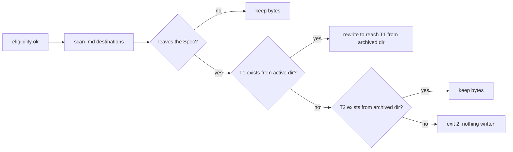

# An archived Spec keeps its links — Technical Spec

## Executive Summary

`spec.Archive` gains a link pass between its eligibility checks and its move.
It scans the Spec's Markdown files for relative link destinations, classifies
each one that leaves the Spec as rewrite, keep or broken, refuses before any
write when one is broken, and otherwise writes the rewrites just before the
rename, restoring them if the rename fails. The same pure scanner backs a
match function the Delivery Queue calls when it resumes an archive commit, so a
rewritten link reads as part of an exact move. The trade-off is a refusal on
outward links that were already broken, which can park a delivery that would
have archived before; it is accepted because history cannot be fixed in place
(ADR-0230).

## Project Constraints

- Identifier strategy: not applicable — no identifier scheme changes. Source:
  `docs/agents/domain.md`.
- Authentication and HTTP: not applicable — local reads and writes only; no
  test reaches the network. Source: `docs/agents/cli.md`,
  `docs/agents/agent-instructions.md`.
- Active ADR obligations: applicable — ADR-0230 (this Spec) governs the
  rewrite, the keep rule and the refusal. ADR-0223: "A delivery keeps its work
  across archive, requeue and review"; the resumed archive commit keeps being
  accepted when it carries rewrites. ADR-0187 and ADR-0189 govern the Roundfix
  Skill edit. ADR-0184: "A TechSpec now declares numbered Surface Transcripts",
  applied to the refusal and the confirmation line. The gate is bound by
  ADR-0080, ADR-0088, ADR-0091, ADR-0104, ADR-0155, ADR-0156 and ADR-0167;
  ADR-0093, ADR-0117, ADR-0168, ADR-0176 and ADR-0183 check consistency;
  ADR-0166, ADR-0178 and ADR-0182 bind each Task commit. ADR-0096 and ADR-0097 cite ADR-0080 but decide the gate's machine stage and row carry, ADR-0194, ADR-0195 and ADR-0210 cite ADR-0097 but decide what a QA row records, when it is observed again and its evidence snapshot, and ADR-0192 cites ADR-0178 but decides how a conflict in declared derived paths is resolved; this Spec changes none of them, so none applies. Source:
  `docs/agents/domain.md`.
- Tooling authority: applicable — express maintainer authorization on
  2026-10-04, "Concedo", for `internal/spec/archive.go`, and "considere
  autorizado a ajustar todas as skills se necessário" for the skills, and
  "Concedo", on 2026-10-04, for the governed `internal/spec/archive_test.go`,
  limited to the Spec 0058 replay fixture. Source: `docs/agents/agent-instructions.md`,
  `docs/agents/spec-routing.md`; Spec-contained authorization record:
  `docs/specs/0226-an-archived-spec-keeps-its-links/_authorization.md`;
  bounded files: `.agents/skills/roundfix/SKILL.md`,
  `.agents/skills/roundfix/references/archive.md`,
  `internal/spec/archive.go`, `internal/spec/archive_test.go`,
  `skills/roundfix/SKILL.md`.

## System Architecture

No new package or command.

| Component | Where | Change |
| --- | --- | --- |
| Link pass | `Archive` and new unexported helpers in `internal/spec/archive.go` | Scan, classify, refuse, rewrite, restore on rename failure |
| Resume match | exported `ArchiveLinksMatch` in `internal/spec/archive.go`; `archiveCommitIsExact` and `archivePRDChangeIsExact` in `internal/cli/deliver_workflow.go` | A rewritten link is part of an exact archive commit |
| Confirmation line | `runArchiveCommand` and its usage in `internal/cli/archive.go` | Appends the rewrite count; one usage sentence |
| Skill and guide | Roundfix Skill archive reference; archive command guide | Describe the behavior |



## Implementation Design

### Interfaces

```go
// internal/spec/archive.go
type ArchiveResult struct {
	// existing fields unchanged
	RewrittenLinks int // relative link destinations rewritten by the move
}

// ArchiveLinksMatch reports whether archived differs from active only by the
// relative link rewrites Archive makes when it moves a Markdown file from
// activeDir to archivedDir out of specDir: every byte outside link
// destinations is identical, and every changed destination leaves specDir and
// reaches, lexically from archivedDir, the same target with the same fragment
// or query that the active destination reaches from activeDir.
func ArchiveLinksMatch(active, archived []byte, activeDir, archivedDir, specDir string) bool
```

### The link pass

1. **Scan.** Every regular `*.md` file under the Spec directory, recursively;
   symbolic links and other files are skipped. Destinations are read from
   inline links and images, in plain or angle-bracket form with an optional
   title, and from reference definitions; fenced code blocks (backtick and
   tilde fences) and code spans on one line are skipped.
2. **Ignore.** An empty destination, one with a URL scheme, one starting with
   `/` or `#` is never touched. A `#fragment` or `?query` is split off, kept,
   and re-appended; percent-encoded paths are decoded to resolve and encoded
   again when written.
3. **Classify** each destination D in file F. Lexically, without evaluating
   symbolic links, T1 is D resolved from F's directory in the active Spec. If T1
   is inside the Spec, D keeps its bytes. If T1 exists, D is rewritten to the
   slash-separated relative path from F's directory in the archived Spec to
   T1. Otherwise T2 is D resolved unchanged from F's directory in the archived
   Spec; if T2 exists, D keeps its bytes. Otherwise D is broken.
4. **Refuse.** The pass runs after eligibility and the destination check and
   before the stamp. Any broken D fails `Archive` with API Contract 1 and no
   file written.
5. **Write.** After the stamp, the rewritten files are written in place, then
   the directory is renamed; a rename failure restores every rewritten file's
   original bytes. A superseded Spec without a Task Graph gets the same pass.
6. **Report.** `ArchiveResult.RewrittenLinks` counts rewritten destinations.

### The resumed archive commit

`archiveCommitIsExact` compares the archive commit's destination tree with the
source tree entry by entry instead of as one map. Equal entries pass. A
differing entry passes only when it is a Markdown file of the same mode and
type whose blobs, read with `git show`, satisfy `spec.ArchiveLinksMatch`. The
PRD body is accepted when it is byte-identical or matches the same way;
frontmatter keeps its existing comparison. `archiveDiffIsExact`, which checks
paths only on a fresh archive, is unchanged. A link rewritten inside PRD
frontmatter is not accepted.

### Data Models

No Run Database or configuration change.

### API Contracts

1. API Contract: refusal, exit `2`, printed on standard error by the existing
   Preflight Validation block under `Reason:` as
   `Spec "<slug>" has relative links that leave the Spec and do not resolve: <file>:<line> "<destination>"[, ...]; fix or remove each link, then retry the archive`,
   where `<file>` is slash-separated and relative to the Spec.
2. API Contract: confirmation, on standard output, exit `0`:
   `archived <slug> -> <path>` or `archived <slug> with QA override -> <path>`,
   followed by `; rewrote <n> relative link(s)` only when n is greater than 0.
3. API Contract: the usage text gains "Relative Markdown links that leave the
   Spec are rewritten to resolve from the archived location; a link whose
   target does not exist refuses the archive before any file changes." and
   keeps "moves unchanged".
4. API Contract: `spec.ArchiveLinksMatch` as declared above.

### Surface Transcripts

1. Surface Transcript: a completed Spec whose PRD links `../../adr/<adr>.md`
   and whose Task links `../../findings/<finding>.md`, both present.

   ```transcript
   $ roundfix archive <slug>
   stdout:
   archived <slug> -> docs/history/specs/<slug>; rewrote 2 relative link(s)
   stderr:
   exit: 0
   ```

2. Surface Transcript: the same Spec with one more Task link,
   `../../findings/missing.md` on line 12 of `task_01.md`, whose target
   exists nowhere.

   ```transcript
   $ roundfix archive <slug>
   stdout:
   stderr:
   Preflight failed

   Reason:
     Spec "<slug>" has relative links that leave the Spec and do not resolve: task_01.md:12 "../../findings/missing.md"; fix or remove each link, then retry the archive

   No side effects:
     Roundfix did not create a Run, fetch Review Source issues, start an Agent, commit, or push.

   Usage:
     Run 'roundfix archive --help' for usage.
   exit: 2
   ```

## Vocabulary Contract

No new glossary term. The emitted words are the refusal, the confirmation
suffix and the usage sentence of API Contracts 1-3; task_01 documents them in
the Roundfix Skill archive reference and the archive command guide.

## Coverage Map

- Goal 1 → The link pass steps 1-3 and 5; API Contract 2.
- Goal 2 → The link pass step 4; API Contract 1.
- Goal 3 → The resumed archive commit; API Contract 4.
- User Story 1 → The link pass; Surface Transcript 1.
- User Story 2 → The link pass step 4; Surface Transcript 2.
- User Story 3 → The resumed archive commit.
- Core Feature 1 → The link pass steps 1-3 and 5.
- Core Feature 2 → The link pass step 3.
- Core Feature 3 → The link pass steps 1-3.
- Core Feature 4 → The link pass step 4; API Contract 1.
- Core Feature 5 → The link pass step 6; API Contract 2.
- Core Feature 6 → The resumed archive commit; API Contract 4.
- Core Feature 7 → Build Order 1.
- Success Metric 1 → Testing Approach 1.
- Success Metric 2 → Testing Approach 1 and 2.
- Success Metric 3 → Testing Approach 3.

## Integration Points

- **Delivery Queue.** Its archive step reads only the archive's exit code, so
  the confirmation suffix changes nothing there; its resume path uses
  `spec.ArchiveLinksMatch`.
- **Active directory refusal.** The existing refusal of files that name the
  Spec's active directory runs before and is unchanged.

## Testing Approach

1. **Archive**, in the new file `internal/spec/archive_links_test.go`:
   `TestArchiveRewritesRelativeLinksThatLeaveTheSpec`,
   `TestArchiveKeepsLinksInsideTheSpecAndNonRelativeLinks`,
   `TestArchiveRefusesALinkThatWouldStayBroken` (no stamp, no move, no byte
   changed), `TestArchiveRewritesLinksUnderAConfiguredSpecRoot`,
   `TestArchiveRewritesLinksInASupersededSpec`,
   `TestArchiveKeepsALinkWhoseTargetWasAlreadyArchived`. The replay test
   `TestSpec0058ReplayArchivesDeclaredUnreachableRelease` in the governed
   `internal/spec/archive_test.go` creates the three targets its replayed Spec
   links to; no other existing test changes.
2. **Command**, in the new file `internal/cli/archive_links_test.go`:
   `TestArchiveCommandRefusesABrokenOutwardLink` (exit `2`, standard error
   names the link, tree unchanged) and `TestArchiveCommandReportsRewrittenLinks`
   (the suffix of API Contract 2).
3. **Resume**, in the new file `internal/cli/deliver_archive_links_test.go`:
   `TestResumeAcceptsAnArchiveCommitWithRewrittenLinks` and
   `TestResumeRefusesALinkRewritingArchiveCommitWithExtraChanges` (an extra byte
   in a Task, a link rewritten to another target, an extra byte in the PRD
   body).

## Build Order

1. The Roundfix Skill archive reference, its mirror, the version record and the
   archive command guide, written from this TechSpec, task_01 (depends on:
   none).
2. The link pass, `ArchiveLinksMatch`, the confirmation line, the replay
   fixture and their tests, task_02 (depends on: 1).
3. The resumed archive commit and its tests, task_03 (depends on: 2).
4. Terminal QA, task_04 (depends on: 1, 2, 3).

## Risks & Considerations

- **A later archive of the target.** A rewritten link that reaches an active
  document breaks when that document is archived later; no rule applied once
  at the Spec's archive can prevent it (ADR-0230).
- **Already broken links.** Specs 0039, 0040 and 0200 of this repository's
  history would have been refused; an active Spec with such a link parks its
  delivery until its author fixes the link.
- **Granted replay fixture.** `internal/spec/archive_test.go` was granted by
  name on 2026-10-04 for the replay fixture only; task_02 changes nothing else
  in it.
- **Queue order.** Specs 0222, 0223 and 0224 may raise the Roundfix Skill's
  version too; task_01 raises it from the tree it starts on.

## Decisions

- Classify by the target the destination reaches, not by its text, as the
  published `docmv` tool does.
- Keep a link whose target already sits in the mirrored history layout.
- Export one match function for the resume path instead of duplicating the
  scanner in the delivery package.
