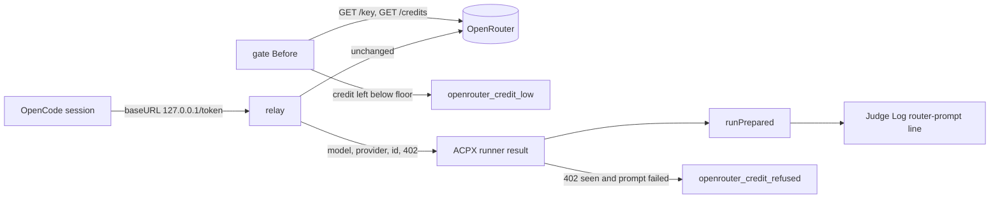

# A Jev Router that checks its credit and names its model — Technical Spec

## Executive Summary

The Jev Router gate reads the month's Jev spend and the key's limit before
each routed prompt; it does not read the OpenRouter account, and nothing in
Roundfix sees an OpenRouter response. This design adds three things. The gate
also reads `GET /api/v1/credits` and refuses below a User Config floor. A
loopback relay, owned by the ACPX runner for each routed Agent Session,
carries OpenCode's model requests to OpenRouter unchanged and notes each
response's `model`, `provider`, `id` and any HTTP 402 refusal. The runner
returns that observation with the prompt's result, the Judge Log line records
it, and a 402 names the prompt's failure `openrouter_credit_refused`. The
primary trade-off is the relay: Roundfix now stands in the path of every
routed request, and the key crosses its memory, accepted because only
OpenRouter's responses name the routed model and the relay forwards bytes
without reading or keeping the key (ADR-0234).

## Project Constraints

- Identifier strategy: not applicable — no identifier scheme changes; the key
  `jev.router_min_credit_usd` follows the dotted configuration names, and the
  relay's per-session path token is a random value that is never stored.
  Source: `docs/agents/domain.md`.
- Authentication and HTTP: applicable — the gate adds one bearer-key
  `GET https://openrouter.ai/api/v1/credits` before each routed prompt, with
  the transport rules of the existing key read: ten-second bound, no
  redirects, no cookies, no `User-Agent`, the key redacted from every error.
  The relay listens on `127.0.0.1` only and forwards to
  `https://openrouter.ai/api/v1`; it never logs, stores or rewrites a header
  or a body. Every test uses a local stand-in for OpenRouter. Source:
  `docs/agents/cli.md`, `docs/agents/agent-instructions.md`.
- Active ADR obligations: applicable — ADR-0234 (this Spec) governs the floor,
  the named refusal and the relay. ADR-0218: "Roundfix gives OpenCode an
  inline provider definition", now pointed at the relay; ADR-0218: "At or
  above the ceiling, or when either source cannot be read, the prompt is not
  sent", which an unreadable credit answer follows. ADR-0231: "The ceiling is
  `jev.monthly_ceiling_usd` in User Config", the pattern the floor's key, its
  Project Config removal and its validation copy. ADR-0201: "the model that
  answered", the Judge Log field the router line fills. ADR-0050: "once Agent
  work begins, Roundfix fails the Work Item instead of switching models over
  potentially modified state". ADR-0114: "A Fallback Selection may switch ACP
  Runtime automatically only while Agent work has not begun". ADR-0002:
  "Roundfix uses YAML for User Config at". ADR-0027: "truly unknown keys keep
  failing strict validation". ADR-0187 and ADR-0189 govern the Roundfix Skill
  edit. ADR-0184: "A TechSpec now declares numbered Surface Transcripts";
  no command's arguments or output change, so none is declared. The gate is
  bound by ADR-0080, ADR-0088, ADR-0091, ADR-0104, ADR-0155, ADR-0156 and
  ADR-0167; ADR-0093, ADR-0117, ADR-0168, ADR-0176 and ADR-0183 check
  consistency; ADR-0166, ADR-0178 and ADR-0182 bind each Task commit. ADR-0229 cites ADR-0167 but decides how an operator archive resumes a park, ADR-0069 cites ADR-0050 but decides the Baseline semantic analysis, ADR-0096 and ADR-0097 cite ADR-0080 but decide the gate's machine stage and row carry, ADR-0192 cites ADR-0178 but decides derived-path conflict regeneration, ADR-0200 and ADR-0209 cite ADR-0201 but decide that the judge never gates and that it only suggests which sources share a Spec, ADR-0208 cites ADR-0209 but decides how sources are grouped, ADR-0194, ADR-0195 and ADR-0210 cite ADR-0097 but decide what a QA row records, when it is observed again and its evidence snapshot, and ADR-0180 cites ADR-0069 but decides the dated Recommended Profile, which this Spec leaves unchanged with the router outside it, ADR-0181 cites ADR-0180 but decides where a configuration is compared with that profile, and ADR-0217 cites ADR-0180 but decides how a Cursor selection is named; this Spec changes none of them, so none applies. Source:
  `docs/agents/domain.md`.
- Tooling authority: applicable — task_01 edits the Roundfix Skill, whose
  canonical files and `SKILL.md` mirror are Governed Paths; express maintainer
  authorization: "considere autorizado a ajustar todas as skills se
  necessário", and the approval of 2026-10-04 quoted in the PRD; bounded
  files: `.agents/skills/roundfix/SKILL.md`,
  `.agents/skills/roundfix/references/runtime.md`,
  `skills/roundfix/SKILL.md`. No other Governed Path changes, and the
  repository's own Project Config is not edited. Source:
  `docs/agents/agent-instructions.md`, `docs/agents/spec-routing.md`;
  Spec-contained authorization record:
  `docs/specs/0229-a-jev-router-that-checks-credit-and-names-its-model/_authorization.md`.

## System Architecture

No new package, command or flag.

| Component | Where | Change |
| --- | --- | --- |
| Configured floor | `Jev`, `jevOverlay`, `applyConfigContent` in `internal/config/config.go` | Adds `jev.router_min_credit_usd`, User Config only |
| Credit read | new `internal/jevrouter/credits.go` | `ReadCredits`, `Credits`, the floor default and rule |
| Gate | `jevRouterGate.Before`, `Dependencies`, `NewEngine` in `internal/daemon/engine.go`; the Implement Run and resolve engines in `internal/cli/implement.go` and `internal/cli/cli.go` | Refuses below the floor |
| Relay | new `internal/jevrouter/relay.go` | Forwards routed requests and notes what responses report |
| Runner | `ACPXRunner`, `codexEnvForSession`, `clearSessionState`, `RunPrompt`, the no-output and exit classification in `internal/agent/acpx_runner.go`; `internal/agent/jev_router.go`; `ExecuteResult` in `internal/agent/agent.go` | Opens a relay token per routed session, returns the observation, names a 402 |
| Judge Log line | `PromptRecord`, `Ledger.Append` in `internal/jevrouter/ledger.go`; `runPrepared` and `selectionReasonCode` in `internal/daemon/agent_session_owner.go` | Records model, provider, response id and refusal; two new reason codes |
| Guides, skill, ADR note | configuration guide; Roundfix Skill `runtime` reference; ADR-0218 | Describe the behavior |



## Implementation Design

### Interfaces

```go
// internal/config/config.go
type Jev struct {
	MonthlyCeilingUSD  float64
	RouterMinCreditUSD float64 // zero means unset; the floor is then US$15
}

// internal/jevrouter/credits.go
const DefaultMinCreditUSD = 15.0
type Credits struct{ TotalCredits, TotalUsage float64 }
func (c Credits) Balance() float64 // TotalCredits - TotalUsage
func ReadCredits(ctx context.Context, client *http.Client, endpoint, key string) (Credits, error)
func MinCredit(configuredUSD float64) float64 // configured when > 0, else the default
func CreditLeft(c Credits, key KeyStatus) float64 // the lower of Balance and LimitRemaining when set

// internal/jevrouter/relay.go
const OpenRouterAPI = "https://openrouter.ai/api/v1"
type Refusal struct{ Status int; LimitSource string }
type Observation struct {
	Models, Providers []string // distinct, first-seen order
	ResponseID        string   // the last response id
	Refusal           *Refusal // the first HTTP 402
}
func StartRelay(upstream string, client *http.Client) (*Relay, error)
func (r *Relay) Open() (token, baseURL string)
func (r *Relay) Take(token string) Observation // returns and clears
func (r *Relay) Release(token string) (open int)
func (r *Relay) Close(ctx context.Context) error
```

```go
// internal/agent
type ExecuteResult struct{ /* existing */ Router jevrouter.Observation }
type ACPXRunner struct{ /* existing */ RouterEndpoint string } // empty: jevrouter.OpenRouterAPI

// internal/jevrouter/ledger.go
type PromptRecord struct{ /* existing */ Reported jevrouter.Observation }

// internal/daemon/engine.go
type Dependencies struct{ /* existing */ JevRouterMinCreditUSD float64 } // zero: the default
```

### The configured floor

`jevOverlay` gains `RouterMinCreditUSD *float64` under `router_min_credit_usd`.
In `applyConfigContent`, beside the ceiling's handling, a Project Config
document has `jev.router_min_credit_usd` removed before decoding and
`warnIgnoredProjectSetting("jev.router_min_credit_usd")` prints API Contract 2.
For any other source, a present value that is not finite or not greater than
zero returns API Contract 3 inside the existing `parse config "<path>": `
wrapping; otherwise it sets `Config.Jev.RouterMinCreditUSD`. `Builtin()`
leaves it zero, and `roundfix config init` templates are unchanged.

### The credit read and the gate

`ReadCredits` makes one `GET <endpoint>/credits` with the transport rules of
`ReadKey` and requires `data.total_credits` and `data.total_usage` as finite
non-negative numbers; anything else, a non-200 status or a body over 1 MiB is
an error prefixed `read account credits: ` with the key redacted.
`jevRouterGate.Before` keeps its order — spend, key limit, ceiling — then
reads the credits. A read error returns the selection failure
`jev_spend_unreadable: <error>`. When `CreditLeft` is below
`MinCredit(deps.MinCreditUSD)` it returns API Contract 4. `jevrouter.Deps`
gains `MinCreditUSD`; `NewEngine` sets it from
`Dependencies.JevRouterMinCreditUSD`, which the Implement Run and resolve
engines set from the loaded configuration, as they set the ceiling.

### The relay

`StartRelay` listens on `127.0.0.1:0` and serves through a
`httputil.ReverseProxy` whose `Rewrite` maps `/<token>/<rest>` to
`<upstream>/<rest>` with the query unchanged and sets no forwarding headers,
whose `FlushInterval` is `-1` so streamed answers pass at once, and whose
`ErrorHandler` answers 502 without logging. A path whose first segment is not
an open token gets 404 and reaches no upstream. `ModifyResponse` wraps the
body in a reader that passes every byte through and observes a copy: a
`text/event-stream` body line by line (the JSON after `data: `), any other
body whole up to 1 MiB. From each JSON object it reads only `id`, `model`,
`provider`, and, for a 402 status, `error.metadata.limit_source`; it adds a
new model or provider to the token's lists, keeps the last id, and records the
first 402 as a `Refusal`. A body it cannot parse is forwarded unchanged and
noted as nothing. No header, body or key is ever logged or written.

Invariants:

```text
1. The relay forwards request and response bytes unchanged.
2. A path without an open token never reaches the upstream.
3. The relay holds no header value after a request ends, and writes nothing.
4. Take returns what was noted since the previous Take for that token.
```

### The runner

`jevRouterProviderConfig` becomes a function of the base URL; the key stays
the `{env:ROUNDFIX_OPENROUTER_API_KEY}` placeholder. For a routed session,
`codexEnvForSession` starts the runner's relay on first use (upstream
`RouterEndpoint` or `jevrouter.OpenRouterAPI`), opens one token per session
name and reuses it for every later command of that session, and passes the
relay's base URL in `OPENCODE_CONFIG_CONTENT`. `clearSessionState` and the
close of a disposable session release the token, and the runner closes the
relay when no token remains. `RunPrompt` takes the session's observation after
the prompt ends, on success and on failure, and returns it in
`ExecuteResult.Router`.

When a routed prompt fails and its observation carries a `Refusal`, the
failure's reason becomes API Contract 5: without Agent output it is a
`SelectionFailureError` reported as a failed selection; with Agent output it
is the `BatchFailureError` reason in place of `agent/protocol error`, with the
exit code and stderr kept.

### The Judge Log line

`runPrepared` copies `result.Router` into `PromptRecord.Reported`.
`Ledger.Append` writes `model` as the models joined by `", "`, `provider` as
the providers joined the same way and `response_id` as the last id. With a
`Refusal`, `error` starts with API Contract 5's code and limit source, and a
key-usage error, when present, follows after `"; "`. `selectionReasonCode`
returns `openrouter_credit_low` and `openrouter_credit_refused` as it returns
`jev_ceiling_reached`, so a fallback receipt names them.

### Data Models

No Run Database change. The Judge Log keeps schema `roundfix/judge-log/v1`;
`router-prompt` lines now fill `model`, `provider`, `response_id` and, on a
refusal, `error`. `Config` gains one value.

### API Contracts

1. API Contract: `jev.router_min_credit_usd` in User Config — a finite number
   greater than zero, in US dollars; unset means US$15.
2. API Contract: the Project Config warning, on standard error, once per
   load: `config: jev.router_min_credit_usd in Project Config is ignored; set jev.router_min_credit_usd in User Config`.
3. API Contract: the configuration error for an invalid value:
   `jev.router_min_credit_usd must be a finite number greater than 0`.
4. API Contract: the gate's refusal below the floor:
   `openrouter_credit_low: OpenRouter credit US$<left> is below the US$<floor> floor`,
   both with four decimals.
5. API Contract: a routed prompt OpenRouter refused for credit:
   `openrouter_credit_refused: OpenRouter refused a routed request for credit (<limit_source>)`,
   with `unspecified` when OpenRouter gives no `limit_source`.
6. API Contract: a `router-prompt` Judge Log line carries `model` and
   `provider` as distinct values joined by `", "` in first-seen order, and
   `response_id` as the last response id; each is empty when no response
   reported it.

### Surface Transcripts

None. No command's arguments, output or exit code change; the refusals of API
Contracts 4 and 5 travel through the existing fallback notice and Task
failure text, which tests assert through the Daemon.

## Vocabulary Contract

- emits: `internal/daemon/engine.go`
  pattern: `openrouter_credit_[a-z]+`
  documented-in: `.agents/skills/roundfix/references/runtime.md`
- emits: `internal/agent/acpx_runner.go`
  pattern: `openrouter_credit_[a-z]+`
  documented-in: `.agents/skills/roundfix/references/runtime.md`
- emits: `internal/config/config.go`
  pattern: `jev\.router_min_credit_usd`
  documented-in: `docs/user-guide/configuration.md`

No new glossary term is adopted. "Account credit", "credit floor" and "relay"
are used in their plain sense beside **Jev Router**, **Judge Log**,
**Fallback Chain**, **Fallback Selection**, **Agent work** and **User
Config**; the QA gate's glossary check decides whether any needs an entry. The
emitted words are `jev.router_min_credit_usd`, `openrouter_credit_low`,
`openrouter_credit_refused` and the messages of API Contracts 2 to 5. task_01
documents each in the configuration guide and the Roundfix Skill's `runtime`
reference.

## Coverage Map

- Goal 1 → The credit read and the gate; API Contract 4.
- Goal 2 → The runner (refusal); API Contract 5.
- Goal 3 → The relay; The Judge Log line; API Contract 6.
- Goal 4 → The configured floor; API Contracts 1 and 2.
- User Story 1 → The credit read and the gate; API Contract 4.
- User Story 2 → The configured floor; API Contracts 1 and 3.
- User Story 3 → The runner; API Contract 5.
- User Story 4 → The relay; The Judge Log line; API Contract 6.
- User Story 5 → The configured floor; API Contract 2.
- Core Feature 1 → The credit read and the gate.
- Core Feature 2 → The credit read and the gate; API Contract 4.
- Core Feature 3 → The configured floor; API Contracts 1 to 3.
- Core Feature 4 → The runner; The Judge Log line; API Contract 5.
- Core Feature 5 → The relay; The runner; The Judge Log line; API Contract 6.
- Core Feature 6 → Build Order 1.
- Success Metric 1 → Testing Approach 2 and 3.
- Success Metric 2 → Testing Approach 5 and 6.
- Success Metric 3 → Testing Approach 4 and 5.
- Success Metric 4 → Testing Approach 1.

## Integration Points

- **OpenRouter credits endpoint.** New read; documented as needing a
  management key, read with an ordinary key on 2026-10-04. Tests serve it
  locally.
- **OpenRouter model API.** Reached through the relay; the relay depends only
  on the documented response fields `id`, `model`, `provider` and
  `error.metadata.limit_source`.
- **OpenCode.** Receives a loopback base URL in its inline provider
  definition; nothing else in its configuration changes.

## Testing Approach

1. **Configuration**, in the new file `internal/config/jev_router_credit_test.go`,
   through `Load` with disposable homes: a User Config floor of 20 loads as
   20; unset loads as zero; a Project Config floor leaves the User Config
   value or zero and writes API Contract 2 once; 0, -1 and `.inf` each fail
   with API Contract 3.
2. **Credit read**, in the new file `internal/jevrouter/credits_test.go`,
   against a local server: only the bearer header is sent; a missing field, a
   negative or non-numeric value, a non-200 status and a redirect are errors
   that never contain the key; `CreditLeft` takes the lower of the balance and
   a reported key remaining limit; `MinCredit` returns the default for zero.
3. **Gate**, in `internal/daemon/jev_router_gate_test.go`, with a local
   stand-in serving `/key` and `/credits`: a balance of 5.11 with a key
   remaining limit of 40.31 is refused with API Contract 4 naming US$15; a
   balance of 20 passes; a key remaining limit of 3 with a balance of 200 is
   refused; a 403 credits answer is `jev_spend_unreadable`; a gate built with
   `JevRouterMinCreditUSD` 4 passes the 5.11 balance; a fake-gate
   `openrouter_credit_low` refusal falls back before work and fails the Task
   after it. The existing tests that serve one answer for every path serve
   `/credits` too.
4. **Relay**, in the new file `internal/jevrouter/relay_test.go`, against a
   local upstream: a streamed and a whole JSON answer arrive byte-identical,
   the upstream receives the request's `Authorization` header and body
   unchanged, the observation lists models and providers in first-seen order
   with the last id, a 402 with `limit_source` is noted, an unknown token gets
   404 with no upstream request, and `Close` stops serving.
5. **Runner**, in `internal/agent/jev_router_test.go`, through the compiled
   fake acpx: the routed session's inline configuration points at a loopback
   base URL with the key placeholder and stays the same across two prompts of
   one session; a fake prompt that posts through that URL to a local upstream
   returns the observation in `ExecuteResult.Router`; a local 402 without
   Agent output is a `SelectionFailureError` with API Contract 5, and with
   Agent output a `BatchFailureError` with that reason; a cleared session
   releases its token. The existing placeholder test compares against the
   configuration built for the observed base URL.
6. **Judge Log line**, in `internal/jevrouter/ledger_test.go` and
   `internal/daemon/jev_router_gate_test.go`: a record whose observation holds
   `a/one` and `b/two` writes `model` `a/one, b/two`, the providers and the
   last id; a refusal writes API Contract 5's code first in `error`; a
   fake-runner refusal reason falls back before work with the receipt naming
   `openrouter_credit_refused`.

## Build Order

1. The configuration guide, the Roundfix Skill's `runtime` reference, its
   mirrors and the version record, and the ADR-0218 note, written from this
   TechSpec, task_01 (depends on: none).
2. The configured floor, the credit read and the gate, task_02 (depends on: 1).
3. The relay, the runner's session wiring and the Judge Log model fields,
   task_03 (depends on: 2).
4. The named credit refusal in the runner, the Judge Log error and the reason
   code, task_04 (depends on: 3).
5. Terminal QA, task_05 (depends on: 1, 2, 3, 4).

## Risks & Considerations

- **Roundfix in the request path.** A relay defect breaks every routed
  prompt. The relay forwards with the standard library's reverse proxy, and a
  broken relay fails before Agent work as a failed selection, so the Fallback
  Chain takes the Task.
- **The credits endpoint's documented management-key requirement.** If
  OpenRouter enforces it, every routed prompt is refused as
  `jev_spend_unreadable` (PRD Open Questions).
- **A session outliving its process.** acpx keeps OpenCode alive between
  prompts; a routed session resumed by another Roundfix process would point at
  a closed relay. Runs do not do this today.
- **An older binary on the machine.** A User Config holding the new key makes
  every older binary refuse it (ADR-0027).
- **Existing tests that serve one answer for every path.** They now also
  answer `/credits`; task_02 declares them.

## Decisions

- The floor is a User Config value with the US$15 default; Project Config is
  ignored with a warning. See ADR-0234.
- An unreadable credit answer refuses the prompt.
- A loopback relay per routed session carries routed requests and notes what
  responses report. See ADR-0234.
- A 402 names the failure; the Fallback Chain boundary is unchanged. See
  ADR-0234.
