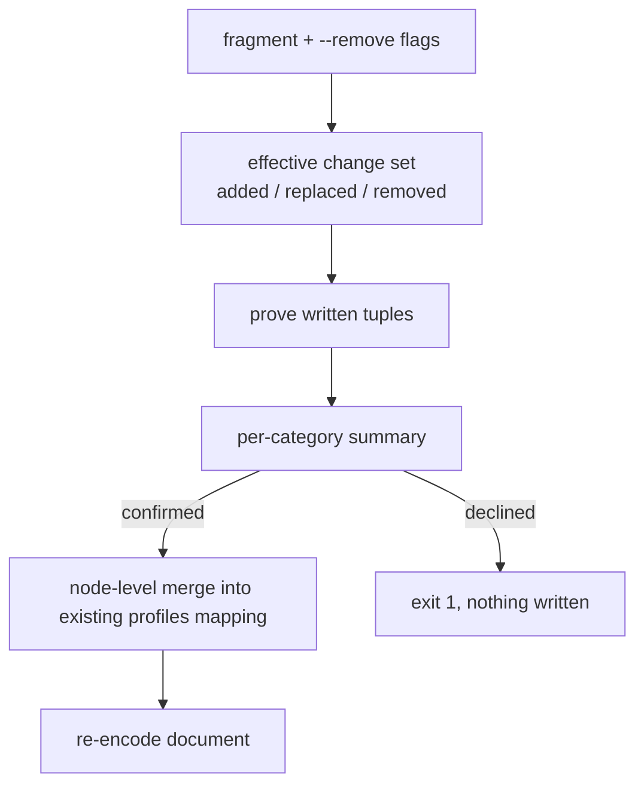

# Profiles configure merge semantics — Technical Spec

## Executive Summary

The destructive write is one line: `mergeProfilesConfigContent` builds a fresh
`profiles` mapping node from the fragment and hands it to
`setTopLevelYAMLNode`, which swaps the whole node. Every category the fragment
did not name loses its node, and with it its Fallback Chain, its comments, and
its formatting. The repair is to merge at the node level inside the existing
`profiles` mapping instead of replacing it, reusing each untouched category's
original nodes.

Format preservation needs no new machinery: the write path already decodes into
a `yaml.Node` tree and re-encodes it, so comments and style survive as long as
the nodes do. This is a smaller change than the PRD's framing implies — the
risk was never a serializer rewrite, it was a node swap.

The design accepts one deliberate deviation from the PRD, stated in Decisions:
proof runs over the categories the operation writes, not over the whole
resulting map, because re-proving untouched categories would let one stale
pre-existing entry block an unrelated edit that works today.

## Project Constraints

- Identifier strategy: not applicable — no project-owned Internal Identifier is
  created; profile categories and Agent Selection tuples keep their existing
  identities. Source: `docs/agents/domain.md`.
- Authentication and HTTP: not applicable — the governing clause prohibits
  reading, printing, committing, or generating secrets and forbids inventing
  authentication, authorization, transport, or deployment policy; this Spec
  handles no credential and opens no transport, since all behavior is local
  configuration reading, merging, confirmation, and writing. Source:
  `docs/agents/agent-instructions.md`.
- Active ADR obligations: applicable — ADR-0049 keeps each present profile
  atomic, so a named category is replaced as one object and the merge is at map
  level, never field level; ADR-0037/0039 selection-proof obligations stand,
  with proof still preceding every write; ADR-0086 makes removal a declared
  flag rather than a fragment shape. Source: `docs/agents/domain.md`.
- Tooling authority: applicable — express maintainer authorization: on
  2026-07-28 the maintainer authorized the Skill pair plus its deterministic
  digest fallout in this Spec's PRD; bounded files:
  `.agents/skills/roundfix/SKILL.md`, `skills/roundfix/SKILL.md`,
  `internal/baseline/assets/setups/typescript-bun.json`,
  `internal/baseline/testdata/catalog.digest`,
  `internal/baseline/testdata/catalog.normalized.json`,
  `internal/baseline/testdata/parity-corpus/v1/fixtures/asset-sync.json`,
  `internal/baseline/testdata/parity-corpus/v1/manifest.json`. This design
  proposes no Skill change, so the authorization may go unused. Source:
  `docs/agents/agent-instructions.md`.

## System Architecture

Two existing files carry the change. `internal/config/profile_config.go` owns
the document merge; `internal/cli/profiles_configure.go` owns flags, the
confirmation summary, and exit codes. No new package, file, or seam.



**The Effective Change Set** is the new intermediate value: for each category,
whether the operation adds, replaces, or removes it. It is computed once and
drives the summary, the proof scope, and the merge, so the three can never
disagree about what the operation does.

## Implementation Design

### Interfaces

The merge, replacing the single destructive call:

```go
// mergeProfilesConfigContent merges by category into the existing profiles
// mapping. Categories absent from the change set keep their original nodes,
// which is what preserves their comments, key order, and formatting.
func mergeProfilesConfigContent(
    path string, content []byte, changes EffectiveChangeSet, source ProfileSource,
) ([]byte, error)

// mergeProfilesNode edits the existing mapping in place:
//   replace -> swap only that category's value node
//   add     -> append a key/value pair
//   remove  -> drop the key/value pair
// Every other pair is left untouched, node identity included.
func mergeProfilesNode(profilesNode *yaml.Node, changes EffectiveChangeSet) error
```

The change set:

```go
type CategoryChange struct {
    Category WorkCategory
    Kind     ChangeKind // ChangeAdded | ChangeReplaced | ChangeRemoved
    Profile  AgentSelectionProfile // zero for ChangeRemoved
}

type EffectiveChangeSet struct{ Changes []CategoryChange } // category-ordered
```

### Data Models

No persisted entity changes. The config file's `profiles` mapping keeps its
schema; only which nodes are rebuilt changes.

### API Contracts

**New flag.** `--remove <category>`, repeatable. Naming a category in both the
fragment and `--remove` is a validation failure, exit `2`. Removing a category
the file does not contain is a no-op that still appears in the summary.

**Exit codes**, from the documented contract, with no new code invented:

| Situation | Code |
| --- | --- |
| Applied, or an already-satisfied no-op | `0` |
| `--dry-run` (unchanged; never writes) | `0` |
| Declined, or unconfirmable non-interactively without `--yes` | `1` |
| Invalid flags, conflicting category, proof failure | `2` |

**Schema** `roundfix/profiles-configure/v1` evolves additively: a `changes`
array of `{category, kind}`, and a `refused` boolean on the decline path.
Existing fields keep their meaning.

## Coverage Map

- Story 1 (fragment merges, others survive) → `mergeProfilesNode`.
- Story 2 (per-category summary) → Effective Change Set, summary renderer.
- Story 3 (reviewable diff) → node reuse for untouched categories.
- Story 4 (decline exits non-zero) → exit code table.
- Story 5 (removal is explicit) → `--remove`, ADR-0086.
- Story 6 (no working path regresses) → characterization corpus.
- Core Features 1–5 → the components above; Core Feature 6 → proof scope, with
  the deviation in Decisions. Core Feature 7 → characterization corpus.

## Integration Points

None external. `profiles show` and `profiles validate` are untouched, and
profile resolution, precedence, and fallback semantics are not on this path.

## Testing Approach

Tests attach at the two existing seams — the config merge function and the CLI
command — plus one new corpus.

- **Characterization corpus, captured before any behavior change.** Real config
  files, including a five-category file with comments, unusual indentation,
  anchors, multiline strings, and non-ASCII values, are round-tripped through
  today's writer and recorded. Every later change is measured against it: a
  file the current writer handles must never fail or be corrupted by the new
  one.
- **Byte-identity assertions.** Configuring one category leaves the other four
  categories' bytes identical — the PRD's headline metric, asserted directly
  rather than through a diff summary.
- **Change-set table tests** over add, replace, remove, no-op removal, and the
  fragment/`--remove` conflict.
- **Exit-code tests** for decline, non-interactive without `--yes`, `--dry-run`,
  and applied.
- **Proof-scope tests** proving that a stale tuple in an untouched category does
  not block an unrelated edit, and that every written tuple is still proven.

## Build Order

1. **Characterization corpus.** Record today's writer behavior over the real
   config shapes. No behavior change in this step; it is the regression gate.
2. **Effective Change Set** (depends on: 1). Compute add/replace/remove from the
   fragment and `--remove`, with the conflict rejection. Pure value, tested in
   isolation.
3. **Node-level merge** (depends on: 2). Replace the whole-node swap with the
   in-place category merge; untouched categories keep their nodes.
4. **Per-category summary and proof scope** (depends on: 3). Render the summary
   in text and `--json`; prove the written categories only.
5. **Exit codes and schema** (depends on: 4). Decline exits `1`, `--dry-run`
   keeps `0`, and the result schema gains its additive fields.
6. **Document the contract** (depends on: 5). Command reference: merge
   semantics, `--remove`, the summary, and the exit-code table.

## Risks & Considerations

- **The regression this could introduce is a corrupted config.** Bounded by the
  characterization corpus in step 1 and by the fact that untouched categories'
  nodes are never rebuilt — the writer touches only what the change set names.
- **Two declared breaks, and only two.** Removal by omission ends, and a
  declined non-interactive write exits `1` instead of `0`. Any other observable
  change in output, exit code, or file content is a defect, per the PRD.
- **Anchors and aliases inside a category.** Replacing a category's value node
  drops an anchor defined there. The corpus must cover it; if an alias elsewhere
  refers to a replaced category, the operation fails rather than writing a
  document that no longer parses.
- **The empty-file and no-`profiles`-section paths** already exist in
  `decodeConfigDocumentForProfiles` and must keep working — merging into an
  absent mapping is an add, not an error.

## Decisions

- Merge happens inside the existing `profiles` mapping node; untouched
  categories keep node identity, which is what preserves comments and format.
  No serializer rewrite is needed — the tree round-trip already existed.
- Removal is a declared `--remove` flag, never a fragment shape. See ADR-0086.
- **Deviation from PRD Core Feature 6, deliberate:** proof runs over the
  categories the operation writes, not over the whole resulting effective map.
  Re-proving untouched categories would let one stale pre-existing entry block
  an unrelated edit that succeeds today — a regression the PRD's own
  non-regression clause forbids. Proof still precedes every write, and every
  written tuple is still exact-proven, so ADR-0037/0039 hold.
- Exit `1` for a refusal reuses the documented contract's Unresolved/Failed
  code; validation failures keep `2`. No new exit code is minted.
