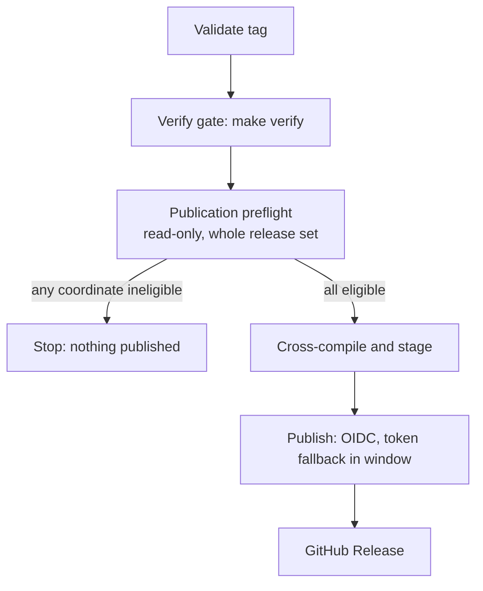

# npm Trusted Publishing and release preflight — Technical Spec

## Executive Summary

The release workflow gains three inline stages: a read-only publication
preflight between the Verification gate and cross-compilation, an OIDC identity
for `npm publish`, and a bounded token fallback that keeps the release set
whole while the trusted-publisher configuration is still unproven. Everything
lives in `.github/workflows/release.yml` — the only file the maintainer
authorized — so no new script, action, or package enters the repository.

The design accepts one trade-off deliberately. npm exposes no way to verify a
trusted publisher before publishing, and configuration is per-package, so
identity cannot be preflighted at all. Rather than weaken ADR-0082's
all-or-nothing guarantee to "all-or-nothing except for identity", the workflow
keeps `NPM_TOKEN` as a per-coordinate retry for one bounded window and reports
every coordinate that needed it. The credential the Spec exists to remove is
therefore retained slightly longer, in exchange for a guarantee that holds
unconditionally from the first OIDC release onward. See ADR-0084.

## Project Constraints

- Identifier strategy: not applicable — package names, platform asset names,
  tags, and versions keep their existing identities, and no project-owned
  Internal Identifier is created. Source: `docs/agents/domain.md`.
- Authentication and HTTP: applicable — the governing clause prohibits reading,
  printing, committing, or generating secrets and requires credentials to stay
  inside the repository's existing secure configuration boundary. `NPM_TOKEN`
  therefore stays a GitHub Actions secret referenced only by expression inside
  the fallback branch: it is never echoed, never written to the fallback log or
  job summary, and never persisted to disk. The fallback log records coordinate
  names only. Publication authentication otherwise moves to GitHub Actions OIDC
  Trusted Publishing, and the preflight performs unauthenticated HTTPS `GET`
  requests against the public npm registry. Both are confined to the release
  workflow; no Roundfix-runtime authentication or HTTP surface changes. Source:
  `docs/agents/agent-instructions.md`.
- Active ADR obligations: applicable — ADR-0031 keeps the launcher plus
  per-platform `optionalDependencies` layout unchanged; ADR-0048 keeps the
  Release Plan Command read-only, so the preflight lives in the workflow and
  never in the command; ADR-0082 makes publication all-or-nothing across the
  release set; ADR-0084 governs the bounded token fallback. Source:
  `docs/agents/domain.md`.
- Tooling authority: applicable — express maintainer authorization: on
  2026-07-28 the maintainer expressly authorized the release workflow mutation
  in this Spec's PRD; bounded files: `.github/workflows/release.yml`. The
  runbook under `docs/user-guide/` is documentation, not protected tooling. No
  other protected tooling mutation is authorized, which is why the preflight is
  inline shell rather than a new file under `scripts/`. Source:
  `docs/agents/agent-instructions.md`.

## System Architecture

The workflow keeps its single `release` job and its existing step order. Three
stages change or appear:



Nothing before `Verify gate` and nothing after `Publish to npm` changes. The
preflight sits where the finding placed it: after Verification, before the
first irreversible byte.

**Release Set.** The preflight and the publish loop derive the same six
coordinates from the same source — `dist/npm/platforms.json` for the five
platform packages plus the launcher `dist/npm/roundfix` — so the set can never
drift between the check and the action.

**Runtime.** Trusted Publishing requires npm 11.5.1+ on Node 22.14.0+. The
workflow pins Node 20 today, whose bundled npm cannot perform an OIDC exchange
at all. `setup-node` moves to Node 24 and a guard asserts the resolved npm
version, so a future runner image change surfaces as a named failure instead of
a silent fall back to token authentication.

## Implementation Design

### Interfaces

The preflight's contract per coordinate, against the unauthenticated packument:

```bash
# GET https://registry.npmjs.org/<url-encoded-name>
#   404                       -> absent      (blocked: no trusted publisher possible)
#   .versions[$TAG]           -> used        (blocked: npm never allows reuse)
#   .time[$TAG]               -> used        (blocked: published then unpublished)
#   .time.unpublished         -> cooldown    (blocked until +24h, print the timestamp)
#   otherwise                 -> eligible
#   transport/parse failure   -> undetermined (stop, but never reported as ineligible)
```

`.time[$TAG]` is checked alongside `.versions[$TAG]` deliberately: a
single-version unpublish removes the entry from `versions` while leaving it in
`time`, and that version can never be republished.

The publish loop, preserving platform-before-launcher order:

```bash
publish_coordinate() {           # $1 = package dir, $2 = coordinate name
  ( cd "$1" && npm publish --access public ) && return 0
  if [ "${FALLBACK_WINDOW}" != "1" ]; then
    echo "::error::identity: $2 failed OIDC publish and the fallback window is closed"
    return 1
  fi
  echo "::warning::identity: $2 failed OIDC publish, retrying with NPM_TOKEN"
  ( cd "$1" && NODE_AUTH_TOKEN="${NPM_TOKEN}" npm publish --access public ) || return 1
  printf '%s\n' "$2" >> "${FALLBACK_LOG}"
}
```

### Data Models

No new persistent entities. Two ephemeral run-scoped artifacts: the eligibility
table the preflight prints (one row per coordinate, with state and reason), and
`FALLBACK_LOG`, the list of coordinates that needed the token. Both are written
to the job summary so the rollback decision is made from evidence rather than
memory.

### API Contracts

**Workflow trigger.** `workflow_dispatch` is added alongside the existing `push`
tag trigger, with a required `version` input. Dispatch runs `Validate tag`'s
semver check and the preflight, then stops — it never cross-compiles, never
publishes, and never creates a GitHub Release. This is the seam that makes the
preflight testable without burning a tag.

**Failure vocabulary**, one line per blocked coordinate, prefixed so the cause
is unambiguous per PRD Core Feature 3:

| Prefix | Meaning | Stage |
| --- | --- | --- |
| `registry:` | coordinate ineligible — used version or cooldown, with the exact package and timestamp | preflight |
| `undetermined:` | registry could not be read; eligibility unknown, nothing published | preflight |
| `identity:` | OIDC authentication failed for a named coordinate | publish |
| `runtime:` | npm or Node too old for Trusted Publishing | preflight |

**Permissions.** `id-token: write` joins the existing `contents: write`. The
publish step stops receiving `NODE_AUTH_TOKEN` unconditionally; the secret is
referenced only inside the fallback branch.

## Coverage Map

- Goal "authenticate through short-lived OIDC" → OIDC publish stage, `id-token`
  permission, Node/npm runtime guard.
- Goal "no package publishes unless every coordinate is eligible" → Publication
  Preflight over the Release Set.
- Goal "failure names identity or registry state" → failure vocabulary table.
- Goal "existing release contract survives" → unchanged Validate tag,
  cross-compile, ordering, changelog extraction, and GitHub Release stages.
- Story 1 (publish via Trusted Publishing) → OIDC publish stage.
- Story 2 (preflight the whole release set before the first publish) →
  Publication Preflight, placed after Verification.
- Story 3 (failure names the blocked coordinate and the cause) → per-coordinate
  prefixes, eligibility table in the job summary.
- Story 4 (no partial release set) → Preflight for registry state, ADR-0084
  token fallback for identity, both gating the same six coordinates.

## Integration Points

- **npm registry, read** — unauthenticated `GET` on the public packument. No
  credential, no `npm` CLI dependency for the check itself; `curl` plus `jq`,
  both already used by the workflow.
- **npm registry, write** — `npm publish` over OIDC. Provenance attestations are
  generated automatically under Trusted Publishing; this adds signed metadata
  alongside each package and does not alter package contents or names.
- **GitHub OIDC provider** — implicit through `id-token: write`; no action
  input, no third-party action added.
- **GitHub Release** — unchanged.

## Testing Approach

CI-only behavior has no Go test seam, so the design creates one rather than
deferring proof to a real release:

- **`workflow_dispatch` preflight run** (new seam, justified because the
  alternative is cutting a tag to learn anything). Exercises the real preflight
  against the real registry with zero irreversible effects.
- **Eligibility classification fixtures.** The classification is a pure function
  of a packument document. Committed fixture packuments — a used version, an
  unpublished-then-cooled package, a fresh coordinate, a malformed body — are
  fed through the same `jq` expression the workflow runs, asserting the four
  states plus `undetermined`. This keeps the logic honest without network
  access. Fixtures live under the Spec, not under `internal/`, since no Go
  package owns them.
- **Ordering and contract assertions.** A dispatch run proves the preflight
  stops before `Cross-compile and stage`; the existing `make verify` gate is
  untouched and still runs first.
- **Real release validation** stays what the PRD says it is: one complete
  release publishing all six coordinates, with `FALLBACK_LOG` empty being the
  precondition for removing the secret.

## Build Order

1. **Runtime and permissions.** Bump `setup-node` to Node 24, add the npm
   version guard, add `id-token: write`. Independently verifiable: the workflow
   still parses and the guard reports the resolved versions.
2. **Eligibility classification and fixtures** (depends on: 1). The packument
   classifier and its committed fixture corpus, covering all five states.
3. **Publication preflight stage** (depends on: 2). Wire the classifier over the
   Release Set derived from `platforms.json` plus the launcher, print the
   eligibility table, stop before cross-compilation on any blocked or
   undetermined coordinate.
4. **`workflow_dispatch` preflight-only path** (depends on: 3). The seam that
   exercises stage 3 without publishing.
5. **OIDC publish with bounded token fallback** (depends on: 1). Remove the
   unconditional `NODE_AUTH_TOKEN`, add `publish_coordinate` with the
   fallback branch, the fallback log, and the job summary.
6. **Runbook and glossary** (depends on: 3, 5). Document the OIDC setup, the
   per-package trusted-publisher configuration, the rollback window and its exit
   condition, and the failure vocabulary in
   `docs/user-guide/release-runbook.md`; add `Publication Preflight` and
   `Release Set` to `CONTEXT.md`.

## Risks & Considerations

- **A false-positive preflight blocks a legitimate release.** This is the
  regression this Spec could introduce, and the design bounds it: a coordinate
  is reported ineligible only on positive evidence in the packument. A network
  failure, a 5xx, or an unparseable body is `undetermined:` — the run still
  stops, because publishing without proof risks the partial release, but it is
  never reported as an ineligible coordinate and never sends the maintainer to
  the wrong recovery.
- **The token is retained deliberately.** The window is a documented state with
  an exit condition, not an open end: one release with an empty fallback log
  closes it. Until then the workflow can still publish with a leaked-secret
  blast radius, which is the pre-existing risk, not a new one.
- **Node 24 changes the runner's toolchain.** `make verify` is Go-only, so the
  exposure is limited to npm behavior. The version guard converts a silent
  regression into a named failure.
- **Provenance attestations are new output.** Package contents, names, and asset
  names stay byte-compatible, so the Upgrade Command's channel is unaffected;
  the attestation is additive registry metadata.
- **Trusted publisher setup is maintainer work outside the repository.** Six
  per-package configurations on npmjs.com must exist before the first OIDC
  release. The runbook step in build order 6 is the record; ADR-0084 is why a
  missed one no longer produces a partial release.

## Decisions

- The preflight is inline shell in `release.yml`, not a script under `scripts/`,
  because tooling authority bounds the change to exactly one file.
- Eligibility is read from the unauthenticated public packument, so the check
  needs no credential and cannot be blocked by the identity migration itself.
- `.time[$TAG]` is checked alongside `.versions[$TAG]` to catch single-version
  unpublishes, which npm also refuses to let us reuse.
- Identity is proven by publishing, not by preflight, because npm offers no
  read-only verification; the release set stays whole through a bounded
  per-coordinate token fallback. See ADR-0084.
- `workflow_dispatch` runs preflight only and never publishes, giving the Spec a
  test seam that costs no tag and no version.
- An undetermined registry read stops the release but is never reported as an
  ineligible coordinate.
