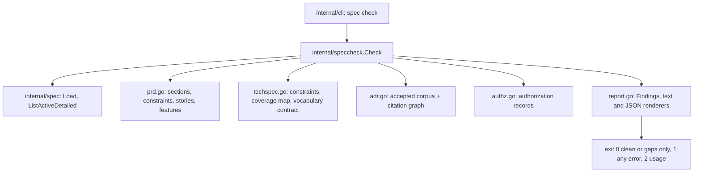

# Spec artifact consistency gate — Technical Spec

## Executive Summary

The check ships as a read-only support command, `roundfix spec check`, in the
family `doctor`, `archive`, and `release plan` already occupy: it reads, it
reports, it mutates nothing. It lives in a new `internal/speccheck` package
that consumes `internal/spec` for the Task Graph and adds Markdown readers for
the PRD, the TechSpec, the ADR corpus, and the authorization records — the
artifacts the Daemon never parses.

The trade-off this design accepts is deliberate and narrow: **the check
compares citations and declarations, never subject matter** (ADR-0093). It
will not find a contradiction that neither artifact writes down. In exchange it
is deterministic, needs no Agent, and finishes in well under a second, which is
what makes it runnable on every authoring change instead of once per gate
cycle. The four characterization findings the PRD names are all reachable
inside that boundary — the probe that established this is recorded under
Testing Approach, and it is the reason the design is citation-based rather than
inference-based.

Every detector is artifact-presence-aware (ADR-0094): it is skipped and
reported as skipped when an input artifact is absent, never failed. That is
what allows the command to be wired into `make verify` as fail-closed while
nine of the ten active Specs legitimately carry a PRD alone.

## Project Constraints

- Identifier strategy: applicable — the check mints one project-owned
  Internal Identifier namespace, the stable diagnostic codes `SC-*` listed
  under API Contracts. They are user-facing vocabulary, join the `CONTEXT.md`
  glossary through the Spec Consistency Check entry, and are never renumbered
  once shipped. Spec slugs, ADR numbers, and Task identifiers keep their
  existing contracts. Source: `docs/agents/domain.md`.
- Authentication and HTTP: not applicable — the governing clause prohibits
  reading, printing, committing, or generating secrets and forbids inventing
  authentication, authorization, transport, or deployment policy; this command
  reads local Markdown from the Spec Root and the repository, opens no
  transport, and handles no credential. Source:
  `docs/agents/agent-instructions.md`.
- Active ADR obligations: applicable — ADR-0080 owns QA verdict semantics and
  this check emits no verdict and never substitutes for the gate; ADR-0088 and
  ADR-0091 own the authored QA gate as a typed Task node, and this Spec's own
  graph is authored under them; ADR-0093 and ADR-0094 are minted by this Spec
  and govern its detection boundary and presence-awareness. Source:
  `docs/agents/domain.md`.
- Tooling authority: applicable — express maintainer authorization: on
  2026-08-02 the maintainer authorized tooling adjustment for the queued Specs,
  recorded at
  `docs/workflow/authorizations/2026-08-02-queued-spec-tooling.md`, whose
  "Which Spec uses what" section names 0064 for the `Makefile`, "to wire the
  consistency check into the local gate". Bounded files: exactly `Makefile`.
  The grant's conditional skill clause — "the skill pair if the check ships as
  an authorial skill" — does **not** apply, because the check ships as a
  binary command; no skill under `.agents/skills/` or `skills/` is touched by
  this Spec. Source: `docs/agents/agent-instructions.md`.

## System Architecture



`internal/speccheck` is a new package rather than new files inside
`internal/spec`. The alternative was considered and loses on blast radius:
`internal/spec` is the Daemon's Task Graph loader on the Run hot path, and
authoring-time Markdown parsing for PRDs, ADRs, and authorization records has
no business being reachable from it. The dependency runs one way —
`speccheck` imports `spec`, never the reverse — so the loader keeps its
current surface and its current tests.

## Implementation Design

### Interfaces

```go
package speccheck

type Severity string

const (
    SeverityError Severity = "error" // a contradiction, both sides located
    SeverityGap   Severity = "gap"   // a candidate the check cannot settle
)

type Location struct {
    Path string // repository-relative
    Line int    // 1-based; 0 when the whole file is the location
}

type Finding struct {
    Code     string     // stable SC-* diagnostic code
    Severity Severity
    Summary  string     // one line, names both sides
    Where    []Location // at least two for an error: each side of the contradiction
    Fix      string     // the concrete next action
}

type SkippedDetector struct {
    Code    string
    Missing string // the artifact whose absence skipped it
}

type Result struct {
    Slug     string
    Findings []Finding
    Skipped  []SkippedDetector
}

// Check reads one Spec folder and the repository facts it cites.
// It opens no network connection and writes no file.
func Check(specsRoot, repoRoot, slug string) (Result, error)
```

### Data Models

No persisted state. Three in-memory models back the detectors:

- **Constraint row** — the four required rows parsed from a
  `## Project Constraints` section: label, applicability (`applicable` /
  `not applicable`), the reason text, and the cited `docs/agents/` source
  path with its line.
- **ADR corpus** — every `docs/adr/NNNN-*.md` with `status: accepted`, its
  number, title, and the set of ADR numbers its body cites. The citation graph
  is this set, inverted; the depth-one closure over a Spec's listed ADRs
  produces the relation candidates.
- **Vocabulary contract** — an optional TechSpec block declaring
  `emits: <path>`, `pattern: <RE2>`, `documented-in: <path>`. Absent block
  means the detector is skipped, never failed.

### API Contracts

```text
roundfix spec check [<slug> ...] [--format text|json] [--strict]
```

No slug checks every active Spec. `--strict` promotes gaps to errors. Output
on stdout, diagnostics on stderr, one `roundfix-speccheck/v1` object per Spec
under `--format json`.

Exit codes: `0` clean or gaps only; `1` at least one `error`; `2` usage or an
unreadable Spec Root. The command never exits non-zero for a Spec that is
merely thin.

| Code | Reads | Reports |
| --- | --- | --- |
| `SC-CONSTRAINT-MISSING` | PRD, present TechSpec | a required Project Constraints row is absent |
| `SC-CONSTRAINT-UNREASONED` | PRD, present TechSpec | a row states applicability with no reason |
| `SC-CONSTRAINT-SOURCE` | PRD, present TechSpec, repo | a row cites a source path that does not exist |
| `SC-TOOLING-UNAUTHORIZED` | PRD, present TechSpec, authorization records | the Tooling authority row cites an authorization record that does not name this Spec |
| `SC-TOOLING-UNBOUNDED` | PRD, present TechSpec | an applicable Tooling authority row records no bounded files |
| `SC-ADR-UNLISTED` | all Spec artifacts, ADR corpus | an ADR cited anywhere in the Spec is absent from the Active ADR row |
| `SC-ADR-RELATED` | ADR corpus | an accepted ADR citing an ADR the Spec lists is itself unlisted — **gap** |
| `SC-COVERAGE-UNMAPPED` | PRD, TechSpec | a PRD User Story or Core Feature no Coverage Map entry covers |
| `SC-COVERAGE-UNTASKED` | PRD, Task Graph, Task files | a PRD User Story or Core Feature no Task references |
| `SC-REF-UNRESOLVED` | Task files, `references/_index.md` | a declared reference path that does not resolve |
| `SC-VOCABULARY-UNDOCUMENTED` | declared vocabulary contract | an emitted token absent from the documenting file |

Every `error` row carries at least two `Where` locations — the PRD side and
the TechSpec, ADR, Task, or authorization side — because a finding a reader
must go hunting for costs more than it saves.

Coverage Map entries are matched in collective form as well as singular:
`Core Features 1–5 → …` covers five features, and `Story 3 → …` covers one.
A Spec that maps a feature and then narrows it satisfies the detector; the
undeclared narrowing behind a satisfied mapping stays QA's finding, which
ADR-0093 states as the accepted limit.

## Coverage Map

- Goal "a contradiction is reported in seconds, before a Run is created" →
  `speccheck.Check`, the `spec check` command, exit-code contract.
- Goal "every Constraint row cites an operative source; every governing ADR
  appears in the Active ADR row" → `SC-CONSTRAINT-*`, `SC-ADR-UNLISTED`,
  `SC-ADR-RELATED`.
- Goal "vocabulary a Spec emits is present in the documentation it claims" →
  `SC-VOCABULARY-UNDOCUMENTED` and the vocabulary contract model.
- Goal "the check reports; it never edits and never substitutes for QA" →
  read-only `Check`, no verdict emission, ADR-0093.
- Core Feature 1 (read-only, runnable before `implement`, fast) → the command
  plus the sub-second budget asserted in Testing Approach.
- Core Feature 2 (contradiction detection naming both locations) →
  `SC-COVERAGE-UNMAPPED` with its two-location `Where` contract.
- Core Feature 3 (constraint completeness in PRD and every present TechSpec) →
  `SC-CONSTRAINT-MISSING`, `-UNREASONED`, `-SOURCE`, `SC-TOOLING-*`.
- Core Feature 4 (ADR coverage reported as a gap, not inferred silently) →
  `SC-ADR-UNLISTED` as error, `SC-ADR-RELATED` as gap, ADR-0093.
- Core Feature 5 (coverage completeness and resolvable references) →
  `SC-COVERAGE-UNTASKED`, `SC-REF-UNRESOLVED`.
- Core Feature 6 (emitted-vocabulary coverage) →
  `SC-VOCABULARY-UNDOCUMENTED`.
- Core Feature 7 (file and line for each side) → the `Location` and `Finding`
  models and the two-location rule for every error.

## Integration Points

- `internal/spec` — consumed for `ListActiveDetailed` and `Load`; unchanged.
- `internal/cli` — one new command branch, its help text, and the usage block.
- `Makefile` — a `spec-check` target appended to `verify`, running the freshly
  built `bin/roundfix` over the Spec Root. This is the one authorized tooling
  file and the only one this Spec touches.
- `CONTEXT.md` — glossary entries for Spec Consistency Check and its two
  severities.
- `.agents/skills/` and `skills/` — **not touched**; the authorization's skill
  clause is conditional on shipping as a skill and this ships as a command.
  Teaching the vocabulary-contract block in `write-techspec` is deferred to a
  Spec that carries its own grant.

## Testing Approach

The existing seam is `internal/*/testdata` fixture trees plus table-driven Go
tests; no new seam is needed. Three tiers:

1. **Unit, per detector** — a fixture Spec folder per detector, one clean and
   one dirty, asserting code, severity, and both `Where` locations. Absence
   fixtures assert the detector is skipped and listed in `Skipped`.
2. **The characterization corpus**, which is this Spec's acceptance. Four
   fixture Spec folders reproduce the artifact shapes the QA reports describe,
   each carrying the report path as provenance in a `README`:
   - 0058 QA-001 — PRD Core Feature 2 promises what the TechSpec and ADR-0084
     acknowledge is impossible. The 0058 Coverage Map lists Goals and Stories
     1–4 and no Core Feature at all, so `SC-COVERAGE-UNMAPPED` reports it.
   - 0058 QA-004 — the workflow emits five failure prefixes and the runbook
     documents four; `SC-VOCABULARY-UNDOCUMENTED` reports `publish:`.
   - 0056 F-001 — ADR-0086 is cited by the TechSpec body and omitted from the
     PRD Active ADR row (`SC-ADR-UNLISTED`); ADR-0055 is cited by no artifact
     but cites ADR-0039 and ADR-0049, both listed, so it surfaces as
     `SC-ADR-RELATED`. The measured depth-one closure over that Spec's cited
     set is exactly two ADRs, one of them ADR-0055.
   - 0056 F-002 — PRD Core Feature 6 versus the TechSpec's narrowed proof
     scope, reported as an unmapped Core Feature.

   The fixtures are authored from each QA report's Expected and Actual, not
   recovered from Git: the pre-remediation artifacts lived on Run Branches that
   no longer exist, and the archived copies are post-fix. Stating this is part
   of the deliverable — a corpus that claims a provenance it does not have is
   the defect class this Spec exists to remove.
3. **False-positive measurement** — a sweep across every Spec in the
   repository, comparing per-code counts against a checked-in golden. Archived
   Specs predate this contract and stay byte-identical, so their counts are
   recorded, never asserted at zero; the active Specs are separately brought to
   zero errors by Build Order 7, and a test added with that work holds them
   there. This is the PRD's third Success Metric, and the golden is what goes
   red first when a detector over-reaches.

A budget assertion keeps Core Feature 1 honest: the full corpus sweep completes
well inside a second, measured in the test rather than claimed in prose.

## Build Order

1. **Package skeleton and report model** — `internal/speccheck` with
   `Finding`, `Location`, `Severity`, `Result`, and both renderers; no
   detectors yet. Fixture harness lands here.
2. **Constraint and tooling detectors** (depends on: 1) —
   `SC-CONSTRAINT-MISSING`, `-UNREASONED`, `-SOURCE`, `SC-TOOLING-UNAUTHORIZED`,
   `SC-TOOLING-UNBOUNDED`, with the authorization-record reader. This is the
   defect that cost four gate cycles on Spec 0072 and it ships first.
3. **ADR corpus, citation graph, and coverage detectors** (depends on: 1) —
   `SC-ADR-UNLISTED`, `SC-ADR-RELATED`, `SC-COVERAGE-UNMAPPED`,
   `SC-COVERAGE-UNTASKED`, `SC-REF-UNRESOLVED`.
4. **Vocabulary contract** (depends on: 1) —
   `SC-VOCABULARY-UNDOCUMENTED` and the declaration parser.
5. **The `spec check` command** (depends on: 2, 3, 4) — dispatch, flags, help,
   usage block, both output formats, the exit-code contract.
6. **Characterization corpus and false-positive sweep** (depends on: 2, 3, 4) —
   the four replay fixtures and the archived-corpus test.
7. **Bring this repository's own Specs to a clean report** (depends on: 6) —
   run the sweep, fix each reported error in the active and archived Specs, and
   declare every change. Archived Specs are corrected only where the report
   finds an error; a Spec is never rewritten for style.
8. **Wire the gate** (depends on: 5, 7) — the authorized `Makefile` target
   appended to `verify`, and the `CONTEXT.md` glossary entries. Landing this
   before step 7 would turn the gate red for every contributor, so the order is
   load-bearing.

## Risks & Considerations

- **The gate goes red on landing.** Step 7 exists for exactly this and must run
  before step 8. Its output is a declared break list, not a discovered one.
- **Over-reach in the relation-closure detector.** Measured at two candidates
  for the worked example, but the corpus sweep in step 6 is what keeps it
  honest; a closure that reports widely is a design failure, and the sweep's
  gap count is the number to watch.
- **Markdown parsing brittleness.** The detectors read heading-anchored
  sections and list rows written by skills, not arbitrary prose. A Spec that
  renames `## Project Constraints` reports a missing section rather than
  silently passing — the failure mode points the right way.
- **The vocabulary contract is a new authoring convention with no skill to
  teach it.** Its diagnostic must therefore carry the block's exact shape in
  the `Fix` text, because the command is the only teacher this Spec ships.
- **Scope discipline.** Three tempting adjacencies are out: `implement` does
  not gain a pre-flight consistency refusal, the check emits no QA verdict, and
  no Spec artifact is auto-corrected. The PRD's non-regression clause and
  ADR-0080 forbid the first two; the third is a stated Non-Goal.

## Decisions

- `roundfix spec check` is a support command in the `doctor`/`archive` family
  rather than a flag on `implement`, because the PRD's Decisions forbid
  changing an existing command's behavior.
- Detection is by citation and declaration, never by subject-matter inference;
  relation-closure candidates report as gaps. See ADR-0093.
- Detectors skip on absent artifacts and record the skip. See ADR-0094.
- `internal/speccheck` is a new package so authoring-time Markdown parsing
  stays off the Daemon's Task Graph load path.
- The `Makefile` is the only tooling file this Spec touches, and the grant's
  conditional skill clause is explicitly not claimed.
