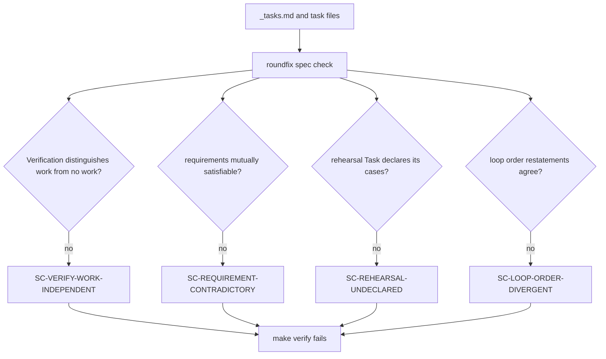

# Loop order and verification honesty — Technical Spec

## Executive Summary

Two defects that share one property: both are stated as rules nobody executes.
The loop's order is prose in two files that disagree, and the rule that a
Task's Verification must prove the Task's effect is advice a skill gives an
Agent who is free to ignore it. Spec 0060's `task_03` did ignore it, settled
`completed`, and ran none of its four cases.

This Spec makes both mechanical. `roundfix spec check` already carries eleven
`SC-*` rules over Spec artifacts and already fails `make verify`; the authoring
rules join it. The loop's order becomes one statement with a check that the
restatements agree, rather than two documents a reader must reconcile.

## The order, decided

The PRD's Core Feature 1 states the loop as *implement the graph, open the
Pull Request, watch until Clean, request QA once, merge*. That contradicts
ADR-0091, which makes the QA gate a typed terminal Task node the Daemon
executes when the last Task settles — before any Pull Request exists.

The maintainer settled this on 2026-08-05: **ADR-0091 stands, and the PRD's
order is the one that changes.** The loop is implement the graph including its
authored gate, archive, open the Pull Request, watch until Clean, merge.

The problem that produced the PRD's ordering — a Spec whose acceptance observes
its own Pull Request cannot reach `pass` before that Pull Request exists — is
already solved by a mechanism that did not exist when Spec 0053 spent four
cycles on it. ADR-0080's environment-blocked rows carry equivalent evidence and
still reach `pass`. Measured on 2026-08-05: Spec 0078's gate closed `pass` with
nine of eighteen rows blocked on "no open Pull Request", each linking recorded
payload, command-runner and event-stream evidence. The order does not need to
change; the blocked-row typing already absorbs the case.

## Project Constraints

- Identifier strategy: applicable — this Spec adds `SC-*` rule identifiers to
  the Spec Consistency Check. They are not project-owned Internal Identifiers
  in the domain sense: they name diagnostics, follow the existing
  `SC-<AREA>-<CONDITION>` convention declared in `internal/speccheck`, and
  carry no lifecycle. Source: `docs/agents/domain.md`.
- Authentication and HTTP: not applicable — the governing clause prohibits
  reading, printing, committing, or generating secrets and forbids inventing
  authentication, authorization, transport, or deployment policy; this Spec
  reads local Spec artifacts and opens no transport. Source:
  `docs/agents/agent-instructions.md`.
- Active ADR obligations: applicable — ADR-0091 owns the authored QA gate as a
  typed Task node and is upheld rather than changed. ADR-0080 keeps QA verdicts
  distinguishing environment-blocked rows, and the retained order depends on
  that typing rather than weakening it. ADR-0093 governs the Spec Consistency
  Check's detection boundary: every rule added here checks a declared citation
  or a declared command, never an inferred intent. ADR-0081 sanctions the
  deterministic digest fallout of the authorized skill edits. Source:
  `docs/agents/domain.md`.
- Tooling authority: applicable — express maintainer authorization: the
  2026-08-02 grant at
  `docs/workflow/authorizations/2026-08-02-queued-spec-tooling.md`, and the
  2026-08-04 confirmation of the boundary it deferred at
  `docs/workflow/authorizations/2026-08-04-queue-tail-tooling.md`, whose
  covered list also names Spec 0065. The exact bounded files: 
  `.agents/skills/write-tasks/**` with its `skills/write-tasks/**` mirror;
  `.agents/skills/roundfix/**` with its `skills/roundfix/**` mirror, both
  regenerated by `make skills-sync`; and
  `internal/baseline/assets/modules/autonomous-work.json`. No other protected
  tooling mutation is authorized. Deterministic digest fallout is sanctioned by
  ADR-0081 and lands in
  `internal/baseline/assets/setups/typescript-bun.json`,
  `internal/baseline/testdata/catalog.digest`,
  `internal/baseline/testdata/catalog.normalized.json`,
  `internal/baseline/testdata/parity-corpus/v1/fixtures/asset-sync.json`, and
  `internal/baseline/testdata/parity-corpus/v1/manifest.json`. Source:
  `docs/agents/agent-instructions.md`.

## System Architecture



Every arrow lands in the same place a Task authoring defect should have landed
all along: the gate, before an Agent Session spends a turn.

## Implementation Design

### Interfaces

```go
// WorkIndependentVerification reports a Task whose declared Verification
// cannot distinguish the Task having run from the Task having done nothing.
// The property is decided from the declared commands, never inferred from
// prose: a sequence composed only of repository-wide gates and working-tree
// cleanliness checks passes most easily when no work happened.
func WorkIndependentVerification(task spec.Task) (Finding, bool)

// ContradictoryRequirements reports one requirement forbidding a state that
// another requirement needs, decided from declared MUST/MUST NOT pairs over
// the same named subject.
func ContradictoryRequirements(task spec.Task) (Finding, bool)

// UndeclaredRehearsal reports a Task whose stated purpose is proving a gate
// fires but which declares no cases and no observation for them.
func UndeclaredRehearsal(task spec.Task) (Finding, bool)
```

### Data Models

No persisted state. Rehearsal Tasks gain one authored section naming each case
and how it is observed; the check reads that section rather than guessing.

### API Contracts

No new command and no new flag. Four rule identifiers join the existing set,
and each fails `make verify` through `spec check` exactly as the eleven
existing rules do.

| Situation | Today | After |
| --- | --- | --- |
| Verification is only `make verify` plus a clean tree | authored, settles `completed` doing nothing | **refused at authoring** |
| One requirement forbids what another needs | authored, Agent spends a turn discovering it | **refused at authoring** |
| Rehearsal Task with no declared cases | authored, settles `completed` without rehearsing | **refused at authoring** |
| Loop order restated differently in two files | both stated, both followed | **refused at authoring** |
| Every Verification that proves its Task's effect | unchanged | unchanged |

The declared break, from the PRD: some Task Verifications valid today become
invalid at authoring time. No recorded evidence is retroactively invalidated,
and archived Spec artifacts are never rewritten.

## Coverage Map

- Core Feature 1 (one order, everywhere) → `SC-LOOP-ORDER-DIVERGENT` plus the
  single corrected statement in the shipped clause and the repository guide.
- Core Feature 2 (one order serves both Spec shapes) → the ADR-0080
  blocked-row argument recorded above, asserted by the Spec 0078 evidence.
- Core Feature 3 (Verification proves the Task's effect) →
  `SC-VERIFY-WORK-INDEPENDENT`.
- Core Feature 4 (mutually unsatisfiable requirements) →
  `SC-REQUIREMENT-CONTRADICTORY`.
- Core Feature 5 (rehearsal Tasks declare their cases) →
  `SC-REHEARSAL-UNDECLARED` and the authored section it reads.

## Integration Points

- `internal/speccheck/` — the four rules, alongside `citations.go`,
  `constraints.go`, and `vocabulary.go`.
- `.agents/skills/write-tasks/**` and `.agents/skills/roundfix/**` with their
  mirrors — the authoring contract and the CLI contract.
- `internal/baseline/assets/modules/autonomous-work.json` — the loop-order
  correction carried to adopting repositories.
- `docs/agents/autonomous-work.md` — the single order statement.

## Testing Approach

`internal/speccheck` is table-driven over Spec artifact fixtures, and
`TestCheckCorpusBudget` already bounds the sweep. No new seam is needed.

- **The Spec 0060 replay**, the PRD's own metric: `task_03` as written is
  refused for both its contradictory requirements and its work-independent
  Verification. This is the assertion that proves the rules catch the case that
  motivated them.
- **The false-positive table.** A Verification that ends with `make verify` but
  also asserts its own effect must pass. The rule targets a Verification
  composed *only* of work-independent checks, and the corpus is the guard
  against it over-reaching.
- **Order divergence** detected across the shipped clause, the repository
  guide, and the Baseline module asset.
- **Corpus non-regression.** Every active and archived Spec still checks as it
  does today, asserted over the existing corpus, and the budget test still
  passes.

## Build Order

1. **The order, stated once** — the corrected statement plus
   `SC-LOOP-ORDER-DIVERGENT`, with the divergence fixture.
2. **Verification honesty** (independent of 1) —
   `SC-VERIFY-WORK-INDEPENDENT` with the Spec 0060 replay and the
   false-positive table.
3. **Authoring coherence** (depends on: 2) —
   `SC-REQUIREMENT-CONTRADICTORY` and `SC-REHEARSAL-UNDECLARED`, sharing the
   requirement-parsing the previous step introduces.
4. **Skill synchronisation** (depends on: 1, 3) — the authorized skill updates
   and the regeneration chain.

## Risks & Considerations

- **Over-reach is the failure mode.** A rule that refuses a legitimate
  Verification costs every future Spec. The corpus non-regression assertion is
  what bounds it, and the rule decides from declared commands rather than from
  prose.
- **Contradiction detection cannot become inference.** ADR-0093 draws the
  boundary: the rule compares declared MUST and MUST NOT clauses over the same
  named subject, and reports nothing when the subject cannot be identified.
- **The order lives in three places.** The clause, the guide, and the Baseline
  module asset. A check that reads only two of them recreates the defect in a
  smaller form.

## Decisions

- ADR-0091 stands; the PRD's stated order is corrected. The case that motivated
  reordering is absorbed by ADR-0080's blocked-row typing, proven by Spec
  0078's gate on 2026-08-05.
- The authoring rules are mechanical `SC-*` checks rather than skill
  instructions. A skill instruction is advice to an Agent free to ignore it,
  which is precisely how Spec 0060's `task_03` settled `completed` having done
  nothing.
- The rules decide from declared commands and declared clauses, never from
  inferred intent, keeping ADR-0093's detection boundary intact.
