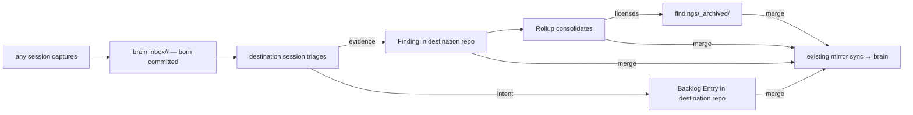

# One door for fleet knowledge — Technical Spec

## Executive Summary

The primary trade-off is deliberate: the door's mechanics live in
documentation contracts and skills rather than in new software, accepting
discipline risk in exchange for zero new tools — and then clawing that risk
back where it can be mechanized, with repository-level consistency checks on
the artifacts this repository owns. The second structural choice is that the
two halves of the Spec decouple: the accumulation half (rollups, archival,
the legacy sweep, the checks) is entirely in-repo and ships first; the door
half (capture, triage, skill routing) gates on one small external act in the
secondbrain repository and on a pilot that proves the save–retrieve–triage
cycle with real material before any clause binds. No task ever leaves the
repository red for the next one — the lesson Spec 0075 paid for tonight.

## Project Constraints

- Identifier strategy: not applicable — inbox entries are named by date and
  slug and address destinations by existing project names; `origin`,
  `destination`, and rollup `members` are declared values read as-is, and no
  project-owned Internal Identifier is minted. Source:
  `docs/agents/domain.md`.
- Authentication and HTTP: not applicable — the whole flow is local
  filesystem and git; no endpoint, credential, or transport is created, and
  the Secondbrain guide's secret prohibitions govern every read. Source:
  `docs/agents/agent-instructions.md`.
- Active ADR obligations: applicable — ADR-0095 is the decision this design
  implements. ADR-0092's boundary shapes the triage interface: it mints
  typed intent or records evidence, never both from one entry without a
  human choice. ADR-0093 bounds every new check to declarations and
  citations — a rollup member is a written path, a license is a written
  pointer, and no check infers relevance. ADR-0094 makes the checks
  presence-aware: a repository with no rollups and no archive skips them.
  ADR-0081 sanctions the digest fallout of the authorized module edits.
  ADR-0080 and ADR-0091 own QA semantics and the authored gate under which
  this graph is authored. Source: `docs/agents/domain.md`.
- Tooling authority: applicable — express maintainer authorization: granted
  2026-08-06, recorded at
  `docs/workflow/authorizations/2026-08-06-fleet-knowledge-door.md`; bounded
  files: `.agents/skills/write-idea/**` and `.agents/skills/write-prd/**`
  with their `skills/**` mirrors regenerated by `make skills-sync`,
  `internal/baseline/assets/modules/context-workflow.json`,
  `internal/baseline/assets/modules/secondbrain.json`, and
  `docs/agents/docs-layout.md` with `docs/agents/secondbrain.md` as adoption
  of regenerated managed-block postimages. Deterministic digest fallout is
  sanctioned by ADR-0081. The knowledge-workspace skill, the session-end
  hook, and the secondbrain repository are recorded external dependencies
  under their own contracts. Source: `docs/agents/agent-instructions.md`.

## System Architecture

Nothing new is built outside one existing seam. The design extends four
things that already exist and contracts one thing that lives elsewhere:

- **`internal/speccheck`** gains three repository-level checks beside the
  loop-order rule, which already proved the shape: a rule that reads
  repository files rather than one Spec, exercised through a dedicated
  fixture carrier so it never depends on live or archived Specs.
- **The findings contract** (carried by the context-workflow Baseline
  module and adopted into the layout guide) gains three extensions: a
  `kind: rollup` finding with declared `members`, an `_archived/` home
  symmetric with Specs, and an `absorbed_by` pointer on archived findings.
- **The secondbrain guide and module** gain the carve-out: sessions may
  create files under the brain's `inbox/**` and nothing else, with the
  entry contract written where every fleet repository will inherit it.
- **The authorial skills** `write-idea` and `write-prd` gain the
  inbox-first reading step; after Spec 0073, an owned-skill content edit
  needs only the mirror sync, not a digest regeneration.
- **The secondbrain repository** (external): the `inbox/` namespace, its
  `AGENTS.md` carve-out, and a qmd collection — executed under that
  repository's contract, witnessed here by the pilot's recorded evidence.



## Implementation Design

### Interfaces

Inbox Entry, at capture and after triage (file contract, not code):

```yaml
---
origin: oraculum          # project that observed
destination: roundfix     # project that must act; the brain itself for research
type-hint: fix            # advisory: finding | feat | fix | perf | refactor | research
created_at: 2026-08-06
capture: manual           # manual | auto (session-end draft)
# added by triage, on move to _triaged/:
resolved_to: docs/findings/2026-08-07-<slug>.md   # or discarded_reason: <text>
---
```

Rollup and archived finding (extensions to the existing findings
frontmatter):

```yaml
kind: rollup              # absent on ordinary findings
members:                  # declared, resolvable paths
  - 2026-07-17-global-run-storage-sanitation-and-compaction.md
# on an archived finding:
absorbed_by: 2026-08-07-rollup-<slug>.md   # or a Spec folder slug
```

The three checks, in the speccheck idiom:

```go
// Repository-level, presence-aware, citation-only (ADR-0093/0094).
CodeFindingLifecycle = "SC-FINDING-LIFECYCLE" // active finding lacks the lifecycle frontmatter
CodeRollupMember     = "SC-ROLLUP-MEMBER"     // a declared member does not resolve
CodeArchiveLicense   = "SC-ARCHIVE-LICENSE"   // archived finding lacks a resolvable absorbed_by
```

### Data Models

No database and no schema. Three file-contract changes: the inbox entry
above (lives in the brain), the rollup kind, and the archived finding's
license pointer. One new directory class: `docs/findings/_archived/`.

### API Contracts

No new command and no new flag. The three check codes above join the
`spec check` report surface with the same file, line, and fix-line shape as
every existing rule; each skips silently when its artifact class is absent.

## Coverage Map

- Goal 1 / Story 1 → the inbox entry contract, the secondbrain-module
  carve-out clause, and the pilot that proves durability and
  non-interference.
- Goal 2 / Story 3 → the rollup contract, `_archived/`,
  `SC-ARCHIVE-LICENSE`, and the legacy sweep.
- Goal 3 / Story 5 → the research-capture clause with the advisory qmd
  check, feeding the brain's own ingestion queue.
- Goal 4 → the three `SC-*` checks and the corpus that guards them.
- Story 2 → the triage procedure in the layout-guide clause and the
  knowledge-workspace mechanics (external, contracted).
- Story 4 / Core Feature 7 → the inbox-first step in `write-idea` and
  `write-prd`.
- Story 6 / Core Feature 8 → the auto-capture entry contract
  (`capture: auto`) written into the guide; the hook itself is the
  maintainer's, outside the repository.
- Core Features 1–11 map one-to-one onto the components above; Core
  Feature 11 is the glossary work that lands before any rule references the
  vocabulary.

## Integration Points

- **secondbrain repository** — external dependency, not a build step:
  `inbox/` namespace, `AGENTS.md` carve-out, qmd collection. The pilot task
  consumes it and records the evidence in-repo; nothing in this repository
  mutates that one.
- **knowledge-workspace skill** (maintainer-global) — carries door
  mechanics and templates; referenced by the guides, edited by the
  maintainer.
- **Mirror sync** — untouched; it is what closes the loop for triaged
  artifacts on merge.

## Testing Approach

Everything attaches to existing seams; the ideal number of new seams stayed
zero.

- The three checks use the speccheck fixture corpus plus a dedicated
  carrier, the pattern the loop-order rule already proved — independent of
  live and archived Specs by construction. Each check lands with a
  red-then-green pair authored against the real surface, and the corpus
  non-regression plus `TestCheckCorpusBudget` guard over-reach.
- The legacy sweep's Verification asserts relations, never counts: every
  active finding carries its lifecycle, every archived finding's
  `absorbed_by` resolves and its rollup names it back, and a second sweep
  changes nothing. The "at most fifteen" number is the QA gate's
  observation, not a task assertion.
- Module edits verify through the Spec 0075 choreography, stated in the
  task rather than rediscovered: new clauses need their Source Baseline
  manifest rows bootstrapped (the regenerator maintains rows, never creates
  them), and `make baseline-digests` runs twice — the maintained fixture is
  the chain's first step and converges only on the second pass.
- The pilot task's Verification asserts this repository's own outputs — the
  triaged Finding and Backlog Entries it minted and the pilot report
  recording brain-side paths and evidence — so it stays hermetic while the
  brain-side facts are witnessed in a committed document.

## Build Order

1. **Vocabulary and contracts** — glossary entries (Inbox Entry, Rollup,
   Triage); the findings-contract extensions (rollup kind, `_archived/`,
   `absorbed_by`) authored in the context-workflow module, regenerated with
   the manifest-row bootstrap, and adopted into the layout guide. Tooling
   task one.
2. **The three checks** (depends on: 1) — `SC-FINDING-LIFECYCLE`,
   `SC-ROLLUP-MEMBER`, `SC-ARCHIVE-LICENSE` with carrier fixtures, corpus
   non-regression, and the budget guard.
3. **Legacy sweep** (depends on: 1, 2) — first rollups written, all 63
   findings stamped, absorbed ones archived, the remainder deferred; the
   new checks are what validate the result.
4. **Door pilot** (depends on: 1; external gate: the brain-side inbox
   exists under its own contract) — capture this Spec's research digest and
   at least one cross-project observation through the door, triage them
   into this repository, and commit the pilot report with the recorded
   evidence. This is the proof the PRD requires before clauses bind.
5. **Skills and binding clauses** (depends on: 4) — the inbox-first step in
   `write-idea` and `write-prd` with mirrors synced; the secondbrain-module
   carve-out clause and the layout-guide inbox-flow clause, including the
   `capture: auto` contract for the session-end hook; guides adopted from
   regenerated postimages. Tooling task two.
6. **QA gate** (depends on: 5) — the authored terminal Task.

Steps 2–3 touch Go and `docs/findings/`; step 5 touches modules, guides,
and skills — file-disjoint from everything that could run near it, per the
same-wave rule the authoring finding records.

## Risks & Considerations

- **The pilot depends on an act outside this repository.** If the brain-side
  inbox is not ready when step 4 arrives, the task blocks with a named
  external dependency rather than faking the proof; steps 1–3 are
  unaffected and land their value regardless.
- **The module chain has measured quirks** — the manifest-row bootstrap and
  the two-pass regeneration are stated in the tasks so no agent
  rediscovers them at Verification time.
- **Check over-reach is the standing failure mode** of new `SC-*` rules;
  the corpus non-regression assertion and the citation-only boundary are
  the guards, and each check skips when its artifact class is absent.
- **The door must stay cheaper than the bypass.** The repository can only
  enforce its own side; if capture friction shows up in the pilot, the
  finding goes to the maintainer before step 5 binds anything.

## Decisions

- A rollup is a finding of `kind: rollup` living beside its members —
  no new directory class beyond `_archived/`, and the lifecycle contract is
  shared. See ADR-0095 for the door itself.
- The three checks are repository-level rules on the loop-order seam with
  a dedicated fixture carrier — no new check infrastructure.
- The accumulation half precedes the door half, and the pilot is the gate
  between capability and obligation — the inert-first ordering Spec 0073
  proved.
- After Spec 0073, owned-skill content edits need only the mirror sync;
  only the module edits carry the digest-regeneration chain.
- Inbox entry status is positional — pending in the namespace root,
  resolved under `_triaged/` — so the pending queue is a listing, not a
  query.
