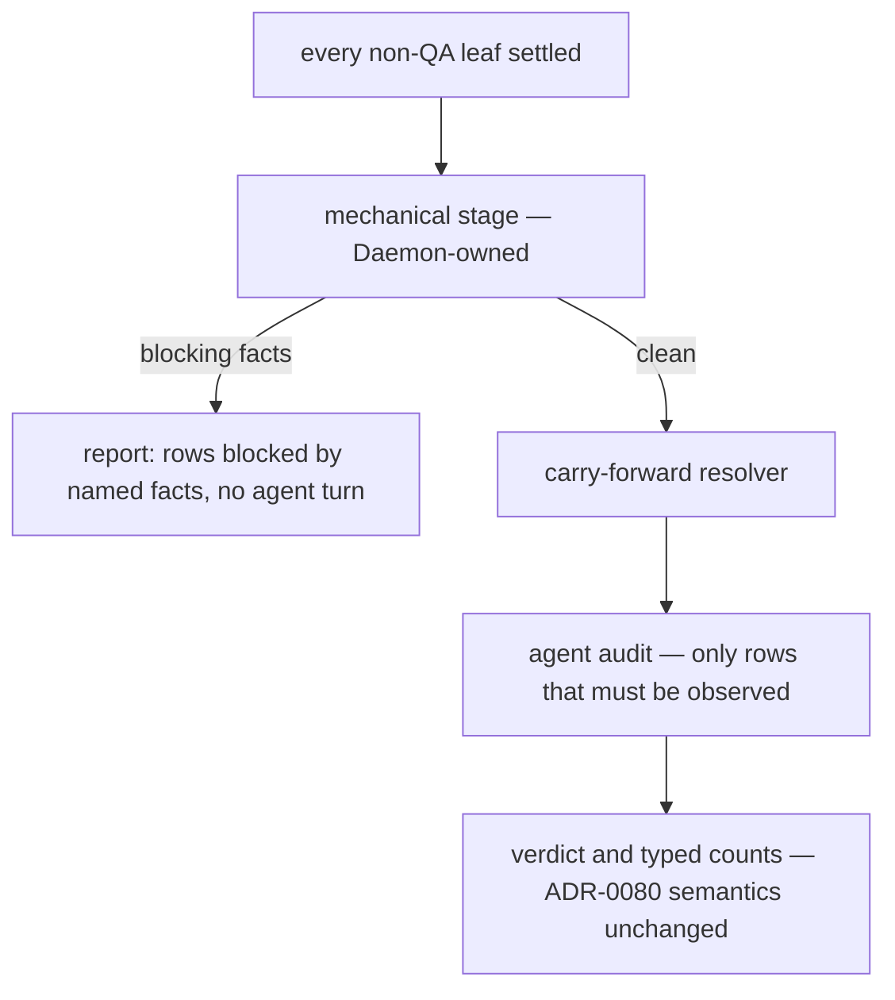

# Cheap detectors run before the gate — Technical Spec

## Executive Summary

The design accepts one primary trade-off: the mechanical stage duplicates
knowledge the skill already states in prose, so a rule now lives in two places
and must be kept in agreement. It is worth paying because the alternative —
leaving those rules only in prose — is what makes every machine fact cost an
agent turn. Everything attaches to seams that exist: the consistency checker
gains repository-level detectors in the shape it already proved, the Daemon
gains a step next to the Verification it already owns, and the QA prompt gains
the Spec Context Bundle every Task prompt already carries. The one genuinely
new mechanism is evidence-scoped carry-forward, which is designed to fail
closed in every direction. Nothing here may relax a verdict; ADR-0080 keeps
that ownership, and the stage computes counts rather than defining them.

## Project Constraints

- Identifier strategy: not applicable — no project-owned Internal Identifier is
  minted; the QA Report filename contract and Task Graph node ids already exist
  and are unchanged. Source: `docs/agents/domain.md`.
- Authentication and HTTP: not applicable — local process execution, Git reads,
  and file I/O only; the gate's existing read-only `gh pr list` lookup is
  untouched. Source: `docs/agents/go.md`.
- Active ADR obligations: applicable — ADR-0096 and ADR-0097 are the decisions
  this design implements. ADR-0080 keeps sole ownership of verdict semantics
  and the three typed blocked-cause counts. ADR-0091 keeps the gate a terminal
  `qa` node whose stages live inside it, and ADR-0088 keeps it authored rather
  than requested. ADR-0015 keeps the report commit, the fail-on-missing-verdict
  rule, and the unresolved outcome on any non-pass. ADR-0093 and ADR-0094 bound
  every detector to citation-checkable facts, deterministic and hermetic,
  skipped rather than failed on an absent artifact, and non-regressive.
  ADR-0014 and ADR-0057 keep Verification execution and Task status with the
  Daemon, so the stage reports and never settles. ADR-0038 keeps the single
  Verification repair, which the stage must not consume. ADR-0020 keeps a
  parsed prompt result outranking a later nonzero exit. ADR-0056 keeps Task
  Capacity separate from Verification Capacity. ADR-0081 sanctions digest
  fallout. Source: `docs/agents/domain.md`.
- Tooling authority: applicable — express maintainer authorization granted
  2026-08-06, recorded at `docs/workflow/authorizations/2026-08-06-proof-cost.md`;
  bounded files: `.agents/skills/qa-gate/**` with its `skills/qa-gate/**`
  mirror regenerated by `make skills-sync`,
  `internal/baseline/assets/modules/core.json`,
  `internal/baseline/assets/modules/spec-workflow.json`, the `docs/agents/`
  guides carrying those modules' regenerated managed-block postimages as
  adoption, and `Makefile` when the incremental tier needs its own target.
  Deterministic digest fallout is sanctioned by ADR-0081; `.github/**` is
  outside this grant. Source: `docs/agents/agent-instructions.md`.

## System Architecture

Four existing seams extend; no new package earns its place.

- **`internal/speccheck`** gains the detectors that are spec-local and
  citation-checkable, in the repository-rule shape the loop-order and findings
  rules already proved, exercised through dedicated fixture carriers.
- **The Daemon's QA step** (`Engine.runQAGate`) gains a mechanical stage before
  its Agent Session, running under the Verification ownership ADR-0014 already
  assigns it and reusing the Verification output and event plumbing rather than
  inventing a channel.
- **The QA prompt** (`BuildQAPrompt`) gains the `SpecContextBundle` the Task
  prompt already assembles, plus the previous report's identity, so scoping is
  expressible at all. It also gains the missing third blocked-cause count in
  its contract text.
- **The Baseline modules** gain the two-tier verification clause, declared per
  profile in terms of the commands that profile names, because an adopting
  repository may have no `make`.



## Implementation Design

### Interfaces

The mechanical stage's result, consumed by the Daemon and handed to the prompt:

```go
// MechanicalStage runs before the QA Agent Session. It never settles a Task,
// never edits a report, and never computes a verdict.
type MechanicalResult struct {
    Findings []MechanicalFinding // every failure found, not the first
    Carried  []CarriedRow        // rows resolvable without observation
    Blocking bool                // at least one Finding blocks the audit
}

type MechanicalFinding struct {
    Code    string // SC-style, e.g. "QA-AUTH-PATHS", "QA-CONSEQUENT-ORDER"
    File    string
    Line    int
    Detail  string
    Fix     string
    RowHint string // the report row this fact blocks, when known
}
```

Carry-forward, whose safety conditions are the whole point (ADR-0097):

```go
type CarriedRow struct {
    ID              string // row id in the current matrix
    EstablishedBy   string // report path that proved it
    EstablishedHead string // commit the proof was taken at
    Inputs          []string
}

// Carriable reports whether a row may be carried. Every condition must hold:
// prior status is pass; Inputs is non-empty; EstablishedHead is an ancestor of
// head; no Input intersects changed(EstablishedHead, head); every cited
// evidence path resolves with unchanged content.
func Carriable(prior ReportRow, head string, changed []string) bool
```

Row input declaration, added to the report's row format so a row can say what
it depends on:

```markdown
| R04 | … | evidence: qa/evidence/…/R04.txt | inputs: internal/inbox/**, docs/agents/docs-layout.md | pass |
```

### Data Models

No database and no schema. Two file-contract additions: an `inputs:` field per
report row, and a carried row's citation of the report and head that
established it. Both are additive; a report without them behaves exactly as
today, and a row without `inputs` is never carriable.

### API Contracts

No new command and no new flag. The mechanical detectors join the `spec check`
report surface with the same code, file, line, and fix shape as every existing
rule. The `Makefile` gains an incremental verification target for this
repository's own fast tier; the contract that other repositories inherit names
commands rather than tools.

## Coverage Map

- Goal 1 / Story 1 → the mechanical stage plus the two-tier clause: the fast
  tier makes per-Task repository gating affordable, which is what names a red
  repository at the Task rather than at the graph's end.
- Goal 2 / Stories 2, 6 → the carry-forward resolver and the row `inputs`
  declaration, with the establishing citation printed in the report.
- Goal 3 / Story 5 → the per-profile two-tier verification clause in the
  Baseline modules.
- Goal 4 → the same clause, inherited by every adopting repository.
- Story 3 → the mechanical stage's findings handed to the prompt.
- Story 4 → `BuildQAPrompt` carrying the Spec Context Bundle and previous
  report identity.
- Core Feature 1 → the mechanical detectors in the consistency checker.
- Core Feature 2 → the Daemon stage withholding the Agent Session on a blocking
  result.
- Core Feature 3 → the citation-only, presence-aware detector boundary.
- Core Feature 4 → the Spec Context Bundle and previous-report identity in the
  QA prompt.
- Core Feature 5 → the carry-forward resolver and the row `inputs` declaration.
- Core Feature 6 → the per-profile two-tier verification clause.
- Core Feature 7 → unchanged verdict computation, asserted rather than assumed.
- Core Feature 8 → the third blocked-cause count restored to the prompt
  contract.

## Integration Points

- **`gh`** — untouched; the existing read-only pull request lookup keeps its
  timeout and its resolved/unresolved distinction.
- **Adopting repositories** — receive the two-tier clause through the Baseline
  modules they already inherit; no repository is required to have `make`.

## Testing Approach

- Each mechanical detector lands with a red-then-green pair over a dedicated
  fixture carrier, never over live or archived Specs, plus a presence-aware
  case proving the silent skip and the corpus non-regression assertion with
  `TestCheckCorpusBudget` still green.
- Carry-forward gets an adversarial suite rather than a happy path: a row that
  failed, a row with no declared inputs, a row whose input changed, a row whose
  establishing head is not an ancestor, and a row whose cited evidence file
  changed content must each refuse to carry. The happy path is one case among
  six refusals, because the risk is entirely on the permissive side.
- The Daemon step is exercised through the existing verification-attempt seam,
  asserting that a blocking mechanical result withholds the Agent Session, that
  the single Verification repair is not consumed, and that Task status is never
  settled by the stage.
- The prompt change is asserted by comparing the assembled QA prompt against
  the Task prompt's bundle contract, and by requiring all three blocked-cause
  count names in the contract text.
- The two-tier clause verifies through the module choreography: manifest-row
  bootstrap, two-pass `make baseline-digests`, postimage adoption — and the
  maintained Source Baseline expectation moves in its own consequent commit,
  never folded into the authorized edit.

## Build Order

1. **Detectors** — the mechanical rules in the consistency checker with carrier
   fixtures: authorization bounded files against actual changed paths,
   consequent-fix commit ordering, report structural shape, evidence-path
   resolution. Inert: nothing calls them from the gate yet, so the repository
   is never left red between steps.
2. **Prompt context** (depends on: 1) — `BuildQAPrompt` carries the Spec
   Context Bundle and the previous report's identity, and its contract text
   names all three blocked-cause counts.
3. **The Daemon stage** (depends on: 1, 2) — the mechanical stage runs before
   the Agent Session, reports every finding in one pass, and withholds the
   session when blocking. Verdict computation is untouched.
4. **Row inputs** (depends on: 2) — the report row format gains `inputs:`, and
   the skill instructs how a row declares them. Declaration only; nothing
   consumes it yet.
5. **Carry-forward** (depends on: 3, 4) — the resolver, its six refusal cases,
   and the carried-row citation in the report.
6. **Two-tier verification** (depends on: 1) — the per-profile clause in the
   Baseline modules with postimage adoption, plus this repository's own
   incremental target. Tooling task; its consequent fixture correction lands as
   its own commit after it.
7. **QA gate** (depends on: 5, 6) — the authored terminal Task.

## Risks & Considerations

- **Carry-forward is the only mechanism here that can make something green
  wrongly.** Mitigation is structural: opt-in per row, fail closed on every
  missing condition, and an adversarial test suite weighted six-to-one toward
  refusal. A row that cannot express its inputs as repository paths always
  re-observes.
- **Two homes for one rule.** A detector and the skill's prose can drift. The
  detectors are authored from the skill's own wording, and the skill points at
  the code as the authority for the facts it no longer performs by hand.
- **Detector over-reach** is the standing failure mode of new rules; the corpus
  non-regression assertion and the citation-only boundary are the guards.
- **The stage must not consume the Verification repair** ADR-0038 allots, nor
  borrow Verification Capacity ADR-0056 separates. Both are asserted, not
  assumed.
- **The fast tier is a contract, not a promise about `make`.** A profile that
  names no incremental command inherits the clause as unmet rather than
  silently satisfied.

## Decisions

- The mechanical stage is a Daemon-owned step inside the `qa` node, not a
  command outside the graph. See ADR-0096.
- It reports every mechanical failure in one pass, because spending the single
  repair turn on the first of N defects is a measured cost this repository
  already documented.
- Carry-forward is evidence-scoped and fails closed; recency never carries a
  row. See ADR-0097.
- The two-tier verification contract is expressed per profile in terms of the
  commands that profile declares, because adopting repositories are not all
  Go repositories with a `Makefile`.
- Verdict semantics, the typed counts, the report naming contract, and the
  report commit stay exactly as ADR-0080, ADR-0015, and ADR-0091 define them.
