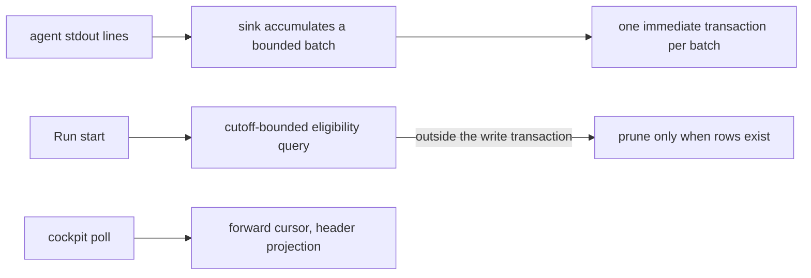

# A journal cheap to write and cheap to keep — Technical Spec

## Executive Summary

The primary trade-off is deliberate and narrow: event durability moves from
per-event to per-batch, so a crash can lose the batch in flight where today it
could lose nothing. Everything else in this design is a defect repair rather
than a trade — the retention eligibility query aggregates the largest table
with no time predicate and does so inside the write transaction, so every Run
start holds the machine-wide write lock across a full scan even when nothing is
eligible; and the cockpit rescans a Run's entire journal, payloads included, on
every append. Those two paths, not disk, are what the three-gigabyte
measurement actually exposed. ADR-0008 stays untouched: payloads remain raw
producer JSON, write-once and read-as-blob, and no design here rewrites,
prunes, or compresses a payload. Whether retention should shed payloads at all
is deferred behind a measurement, because the honest answer may be no.

## Project Constraints

- Identifier strategy: not applicable — Run identifiers and event cursors exist
  and are unchanged; no project-owned Internal Identifier is minted. Source:
  `docs/agents/domain.md`.
- Authentication and HTTP: not applicable — local SQLite access and file I/O
  only; no endpoint, credential, or transport is created. Source:
  `docs/agents/go.md`.
- Active ADR obligations: applicable — ADR-0098 is the decision this design
  implements. ADR-0008 binds the payload as raw producer JSON, write-once and
  read-as-blob, and nothing here re-serializes or prunes one. ADR-0030 makes
  the journal the only durable copy of agent payloads, which is why durability
  is traded per batch rather than per window. ADR-0033 owns the retention
  policy this design makes cheap to evaluate without changing its meaning.
  ADR-0009 keeps the cockpit reading the journal exclusively, so read-path
  changes affect live rendering. ADR-0004 keeps one machine-wide Run Database,
  preserved here by decision and revisited only if measurement demands it.
  ADR-0022 does not apply: Stop Requests travel through the Run Database as
  control state, and no Run state, Stop semantics, or their tables are touched.
  ADR-0027 owns how a renamed or removed config key degrades to a warning.
  Source: `docs/agents/domain.md`.
- Tooling authority: not applicable — no protected tooling mutation is
  proposed. The work is Go code, SQL, Go-side config defaults, and a user-guide
  document; this repository's `.roundfixrc.yml` is out of scope and defaults
  ship in code. Source: `docs/agents/agent-instructions.md`.

## System Architecture

Three seams in `internal/store`, one in the TUI, one measurement harness. No
new package, no second store, no schema migration unless the measurement
demands one.

- **The append path** (`appendRunEvent`, `AppendRunEvents`, `JournalSink`)
  gains real batching: the existing plural entry point stops being called with
  one-element slices, and the sink accumulates within a bounded window before
  committing one transaction.
- **The retention path** (`terminalRunPruneCandidates`, `PruneTerminalRuns`)
  gains a cutoff predicate in SQL and loses its full-table aggregate from
  inside the write transaction.
- **The read path** (`RunEventsAfter`, `RunEventsBefore`) gains a payload-free
  projection for consumers that only need headers.
- **The cockpit** (`refreshTaskJournalEvents`) advances a forward cursor the
  way `refreshBatchClocks` already does.
- **A measurement harness** records event-write latency, lock-wait, and
  `SQLITE_BUSY` frequency against journal size and writer count, producing the
  baseline artifact every later claim is checked against.



## Implementation Design

### Interfaces

The batching boundary, expressed where the sink already is:

```go
// JournalSink accumulates events and commits them in one immediate
// transaction. A batch closes on size, on elapsed time, or on any event that
// must be durable immediately (terminal outcomes, verification results).
type JournalSink struct {
    maxBatch  int
    maxLinger time.Duration
}

// Flush commits the pending batch. Publish returns only after the event is
// either committed or accepted into the open batch; a failed flush fails the
// Run exactly as a failed append does today.
func (s *JournalSink) Flush(ctx context.Context) error
```

Retention, with the predicate where the database can use it:

```go
// Candidates returns terminal Runs completed before cutoff. The cutoff is a
// SQL predicate, not a Go filter, and the query runs outside any write
// transaction. Event counts, when reported at all, come from a bounded query
// over the candidate set rather than an aggregate over every row.
func (s *Store) TerminalRunPruneCandidates(ctx context.Context, cutoff time.Time) ([]RunPruneCandidate, error)
```

Header-only reads for consumers that discard payloads:

```go
// RunEventHeadersAfter projects cursor, batch, source, kind, summary, and
// created_at. Consumers needing the raw payload keep using RunEventsAfter.
func (s *Store) RunEventHeadersAfter(ctx context.Context, runID string, cursor int64) ([]RunEventHeader, error)
```

### Data Models

No schema change is planned. If the measurement shows the payload column
itself is the write-path cost — rather than the transaction and fsync around
it — a payload side-table becomes a candidate, and in that case the durable
lifecycle table in the run-database guide is updated in the same change, which
its own test enforces.

### API Contracts

No command, flag, output shape, or stream schema changes. `roundfix events`,
`attach`, the cockpit, and `gc` keep their contracts byte-for-byte, including
every daemon payload field the stream requires.

## Coverage Map

- Goal 1 / Story 1 → the cutoff-bounded eligibility query outside the write
  transaction.
- Goal 2 / Story 2 → the batching sink and its flush boundaries.
- Goal 3 / Story 3 → both of the above, proven by the parallel-Run scenario at
  the pre-raise `busy_timeout`.
- Goal 4 / Stories 4, 5 → the header projection and the cockpit's forward
  cursor, with the stream contract asserted unchanged.
- Goal 5 / Story 6 → the measurement harness and the deferred retention-shape
  decision, which may conclude that no payload is shed.
- Core Feature 1 → the measurement harness and its committed baseline.
- Core Feature 2 → the cutoff-bounded eligibility query outside the write
  transaction.
- Core Feature 3 → the batching sink with its named flush boundaries.
- Core Feature 4 → the header projection and the cockpit's forward cursor.
- Core Feature 5 → the deferred retention-shape decision, gated on the
  re-measurement.
- Core Feature 6 → the parallel-Run proof at the pre-raise timeout.
- Core Feature 7 → the durable lifecycle table, updated only if a table
  changes.

## Integration Points

- **SQLite** — the only external dependency, unchanged in version and driver.
- **Supervisors consuming `roundfix events`** — the stream is daemon-only and
  requires daemon payload fields; the header projection is never used on that
  path.
- **Reconcile's replay probe** matches on payload equality. Nothing here
  rewrites a payload, so the probe keeps working; any future payload change
  must re-key it first, and that ordering is recorded as a precondition.

## Testing Approach

- The measurement harness is the first artifact and is itself testable: it
  produces a recorded baseline, and every performance claim later in the Spec
  cites a before and after from the same harness. No claim ships as prose.
- Batching is tested at the boundary, not by timing: a batch that reaches its
  size commits, a batch that reaches its linger commits, an event marked
  immediate commits alone, and a failed flush fails the Run exactly as a failed
  append does today. Ordering by cursor is asserted under concurrency.
- The retention query gets a characterization test on a seeded journal proving
  that eligibility work is bounded by the candidate set rather than the table,
  and that no aggregate runs inside a write transaction.
- Consumer non-regression is a corpus test: a journal recorded before the
  change replays identically through `events`, the timeline, the cockpit's task
  and verification parsing, reconcile's replay probe, and `gc`.
- The parallel-Run scenario runs at the pre-raise `busy_timeout` deliberately,
  so the test proves the design rather than the timeout.

## Build Order

1. **Measurement harness and baseline** — event-write latency, lock-wait, and
   `SQLITE_BUSY` frequency against journal size and writer count, recorded as a
   committed artifact. Everything after cites it.
2. **Retention query repair** (depends on: 1) — cutoff predicate in SQL,
   eligibility work out of the write transaction, event count bounded or
   dropped from the hot path.
3. **Batched appends** (depends on: 1) — the sink accumulates and commits per
   batch with `synchronous` unchanged, with immediate-flush kinds named.
4. **Header projection and forward cursor** (depends on: 1) — the payload-free
   read path and the cockpit's cursor, with the consumer corpus asserted
   unchanged.
5. **Parallel-Run proof** (depends on: 2, 3) — the scenario at the pre-raise
   timeout, measured against the step-1 baseline.
6. **Retention shape decision** (depends on: 5) — with the write and lock costs
   fixed and re-measured, decide whether any payload shedding is needed at all;
   if it is, it arrives as an explicit ADR-0008 amendment naming the lost
   capability, and the payload-equality replay probe is re-keyed first.
7. **QA gate** (depends on: 6) — the authored terminal Task.

## Risks & Considerations

- **A batch in flight is lost on crash.** That is the accepted trade
  (ADR-0098). Terminal outcomes and verification results flush immediately, so
  the events a post-mortem needs most are never in a pending batch.
- **Batching can reorder or stall.** Cursor allocation stays monotonic per Run,
  and linger is bounded so a quiet Run's last line is not held indefinitely.
- **The cockpit reads the journal for live Runs** (ADR-0009), so a read-path
  change is a live-rendering change; the consumer corpus test is what makes
  that safe.
- **The measurement may disprove the premise.** If the lock and write repairs
  remove the pain, step 6 concludes with no payload change, and the Spec ships
  smaller than its title suggests. That is a success, not a shortfall.
- **One machine-wide database stays** by decision. If the parallel-Run proof
  still shows contention after steps 2 and 3, that result is the input to a
  separate ADR-0004 conversation, not a scope expansion here.

## Decisions

- Appends batch, with durability per batch and `synchronous` unchanged. See
  ADR-0098.
- Measurement precedes every performance claim, and the retention-shape
  decision waits behind it.
- ADR-0008 is binding: no payload is rewritten, pruned, or compressed in this
  Spec.
- ADR-0004 stands; the single machine-wide database is preserved and the
  contention hypothesis is tested against the repaired paths first.
- Header-only reads are added beside the existing full reads rather than
  replacing them, so no consumer changes shape.
