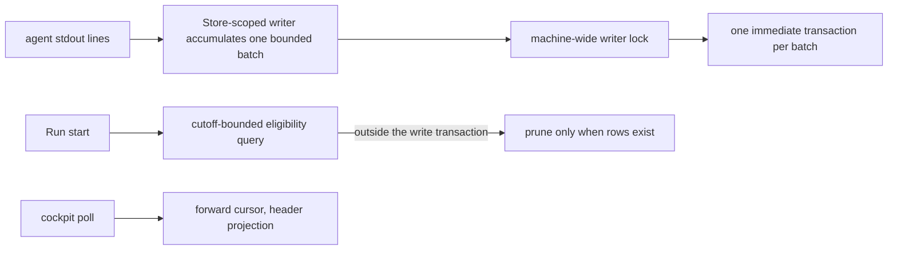

# A journal cheap to write and cheap to keep — Technical Spec

## Executive Summary

The primary trade-off is deliberate and narrow: event durability moves from
per-event to per-batch, so a crash can lose the batch in flight where today it
could lose nothing. Everything else in this design is a defect repair rather
than a trade — the retention eligibility query aggregates the largest table
with no time predicate and does so inside the write transaction, so every Run
start holds the machine-wide write lock across a full scan even when nothing is
eligible; and the cockpit rescans a Run's entire journal, payloads included, on
every append. Those two paths, not disk, are what the three-gigabyte
measurement actually exposed. ADR-0008 stays untouched: payloads remain raw
producer JSON, write-once and read-as-blob, and no design here rewrites,
prunes, or compresses a payload. Journal Retention also stays terminal-only
and age-based. A second retention window and payload shedding are rejected
because they do not repair the measured lock or write paths and would create a
new data-loss boundary for the journal's only durable payload copy.

## Project Constraints

- Identifier strategy: not applicable — Run identifiers and event cursors exist
  and are unchanged; no project-owned Internal Identifier is minted. Source:
  `docs/agents/domain.md`.
- Authentication and HTTP: not applicable — local SQLite access and file I/O
  only; no endpoint, credential, or transport is created. Source:
  `docs/agents/go.md`.
- Active ADR obligations: applicable — ADR-0098 is the decision this design
  implements. ADR-0008 binds the payload as raw producer JSON, write-once and
  read-as-blob, and nothing here re-serializes or prunes one. ADR-0030 makes
  the journal the only durable copy of agent payloads, which is why durability
  is traded per batch rather than per window. ADR-0033 owns the retention
  policy this design makes cheap to evaluate without changing its meaning.
  ADR-0009 keeps the cockpit reading the journal exclusively, so read-path
  changes affect live rendering. ADR-0004 keeps one machine-wide Run Database,
  preserved here by decision.
  ADR-0022 does not apply: Stop Requests travel through the Run Database as
  control state, and no Run state, Stop semantics, or their tables are touched.
  ADR-0027 owns how a renamed or removed config key degrades to a warning.
  Source: `docs/agents/domain.md`.
- Tooling authority: not applicable — no protected tooling mutation is
  proposed. The work is Go code, SQL, Go-side config defaults, and a user-guide
  document; this repository's `.roundfixrc.yml` is out of scope and defaults
  ship in code. Source: `docs/agents/agent-instructions.md`.

## System Architecture

Three seams in `internal/store`, one in the TUI, one measurement harness. No
new package, no second store, and no schema migration.

- **The append path** (`appendRunEvent`, `AppendRunEvents`, `JournalSink`)
  gains one Store-scoped writer: every sink handle publishes into the same
  bounded batch, and one transaction commits that batch.
- **Every Store write path** uses one machine-wide advisory writer lock keyed
  by the Run Database path, one `sql.DB` connection per process, and one
  immediate transaction at a time. The lock is acquired before `BeginTx` and
  released only after commit or rollback, so Roundfix writers never race in
  SQLite.
- **The retention path** (`terminalRunPruneCandidates`, `PruneTerminalRuns`)
  gains a cutoff predicate in SQL and loses its full-table aggregate from
  inside the write transaction.
- **The read path** (`RunEventsAfter`, `RunEventsBefore`) gains a payload-free
  projection for consumers that only need headers.
- **The cockpit** (`refreshTaskJournalEvents`) advances a forward cursor the
  way `refreshBatchClocks` already does.
- **A measurement harness** records event-write latency, lock-wait, and
  `SQLITE_BUSY` frequency against journal size and writer count, producing the
  baseline artifact every later claim is checked against.



## Implementation Design

### Interfaces

The batching boundary is Store-scoped rather than sink-scoped:

```go
const (
    journalBatchSize = 128
    journalMaxLinger = 100 * time.Millisecond
)

// Every JournalSink returned by the Store shares its one JournalWriter.
func (s *Store) JournalSink() runevent.Sink
func (s *Store) FlushJournal(ctx context.Context) error
func (s *Store) CloseJournal(ctx context.Context) error

// CompleteRun bypasses the closed JournalWriter. It validates outcome as this
// Run's daemon.outcome event, then commits the terminal state, Active Run lock
// release, cursor allocation, and event insert through one withWriteTx call;
// an ambiguous commit is reconciled against that exact state and event.
func (s *Store) CompleteRun(
    ctx context.Context,
    runID string,
    terminalState string,
    outcome runevent.RunEvent,
) (CompleteRunResult, error)
```

A batch closes at 128 events, 100 milliseconds after its first event, before a
`daemon.outcome`, verification-verdict, or closed-session event, and on
explicit flush for an error path, Agent teardown, terminal settlement, or
process shutdown. The limits are internal constants, not configuration or CLI
surface. `Publish` preserves call order. The write transaction allocates a
contiguous cursor range per Run and removes events from the pending batch only
after a successful commit.

Begin, insert, and commit failures preserve the entire pending batch and return
through the critical-sink error path. If commit returns an ambiguous result,
the writer reads the assigned cursor range: an exact field-and-payload match
settles the batch, no rows permits one retry with the same cursors, and a
partial or different match fails as corruption. The existing `(run_id,
cursor)` primary key makes that retry idempotent without a new identifier.

The Run lifecycle owns the shared writer. It flushes before ending the Agent
Session, publishes the closed-session event, then calls `CloseJournal` before
terminal settlement. `CloseJournal` flushes the pending batch and marks the
writer closed only after that flush commits; a failed Close preserves the batch
and remains retryable, while every later `Publish` after a successful Close is
rejected.

Only after Close succeeds does the Daemon construct `daemon.outcome` and call
`CompleteRun`. `CompleteRun` does not publish through `JournalSink`: it enters
`withWriteTx` directly, compare-and-sets the terminal state, releases the
Active Run lock, allocates the event cursor, inserts `daemon.outcome`, and
commits those changes atomically. This direct terminal path is the sole append
allowed after the JournalWriter closes. Post-terminal notification receipts
also use immediate `withWriteTx` transactions and never enter the closed batch;
the database connection closes after those receipts finish.

A Flush or Close error returns before `CompleteRun`, so the requested outcome
is not attempted. The existing Run-failure path records the error, retries the
still-open Close boundary when needed, and then attempts `CompleteRun` with
`Failed` and a failure outcome. A `CompleteRun` begin, state update, lock
release, or event-insert error rolls back the whole transaction: the requested
state, its event, and the lock release are all absent.

A commit error is treated as ambiguous rather than assumed rolled back.
`CompleteRun` reads the Run state, Active Run lock, and exact serialized outcome
event: the requested terminal state plus the exact event and released lock
settles successfully; the original non-terminal state plus lock and no event
permits one retry of the same transaction; any partial or different result
fails as corruption. The Run-failure path may attempt `Failed` only after this
reconciliation proves the requested transaction did not commit. If terminal
failure settlement also errors, the command returns both diagnostics and
preserves the last observed state and lock for recovery. No notification or
requested-outcome report is emitted unless the matching state and
`daemon.outcome` are proven committed together.

Every writer transaction, not only journal appends, enters through the same
Store helper:

```go
// withWriteTx serializes Roundfix processes before SQLite sees a writer.
// Cursor allocation, inserts, state changes, and commit all hold the lock.
func (s *Store) withWriteTx(
    ctx context.Context,
    fn func(*sql.Tx) error,
) error
```

Each operational process opens one writer Store, and that Store keeps
`SetMaxOpenConns(1)`; read-only Store values remain separate. Context
cancellation or an advisory-lock failure returns to the caller. The existing
`busy_timeout` remains defensive for an unknown non-Roundfix writer, but no
Roundfix path relies on it for concurrency. Cursor allocation stays inside the
locked transaction, so concurrent Runs preserve input order and monotonic
per-Run cursors.

Retention, with the predicate where the database can use it:

```go
// Candidates returns terminal Runs completed before cutoff. The cutoff is a
// SQL predicate, not a Go filter, and the query runs outside any write
// transaction. Event counts, when reported at all, come from a bounded query
// over the candidate set rather than an aggregate over every row.
func (s *Store) TerminalRunPruneCandidates(ctx context.Context, cutoff time.Time) ([]RunPruneCandidate, error)
```

Header-only reads for consumers that discard payloads:

```go
// RunEventHeadersAfter projects cursor, batch, source, kind, summary, and
// created_at. Consumers needing the raw payload keep using RunEventsAfter.
func (s *Store) RunEventHeadersAfter(ctx context.Context, runID string, cursor int64) ([]RunEventHeader, error)
```

### Data Models

No schema change. Payload remains in `run_events`, and the existing durable
table lifecycle entry stays unchanged. The only supported retention behavior
is the existing Journal Retention contract: a terminal Run older than the
configured window may have its complete journal pruned; no retained Run loses
only its payload.

### API Contracts

No command, flag, output shape, or stream schema changes. `roundfix events`,
`attach`, the cockpit, and `gc` keep their contracts byte-for-byte, including
every daemon payload field the stream requires.

## Coverage Map

- Goal 1 / Story 1 → the cutoff-bounded eligibility query outside the write
  transaction.
- Goal 2 / Story 2 → the batching sink and its flush boundaries.
- Goal 3 / Story 3 → the machine-wide writer lock, one-connection discipline,
  and bounded transactions, proven by the parallel-Run scenario at the
  pre-raise `busy_timeout`.
- Goal 4 / Stories 4, 5 → the header projection and the cockpit's forward
  cursor, with the stream contract asserted unchanged.
- Goal 5 / Story 6 → the cutoff-bounded query and the explicit decision to
  preserve terminal-only, age-based Journal Retention without payload shedding.
- Core Feature 1 → the measurement harness and its committed baseline.
- Core Feature 2 → the cutoff-bounded eligibility query outside the write
  transaction.
- Core Feature 3 → the batching sink with its named flush boundaries.
- Core Feature 4 → the header projection and the cockpit's forward cursor.
- Core Feature 5 → unchanged Journal Retention semantics and no new payload
  loss boundary.
- Core Feature 6 → the parallel-Run proof at the pre-raise timeout.
- Core Feature 7 → the durable lifecycle table, confirmed unchanged because no
  table changes.

## Integration Points

- **SQLite** — the only external dependency, unchanged in version and driver.
- **Supervisors consuming `roundfix events`** — the stream is daemon-only and
  requires daemon payload fields; the header projection is never used on that
  path.
- **Reconcile's replay probe** matches on payload equality. Nothing here
  rewrites a payload, so the probe keeps working unchanged.

## Testing Approach

- The measurement harness is the first artifact and is itself testable: it
  produces a recorded baseline, and every performance claim later in the Spec
  cites a before and after from the same harness. No claim ships as prose.
- Batching is tested at the boundary, not by timing: a batch that reaches its
  size commits, a batch that reaches its linger commits, an event marked
  immediate flushes prior events and commits, and a failed flush preserves the
  whole batch and fails the Run exactly as a failed append does today. An
  ambiguous-commit fixture proves exact-match reconciliation, same-cursor
  retry, and mismatch refusal. Ordering by cursor is asserted under concurrency.
- The lifecycle suite constructs several sink handles from one Store and proves
  they share one batch. It then covers error, Agent teardown, terminal
  settlement, and process shutdown. It asserts that Publish is rejected after
  a successful Close while direct `CompleteRun` still persists
  `daemon.outcome`; that a failed Close preserves the batch and leaves the
  requested outcome unsettled; and that pre-commit terminal-transaction
  failures roll back state, event, and lock release before the existing failure
  path attempts `Failed`. Ambiguous commit fixtures prove exact-match success,
  one same-operation retry after a proven no-op, and corruption refusal for a
  partial or different state-event-lock combination.
- The writer-concurrency suite opens independent Store writers against one
  database and proves that every write transaction serializes through the
  machine-wide lock, cursors stay monotonic, and lock cancellation propagates.
- The retention query gets a characterization test on a seeded journal proving
  that eligibility work is bounded by the candidate set rather than the table,
  and that no aggregate runs inside a write transaction.
- Consumer non-regression is a corpus test: a journal recorded before the
  change replays identically through `events`, the timeline, the cockpit's task
  and verification parsing, reconcile's replay probe, and `gc`.
- The parallel-Run scenario runs at the pre-raise `busy_timeout` deliberately,
  so the test proves the design rather than the timeout.

## Build Order

1. **Measurement harness and baseline** — event-write latency, lock-wait, and
   `SQLITE_BUSY` frequency against journal size and writer count, recorded as a
   committed artifact. Everything after cites it.
2. **Writer transaction discipline** (depends on: 1) — machine-wide advisory
   lock, one connection per process, and one helper for every immediate write
   transaction.
3. **Retention query repair** (depends on: 1, 2) — cutoff predicate in SQL,
   eligibility work out of the write transaction, event count bounded or
   dropped from the hot path.
4. **Store-scoped batched appends** (depends on: 1, 2) — shared writer,
   count/linger/immediate boundaries, idempotent ambiguous-commit handling,
   and Flush/Close integration with Agent teardown and terminal settlement.
5. **Header projection and forward cursor** (depends on: 1) — the payload-free
   read path and the cockpit's cursor, with the consumer corpus asserted
   unchanged.
6. **Parallel-Run proof** (depends on: 3, 4) — the scenario at the pre-raise
   timeout, measured against the step-1 baseline.
7. **QA gate** (depends on: 5, 6) — the authored terminal Task.

## Risks & Considerations

- **A batch in flight is lost on crash.** That is the accepted trade
  (ADR-0098). Terminal outcomes and verification results flush immediately, so
  the events a post-mortem needs most are never in a pending batch.
- **Batching can reorder or stall.** Cursor allocation stays monotonic per Run,
  publisher order is retained in the pending batch, and linger is bounded so a
  quiet Run's last line is not held indefinitely.
- **Serialization trades peak write parallelism for a zero-busy contract among
  Roundfix processes.** Transactions stay bounded and retention scans run
  outside them, so the machine-wide lock covers only the writes SQLite already
  serializes.
- **A flush failure can change the requested terminal outcome to Failed.** That
  is intentional: settling Clean while its only durable event copy remains in
  memory would be false. Terminal state and outcome event commit atomically.
- **The cockpit reads the journal for live Runs** (ADR-0009), so a read-path
  change is a live-rendering change; the consumer corpus test is what makes
  that safe.
- **Retention still deletes data at its existing boundary.** When a terminal
  Run becomes eligible, GC removes its complete Run Event Journal; before that
  boundary this Spec sheds no payload. No new recovery loss is introduced.
- **One machine-wide database stays** by decision. If the parallel-Run proof
  still shows contention after steps 3 and 4, that result is the input to a
  separate ADR-0004 conversation, not a scope expansion here.

## Decisions

- Appends batch, with durability per batch and `synchronous` unchanged. See
  ADR-0098.
- One machine-wide advisory writer lock serializes every Roundfix write
  transaction; each process retains one writer connection, and cursor
  allocation stays inside the transaction.
- One JournalWriter belongs to each Store. Sink handles share it, and Flush,
  terminal finalization, and Close are explicit error-returning lifecycle
  operations.
- Measurement precedes every performance claim, and the retention contract is
  already settled: no payload shedding or second window ships.
- ADR-0008 is binding: no payload is rewritten, pruned, or compressed in this
  Spec.
- ADR-0004 stands; the single machine-wide database is preserved and the
  contention hypothesis is tested against the repaired paths first.
- Header-only reads are added beside the existing full reads rather than
  replacing them, so no consumer changes shape.

### Rejected alternatives

- **Batching without writer serialization** reduces lock attempts but cannot
  guarantee zero `SQLITE_BUSY` across independent Run processes.
- **One writer goroutine per process** cannot coordinate the other processes
  that open the same machine-wide Run Database.
- **A database per Run** avoids contention by abandoning ADR-0004 and makes
  machine-wide discovery and retention a cross-database problem.
- **A payload side table, payload shedding, or a second retention window**
  changes durability without repairing the measured transaction and scan
  costs. It would make agent payloads unrecoverable before the existing Journal
  Retention boundary, so it is outside this Spec.
