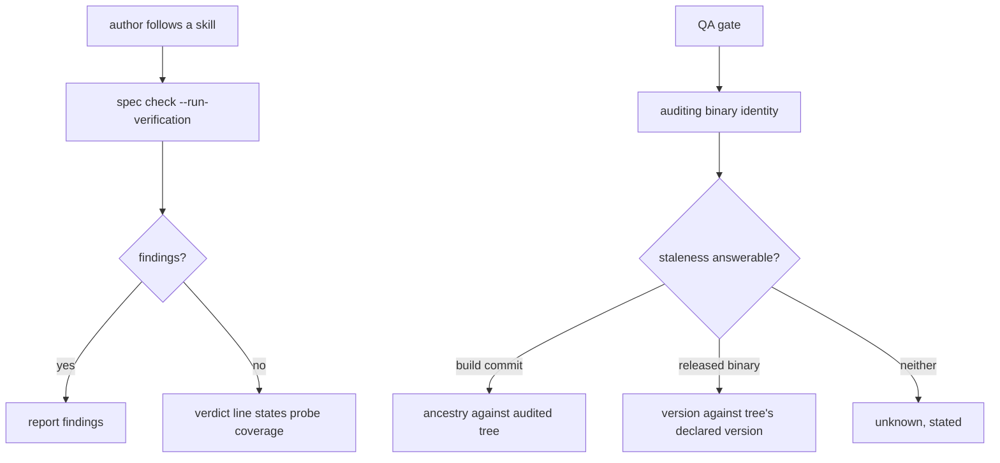

# A verdict that states its own scope — Technical Spec

## Executive Summary

Three surfaces report less than their reader takes them to mean, and each is
repaired where it is read rather than where it is computed. The authoring skills
gain the probing form of the Spec Consistency Check, which they name zero times
today. The check's clean verdict carries its own coverage on the verdict line
instead of leaving it to a trailing note the reader has already passed. The QA
Report records the binary that produced it beside the tree it audited.

The primary trade-off is that staleness is answered from two different signals
and is allowed to be **unknown**. A released binary leaves `BuildCommit` empty
by design — only the Makefile stamps it — so commit ancestry cannot answer the
question for the binaries most readers run. Comparing the running version
against the version the audited tree declares answers it for those, and neither
signal is available in every case. Reporting `unknown` where neither applies is
the honest third state; inferring "current" from a missing signal would
reproduce the defect this Spec exists to remove, one layer down.

The second trade-off is that the coverage line is unconditional on a clean
verdict. It costs one line on every clean check, including the many where the
author already knew. The alternative — printing it only when the graph carries
commands the probe would have run — was rejected because it makes the notice's
absence meaningful, and an author cannot read an absence they were never shown.

## Project Constraints

- Identifier strategy: applicable — Spec Consistency Check, Verification, QA
  Report, Verdict, and Task are glossary terms this Spec reports on, and a
  message that invents a synonym for one of them is a defect. This Spec coins
  one term for the binary that produced a verdict; the Vocabulary Contract below
  binds its emitting surfaces to `CONTEXT.md`. The closing node checks whether
  the work introduced, changed, or retired any other term the glossary should
  carry. Source: `docs/agents/domain.md`.
- Authentication and HTTP: not applicable — no network boundary, credential,
  request, or transport is created or read. Every input is the local repository,
  the authored Spec artifacts, and the running binary's own build identity.
  Source: `docs/agents/specific-repository.md`.
- Active ADR obligations: applicable — ADR-0148 already decides that authoring
  and Run time share one Verification prober precisely so a checker cannot
  approve what the probe later refuses; this Spec closes the remaining half,
  which is that the shared prober is never reached from the authoring path the
  skills name, and changes no classification. ADR-0135 makes an absent
  diagnostic a reported state rather than an empty message, which is the rule
  this Spec applies twice: to an unrun check and to an unanswerable staleness
  question. ADR-0117 places a defect's check at the stage that can produce it,
  and a vacuous Verification is produced during authoring, so authoring is where
  it must be refused. ADR-0096 keeps the QA gate's mechanical stage
  deterministic and hermetic, which bounds how the auditor identity may be
  obtained: from the running binary and the repository, never from a network
  call. ADR-0080 distinguishes blocked rows by typed cause and never
  credits a journey without evidence, so nothing here may loosen what a report
  must carry to earn its verdict. Source: `docs/agents/domain.md`.
- Tooling authority: applicable — this Spec edits four Roundfix-owned authoring
  skills, which are protected tooling. Express maintainer authorization: granted
  2026-08-26 in session, recorded at
  `docs/workflow/authorizations/2026-08-30-the-authoring-skills-name-the-probing-check.md`.
  Bounded files: `.agents/skills/write-prd/SKILL.md`,
  `.agents/skills/write-techspec/SKILL.md`,
  `.agents/skills/write-tasks/SKILL.md`, `.agents/skills/qa-gate/SKILL.md`, and
  their generated copies `skills/write-prd/SKILL.md`,
  `skills/write-techspec/SKILL.md`, `skills/write-tasks/SKILL.md`,
  `skills/qa-gate/SKILL.md`. The generated copies are rewritten by the declared
  `make skills-sync` and stay sanctioned fallout under ADR-0081; they are named
  in the record's `paths:` because the changed-path audit reads that frontmatter
  and not its prose. The record lands as its own commit before any skill edit.
  Source: `docs/agents/agent-instructions.md`.

## Vocabulary Contract

This Spec coins one term. **Auditing Binary** names the Roundfix that produced a
verdict, as distinct from the tree it audited. The distinction has no name
today, which is why a QA Report can record `build:` and leave a reader unable to
tell whether it identifies the auditor or the audited.

- emits: `internal/spec/qa.go`
  pattern: `AuditingBinary|auditing_binary`
  documented-in: `CONTEXT.md`
- emits: `internal/app/version.go`
  pattern: `AuditingBinary|auditing_binary`
  documented-in: `CONTEXT.md`
- emits: `.agents/skills/qa-gate/SKILL.md`
  pattern: `auditing_binary`
  documented-in: `CONTEXT.md`

The first is where a report records the identity, the second is where the
identity is assembled from the build stamp, and the third is the template an
Agent fills. Each path is present and readable now.

## System Architecture

Four existing components change; no package, layer, or directory is added.

**The four authoring skills** name the Spec Consistency Check once each, except
the QA gate skill which names it three times. None names `--run-verification`.
Each instruction gains the probing form, and the skill that owns the
Verification contract states what a clean non-probing verdict does not cover.
This is guidance, not code, and it is the only part of this Spec that reaches an
author who never reads a diagnostic.

**The Spec Consistency Check's text renderer** writes the verdict in
`internal/speccheck`, while the note about the probe not running is appended
later by `internal/cli`, after the skipped-detector list. The coverage statement
moves to the verdict line, where the reader who stops at the verdict still meets
it. The renderer therefore needs to know whether the probe ran, which it does
not today: the caller keeps deciding, and passes the answer in.

**The auditing-binary identity** is assembled from the existing build stamp in
`internal/app`, which already composes `--version`. This Spec adds a structured
form of the same facts so a report can record them as data rather than reparse a
human line.

**The QA Report contract** has two writers: the precondition-refusal writer in
`internal/spec/qa.go`, and the template in the QA gate skill that an Agent
fills. Both record the auditing binary, so a report carries it whether the gate
reached its matrix or refused before it.



## Implementation Design

### Interfaces

```go
// AuditingBinary identifies the Roundfix that produced a verdict, as distinct
// from the tree it audited.
type AuditingBinary struct {
    Version string // app.Version
    Commit  string // app.BuildCommit; empty for released builds by design
    Built   string // app.BuildTime; empty for released builds
}

// Auditor returns the running binary's identity.
func Auditor() AuditingBinary

// Staleness is what the report says about auditor age. Unknown is a state the
// reader is shown, never a silent "current".
type Staleness string

const (
    StalenessCurrent Staleness = "current"
    StalenessStale   Staleness = "stale"
    StalenessUnknown Staleness = "unknown"
)

// CompareToTree answers whether this binary predates the tree it audits, from
// commit ancestry when the build is stamped and from the tree's declared
// version otherwise. It returns the reason alongside, so a report states which
// signal answered.
func (binary AuditingBinary) CompareToTree(treeVersion string, ancestry AncestryResult) (Staleness, string)
```

```go
// VerificationCoverage tells the renderer what the probe did, so the verdict
// line can state its own scope instead of a trailing note doing it.
type VerificationCoverage struct {
    Ran      bool
    Commands int
}
```

### Data Models

No schema change and no new persisted entity. The QA Report frontmatter gains
`auditing_binary` and `auditor_staleness`, both strings, beside the existing
`build`. Existing readers are unaffected: `QAVerdict` parses named keys and
ignores unknown ones, so a report written by an older Roundfix still validates.

### API Contracts

`roundfix spec check [<slug> ...]` — unchanged flags and exit codes. A clean
result's verdict line states whether the authored Verification commands were
executed. The trailing note is removed rather than duplicated, so the same fact
is never reported twice in two voices.

The QA Report gains two frontmatter keys. No verdict rule changes, and no
report becomes more permissive: staleness is recorded, never enforced.

## Coverage Map

| PRD item | Component |
| --- | --- |
| Goal 1, Story 1, Core Feature 1 | The four authoring skills' check instruction |
| Goal 2, Story 2, Core Feature 2 | `VerificationCoverage` and the verdict line |
| Goal 3, Story 3, Core Feature 3 | `AuditingBinary`, `Auditor`, and both report writers |
| Goal 4, Core Feature 4 | `Staleness` and `CompareToTree` |

## Integration Points

- `.agents/skills/{write-prd,write-techspec,write-tasks,qa-gate}/SKILL.md` and
  their generated copies, under the recorded authorization.
- `internal/speccheck/report.go` — the verdict line.
- `internal/cli/spec_check.go` — the caller that knows whether the probe ran.
- `internal/app/version.go` — the structured build identity.
- `internal/spec/qa.go` — the precondition-refusal report writer.
- `CONTEXT.md` — the coined term.

## Testing Approach

Every seam exists. `internal/speccheck` and `internal/cli/spec_check_test.go`
already cover rendering and the probe; `internal/spec` already covers the QA
report writer. No new seam is added.

- The verdict line states coverage in both directions: a probed clean run and an
  unprobed clean run render different verdict lines, asserted on the line that
  carries the verdict rather than on the whole report.
- `CompareToTree` is table-driven over the three states, including the two ways
  `unknown` arises: no build stamp and no declared tree version.
- A released-build identity — empty commit, empty time — produces a complete
  report rather than an empty field.
- The precondition-refusal report carries the auditing binary, proving a gate
  that refused before its matrix still names its auditor.
- A report written without the new keys still validates, so the change is
  backward compatible for reports already in the repository.

Repository Verification is `rtk make verify`; `make verify-docs` covers the
markdown contracts and is required before the pull request opens.

## Build Order

1. Add the structured auditing-binary identity and its staleness comparison to
   `internal/app`, with the three-state result and the reason.
2. Record the auditing binary and its staleness in the QA Report contract's code
   writer (depends on: 1).
3. State the probe's coverage on the Spec Consistency Check's verdict line, and
   remove the trailing note it replaces (depends on: none; it shares no file
   with 1 or 2, but is serialized after 2 by edit locality in `internal/cli`).
4. Add the coined term to the glossary (depends on: 2, 3 — the entry describes
   delivered behavior).
5. Amend the four authoring skills under the recorded authorization, as its own
   commit, after every behavior step so the guidance describes what shipped
   (depends on: 3, 4).
6. QA gate (depends on: 5).

**Every documentation step follows every behavior step.** Spec 0118 shipped two
surfaces describing a decision rule that a later corrective Task changed, and
its QA gate caught it as F-02. The ordering above is that lesson applied before
the fact rather than after.

## Risks & Considerations

**Staleness is unanswerable for a released binary against an unversioned tree.**
Both signals can be absent at once. The design makes that an explicit `unknown`
with its reason, because the alternative is a report that reads as "current"
when nothing was compared — the exact shape of the defect this Spec removes.

**The coverage line is unconditional and costs a line on every clean check.**
Accepted deliberately: a notice printed only sometimes teaches the reader to
infer from its absence, and the PRD's own Open Question resolves this way for
that reason.

**The skills are the only part that reaches an author who reads no diagnostic.**
They are also the part with no automated gate proving they say something true.
The closing node reads each amended instruction against the delivered command
rather than against this TechSpec.

**A stale-auditor report could be read as a verdict.** It is not: this Spec's
Non-Goals exclude refusing on auditor age, and ADR-0080's requirement that no
row is credited without evidence is untouched. The report states a condition;
nothing branches on it.

## Decisions

- Staleness answers from commit ancestry when the build is stamped and from the
  tree's declared version otherwise, because released binaries leave the build
  stamp empty by design and are what most readers run.
- `unknown` is a reported state rather than a default to `current`, under
  ADR-0135.
- The coverage statement replaces the trailing note rather than joining it, so
  one fact is reported once.
- The identity is assembled in `internal/app` beside the existing `--version`
  composition rather than in the report writer, so both report writers and any
  later caller read one source.
- No new ADR is minted. Every decision applies an accepted record or completes
  scope ADR-0148 already stated, and none reverses a prior decision.
