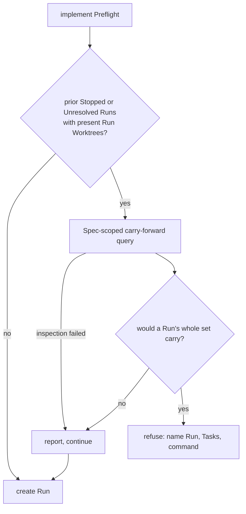

# A Task proved once does not run twice — Technical Spec

## Executive Summary

The carry-forward act Spec 0092 shipped is already outcome-agnostic in its
mechanics: it reads settlement commits by Git trailer, proves each Task against
its own settlement commit and the checkout, and fast-forwards through a
temporary detached staging worktree. Only two guards and a handful of
diagnostic strings tie it to the Stopped outcome. This design widens those
guards to admit the Unresolved Outcome, leaves every proof byte-for-byte
unchanged, and then gives the Implement Command a Preflight that asks the same
question before it spends an Agent turn.

The primary trade-off this design accepts is that the Implement Preflight fails
**open**. It inspects Git and the Run Database to decide whether proved work is
recoverable, and any failure of that inspection is reported and then ignored,
letting the Run proceed. The Preflight exists to save Agent turns, not to
guarantee correctness, so an inspection defect must never be able to block a
Spec. The cost is that a transient Git failure silently returns the caller to
today's behavior; the benefit is that the new check can never become a new way
for the loop to stop.

The second trade-off is that the Preflight names exactly one Run. Carry-forward
refuses a set in which any member refuses, and a carried Task makes itself
refuse afterwards, so the caller effectively gets one attempt. Naming the Run
with the largest carriable set is therefore not a preference among equals — it
is the only choice that recovers the maximum. For the same reason the Preflight
refuses only when the **complete** set would carry: a refusal that named a
command which then refuses is the deadlock it exists to prevent.

One proof detail is load-bearing and was found by running this Spec on itself.
A candidate's declared inputs are compared against the accumulating staged
carries — the checkout plus the carries staged ahead of it — not against the
raw checkout. In any serial graph where one Task edits a shared declared input,
comparing against the raw checkout reports every later Task as moved and
refuses everything.

## Project Constraints

- Identifier strategy: applicable — the new reporting names Unresolved Outcome,
  Stopped, Run Branch, Run Worktree, Task, Verification, and Preflight
  Validation, all glossary terms, and the diagnostics this design rewrites are
  the ones that currently hard-code one outcome's name into a sentence that
  will describe two. The closing node adds the missing term for the
  carry-forward act and repairs the Reconcile Command entry, which names
  `--apply` as the command's only mutation switch. Source:
  `docs/agents/domain.md`.
- Authentication and HTTP: not applicable — no network boundary, credential,
  request, or transport is created or read; every input is local Git evidence,
  the Run Database, and files in the checkout. Source:
  `docs/agents/specific-repository.md`.
- Active ADR obligations: applicable — ADR-0023 keeps a non-Clean Run's
  worktree and branch as the single inspection and settle surface, which is
  what makes an Unresolved Run inspectable at all. ADR-0053 requires terminal
  reconciliation to stay explicit and proof-based, so this design changes which
  outcomes are admitted and no proof. ADR-0115 keeps disposal a separate named
  act and rejects a command that mutates to unblock itself, which is why the
  Implement Preflight refuses and reports rather than carrying work forward.
  ADR-0024 and ADR-0026 own how commits reach a branch — porcelain only, and a
  serialized cherry-pick whose conflict surfaces a graph defect — and the
  staging worktree this design leaves untouched is that mechanism. ADR-0097
  supplies the carried-record principle the existing provenance stamp already
  applies. ADR-0104 obliges an outside-evidence acceptance row at the gate.
  ADR-0141 is not applicable: it governs review Runs, which create no Run
  Worktree and carry no Tasks. Source: `docs/agents/domain.md`.
- Tooling authority: applicable — this Spec edits the Roundfix-owned `roundfix`
  skill, which is protected tooling. Express maintainer authorization: granted
  2026-08-27 in session, recorded at
  `docs/workflow/authorizations/2026-08-27-carry-forward-reaches-an-unresolved-run.md`.
  Bounded files: `.agents/skills/roundfix/SKILL.md`. Its generated copy under
  `skills/` is rewritten by the declared `make skills-sync` and is sanctioned
  fallout, not a separate target. The authorization record lands as its own
  commit before the commit that edits the skill. Source:
  `docs/agents/agent-instructions.md`.

## Vocabulary Contract

This Spec coins one term for an act the product has performed since Spec 0092
without the glossary naming it. **Task Carry-Forward** names handing a settled
Task from a terminal Run's Run Branch back to the checkout on proof. The bare
noun was unavailable in both directions: ADR-0097 already uses "carry forward"
for a QA row inheriting an earlier observation, and this act moves a commit
rather than a verdict, so the term is qualified by what it carries.

- emits: `internal/cli/reconcile.go`
  pattern: `CarryForward|carry-forward`
  documented-in: `CONTEXT.md`
- emits: `internal/spec/spec.go`
  pattern: `CarryForward`
  documented-in: `CONTEXT.md`
- emits: `internal/cli/implement.go`
  pattern: `CarryForward|carry-forward`
  documented-in: `CONTEXT.md`
- emits: `docs/user-guide/commands.md`
  pattern: `carry-forward`
  documented-in: `CONTEXT.md`

The first two are where the act is proved and recorded today, the third is the
Preflight this Spec adds, and the fourth is where a reader meets the command.
Each is present and readable now.

## System Architecture

Three existing components change; no package, layer, or directory is added.

**The Reconcile Command's carry-forward act** holds the two outcome guards. The
first refuses the invocation when the single selected Run's outcome is neither
Stopped nor Unresolved; the second skips any Run with another outcome while
building the candidate set. Both use a shared membership test over the
accepted-outcome set of Stopped and Unresolved.
Every proof downstream of those guards — settlement-commit count, committed
status, declared-input comparison, symlink crossing, checkout cleanliness, HEAD
stability, repository-local Specs Root — is untouched.

**A Spec-scoped carry-forward query** is extracted from the reconcile command
path so a second caller can ask what a Spec's prior Runs would hand back
without duplicating a proof. It takes the Run Database, the repository, the
resolved Specs Root, and a Spec slug; it returns, per prior Stopped or
Unresolved Run of that Spec whose recorded Run Worktree is present, the
candidates and their actions. Runs with other terminal outcomes are not
carry-forward candidates, and a released Run whose Run Worktree is absent is
skipped. It is the same inspection reconcile already performs, called with a
different selection.

**The Implement Command's Preflight** gains one step, placed after the Run
Database is opened and beside the existing Run Window check, which is the
established precedent for a Preflight that refuses with no Run and no side
effect. It consumes the query, decides whether the complete candidate set of
some prior Run would carry, and either refuses or reports and continues.



## Implementation Design

### Interfaces

```go
// carryForwardAcceptedStates is the set of terminal Run outcomes whose Tasks
// may be handed back. Both keep their Run Worktree and Run Branch under
// ADR-0023, which is what makes them inspectable.
var carryForwardAcceptedStates = []string{store.StateStopped, store.StateUnresolved}

// specCarryForward is what one prior Run would hand back to the checkout.
type specCarryForward struct {
    Run        store.Run
    Candidates []spec.CarryForward
}

// carriable counts the candidates that passed every proof.
func (result specCarryForward) carriable() int

// inspectSpecCarryForwards reports, per prior Stopped or Unresolved Run of one
// Spec in this repository whose recorded Run Worktree is present, what
// carry-forward would do. Runs with other terminal outcomes are ignored, and
// Runs whose Run Worktree is no longer present are skipped rather than failing
// the inspection, so a released Run never blocks the caller.
func inspectSpecCarryForwards(
    ctx context.Context,
    runStore *store.Store,
    repository string,
    resolvedSpecsRoot roundconfig.SpecsRoot,
    specSlug string,
) ([]specCarryForward, error)

// implementCarryForwardAvailableError refuses a Run that would re-execute
// Tasks a prior Run already completed and verified.
type implementCarryForwardAvailableError struct {
    Run   store.Run
    Tasks []string
}

func (err implementCarryForwardAvailableError) Error() string
func (err implementCarryForwardAvailableError) NextAction() string
```

`NextAction` mirrors the Run Window refusal introduced by Spec 0117, so both
Preflight refusals present a next action through the same shape the printer
already reads.

### Data Models

No schema change. The Run Database is read through the existing Run listing
scoped to the current repository, then filtered in Go by Spec slug and by
membership in the accepted-outcome set — the listing already carries the Spec
slug, the recorded Run Worktree, the Run Branch, and the starting commit each
proof needs. Raising the schema version is explicitly out of scope: the Run
Database is machine-wide and shared by every repository on the host, so a
migration is a one-way door for consumers this Spec has no reason to move.

Task files are unchanged. The provenance stamp carry-forward already appends is
the record of a carried Task, and this Spec adds nothing beside it.

### API Contracts

`roundfix reconcile <run-id> --carry-forward` — accepts a Run whose outcome is
Stopped or Unresolved. A Run with any other terminal outcome is refused with a
message naming the outcome it actually has and the outcomes carry-forward
accepts, replacing the sentence that claims carry-forward accepts one stopped
Run. Exit behavior, output streams, and the JSON envelope are unchanged; no
flag is added.

`roundfix implement --spec <slug>` — gains one Preflight refusal. When a prior
terminal Run of the same Spec in this repository holds at least one carriable
Task, the command exits through Preflight Validation, creating no Run, opening
no Agent Session, and writing nothing to Git or the Run Database. The
diagnostic names the Run, each Task it would recover, and the exact
`roundfix reconcile <run-id> --carry-forward` invocation. When inspected prior
Stopped or Unresolved Runs hold completed Tasks that no longer pass the proofs,
or when the inspection itself fails, the command reports that on stderr and
proceeds to create the Run. Runs with other terminal outcomes are ignored, and
a released Run whose Run Worktree is absent is skipped.

## Coverage Map

| PRD item | Component |
| --- | --- |
| Goal 1, Story 1 | The widened accepted-outcome set plus the Implement Preflight refusal |
| Goal 2, Core Feature 1 | The accepted-outcome membership test, with every proof unchanged |
| Goal 3, Story 2, Core Feature 3 | `implementCarryForwardAvailableError` and its Preflight step |
| Goal 4, Story 3, Core Feature 4 | The carriable count gate and the fail-open inspection path |
| Goal 5, Story 5, Core Feature 7 | The `roundfix` skill reconcile and implement sections |
| Story 4, Core Feature 2 | The outcome-naming refusal in the carry-forward guard |
| Core Feature 5 | Selection by largest carriable set, ties broken by newest Run |
| Core Feature 6 | The glossary term and the corrected Reconcile Command entry |

## Integration Points

- The Reconcile Command path in `internal/cli`, which owns both outcome guards
  and every carry-forward proof.
- The Implement Command Preflight in `internal/cli`, beside the Run Window
  check Spec 0117 established.
- The Run listing in `internal/store`, read-only and already scoped by
  repository.
- The Task document reader in `internal/spec`, unchanged and called as-is.
- `docs/user-guide/commands.md` for the two command contracts, and
  `CONTEXT.md` for the glossary repairs.

## Testing Approach

Every seam already exists; none is added. The reconcile test helper that builds
a terminal Run fixture already takes the Run state as a parameter, so the four
existing carry-forward tests — settles an unchanged Task, refuses a moved
input, refuses rather than carrying a subset, reports without the flag — are
parameterized over Stopped and Unresolved instead of being copied. That is what
proves the proofs did not change: the same assertions must hold for both
outcomes.

New unit coverage attaches to the same two files:

- A Run whose outcome is neither Stopped nor Unresolved is refused, and the
  message names its outcome.
- The Implement Preflight refuses with no Run created, asserted against the Run
  Database rather than against stdout alone.
- The Preflight proceeds when prior Runs hold only non-carriable Tasks.
- The Preflight proceeds when the inspection fails, with the failure reported.
- Selection picks the Run with the largest carriable set, and the newest on a
  tie.

The repository Verification is `rtk make verify`; `make verify-docs` covers the
markdown contracts and `roundfix spec check`, and is required before the pull
request opens.

## Build Order

1. Widen the carry-forward accepted-outcome set to Stopped and Unresolved, and
   rewrite the guard diagnostics to name the Run's actual outcome and the
   accepted set. Parameterize the four existing carry-forward tests over both
   outcomes.
2. Extract the Spec-scoped carry-forward query from the reconcile command path,
   skipping Runs whose Run Worktree is absent rather than failing (depends on:
   1 — both edit the reconcile command path, so they are serialized rather than
   siblings).
3. Add the Implement Preflight step: refuse when a Run holds carriable Tasks,
   report and continue otherwise, and fail open on inspection error (depends
   on: 2).
4. Record in the glossary which Run outcomes Task Carry-Forward accepts
   (depends on: 1 — the sentence is only true once the guard admits both). The
   term itself and the corrected Reconcile Command mutation-switch claim landed
   with this Spec's authoring, because the Vocabulary Contract detector refuses
   a Spec whose coined term is undocumented and because the `--apply`-only
   claim was already false before this Spec.
5. Corrective, from this Spec's own first Run: compare each candidate against
   the staged carries rather than the raw checkout, make the Preflight refuse
   only when the whole set would carry, and restore the store open to its place
   after the profile preflight (depends on: 4).
6. Corrective, from QA finding F-01: the reconcile help states the outcomes the
   act accepts (depends on: 5).
7. Update the user guide's reconcile and implement contracts (depends on: 6).
8. Update the `roundfix` skill under the recorded authorization, as its own
   commit (depends on: 7).
9. Acceptance: prove the defect is closed against the Run Branch evidence this
   repository still carries, and satisfy the outside-evidence row (depends on:
   8).

**Every documentation step follows every behavior step.** The first cut of this
Build Order placed the glossary, user guide, and skill immediately after the
Preflight, which read correctly until a corrective step changed the decision
rule those documents had already described. QA finding F-02 caught the result:
two shipped surfaces stating that one carriable Task triggers a refusal and
that inputs are compared with the checkout, when the delivered code requires
the whole set and compares against the staged carries. A documentation Task
whose subject can still move is a Task authored against a draft. Only the
glossary stays early, because it defines the act rather than its decision rule
and nothing later changed what the term means.

## Risks & Considerations

**A partially carried Spec still re-executes.** Carry-forward refuses a set
with any refusing member, and a carried Task's own file becomes a moved input
afterwards. So carrying from an older Run first makes a newer Run's overlapping
set refuse. This is why the Preflight names the largest carriable set rather
than the newest Run. Carrying a subset was considered and rejected: Spec 0092
refuses the whole set precisely so a Task whose Spec, instruction, or Context
moved is never silently replayed, and relaxing that would trade a measured
waste for a silent correctness risk.

**The declared-input baseline is the staged state, not the raw checkout.**
Measured on this Spec's own first Run: task_04 edits `CONTEXT.md` and later
Tasks correct the TechSpec, so every Task settled after them reported both as
moved and the whole set refused. Nothing had drifted — the checkout simply had
not received the earlier Tasks yet. Comparing a candidate against the raw
checkout therefore asks the wrong question for any serial graph in which one
Task edits a shared declared input, which is the ordinary shape: Spec 0117's
graph would have failed the same way. The act already cherry-picks into a
temporary staging worktree in dependency order, so each candidate is compared
against that accumulating state — the checkout plus the carries staged ahead of
it, which is exactly the state the Task was validated against. This strengthens
the proof rather than relaxing it: an input that moved for any other reason
still refuses, and the whole-set refusal is unchanged.

**A refusal must mean the whole set would carry.** The Preflight's condition is
that carry-forward would succeed, not that some member is individually
carriable. Those differ precisely when the set refuses as a whole, and the
weaker condition produces the deadlock the Preflight exists to avoid: implement
refuses and names a command that then refuses.

**The Preflight must not create the Run Database before cheaper checks run.**
Three existing tests encode that a profile-preflight failure leaves no Run
Database behind. Opening the store to answer the carry-forward question must
therefore stay where Spec 0117 put it — after the profile preflight — rather
than being hoisted above it.

**The Preflight adds Git work before every Run.** It is bounded by the number
of prior Stopped or Unresolved Runs of one Spec in one repository whose Run
Worktree still exists — three in the measured case, and zero once
`reconcile --apply` has released them. No cap is imposed, because a cap would
silently truncate coverage; the natural bound is the surviving worktrees.

**Fail-open hides a defect in the new inspection.** Mitigated by reporting every
inspection failure on stderr rather than swallowing it, so a recurring failure
is visible in Run output even though it never blocks.

**The refusal could surprise an autonomous Supervisor.** It is a Preflight exit,
which the loop already handles for the Run Window and the default-branch guard,
and the diagnostic carries the exact command that clears it.

## Decisions

- Widen the accepted-outcome set rather than add a command: the proofs,
  refusals, and reporting already exist, and a second surface would drift.
- The Implement Preflight refuses rather than carrying work forward itself,
  under ADR-0115.
- The Preflight fails open on inspection error, because it is an economic check
  and must never become a new way for the loop to stop.
- The Preflight refuses only when a Task is actually carriable, so a refusal
  never offers a command that would refuse.
- Selection is by largest carriable set, ties broken by the newest Run, because
  the caller effectively gets one carry-forward.
- No new ADR is minted. Each decision applies an accepted record or completes
  scope ADR-0023 and Spec 0092 already stated; none reverses a prior decision.
