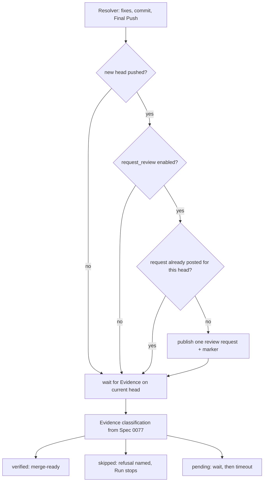

# Roundfix asks for the review — Technical Spec

## Executive Summary

The Round loop already has the seam. In `internal/watch/watch.go`,
`deps.Resolver.Resolve` performs the round's fixes, commit, and Final Push and
returns the new `resolved.HeadSHA`. Every path that follows — the
`Remaining == 0` merge-ready confirmation and the next Round's
`waitForSettled` — waits for Evidence bound to that head. Nothing between them
asks the Review Source for the review it is waiting on.

One insertion point at that seam, guarded by configuration, publishes exactly
one request per Round. The primitive already exists too: `GHClient` carries
`CommentOnPullRequest`, and Spec 0077 added `IssueComments`, which is what
makes the request idempotent without new storage — the marker lives in the
comment body and the comment list is the ledger.

The rest is the refusal that keeps an operator out of the trap: a repository
whose Review Source no longer reviews pushes, and whose Roundfix does not ask,
produces a Run that waits until timeout for an answer nobody requested. That
pair is decidable before the Run starts, and Preflight Validation decides it.

## Project Constraints

- Identifier strategy: not applicable — no project-owned Internal Identifier is
  created. The request is keyed by the pushed head SHA inside a comment marker,
  and Run identities, Round numbers, and Review Source thread identities keep
  their existing contracts. Source: `docs/agents/domain.md`.
- Authentication and HTTP: not applicable — the request reuses the existing
  `gh`-backed Review Source client already used for pull request comments and
  thread replies. No credential is read, printed, committed, or generated, and
  no authentication, authorization, transport, or deployment policy is
  invented. Source: `docs/agents/agent-instructions.md`.
- Active ADR obligations: applicable — ADR-0054 keeps Review Source Evidence
  the determinant of outcomes, and the request never becomes evidence of its
  own answer. ADR-0036 owns the artifact-only docs commit whose descendant
  inherits its parent's Evidence, which is why the request targets the fix push
  and not that commit. ADR-0029 owns review artifact placement and is
  untouched. ADR-0080 owns QA verdict semantics and ADR-0091 owns the authored
  QA gate, under which this graph is authored. ADR-0081 sanctions the
  deterministic digest fallout of the authorized Skill synchronisation.
  ADR-0093 surfaces as a relation candidate because it cites ADR-0080 and does
  not apply. Source: `docs/agents/domain.md`.
- Tooling authority: applicable — express maintainer authorization is the
  2026-08-04 standing grant for Roundfix Skill CLI synchronisation at
  `docs/workflow/authorizations/2026-08-04-queue-tail-tooling.md`, whose
  covered list names Spec 0078 and whose 2026-08-05 addendum records this
  Spec's grant; bounded files: `.agents/skills/roundfix/**` and its
  `skills/roundfix/**` mirror, regenerated by `make skills-sync`, for
  CLI-contract synchronisation only. Source:
  `docs/agents/agent-instructions.md`.

## System Architecture



The `DUP` diamond is why no new persistence appears: the pull request's own
comment list answers it.

## Implementation Design

### Interfaces

```go
// ReviewRequester publishes one Review Source request for a pushed head.
// It never waits for, infers, or returns Evidence: asking is not an answer.
type ReviewRequester interface {
    RequestReview(ctx context.Context, req ReviewRequest) (ReviewRequestOutcome, error)
}

type ReviewRequest struct {
    BaseRepository string
    PRNumber       string
    HeadSHA        string
    Command        string // the Review Source's request command
}

type ReviewRequestOutcome struct {
    Published bool   // false when an identical request already existed
    Marker    string
}
```

`watch.Dependencies` gains one optional `ReviewRequester`. A nil requester, or
a disabled configuration, preserves today's control flow exactly.

### Data Models

No persisted state and no schema change. The idempotency marker is an HTML
comment carried in the request body:

```text
@coderabbitai review

<!-- roundfix:review-request head=<head-sha> -->
```

`IssueComments`, added by Spec 0077 for refusal recognition, lists the pull
request's comments; a Roundfix-authored comment carrying the marker for the
same head means the request was already made.

### API Contracts

No new command and no new flag. Two configuration keys, both with
Project Config over User Config over built-in precedence:

| Key | Default | Meaning |
| --- | --- | --- |
| `review_source.request_review` | `false` | Roundfix publishes the request after a Round's Final Push |
| `review_source.request_command` | `@coderabbitai review` | the published command |

Preflight Validation for `resolve` and `watch` reads the repository's
`.coderabbit.yaml` and decides one predicate:

```text
pushTriggersReview = auto_review.enabled != false
                     AND auto_review.auto_incremental_review != false
                     AND auto_review.auto_pause_after_reviewed_commits == 0
```

An absent or unreadable file means the Review Source defaults apply. Because
CodeRabbit defaults `auto_pause_after_reviewed_commits` to `5`,
`pushTriggersReview` is false unless the repository explicitly disables the
finite pause with `0`. The refusal is the equality:

| `pushTriggersReview` | `request_review` | Result |
| --- | --- | --- |
| true | false | ok — automatic reviews remain available after every push |
| false | true | ok — the manual flow this Spec ships |
| false | false | **refused** — the Run would wait for a review nobody asks for |
| true | true | **refused** — every Round would buy a second review |

`fetch` is exempt: it publishes nothing and pushes nothing.

## Coverage Map

- Goal 1 (an unattended pushed Round requests its review) → the
  `ReviewRequester` seam in `watch.Run` and the equivalent post-push call in
  `resolve`.
- Goal 2 (bounded, predictable review consumption) → the per-head comment
  marker, one request inside each Round, and the existing Max Rounds cap.
- Goal 3 (refuse a stranded loop before it starts) →
  `validateReviewRequestCoherence` and the four-row Preflight predicate.
- The PRD defines no separate User Stories section.
- Core Feature 1 (request after Final Push) → the `ReviewRequester` call at the
  `resolved.HeadSHA` seam in `watch.Run`, and the equivalent after `resolve`'s
  push.
- Core Feature 2 (idempotent per head) → the body marker plus the
  `IssueComments` lookup.
- Core Feature 3 (`fetch` stays read-only) → the command exemption, asserted.
- Core Feature 4 (configuration, and refusal of an incoherent pair) →
  `review_source.request_review` and the Preflight predicate table above.
- Core Feature 5 (a refused request stops the Run) → the existing Spec 0077
  `skipped` classification, which needs no change and is asserted here.
- Core Feature 6 (bounded by the Round cap) → the request lives inside the
  Round loop, so `max_rounds` bounds it by construction.
- Core Feature 7 (observable) → one Run Event per request with its head,
  command, and published-or-deduplicated outcome.

## Integration Points

- `internal/watch/watch.go` — the `Dependencies` entry and the one call site
  after `deps.Resolver.Resolve`.
- `internal/reviewsource/coderabbit/coderabbit.go` — the requester built on
  `CommentOnPullRequest` and `IssueComments`.
- `internal/preflight/` — the `.coderabbit.yaml` inspection and the coherence
  refusal.
- `internal/config/config.go` — the two keys and their validation.
- `internal/cli/cli.go` — dependency wiring, the `resolve` call site, and the
  help text.
- `internal/runevent/` — the request Run Event.
- `.agents/skills/roundfix/**` and its mirror — CLI-contract synchronisation.

## Testing Approach

`internal/watch` is already driven by injected function-typed dependencies, and
`internal/reviewsource/coderabbit` is table-driven over recorded payloads. No
new seam is needed.

- **The stall test.** With `pushTriggersReview` false and asking enabled, a
  Round that pushes publishes exactly one request. This is the behaviour the
  Spec exists for.
- **The one-per-Round test.** A Round whose Final Push is followed by the
  artifact-only docs commit publishes one request, for the fix head.
- **Idempotency.** A comment list already carrying the marker for the same head
  publishes nothing and reports `Published: false`.
- **The refusal table.** All four rows of the Preflight predicate asserted
  directly, including the absent-file default and explicit finite- and
  zero-pause settings.
- **`fetch` publishes nothing**, asserted rather than assumed.
- **A refused request** leaves the Spec 0077 classification untouched: the Run
  ends Review Skipped naming the refusal, and no second request follows.
- **Non-regression.** With `request_review` false — the built-in default —
  `resolve` and `watch` proceed only when `.coderabbit.yaml` disables the
  finite automatic-review pause; `fetch` remains exempt.

## Build Order

1. **The requester** — the Review Source primitive with its marker and
   deduplication, plus the Run Event. Provable on its own, wired to nothing.
2. **The Round seam** (depends on: 1, 3) — the `watch` call site and the
   `resolve` call site, with the one-per-Round and artifact-descendant
   assertions.
3. **Configuration and refusal** (independent of 1) — the two keys and the
   Preflight predicate, with the four-row table.
4. **The repository's own flow** (depends on: 2) — `.roundfixrc.yml` enabling
   the request and lowering `max_rounds` to `2`, and `.coderabbit.yaml`
   committed in this Pull Request so the manual mode and the asking arrive
   together.
5. **Skill synchronisation** (depends on: 4) — the authorized Skill update and
   its regeneration chain.

Steps 1 and 3 are independent of each other; step 4 is the one that must not
land early. Committing the `.coderabbit.yaml` change before the requester works
is the window where every unattended Run stalls.

## Risks & Considerations

- **The dead window.** `.coderabbit.yaml` takes effect when it reaches the
  default branch. It is already modified in the working tree and rides this
  Spec's Pull Request deliberately; landing it separately would strand the loop.
- **A request is not an answer.** The largest way to get this wrong is to treat
  a published request as progress. It is not Evidence, it does not advance the
  Round, and ADR-0054 governs.
- **Deduplication reads a mutable list.** A pull request with a very long
  comment history pages; the lookup must not silently truncate and re-ask.
- **The refusal can block a legitimate setup.** A repository using
  `labels` or `description_keyword` gating has a shape this predicate reads as
  automatic. The refusal names the keys it read, so the operator can see what
  Roundfix concluded and correct the pair rather than guess.

## Decisions

- The request is published once per Round, at the head the fixes landed on.
  The artifact-only docs commit inherits Evidence under ADR-0036.
- Idempotency lives in the comment body, not in the Run Database, because the
  pull request is the shared surface and a resumed or replayed Run must see
  what a previous one did.
- The incoherent pair is a Preflight refusal, not a warning. The failure it
  prevents is an unattended Run waiting for an answer nobody requested, and a
  warning on that Run's stderr reaches no one.
- No retry and no backoff. The Round cap bounds requests, and a refusal ends
  the Run with its reason named.
